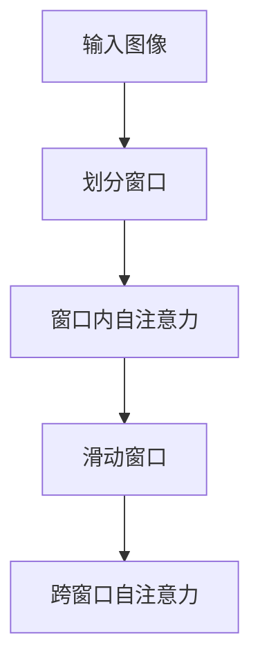

# SwinTransformer的位置编码

## 1.背景介绍

在计算机视觉领域，Transformer架构已经展现出其强大的性能和灵活性。Swin Transformer（Shifted Window Transformer）作为一种改进的Transformer模型，特别适用于图像处理任务。位置编码（Positional Encoding）是Transformer模型中的一个关键组件，它帮助模型理解输入数据的顺序信息。在Swin Transformer中，位置编码的设计和实现有其独特之处，本文将深入探讨这一主题。

## 2.核心概念与联系

### 2.1 Transformer与位置编码

Transformer模型最初应用于自然语言处理（NLP）任务中，其核心思想是通过自注意力机制（Self-Attention）来捕捉输入序列中各个元素之间的关系。然而，Transformer模型本身并不具备位置感知能力，因此需要引入位置编码来提供序列信息。

### 2.2 Swin Transformer的创新

Swin Transformer通过引入滑动窗口（Shifted Window）机制，将全局自注意力机制转化为局部自注意力机制，从而大幅降低了计算复杂度。与传统的Transformer不同，Swin Transformer在处理图像时需要考虑图像的空间结构，这使得位置编码的设计变得尤为重要。

### 2.3 位置编码的类型

在Transformer模型中，常见的位置编码方式包括绝对位置编码（Absolute Positional Encoding）和相对位置编码（Relative Positional Encoding）。Swin Transformer采用了相对位置编码，以更好地适应其局部自注意力机制。

## 3.核心算法原理具体操作步骤

### 3.1 滑动窗口机制

Swin Transformer通过将输入图像划分为多个不重叠的窗口，并在每个窗口内应用自注意力机制。随后，通过滑动窗口机制，将窗口进行平移，以捕捉跨窗口的依赖关系。



### 3.2 相对位置编码的计算

相对位置编码的核心思想是通过计算窗口内各个像素之间的相对位置关系，来生成位置编码矩阵。具体步骤如下：

1. **初始化位置编码矩阵**：根据窗口大小初始化一个位置编码矩阵。
2. **计算相对位置索引**：对于每个像素，计算其与其他像素的相对位置索引。
3. **生成位置编码**：根据相对位置索引，从位置编码矩阵中提取相应的编码值。

### 3.3 位置编码的应用

在Swin Transformer中，位置编码被添加到自注意力机制的键（Key）和查询（Query）中，以增强模型的空间感知能力。

## 4.数学模型和公式详细讲解举例说明

### 4.1 自注意力机制

自注意力机制的核心公式如下：

$$
\text{Attention}(Q, K, V) = \text{softmax}\left(\frac{QK^T}{\sqrt{d_k}}\right)V
$$

其中，$Q$、$K$、$V$分别表示查询、键和值矩阵，$d_k$表示键的维度。

### 4.2 位置编码的数学表示

对于相对位置编码，假设窗口大小为$M \times M$，则位置编码矩阵$P$的维度为$(2M-1) \times (2M-1)$。对于任意两个像素$i$和$j$，其相对位置索引为$(i_x - j_x + M - 1, i_y - j_y + M - 1)$，其中$i_x$和$i_y$分别表示像素$i$的横纵坐标。

### 4.3 位置编码的应用公式

在自注意力机制中，位置编码被添加到键和查询中，公式如下：

$$
Q' = Q + P_{Q}
$$

$$
K' = K + P_{K}
$$

其中，$P_{Q}$和$P_{K}$分别表示查询和键的相对位置编码。

## 5.项目实践：代码实例和详细解释说明

### 5.1 环境准备

首先，确保你已经安装了必要的Python库，如PyTorch和NumPy。

```python
import torch
import torch.nn as nn
import numpy as np
```

### 5.2 位置编码的实现

以下是一个简单的相对位置编码的实现示例：

```python
class RelativePositionEncoding(nn.Module):
    def __init__(self, window_size):
        super(RelativePositionEncoding, self).__init__()
        self.window_size = window_size
        self.position_encoding = nn.Parameter(torch.randn(2 * window_size - 1, 2 * window_size - 1))

    def forward(self, x):
        batch_size, num_heads, height, width, channels = x.size()
        relative_indices = self.get_relative_indices(height, width)
        position_encoding = self.position_encoding[relative_indices[:, 0], relative_indices[:, 1]]
        position_encoding = position_encoding.view(height, width, channels)
        return x + position_encoding

    def get_relative_indices(self, height, width):
        indices = torch.arange(height * width).view(height, width)
        relative_indices = indices.unsqueeze(2) - indices.unsqueeze(1)
        return relative_indices + self.window_size - 1
```

### 5.3 代码解释

1. **初始化位置编码矩阵**：在`__init__`方法中，根据窗口大小初始化位置编码矩阵。
2. **计算相对位置索引**：在`get_relative_indices`方法中，计算窗口内各个像素之间的相对位置索引。
3. **生成位置编码**：在`forward`方法中，根据相对位置索引，从位置编码矩阵中提取相应的编码值，并将其添加到输入张量中。

### 5.4 测试代码

```python
# 测试位置编码
window_size = 7
input_tensor = torch.randn(1, 8, window_size, window_size, 64)  # 假设输入张量的维度为 (batch_size, num_heads, height, width, channels)
position_encoding = RelativePositionEncoding(window_size)
output_tensor = position_encoding(input_tensor)
print(output_tensor.size())
```

## 6.实际应用场景

### 6.1 图像分类

Swin Transformer在图像分类任务中表现出色，尤其是在处理高分辨率图像时，其滑动窗口机制能够有效降低计算复杂度。

### 6.2 目标检测

在目标检测任务中，Swin Transformer通过其局部自注意力机制，能够更好地捕捉图像中的细节信息，从而提高检测精度。

### 6.3 图像分割

在图像分割任务中，Swin Transformer能够通过其位置编码机制，准确地分割出图像中的目标区域。

## 7.工具和资源推荐

### 7.1 开源库

- [PyTorch](https://pytorch.org/): 一个流行的深度学习框架，支持Swin Transformer的实现。
- [Hugging Face Transformers](https://github.com/huggingface/transformers): 提供了多种Transformer模型的实现，包括Swin Transformer。

### 7.2 研究论文

- [Swin Transformer: Hierarchical Vision Transformer using Shifted Windows](https://arxiv.org/abs/2103.14030): Swin Transformer的原始论文，详细介绍了其架构和实现细节。

### 7.3 在线课程

- [Deep Learning Specialization](https://www.coursera.org/specializations/deep-learning): 由Andrew Ng教授主讲的深度学习课程，涵盖了Transformer模型的基础知识。

## 8.总结：未来发展趋势与挑战

### 8.1 未来发展趋势

Swin Transformer作为一种新型的Transformer架构，已经在多个计算机视觉任务中展现出其强大的性能。未来，随着硬件性能的提升和算法的不断优化，Swin Transformer有望在更多实际应用中得到广泛应用。

### 8.2 挑战

尽管Swin Transformer在性能上有显著提升，但其计算复杂度仍然较高，尤其是在处理超高分辨率图像时。此外，如何进一步优化位置编码机制，以更好地适应不同任务，也是一个值得研究的方向。

## 9.附录：常见问题与解答

### 9.1 什么是位置编码？

位置编码是Transformer模型中的一个关键组件，用于提供输入数据的序列信息，帮助模型理解输入数据的顺序。

### 9.2 Swin Transformer中的位置编码有何不同？

Swin Transformer采用了相对位置编码，以更好地适应其局部自注意力机制，从而提高模型的空间感知能力。

### 9.3 如何实现相对位置编码？

相对位置编码的实现包括初始化位置编码矩阵、计算相对位置索引和生成位置编码等步骤。具体实现可以参考本文的代码实例。

### 9.4 Swin Transformer的实际应用有哪些？

Swin Transformer在图像分类、目标检测和图像分割等任务中表现出色，尤其适用于处理高分辨率图像。

### 9.5 Swin Transformer的未来发展趋势是什么？

随着硬件性能的提升和算法的不断优化，Swin Transformer有望在更多实际应用中得到广泛应用。然而，其计算复杂度和位置编码机制的优化仍然是未来研究的重点。

---

作者：禅与计算机程序设计艺术 / Zen and the Art of Computer Programming