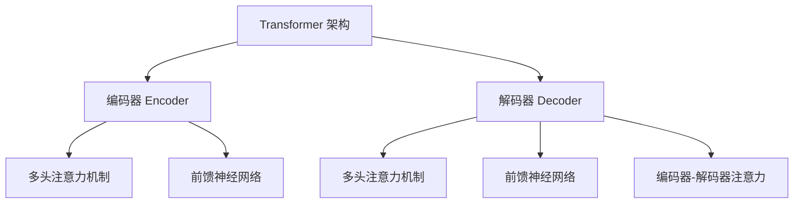

# T5：T5 vs GPT-3 对比分析

## 1. 背景介绍

在自然语言处理(NLP)领域,Transformer模型已经成为主流架构,其中GPT-3和T5都是基于Transformer的大型语言模型,在各种NLP任务上表现出色。本文将对这两种模型进行全面对比分析,探讨它们的异同、优缺点以及适用场景。

### 1.1 GPT-3 简介

GPT-3(Generative Pre-trained Transformer 3)是由OpenAI于2020年推出的一种大型语言模型,使用了1750亿个参数,是当时最大的语言模型。它采用自回归(auto-regressive)的生成方式,可以根据给定的文本前缀生成连贯、流畅的后续文本。GPT-3展现出了强大的文本生成能力,可以应用于多种NLP任务,如文本续写、问答、文本摘要、代码生成等。

### 1.2 T5 简介

T5(Text-to-Text Transfer Transformer)是由谷歌于2020年提出的一种统一的Transformer模型框架。与GPT-3不同,T5将所有NLP任务都转化为文本到文本的形式,包括文本生成、文本摘要、文本分类、阅读理解等。T5采用了编码器-解码器(encoder-decoder)的结构,可以同时处理输入和输出序列。

## 2. 核心概念与联系

### 2.1 Transformer 架构

GPT-3和T5都是基于Transformer架构的,Transformer是一种全新的基于注意力机制(Attention Mechanism)的序列到序列模型。与传统的RNN和LSTM模型相比,Transformer架构可以更好地捕捉长距离依赖关系,并且可以并行计算,从而提高了训练和推理的效率。



Transformer架构主要由编码器(Encoder)和解码器(Decoder)两部分组成。编码器用于处理输入序列,解码器用于生成输出序列。每个编码器/解码器层都包含多头注意力机制(Multi-Head Attention)和前馈神经网络(Feed-Forward Neural Network)两个子层。此外,解码器还包含一个编码器-解码器注意力(Encoder-Decoder Attention)子层,用于关注输入序列中的相关部分。

### 2.2 预训练与微调

GPT-3和T5都采用了预训练(Pre-training)和微调(Fine-tuning)的范式。预训练是在大规模无监督语料库上训练模型,以捕捉通用的语言知识。微调则是在特定的有监督数据集上继续训练模型,以适应特定的下游任务。

这种预训练+微调的范式可以显著提高模型的性能,同时降低了对大量有标注数据的需求。预训练模型可以作为通用的语言表示,然后通过微调来适应特定的NLP任务。

## 3. 核心算法原理具体操作步骤  

### 3.1 GPT-3 算法原理

GPT-3采用了自回归(Auto-Regressive)的生成方式,即根据给定的文本前缀,模型会生成下一个最可能的token,然后将其附加到前缀后面,重复这个过程直到生成完整的序列。

具体操作步骤如下:

1. 将输入文本编码为token序列
2. 将token序列输入到Transformer解码器
3. 对于每个位置,计算所有可能token的概率分布
4. 选择概率最高的token作为该位置的输出
5. 将输出token附加到输入序列的末尾
6. 重复步骤3-5,直到达到预设的最大长度或生成终止token

在生成过程中,GPT-3还采用了一些技术来提高生成质量,如Top-K采样、Top-P采样(Nucleus Sampling)等,以增加生成的多样性。

### 3.2 T5 算法原理 

T5将所有NLP任务都统一转化为"文本到文本"的形式,即将输入文本和任务类型编码为单个输入序列,然后生成相应的输出序列。

具体操作步骤如下:

1. 将输入文本和任务类型拼接为单个输入序列,如"问题: 什么是Transformer模型? 任务: 问答"
2. 将输入序列输入到Transformer编码器
3. 将编码器的输出传递给Transformer解码器
4. 对于每个位置,解码器计算所有可能token的概率分布
5. 选择概率最高的token作为该位置的输出
6. 重复步骤5,直到生成终止token或达到最大长度

T5的优势在于统一的"文本到文本"框架,可以支持多种NLP任务,并且可以通过多任务学习的方式提高泛化能力。

## 4. 数学模型和公式详细讲解举例说明

### 4.1 Self-Attention 机制

Self-Attention是Transformer中的核心机制,它允许模型捕捉输入序列中任意两个位置之间的依赖关系。

给定一个输入序列 $X = (x_1, x_2, ..., x_n)$,Self-Attention的计算过程如下:

1. 计算Query(Q)、Key(K)和Value(V)矩阵:

$$Q = XW_Q, K = XW_K, V = XW_V$$

其中 $W_Q, W_K, W_V$ 是可学习的权重矩阵。

2. 计算注意力分数:

$$\text{Attention}(Q, K, V) = \text{softmax}(\frac{QK^T}{\sqrt{d_k}})V$$

其中 $d_k$ 是缩放因子,用于防止内积过大导致梯度消失。

3. 多头注意力机制(Multi-Head Attention):

$$\text{MultiHead}(Q, K, V) = \text{Concat}(head_1, ..., head_h)W_O$$
$$\text{where } head_i = \text{Attention}(QW_i^Q, KW_i^K, VW_i^V)$$

通过线性变换将Q、K、V投影到不同的子空间,然后并行计算多个注意力头,最后将它们拼接起来。

Self-Attention机制赋予了Transformer强大的长距离依赖捕捉能力,是其取得卓越性能的关键所在。

### 4.2 掩码自注意力机制

在自回归生成任务中,如GPT-3的文本生成,需要防止模型利用将来的信息,因此引入了掩码自注意力机制(Masked Self-Attention)。

对于位置 $i$,其注意力分数计算如下:

$$\text{Attention}(Q_i, K, V) = \text{softmax}(\frac{Q_iK^T}{\sqrt{d_k}})V$$
$$\text{where } K = \begin{cases} 
K & \text{if } j \leq i \\
\text{mask} & \text{if } j > i
\end{cases}$$

即对于位置 $i$,只能关注之前的位置,之后的位置被掩码屏蔽。这样可以确保模型只利用当前和之前的信息进行预测。

### 4.3 交叉注意力机制

在编码器-解码器架构中,如T5模型,解码器需要关注编码器的输出,这就需要交叉注意力机制(Cross-Attention)。

交叉注意力的计算方式与Self-Attention类似:

$$\text{CrossAttention}(Q, K, V) = \text{softmax}(\frac{QK^T}{\sqrt{d_k}})V$$

其中 $Q$ 来自解码器,而 $K$ 和 $V$ 来自编码器的输出。这样解码器可以选择性地关注输入序列中的相关部分,从而生成更准确的输出序列。

## 5. 项目实践:代码实例和详细解释说明

以下是使用Hugging Face的Transformers库对GPT-2进行文本生成的Python代码示例:

```python
from transformers import GPT2LMHeadModel, GPT2Tokenizer

# 加载预训练模型和分词器
model = GPT2LMHeadModel.from_pretrained('gpt2')
tokenizer = GPT2Tokenizer.from_pretrained('gpt2')

# 输入文本
text = "今天天气很好,"

# 对输入文本进行编码
input_ids = tokenizer.encode(text, return_tensors='pt')

# 生成文本
output = model.generate(input_ids, max_length=100, do_sample=True, top_k=50, top_p=0.95, num_return_sequences=1)

# 解码输出
generated_text = tokenizer.decode(output[0], skip_special_tokens=True)

print(generated_text)
```

代码解释:

1. 首先加载预训练的GPT-2模型和分词器。
2. 定义输入文本`text`。
3. 使用分词器将输入文本编码为token id序列`input_ids`。
4. 调用`model.generate()`方法进行文本生成,设置相关参数如`max_length`(最大长度)、`do_sample`(是否采样)、`top_k`(Top-K采样)、`top_p`(Top-P采样)等。
5. 将生成的token id序列解码为文本`generated_text`。

通过修改输入文本和生成参数,可以生成不同风格和长度的文本。此示例使用了GPT-2模型,对于GPT-3或T5模型,代码会有一些细微差异,但原理是类似的。

## 6. 实际应用场景

### 6.1 GPT-3 应用场景

- 文本生成: 继续给定的文本前缀生成连贯、流畅的后续内容,可用于小说写作、新闻报道、对话生成等。
- 问答系统: 根据问题生成相关的答复,可用于构建智能问答助手。
- 文本摘要: 对长文本进行摘要,提取关键信息。
- 代码生成: 根据给定的代码片段或自然语言描述,生成相应的代码。
- 数据增广: 通过生成相似但不同的文本,增加训练数据的多样性。

### 6.2 T5 应用场景

- 文本生成: 与GPT-3类似,可用于各种文本生成任务。
- 文本摘要: 将长文本压缩为简洁的摘要。
- 文本分类: 将输入文本分类到预定义的类别中。
- 机器翻译: 将一种语言的文本翻译成另一种语言。
- 阅读理解: 根据给定的文章回答相关问题。
- 数据增广: 通过生成相关的输入-输出对,增加训练数据。

由于T5的统一"文本到文本"框架,它可以更好地支持多种NLP任务,并且通过多任务学习提高泛化能力。

## 7. 工具和资源推荐

### 7.1 模型和库

- **Hugging Face Transformers**: 提供了GPT、T5等多种预训练模型,以及用于微调和推理的工具。
- **OpenAI GPT-3 API**: 允许开发者访问GPT-3模型的API服务。
- **Google T5**: 谷歌开源的T5模型和代码库。

### 7.2 数据集

- **WritingPrompts**: 用于文本生成的数据集,包含超过30万个写作提示。
- **CNN/DailyMail**: 常用的文本摘要数据集,包含新闻文章及对应摘要。
- **GLUE**: 一个集合了多种NLP任务的基准测试集。
- **HuggingFace Datasets**: 提供了多种NLP数据集,可用于模型训练和评估。

### 7.3 教程和资源

- **Hugging Face Course**: 免费的在线课程,涵盖Transformers库的使用方法。
- **Stanford CS224N**: 斯坦福大学的自然语言处理公开课。
- **Papers with Code**: 提供了NLP领域内顶级论文的代码实现。
- **LangChain**: 一个统一的框架,用于构建基于大型语言模型的应用程序。

## 8. 总结:未来发展趋势与挑战

GPT-3和T5代表了大型语言模型的最新进展,展现了令人印象深刻的性能。然而,它们也面临一些挑战和局限性:

1. **计算资源需求巨大**: 训练这些大型模型需要海量的计算资源,对硬件和能源的需求也随之增加。
2. **数据质量和隐私**: 训练数据的质量和隐私问题可能会影响模型的表现和公平性。
3. **缺乏解释性**: 这些黑盒模型的内部工作机制往往