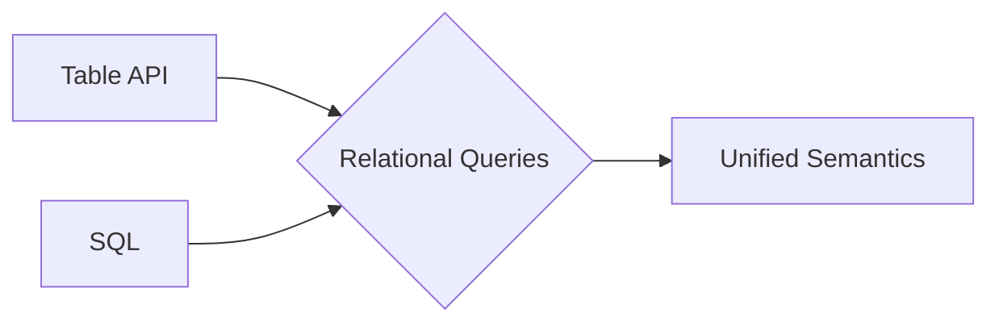
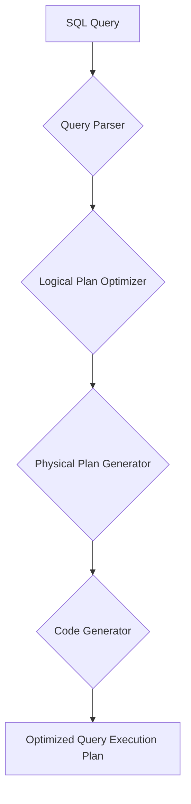

# Table API和SQL 原理与代码实例讲解

## 1.背景介绍

### 1.1 Table API和SQL的起源与发展
#### 1.1.1 Table API的起源
#### 1.1.2 SQL的起源
#### 1.1.3 Table API和SQL的发展历程

### 1.2 Table API和SQL的重要性
#### 1.2.1 在大数据处理中的重要地位 
#### 1.2.2 对数据分析和商业智能的意义
#### 1.2.3 在数据科学和机器学习中的应用

### 1.3 Table API和SQL的主流框架和平台
#### 1.3.1 Apache Flink的Table API & SQL
#### 1.3.2 Apache Spark的Spark SQL
#### 1.3.3 Apache Hive的HiveQL
#### 1.3.4 其他主流大数据框架对SQL的支持

## 2.核心概念与联系

### 2.1 关系型数据库的核心概念
#### 2.1.1 关系模型
#### 2.1.2 表、行、列
#### 2.1.3 主键、外键、索引
#### 2.1.4 范式理论

### 2.2 SQL的核心概念
#### 2.2.1 数据定义语言(DDL)
#### 2.2.2 数据操纵语言(DML)  
#### 2.2.3 数据查询语言(DQL)
#### 2.2.4 数据控制语言(DCL)

### 2.3 Table API的核心概念
#### 2.3.1 Table & TableEnvironment
#### 2.3.2 Table Schema
#### 2.3.3 Table API中的关系操作
#### 2.3.4 Table与DataStream、DataSet的转换

### 2.4 Table API和SQL的关系
#### 2.4.1 Table API对SQL的集成 
#### 2.4.2 SQL作为Table API的补充
#### 2.4.3 统一的关系型API



## 3.核心算法原理具体操作步骤

### 3.1 关系代数
#### 3.1.1 选择
#### 3.1.2 投影
#### 3.1.3 笛卡尔积
#### 3.1.4 并、交、差
#### 3.1.5 θ连接
#### 3.1.6 自然连接

### 3.2 查询优化
#### 3.2.1 逻辑查询优化
#### 3.2.2 物理查询优化
#### 3.2.3 基于规则的优化
#### 3.2.4 基于代价的优化

### 3.3 查询执行
#### 3.3.1 查询执行计划生成
#### 3.3.2 算子的执行
#### 3.3.3 流水线执行
#### 3.3.4 物化视图和查询结果缓存



## 4.数学模型和公式详细讲解举例说明

### 4.1 关系代数的数学定义
#### 4.1.1 选择的数学定义
#### 4.1.2 投影的数学定义
#### 4.1.3 连接的数学定义

### 4.2 查询优化中的数学模型 
#### 4.2.1 查询代价模型
#### 4.2.2 基于动态规划的优化算法
#### 4.2.3 基于启发式搜索的优化算法

### 4.3 数据统计与估算模型
#### 4.3.1 直方图
#### 4.3.2 抽样
#### 4.3.3 概率模型

选择算子$\sigma$的数学定义：

$$\sigma_{c}(R) = \{t\ |\ t \in R \wedge c(t)\}$$

其中$R$表示关系，$t$表示关系中的元组，$c$是选择条件。

## 5.项目实践：代码实例和详细解释说明

### 5.1 基于Flink的Table API和SQL实例
#### 5.1.1 批处理实例
#### 5.1.2 流处理实例 
#### 5.1.3 多表关联查询
#### 5.1.4 窗口聚合查询

### 5.2 基于Spark的Spark SQL实例
#### 5.2.1 DataFrame API示例
#### 5.2.2 Dataset API示例
#### 5.2.3 Spark SQL外部数据源集成
#### 5.2.4 用户自定义函数(UDF)

### 5.3 基于Hive的SQL实例
#### 5.3.1 Hive建表与数据导入
#### 5.3.2 Hive查询优化实例
#### 5.3.3 Hive UDF和UDAF开发
#### 5.3.4 Hive与HBase集成应用

以下是一个Flink Table API和SQL的代码示例：

```scala
// 创建表环境
val env = StreamExecutionEnvironment.getExecutionEnvironment
val tableEnv = StreamTableEnvironment.create(env)

// 创建输入表
tableEnv.executeSql(
  """
    |CREATE TABLE Orders (
    |  order_id BIGINT,
    |  price DECIMAL(32,2),
    |  currency STRING,
    |  order_time TIMESTAMP(3)
    |) WITH (
    |  'connector' = 'kafka',
    |  'topic' = 'orders',
    |  'properties.bootstrap.servers' = 'localhost:9092',
    |  'format' = 'json'  
    |)
  """.stripMargin)

// 创建输出表  
tableEnv.executeSql(
  """
    |CREATE TABLE OrderResults (
    |  order_id BIGINT,
    |  total_price DECIMAL(32,2),
    |  currency STRING,
    |  order_time TIMESTAMP(3)
    |) WITH (
    |  'connector' = 'elasticsearch',
    |  'hosts' = 'http://localhost:9200',
    |  'index' = 'order_results'
    |)
  """.stripMargin)

// 执行查询并写入结果表
val result = tableEnv.sqlQuery(
  """
    |SELECT 
    |  order_id,
    |  SUM(price) AS total_price,
    |  currency,
    |  TUMBLE_START(order_time, INTERVAL '10' MINUTES) AS order_time
    |FROM Orders
    |GROUP BY 
    |  TUMBLE(order_time, INTERVAL '10' MINUTES),
    |  order_id,
    |  currency
  """.stripMargin)

result.executeInsert("OrderResults")
```

上面的代码实现了以下功能：
1. 创建了名为`Orders`的输入表，从Kafka读取订单数据。
2. 创建了名为`OrderResults`的输出表，将聚合结果写入Elasticsearch。
3. 使用SQL查询对`Orders`表进行了窗口聚合，计算每10分钟内每个订单的总金额。
4. 将聚合结果插入到`OrderResults`表中。

## 6.实际应用场景

### 6.1 电商场景
#### 6.1.1 实时订单分析
#### 6.1.2 用户行为分析
#### 6.1.3 商品推荐

### 6.2 物联网场景
#### 6.2.1 设备监控
#### 6.2.2 传感器数据分析
#### 6.2.3 预测性维护

### 6.3 金融场景
#### 6.3.1 欺诈检测
#### 6.3.2 风险评估
#### 6.3.3 交易分析

### 6.4 物流场景
#### 6.4.1 运输路径优化
#### 6.4.2 库存管理
#### 6.4.3 供应链分析

## 7.工具和资源推荐

### 7.1 开源框架
#### 7.1.1 Apache Flink
#### 7.1.2 Apache Spark
#### 7.1.3 Apache Hive
#### 7.1.4 Apache Beam

### 7.2 商业平台
#### 7.2.1 AWS Athena
#### 7.2.2 Google BigQuery
#### 7.2.3 Azure Stream Analytics
#### 7.2.4 Alibaba MaxCompute

### 7.3 学习资源
#### 7.3.1 官方文档
#### 7.3.2 在线课程
#### 7.3.3 技术博客
#### 7.3.4 开源项目

## 8.总结：未来发展趋势与挑战

### 8.1 统一批流处理
#### 8.1.1 Lambda架构向Kappa架构演进
#### 8.1.2 流批一体化处理

### 8.2 SQL语义扩展  
#### 8.2.1 流处理特有语义
#### 8.2.2 机器学习算法的SQL集成
#### 8.2.3 非结构化数据处理

### 8.3 智能优化
#### 8.3.1 自适应查询优化
#### 8.3.2 智能数据分布
#### 8.3.3 自调优存储格式

### 8.4 挑战
#### 8.4.1 实时性与准确性权衡
#### 8.4.2 数据规模与复杂度不断提升
#### 8.4.3 数据隐私与安全

## 9.附录：常见问题与解答

### 9.1 什么是Table API和SQL？
### 9.2 Table API和SQL的区别是什么？
### 9.3 Table API和SQL适用于哪些场景？
### 9.4 如何选择合适的大数据处理框架？
### 9.5 学习Table API和SQL需要哪些前置知识？
### 9.6 如何提高Table API和SQL作业的性能？
### 9.7 如何处理流数据中的延迟数据和乱序数据？
### 9.8 如何实现流数据的关联查询？
### 9.9 如何保证流处理的exactly-once语义？
### 9.10 未来Table API和SQL可能有哪些发展方向？

作者：禅与计算机程序设计艺术 / Zen and the Art of Computer Programming