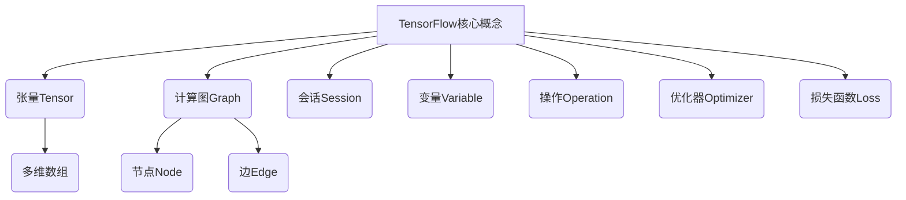

# TensorFlow 原理与代码实战案例讲解

## 1. 背景介绍

### 1.1 人工智能的兴起

人工智能(Artificial Intelligence, AI)是当代科技发展的前沿领域,近年来受到了前所未有的关注和投入。随着计算能力的不断提高和大数据时代的到来,人工智能技术在语音识别、图像处理、自然语言处理等诸多领域展现出了巨大的潜力和应用价值。

### 1.2 机器学习与深度学习

机器学习(Machine Learning)是人工智能的一个重要分支,它赋予计算机在没有明确程序的情况下,通过学习数据获取知识并做出决策的能力。而深度学习(Deep Learning)则是机器学习中一种基于对数据的表征学习的方法,通过对数据多层次特征的自动提取和组合,来完成最终的任务。

### 1.3 TensorFlow 的重要性

TensorFlow 是谷歌公司开源的机器学习框架,可被广泛应用于深度学习、自然语言处理等多个领域。它提供了强大的数值计算能力,并支持在多种设备(CPU、GPU 和 TPU)上高效运行。TensorFlow 具有灵活性、可移植性和高性能等优点,已成为深度学习研究和应用的重要工具。

## 2. 核心概念与联系



TensorFlow 的核心概念包括:

### 2.1 张量(Tensor)

张量是 TensorFlow 中的基本数据单元,可视为一个多维数组。张量的阶数(rank)表示其维度,0 阶张量是标量,1 阶张量是向量,2 阶张量是矩阵,更高阶的张量对应更高维度的数组。

### 2.2 计算图(Graph)

计算图是 TensorFlow 中描述计算过程的数据结构,由节点(Node)和边(Edge)组成。节点表示具体的操作,边则表示操作之间的依赖关系。计算图定义了张量之间的数学运算,可以高效地利用计算资源进行并行计算。

### 2.3 会话(Session)

会话是 TensorFlow 中执行计算图的环境,用于分配资源并运行操作。在会话中,我们可以初始化变量、运行计算图中的操作,并获取计算结果。会话管理着 TensorFlow 程序的整个生命周期。

### 2.4 变量(Variable)

变量是 TensorFlow 中可修改的张量,通常用于存储模型参数。在训练过程中,变量会根据优化算法不断更新,以最小化损失函数。变量需要在会话中初始化后才能使用。

### 2.5 操作(Operation)

操作是计算图中的节点,表示对张量进行的具体计算操作,如加法、乘法、卷积等。操作可以是预定义的,也可以是自定义的。

### 2.6 优化器(Optimizer)

优化器是 TensorFlow 中实现模型训练的关键组件,它根据损失函数的值,通过特定的优化算法(如梯度下降)来更新模型的变量,使损失函数的值最小化。

### 2.7 损失函数(Loss)

损失函数用于评估模型的预测结果与真实值之间的差距。在训练过程中,我们需要最小化损失函数的值,从而使模型的预测结果逐渐逼近真实值。不同的任务会采用不同的损失函数。

## 3. 核心算法原理具体操作步骤

### 3.1 建立计算图

在 TensorFlow 中,我们首先需要构建计算图来描述数据流程。计算图由节点和边组成,节点表示具体的操作,边则表示数据依赖关系。我们可以使用 TensorFlow 提供的各种操作来构建计算图,如加法、乘法、卷积等。

以下是一个简单的示例,演示如何构建一个计算图来实现 $y = x^2$ 的操作:

```python
import tensorflow as tf

# 创建一个占位符x,用于输入数据
x = tf.placeholder(tf.float32)

# 创建一个操作节点,计算x的平方
y = tf.square(x)

# 启动会话,运行计算图
with tf.Session() as sess:
    # 输入数据
    x_value = 3.0
    
    # 计算y的值
    y_value = sess.run(y, feed_dict={x: x_value})
    
    print(f"x={x_value}, y={y_value}")  # 输出: x=3.0, y=9.0
```

在这个示例中,我们首先创建了一个占位符 `x`,用于输入数据。然后,我们定义了一个操作节点 `y`,它计算 `x` 的平方。接下来,我们启动一个会话,并使用 `sess.run()` 函数来执行计算图中的操作,输入数据并获取结果。

### 3.2 定义模型

在构建计算图的基础上,我们可以定义机器学习模型,包括输入数据、模型参数、前向传播过程和损失函数等。以下是一个简单的线性回归模型示例:

```python
import tensorflow as tf

# 输入数据
X = tf.placeholder(tf.float32, shape=[None, 1])
y = tf.placeholder(tf.float32, shape=[None, 1])

# 模型参数
W = tf.Variable(tf.random_normal([1, 1]), name='weight')
b = tf.Variable(tf.zeros([1]), name='bias')

# 前向传播
y_pred = tf.matmul(X, W) + b

# 损失函数
loss = tf.reduce_mean(tf.square(y_pred - y))
```

在这个示例中,我们首先定义了输入数据 `X` 和 `y`。然后,我们创建了模型参数 `W` 和 `b`,分别表示权重和偏置。接下来,我们定义了前向传播过程 `y_pred`,它计算了线性回归模型的预测值。最后,我们定义了损失函数 `loss`,它计算了预测值与真实值之间的均方差。

### 3.3 训练模型

定义好模型后,我们需要进行训练,使模型参数不断优化,从而最小化损失函数。在 TensorFlow 中,我们通常使用优化器来实现这一过程。以下是一个使用梯度下降优化器训练线性回归模型的示例:

```python
# 优化器
optimizer = tf.train.GradientDescentOptimizer(learning_rate=0.01).minimize(loss)

# 初始化变量
init = tf.global_variables_initializer()

# 启动会话,训练模型
with tf.Session() as sess:
    sess.run(init)
    
    # 迭代训练
    for i in range(1000):
        _, loss_value = sess.run([optimizer, loss], feed_dict={X: X_train, y: y_train})
        if i % 100 == 0:
            print(f"Iteration {i}, Loss={loss_value}")
    
    # 评估模型
    W_value, b_value = sess.run([W, b])
    print(f"W={W_value}, b={b_value}")
```

在这个示例中,我们首先创建了一个梯度下降优化器 `optimizer`,它的目标是最小化损失函数 `loss`。然后,我们初始化了模型的变量。

接下来,我们启动一个会话,并进行迭代训练。在每一次迭代中,我们执行优化器操作 `optimizer`,它会根据当前的损失函数值更新模型参数。我们还打印出每 100 次迭代的损失函数值,以便监控训练过程。

最后,我们评估训练后的模型参数 `W` 和 `b`,并打印出它们的值。

通过上述步骤,我们就完成了一个简单的线性回归模型的训练过程。在实际应用中,我们可以根据具体任务调整模型结构、损失函数和优化器等,以获得更好的性能。

## 4. 数学模型和公式详细讲解举例说明

在深度学习中,许多核心算法都基于数学模型和公式。本节将介绍一些常见的数学模型和公式,并通过具体示例详细解释它们的原理和应用。

### 4.1 线性回归

线性回归是一种简单但广泛应用的机器学习算法,它试图找到一条最佳拟合直线,使数据点到直线的距离之和最小。线性回归的数学模型可表示为:

$$y = wx + b$$

其中 $y$ 是预测值, $x$ 是输入特征, $w$ 是权重, $b$ 是偏置。我们的目标是找到最优的 $w$ 和 $b$,使得预测值 $y$ 尽可能接近真实值。

为了优化 $w$ 和 $b$,我们通常采用最小二乘法,即最小化以下损失函数:

$$\text{Loss} = \sum_{i=1}^{n} (y_i - (wx_i + b))^2$$

其中 $n$ 是样本数量, $y_i$ 是第 $i$ 个样本的真实值, $x_i$ 是第 $i$ 个样本的特征值。

通过梯度下降等优化算法,我们可以不断更新 $w$ 和 $b$,使损失函数的值最小化。以下是一个使用 TensorFlow 实现线性回归的示例:

```python
import tensorflow as tf
import numpy as np

# 生成模拟数据
X_train = np.random.rand(100, 1)
y_train = 3 * X_train + 2 + np.random.randn(100, 1)

# 定义占位符
X = tf.placeholder(tf.float32, shape=[None, 1])
y = tf.placeholder(tf.float32, shape=[None, 1])

# 定义模型参数
W = tf.Variable(tf.random_normal([1, 1]), name='weight')
b = tf.Variable(tf.zeros([1]), name='bias')

# 前向传播
y_pred = tf.matmul(X, W) + b

# 损失函数
loss = tf.reduce_mean(tf.square(y_pred - y))

# 优化器
optimizer = tf.train.GradientDescentOptimizer(learning_rate=0.01).minimize(loss)

# 初始化变量
init = tf.global_variables_initializer()

# 训练模型
with tf.Session() as sess:
    sess.run(init)
    
    for i in range(1000):
        _, loss_value = sess.run([optimizer, loss], feed_dict={X: X_train, y: y_train})
        if i % 100 == 0:
            print(f"Iteration {i}, Loss={loss_value}")
    
    # 评估模型
    W_value, b_value = sess.run([W, b])
    print(f"W={W_value}, b={b_value}")
```

在这个示例中,我们首先生成了一些模拟数据,其中 $y = 3x + 2 + \epsilon$ ($\epsilon$ 是随机噪声)。然后,我们定义了输入占位符 `X` 和 `y`、模型参数 `W` 和 `b`、前向传播过程 `y_pred` 以及损失函数 `loss`。

接下来,我们创建了一个梯度下降优化器 `optimizer`,并进行迭代训练。在每一次迭代中,我们执行优化器操作,更新模型参数 `W` 和 `b`,并打印当前的损失函数值。

最后,我们评估训练后的模型参数 `W` 和 `b`,它们的值应该接近于 3 和 2。

通过这个示例,我们可以看到如何使用 TensorFlow 实现线性回归模型,并通过梯度下降算法优化模型参数,使预测值尽可能接近真实值。

### 4.2 逻辑回归

逻辑回归是一种广泛应用于分类问题的算法,它将输入特征映射到 0 到 1 之间的概率值,表示样本属于某个类别的可能性。逻辑回归的数学模型可表示为:

$$y = \sigma(wx + b)$$

其中 $\sigma(z) = \frac{1}{1 + e^{-z}}$ 是 Sigmoid 函数,它将输入值映射到 0 到 1 之间。$y$ 表示样本属于正类的概率, $x$ 是输入特征, $w$ 是权重, $b$ 是偏置。

为了训练逻辑回归模型,我们通常采用交叉熵损失函数:

$$\text{Loss} = -\frac{1}{n} \sum_{i=1}^{n} [y_i \log(\hat{y}_i) + (1 - y_i) \log(1 - \hat{y}_i)]$$

其中 $n$ 是样本数