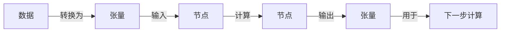

# TensorFlow 原理与代码实战案例讲解

## 1. 背景介绍
在深度学习技术飞速发展的今天，TensorFlow已经成为了其中最受欢迎的框架之一。自2015年由Google开源以来，TensorFlow凭借其强大的计算能力、灵活的设计和广泛的社区支持，迅速成为了研究者和开发者的首选。无论是在图像识别、自然语言处理还是强化学习等领域，TensorFlow都扮演着至关重要的角色。

## 2. 核心概念与联系
TensorFlow的核心概念围绕着数据流图（Data Flow Graphs），其中节点（Nodes）代表计算操作，边（Edges）代表在节点间流动的多维数据数组，即张量（Tensors）。这种结构使得TensorFlow能够灵活地在多种设备上执行，并且能够进行自动微分，这对于深度学习模型的训练至关重要。



## 3. 核心算法原理具体操作步骤
TensorFlow的核心算法原理基于反向传播和梯度下降。在执行计算图时，TensorFlow会自动计算所需的梯度，并通过优化器更新模型的参数，以最小化损失函数。

## 4. 数学模型和公式详细讲解举例说明
以线性回归为例，模型可以表示为 $y = wx + b$，其中 $w$ 是权重，$b$ 是偏置。损失函数通常使用均方误差（MSE），表示为：

$$
L = \frac{1}{n}\sum_{i=1}^{n}(y_i - (wx_i + b))^2
$$

在TensorFlow中，我们可以使用自动微分来计算 $L$ 关于 $w$ 和 $b$ 的梯度，并通过梯度下降法更新这些参数。

## 5. 项目实践：代码实例和详细解释说明
以下是一个简单的TensorFlow代码实例，展示了如何实现和训练一个线性回归模型：

```python
import tensorflow as tf

# 模拟数据
x = tf.constant([[1.0], [2.0], [3.0], [4.0]])
y_true = tf.constant([[0.], [1.], [2.], [3.]])

# 模型参数
W = tf.Variable(tf.ones([1, 1]))
b = tf.Variable(tf.zeros([1]))

# 模型输出
y_pred = tf.matmul(x, W) + b

# 损失函数
loss = tf.reduce_mean(tf.square(y_pred - y_true))

# 优化器
optimizer = tf.train.GradientDescentOptimizer(0.01)
train = optimizer.minimize(loss)

# 创建会话并初始化变量
with tf.Session() as sess:
    sess.run(tf.global_variables_initializer())
    for i in range(1000):
        sess.run(train)
    print(sess.run([W, b]))
```

在这个例子中，我们首先定义了模拟数据和模型参数。然后，我们计算了模型的输出和损失函数。最后，我们使用梯度下降优化器来最小化损失，并在一个会话中运行这个训练过程。

## 6. 实际应用场景
TensorFlow在许多实际应用场景中都有广泛的应用，包括但不限于图像识别、语音识别、推荐系统、自然语言处理等。例如，在图像识别中，TensorFlow可以用来训练卷积神经网络（CNN）来识别和分类图像中的对象。

## 7. 工具和资源推荐
为了更好地使用TensorFlow，以下是一些推荐的工具和资源：
- TensorFlow官方文档：提供了详细的API参考和教程。
- TensorFlow Playground：一个在线的可视化工具，可以帮助理解神经网络的工作原理。
- Google Colab：一个免费的Jupyter笔记本环境，可以直接在浏览器中使用TensorFlow。

## 8. 总结：未来发展趋势与挑战
TensorFlow正不断地发展和进化，未来的趋势可能包括更加高效的计算性能、更广泛的硬件支持、以及更加友好的API设计。同时，随着模型和数据集的不断增大，如何有效地进行分布式训练和模型部署也将是TensorFlow面临的挑战。

## 9. 附录：常见问题与解答
Q1: TensorFlow 2.x和1.x有什么区别？
A1: TensorFlow 2.x在API设计上更加简洁和统一，移除了许多1.x版本中的冗余和复杂性。同时，2.x版本默认启用了Eager Execution，使得操作更加直观和易于调试。

Q2: 如何在TensorFlow中进行GPU加速？
A2: TensorFlow会自动检测系统中的GPU并尝试使用它进行加速。你可以通过设置环境变量或者在代码中配置来控制GPU的使用。

作者：禅与计算机程序设计艺术 / Zen and the Art of Computer Programming