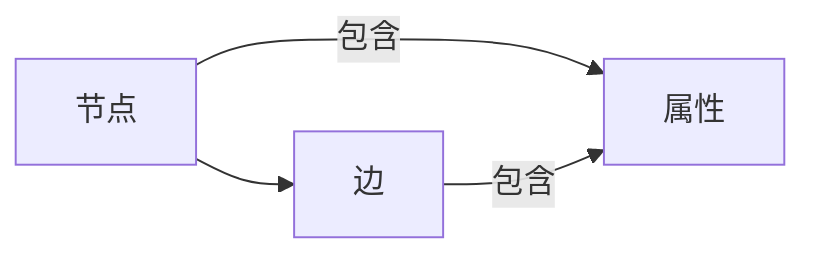
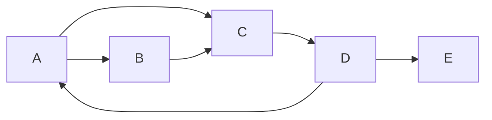

# TinkerPop原理与代码实例讲解

## 1.背景介绍

### 1.1 图数据库简介

在当今数据驱动的世界中,数据的重要性不言而喻。传统的关系型数据库虽然在结构化数据存储和查询方面表现出色,但在处理高度互连的数据时却显得力不从心。这种数据通常以网络或图的形式存在,例如社交网络、知识图谱、基因组数据等。为了高效地存储和查询这些数据,图数据库(Graph Database)应运而生。

图数据库是一种NoSQL数据库,它使用图结构高效地存储由节点(Node)和边(Edge)组成的数据。每个节点代表一个实体(如人或地点),而边则描述节点之间的关系。与关系型数据库相比,图数据库更适合表示和查询高度互连的数据。

### 1.2 TinkerPop介绍

TinkerPop是一个开源的图计算框架,旨在提供标准的图数据结构和查询语言,使不同的图数据库系统能够无缝集成和互操作。它由Apache软件基金会维护,是图数据库领域的事实标准。

TinkerPop包含以下几个核心组件:

- **Blueprints**: 定义了图数据模型的标准接口,包括节点、边、属性等概念。
- **Gremlin**: 一种功能强大的图遍历语言,用于查询和操作图数据。
- **Gremlin-Server**: 一个基于WebSocket的服务器,允许远程执行Gremlin查询。
- **Gremlin-Driver**: 一组语言特定的驱动程序,用于连接Gremlin-Server并执行查询。

TinkerPop提供了一个通用的框架,使得开发人员可以编写一次代码,在多种图数据库系统上运行,从而避免了数据库锁定的问题。它还支持多种编程语言,如Java、Groovy、Python、.NET等。

## 2.核心概念与联系

### 2.1 图数据模型

在TinkerPop中,图数据模型由以下核心概念组成:

1. **节点(Vertex)**: 代表图中的实体或对象。
2. **边(Edge)**: 连接两个节点,描述它们之间的关系。
3. **属性(Property)**: 附加在节点或边上的键值对,用于存储元数据。
4. **标签(Label)**: 用于对节点或边进行分类和标识。

这些概念共同构建了一个富有表现力的数据模型,能够自然地表示现实世界中的实体及其关系。



### 2.2 Gremlin查询语言

Gremlin是TinkerPop中的核心查询语言,它基于函数式编程范式,使用链式调用的方式构建图遍历查询。Gremlin查询由一系列步骤(Step)组成,每个步骤都会对输入的数据进行转换或过滤,最终得到所需的结果。

Gremlin查询语言提供了丰富的步骤,可以执行各种操作,如遍历、过滤、转换、聚合等。它还支持嵌套查询、子查询和模块化编程,使得复杂查询的构建和维护变得更加简单。

以下是一个简单的Gremlin查询示例,用于查找与给定节点相连的所有节点:

```groovy
g.V(1).outE().inV().valueMap()
```

这个查询首先从节点ID为1的节点开始,然后遍历所有出边,再遍历到达的节点,最后返回这些节点的属性映射。

## 3.核心算法原理具体操作步骤

### 3.1 图遍历算法

图遍历是图数据库中最常见的操作之一,它指的是从一个或多个起始节点出发,沿着边遍历图中的节点和边。TinkerPop中的Gremlin语言提供了多种图遍历算法,用于解决不同的查询需求。

以下是一些常见的图遍历算法及其具体操作步骤:

#### 3.1.1 广度优先遍历(BFS)

广度优先遍历从起始节点开始,先访问所有相邻节点,然后访问这些节点的相邻节点,依此类推,直到遍历完整个图或达到指定的终止条件。

1. 将起始节点加入队列。
2. 从队列中取出一个节点,访问它。
3. 将该节点的所有未访问过的相邻节点加入队列。
4. 重复步骤2和3,直到队列为空。

```groovy
g.V(1).repeat(__.outE().inV().simplePath()).times(3).path()
```

这个查询从节点1开始,执行三次广度优先遍历,并返回所有路径。

#### 3.1.2 深度优先遍历(DFS)

深度优先遍历从起始节点开始,沿着一条路径尽可能深入,直到无法继续前进,然后回溯到上一个节点,尝试另一条路径。

1. 将起始节点压入栈。
2. 从栈顶取出一个节点,访问它。
3. 将该节点的所有未访问过的相邻节点压入栈。
4. 重复步骤2和3,直到栈为空。

```groovy
g.V(1).repeat(__.outE().inV().simplePath()).emit().times(3).path()
```

这个查询从节点1开始,执行三次深度优先遍历,并返回所有路径。

### 3.2 图算法

除了基本的遍历算法之外,TinkerPop还提供了一些高级的图算法,用于解决特定的问题,如最短路径、连通分量、页面排名等。这些算法通常基于遍历算法,但采用了更高级的策略和优化技术。

#### 3.2.1 最短路径算法

最短路径算法用于在图中找到两个节点之间的最短路径,常见的算法有Dijkstra算法和A*算法。

1. 初始化一个优先队列,将起始节点及其距离(0)加入队列。
2. 从队列中取出距离最小的节点。
3. 更新该节点的所有相邻节点的距离,并将未访问过的节点加入队列。
4. 重复步骤2和3,直到目标节点被访问或队列为空。

```groovy
g.withComputer().V(1).shortestPath().with(ShortestPathStrategy.Target, __.hasId(10)).toList()
```

这个查询使用Spark图计算引擎,从节点1开始,找到到达节点10的最短路径。

#### 3.2.2 PageRank算法

PageRank算法是谷歌用于网页排名的著名算法,它通过计算每个节点的重要性得分,来评估节点在图中的影响力。

1. 初始化所有节点的PageRank值为1/N(N为节点总数)。
2. 对每个节点,将其PageRank值平均分配给所有出边指向的节点。
3. 重复步骤2,直到PageRank值收敛或达到最大迭代次数。

```groovy
g.withComputer().pageRank().valueMap().toList()
```

这个查询使用Spark图计算引擎,计算图中所有节点的PageRank值。

### 3.3 图分析

除了查询和算法之外,TinkerPop还提供了一些图分析功能,用于深入了解图数据的结构和特性。

#### 3.3.1 统计指标

TinkerPop支持计算各种统计指标,如节点/边的数量、度数分布、聚类系数等。这些指标可以帮助我们更好地理解图的拓扑结构和连通性。

```groovy
g.V().count()  // 节点数量
g.E().count()  // 边数量
g.V().outE().groupCount().next()  // 出度分布
g.V().inE().groupCount().next()  // 入度分布
```

#### 3.3.2 社区发现

社区发现算法用于识别图中的密集子图或社区结构。这对于理解图中的群集行为和发现潜在的关联模式非常有用。

```groovy
g.withComputer().initializer(Initiators.load(initialGraph)).algorithm(VertexProgramAlgorithm.LOUVAIN).persist(GraphComputer.Persist.EDGES).program(LouvainVertexProgram.build().maxIterations(100).build()).submit().get().memory().vertices().groupCount().next()
```

这个查询使用Spark图计算引擎,运行Louvain社区发现算法,并返回每个社区的节点数量。

## 4.数学模型和公式详细讲解举例说明

在图数据库和图算法领域,一些重要的数学模型和公式为理解和优化算法提供了理论基础。

### 4.1 PageRank算法

PageRank算法是谷歌用于网页排名的著名算法,它通过计算每个节点的重要性得分,来评估节点在图中的影响力。PageRank算法的核心思想是,一个节点的重要性不仅取决于指向它的入边数量,还取决于这些入边所连接节点的重要性。

PageRank算法的数学模型可以表示为:

$$PR(u) = \frac{1-d}{N} + d \sum_{v \in B_u} \frac{PR(v)}{L(v)}$$

其中:

- $PR(u)$表示节点$u$的PageRank值
- $N$是图中节点的总数
- $B_u$是指向节点$u$的所有节点集合
- $L(v)$是节点$v$的出度(出边数量)
- $d$是一个阻尼系数,通常取值0.85

这个公式可以递归地计算每个节点的PageRank值,直到收敛或达到最大迭代次数。

为了更好地理解PageRank算法,让我们考虑一个简单的示例。假设我们有一个包含5个节点的图,如下所示:



初始时,每个节点的PageRank值为$\frac{1}{5}$。在第一次迭代后,每个节点的PageRank值如下:

- $PR(A) = \frac{1-0.85}{5} + 0.85 \times \frac{1/5}{2} = 0.285$
- $PR(B) = \frac{1-0.85}{5} + 0.85 \times \frac{1/5}{1} = 0.335$
- $PR(C) = \frac{1-0.85}{5} + 0.85 \times \frac{1/5 + 1/5}{2} = 0.335$
- $PR(D) = \frac{1-0.85}{5} + 0.85 \times \frac{1/5}{3} = 0.235$
- $PR(E) = \frac{1-0.85}{5} + 0.85 \times \frac{1/5}{1} = 0.335$

经过多次迭代,PageRank值将逐渐收敛到一个稳定的状态,反映了每个节点在图中的相对重要性。

### 4.2 社区发现算法

社区发现算法旨在识别图中的密集子图或社区结构。这些算法通常基于模ул度(Modularity)指标,该指标衡量了图中社区的紧密程度。

模块度的数学定义如下:

$$Q = \frac{1}{2m} \sum_{i,j} \left[ A_{ij} - \frac{k_i k_j}{2m} \right] \delta(c_i, c_j)$$

其中:

- $m$是图中边的总数
- $A_{ij}$是邻接矩阵,如果节点$i$和节点$j$之间有边,则$A_{ij}=1$,否则为0
- $k_i$和$k_j$分别是节点$i$和节点$j$的度数
- $\delta(c_i, c_j)$是一个指示函数,如果节点$i$和节点$j$属于同一个社区,则为1,否则为0

模块度的取值范围是[-1, 1]。较高的模块度值表示图中存在更明显的社区结构。

一种常见的社区发现算法是Louvain算法,它是一种基于模块度优化的层次聚类算法。Louvain算法的基本思想是:

1. 将每个节点初始化为一个单独的社区。
2. 对于每个节点,计算将其移动到相邻社区后模块度的增量,并选择增量最大的移动。
3. 重复步骤2,直到模块度不再增加。
4. 将每个社区视为一个新的"节点",构建新的图。
5. 重复步骤2-4,直到模块度不再增加。

通过这种层次聚类的方式,Louvain算法可以有效地发现图中的社区结构。

## 5.项目实践:代