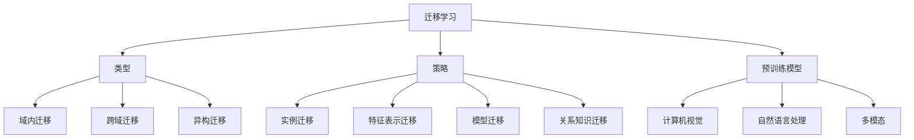

# Transfer Learning 原理与代码实战案例讲解

## 1. 背景介绍

### 1.1 机器学习的挑战

在过去几年中,机器学习和深度学习取得了令人瞩目的成就,但训练一个高性能的模型仍然面临着巨大的挑战。首先,收集和标注大量高质量的训练数据是一个昂贵且耗时的过程。其次,从头开始训练一个复杂的深度神经网络模型需要大量的计算资源和时间。此外,针对不同的任务和数据集,通常需要重新设计和训练新的模型,这增加了开发的复杂性和成本。

### 1.2 Transfer Learning的概念

为了解决上述挑战,Transfer Learning(迁移学习)应运而生。迁移学习的核心思想是利用在源领域学习到的知识,来帮助相关的目标领域任务的学习。换句话说,我们可以在一个领域(如图像识别)预先训练一个模型,然后将这个模型的知识迁移到另一个相关领域(如医学影像分析),从而加速新模型的训练过程并提高其性能。

### 1.3 Transfer Learning的优势

引入Transfer Learning带来了诸多优势:

1. **数据效率**: 通过迁移学习,我们可以在小数据集上训练出良好的模型,避免了从头开始收集和标注大量数据的需求。
2. **计算效率**: 由于模型的大部分参数和特征可以从源任务中迁移,因此训练新模型所需的计算资源和时间大大减少。
3. **泛化能力**: 在源任务中学习到的通用特征可以很好地迁移到目标任务,从而提高模型的泛化能力。
4. **模型复用**: 预训练模型可以在多个相关任务之间共享和复用,从而降低了开发成本。

## 2. 核心概念与联系

### 2.1 迁移学习的类型

根据源任务和目标任务的不同,迁移学习可以分为以下几种类型:

1. **域内迁移(Intra-Domain Transfer)**: 源任务和目标任务属于同一领域,例如从自然图像分类迁移到医学图像分类。
2. **跨域迁移(Cross-Domain Transfer)**: 源任务和目标任务属于不同领域,例如从自然语言处理迁移到计算机视觉。
3. **异构迁移(Heterogeneous Transfer)**: 源任务和目标任务的数据类型不同,例如从图像迁移到文本或从视频迁移到音频。

### 2.2 迁移学习的策略

根据如何利用源模型的知识,迁移学习可以采用以下几种主要策略:

1. **实例迁移(Instance Transfer)**: 重用源数据或通过数据挖掘生成合成数据,用于目标任务的训练。
2. **特征表示迁移(Feature Representation Transfer)**: 将源模型学习到的特征表示迁移到目标模型,作为初始化或正则化。
3. **模型迁移(Model Transfer)**: 直接迁移源模型的参数,对目标任务进行微调(fine-tuning)或模型扩展。
4. **关系知识迁移(Relational Knowledge Transfer)**: 迁移源任务中学习到的数据间的关系或逻辑规则。

### 2.3 预训练模型

在实践中,我们通常会利用在大型公开数据集(如ImageNet)上预先训练好的模型,将其作为迁移学习的源模型。一些常用的预训练模型包括:

- 计算机视觉: VGGNet、ResNet、Inception、EfficientNet等。
- 自然语言处理: Word2Vec、BERT、GPT、XLNet等。
- 多模态: ViLBERT、VisualBERT、UNITER等。

利用这些预训练模型作为起点,我们可以快速构建出适用于特定任务的高性能模型。



## 3. 核心算法原理具体操作步骤

### 3.1 模型微调(Fine-tuning)

模型微调是迁移学习中最常用的策略之一。它的基本思路是:首先在源任务上预训练一个基础模型,然后在目标任务上对该模型的部分层或全部层进行微调。具体操作步骤如下:

1. **获取预训练模型**: 从公开的模型库(如PyTorch Hub、TensorFlow Hub)中下载适合的预训练模型。
2. **冻结基础层**: 由于底层捕获的是一些通用的低级特征,因此我们通常冻结预训练模型的基础层参数,防止在微调过程中被修改。
3. **替换输出层**: 将预训练模型的输出层替换为新的输出层,使其与目标任务的输出维度相匹配。
4. **微调训练**: 使用目标任务的数据集,在保持基础层参数不变的情况下,仅微调顶层的全连接层。
5. **全模型微调(可选)**: 在第4步的基础上,解冻所有层并进一步微调整个模型。

通过模型微调,我们可以在相对较短的时间内获得针对目标任务的高性能模型。

### 3.2 特征提取

除了微调整个模型之外,我们还可以将预训练模型视为一个特征提取器,仅利用其中的某些层输出作为目标任务的特征表示。具体步骤如下:

1. **获取预训练模型**: 与模型微调中的第1步相同。
2. **冻结所有层**: 将预训练模型的所有层参数冻结,防止在训练过程中被修改。
3. **前向传播**: 使用源任务的数据集,通过预训练模型进行前向传播,获取中间层的输出作为特征表示。
4. **训练新模型**: 使用提取的特征表示作为输入,训练一个新的模型(如支持向量机、随机森林等)以完成目标任务。

这种方法的优点是简单高效,但由于没有对预训练模型进行微调,可能无法充分利用其知识。因此,通常将其作为一种基线方法,或用于快速原型设计。

### 3.3 模型扩展

除了微调和特征提取之外,我们还可以通过模型扩展的方式进行迁移学习。其基本思路是:在预训练模型的基础上,增加一些新的层或组件,使其能够适应目标任务的需求。具体步骤如下:

1. **获取预训练模型**: 与模型微调中的第1步相同。
2. **冻结基础层**: 与模型微调中的第2步相同。
3. **添加新层**: 根据目标任务的需求,在预训练模型的顶部添加新的层或组件,例如注意力机制、条件随机场等。
4. **端到端训练**: 使用目标任务的数据集,对整个模型(包括预训练部分和新添加的部分)进行端到端的联合训练。

这种方法的优点是可以充分利用预训练模型的知识,同时又可以通过添加新组件来满足目标任务的特殊需求。但是,它也需要更多的设计工作和计算资源。

无论采用哪种迁移学习策略,都需要根据具体的任务需求和资源约束进行权衡。在实践中,通常会尝试多种策略并进行比较,以获得最佳的模型性能。

## 4. 数学模型和公式详细讲解举例说明

在迁移学习中,我们通常会使用损失函数来衡量模型在目标任务上的性能,并通过优化该损失函数来调整模型参数。下面我们将介绍一些常用的损失函数及其数学原理。

### 4.1 交叉熵损失(Cross-Entropy Loss)

交叉熵损失是分类任务中最常用的损失函数之一。它衡量了模型预测的概率分布与真实标签之间的差异。对于二分类问题,交叉熵损失可以表示为:

$$
L(y, \hat{y}) = -[y \log(\hat{y}) + (1 - y) \log(1 - \hat{y})]
$$

其中,y是真实标签(0或1),\hat{y}是模型预测的概率值。

对于多分类问题,交叉熵损失可以扩展为:

$$
L(Y, \hat{Y}) = -\sum_{i=1}^{C} y_i \log(\hat{y}_i)
$$

其中,C是类别数量,Y是一个one-hot向量表示真实标签,\hat{Y}是模型预测的概率分布。

交叉熵损失的优点是可以直接优化模型的概率输出,并且对于不平衡的类别分布具有较好的鲁棒性。

### 4.2 三重损失(Triplet Loss)

在一些度量学习任务中,我们希望学习到一个embedding空间,使得相似的样本在该空间中彼此靠近,而不相似的样本则相距较远。这种情况下,我们可以使用三重损失函数:

$$
L(a, p, n) = \max(d(a, p) - d(a, n) + \alpha, 0)
$$

其中,a是锚点样本,p是正例样本,n是负例样本,d(x, y)是x和y之间的距离度量(如欧氏距离),\alpha是一个超参数,用于控制正负样本之间的最小间隔。

三重损失的目标是最小化锚点样本与正例样本之间的距离,同时最大化锚点样本与负例样本之间的距离,从而学习到一个有区分能力的embedding空间。

### 4.3 中心损失(Center Loss)

在一些特征学习任务中,我们希望学习到一个discriminative的特征表示,使得同类样本的特征向量彼此靠近,而异类样本的特征向量相距较远。为此,我们可以引入中心损失:

$$
L_c = \frac{1}{2}\sum_{i=1}^{m} \left\lVert x_i - c_{y_i} \right\rVert_2^2
$$

其中,m是小批量样本数,x_i是第i个样本的特征向量,y_i是其对应的类别标签,c_{y_i}是该类别的特征中心。

中心损失的目标是最小化每个样本特征向量与其类别中心之间的距离,从而使同类样本的特征向量聚集在一起。通常,我们会将中心损失与原有的分类损失(如交叉熵损失)相结合,共同优化模型的参数。

上述损失函数只是迁移学习中常用的一些代表性例子。在实际应用中,我们还可以根据具体任务的需求,设计出其他形式的损失函数,以获得更好的迁移效果。

## 5. 项目实践: 代码实例和详细解释说明

在这一部分,我们将通过一个实际的代码示例,演示如何使用PyTorch进行迁移学习。我们将基于预训练的ResNet-50模型,对一个小型的图像分类数据集进行微调。

### 5.1 导入必要的库

```python
import torch
import torch.nn as nn
import torchvision.models as models
import torchvision.transforms as transforms
from torch.utils.data import DataLoader
from torchvision.datasets import ImageFolder
```

### 5.2 准备数据集

我们将使用PyTorch内置的`ImageFolder`类来加载图像数据集。这里我们假设数据集的目录结构如下:

```
data/
    train/
        class_a/
            image_1.jpg
            image_2.jpg
            ...
        class_b/
            image_1.jpg
            image_2.jpg
            ...
    val/
        class_a/
            image_1.jpg
            image_2.jpg
            ...
        class_b/
            image_1.jpg
            image_2.jpg
            ...
```

```python
# 定义数据预处理
data_transforms = {
    'train': transforms.Compose([
        transforms.RandomResizedCrop(224),
        transforms.RandomHorizontalFlip(),
        transforms.ToTensor(),
        transforms.Normalize([0.485, 0.456, 0.406], [0.229, 0.224, 0.225])
    ]),
    'val': transforms.Compose([
        transforms.Resize(256),
        transforms.CenterCrop(224),
        transforms.ToTensor(),
        transforms.Normalize([0.485, 0.456, 0.406],