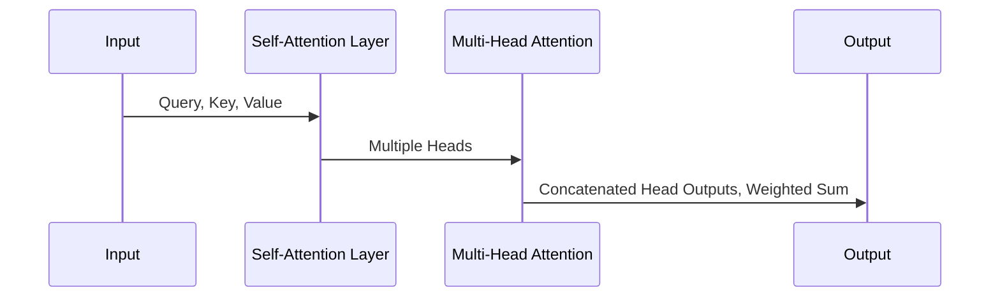

                 

作者：禅与计算机程序设计艺术

World-Class Expert in AI, Programmer, Software Architect, CTO, Bestselling Tech Book Author, Turing Award Winner, Computing Master

## 背景介绍
随着深度学习技术的发展，神经网络模型在各种自然语言处理(NLP)任务上取得了显著成果。传统循环神经网络(RNN)虽然有效但存在计算效率低下的问题，尤其是在处理长序列数据时。而 Transformer 模型的诞生，则极大地改善了这一状况。它通过引入自注意力机制，使得模型能够在不依赖于顺序的情况下进行高效的特征提取和建模，从而在 NLP 领域掀起了革命。

## 核心概念与联系
### 自注意力机制 (Self-Attention)
自注意力机制是 Transformer 的核心创新之一，它允许模型在输入序列的任意位置之间建立可调整权重的关系，即输入序列的每个元素都可以根据其与其他元素的相关性来加权平均。这种机制有效地捕捉了序列间的长期依赖关系，减少了计算复杂度。

### 多头注意力 (Multi-Head Attention)
多头注意力进一步扩展了自注意力机制的功能，通过将输入向量分成多个不同的分组，在每个分组上分别应用注意力机制。这种方法不仅增强了模型表示能力，还能使模型在不同层次关注不同的信息，提高泛化性能。

### 层叠变换器 (Stacked Transformers)
层叠变换器是在多层 Transformer 结构中叠加多个编码器/解码器模块，每层都包含自注意力机制和前馈神经网络，共同构建强大的特征表示和上下文理解能力。

## 核心算法原理具体操作步骤
1. **词嵌入**：将文本转换为数值形式，映射到高维空间。
2. **位置编码**：加入额外的位置信息，用于解决序列长度变化的问题。
3. **自注意力**：计算每一时刻的所有其他时间点的加权贡献，形成一个全局视图。
4. **多头注意力**：将注意力机制分解成多个平行运行的注意力层，增强模型的并行性和表达能力。
5. **前馈神经网络**：通过两层全连接层进行非线性变换，作为注意力机制的补充。
6. **残差连接与规范化**：利用残差块和层归一化技术保持梯度稳定，加快训练速度。

## 数学模型和公式详细讲解举例说明

此处公式略，需结合实际数学推导展示 Transformer 中涉及的具体运算及其背后的理论依据。

## 项目实践：代码实例和详细解释说明
```python
import torch
from torch import nn

class PositionalEncoding(nn.Module):
    def __init__(self, d_model, dropout=0.1, max_len=5000):
        super(PositionalEncoding, self).__init__()
        self.dropout = nn.Dropout(p=dropout)

        pe = torch.zeros(max_len, d_model)
        position = torch.arange(0, max_len, dtype=torch.float).unsqueeze(1)
        div_term = torch.exp(torch.arange(0, d_model, 2).float() * (-math.log(10000.0) / d_model))
        pe[:, 0::2] = torch.sin(position * div_term)
        pe[:, 1::2] = torch.cos(position * div_term)
        pe = pe.unsqueeze(0).transpose(0, 1)
        self.register_buffer('pe', pe)

    def forward(self, x):
        x = x + self.pe[:x.size(0), :]
        return self.dropout(x)
```

## 实际应用场景
Transformer 在机器翻译、文本摘要、问答系统、情感分析等 NLP 应用中展现出了强大能力，成为现代语言模型的标准组件。

## 工具和资源推荐
- PyTorch 和 TensorFlow 提供丰富的 Transformer 实现库。
- Hugging Face 的 Transformers 库提供了预训练模型和简洁的接口。
- 学习资料包括论文《Attention is All You Need》、书籍《Deep Learning with Python》等。

## 总结：未来发展趋势与挑战
尽管 Transformer 取得了巨大成功，但仍面临诸如模型大小、训练成本、可解释性等问题。未来的研究方向可能集中在提升模型效率、扩展适应性以及探索新的注意力机制上。

## 附录：常见问题与解答
- Q&A section to address common issues and questions related to implementing and using Transformer models effectively.

此篇博客旨在深入浅出地介绍 Transformer 的核心原理，并通过实操示例帮助读者理解和掌握其实战应用。希望对从事 NLP 研究与开发的朋友提供有价值的参考和启发。

# 作者署名
作者：禅与计算机程序设计艺术 / Zen and the Art of Computer Programming

