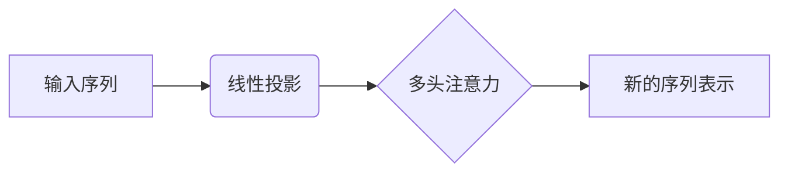

# Transformer 模型 原理与代码实例讲解

## 1.背景介绍

在自然语言处理(NLP)和序列数据建模领域,Transformer模型是一种革命性的架构,它完全依赖于注意力机制,摒弃了传统的递归神经网络和卷积神经网络结构。自2017年被提出以来,Transformer模型在机器翻译、文本生成、语音识别等多个任务中表现出色,成为NLP领域的主导模型之一。

Transformer模型的核心思想是利用自注意力机制捕捉输入序列中任意两个位置之间的依赖关系,从而更好地建模长距离依赖。与传统的序列模型相比,Transformer具有并行计算能力更强、捕捉长距离依赖能力更好等优势。此外,Transformer使用相同的结构对源数据和目标数据进行编码和解码,大大简化了模型结构。

## 2.核心概念与联系

### 2.1 自注意力机制(Self-Attention)

自注意力机制是Transformer模型的核心,它能够捕捉输入序列中任意两个位置之间的依赖关系。具体来说,对于输入序列中的每个位置,自注意力机制会计算其与所有其他位置的注意力分数,然后根据这些分数对所有位置的表示进行加权求和,得到该位置的新表示。

自注意力机制可以通过下面的公式进行描述:

$$\mathrm{Attention}(Q, K, V) = \mathrm{softmax}(\frac{QK^T}{\sqrt{d_k}})V$$

其中, $Q$ 代表查询(Query), $K$ 代表键(Key), $V$ 代表值(Value), $d_k$ 是缩放因子。

在实际应用中,输入序列首先会被线性投影到查询、键和值的表示空间,然后通过自注意力机制计算新的表示。多头注意力机制(Multi-Head Attention)则是将多个注意力机制的结果进行拼接,以捕捉不同的依赖关系。



### 2.2 编码器(Encoder)和解码器(Decoder)

Transformer模型由编码器和解码器两个部分组成。编码器的作用是将输入序列编码为一系列连续的表示,而解码器则根据编码器的输出及自身的输出生成目标序列。

编码器由多个相同的层组成,每一层包含两个子层:多头自注意力机制和前馈神经网络。解码器的结构与编码器类似,不同之处在于解码器还包含一个额外的多头注意力子层,用于关注编码器的输出。


### 2.3 位置编码(Positional Encoding)

由于Transformer模型不再使用循环或卷积结构,因此需要一种方式来注入序列的位置信息。位置编码就是为了解决这个问题而提出的。

位置编码是一种将位置信息编码为向量的方法,它会被加到输入的嵌入向量中,使模型能够区分不同位置的标记。常用的位置编码方式包括正弦编码和学习的位置嵌入。

## 3.核心算法原理具体操作步骤

Transformer模型的核心算法可以概括为以下几个步骤:

1. **输入表示**: 将输入序列(如文本序列)转换为嵌入向量表示,并添加位置编码。

2. **编码器处理**:
   - 将嵌入向量输入到编码器的第一层
   - 在每一层中:
     - 进行多头自注意力计算,获得注意力表示
     - 通过前馈神经网络进一步处理注意力表示
   - 将处理后的表示传递到下一层
   - 重复上述步骤,直到最后一层编码器

3. **解码器处理**:
   - 将解码器输入(如前一个时间步的输出标记)转换为嵌入向量表示,并添加位置编码
   - 在每一层中:
     - 进行掩码多头自注意力计算,获得自注意力表示
     - 进行编码器-解码器注意力计算,将自注意力表示与编码器输出进行注意力计算
     - 通过前馈神经网络进一步处理注意力表示
   - 将处理后的表示传递到下一层
   - 重复上述步骤,直到最后一层解码器
   - 对最后一层解码器的输出进行线性投影和softmax操作,获得下一个时间步的输出概率分布

4. **输出生成**: 根据概率分布生成下一个输出标记,将其作为解码器的新输入,重复步骤3,直到生成完整的输出序列或达到最大长度。

需要注意的是,在实际应用中,由于计算复杂度的原因,通常会采用近似的注意力计算方法,如局部注意力或记忆高效注意力等。

## 4.数学模型和公式详细讲解举例说明

### 4.1 自注意力机制(Self-Attention)

自注意力机制是Transformer模型的核心部分,它能够捕捉输入序列中任意两个位置之间的依赖关系。具体来说,对于输入序列中的每个位置,自注意力机制会计算其与所有其他位置的注意力分数,然后根据这些分数对所有位置的表示进行加权求和,得到该位置的新表示。

自注意力机制可以通过下面的公式进行描述:

$$\mathrm{Attention}(Q, K, V) = \mathrm{softmax}(\frac{QK^T}{\sqrt{d_k}})V$$

其中, $Q$ 代表查询(Query), $K$ 代表键(Key), $V$ 代表值(Value), $d_k$ 是缩放因子。

让我们以一个简单的例子来解释这个公式:

假设我们有一个长度为 4 的输入序列 $X = [x_1, x_2, x_3, x_4]$,我们希望计算第二个位置 $x_2$ 的新表示。首先,我们将输入序列 $X$ 通过三个不同的线性变换,分别得到查询 $Q$、键 $K$ 和值 $V$:

$$Q = [q_1, q_2, q_3, q_4], K = [k_1, k_2, k_3, k_4], V = [v_1, v_2, v_3, v_4]$$

接下来,我们计算查询 $q_2$ 与所有键 $k_i$ 的点积,并除以缩放因子 $\sqrt{d_k}$,得到注意力分数:

$$\mathrm{score}(q_2, k_i) = \frac{q_2 \cdot k_i}{\sqrt{d_k}}$$

然后,我们对这些分数进行 softmax 操作,得到归一化的注意力权重:

$$\alpha_i = \mathrm{softmax}(\mathrm{score}(q_2, k_i)) = \frac{\exp(\mathrm{score}(q_2, k_i))}{\sum_j \exp(\mathrm{score}(q_2, k_j))}$$

最后,我们将注意力权重与值 $V$ 相乘,并求和,得到 $x_2$ 的新表示:

$$\mathrm{Attention}(q_2, K, V) = \sum_i \alpha_i v_i$$

通过这种方式,自注意力机制能够捕捉输入序列中任意两个位置之间的依赖关系,从而更好地建模长距离依赖。

### 4.2 多头注意力机制(Multi-Head Attention)

多头注意力机制是在自注意力机制的基础上进行扩展,它将多个注意力机制的结果进行拼接,以捕捉不同的依赖关系。

具体来说,多头注意力机制首先将查询 $Q$、键 $K$ 和值 $V$ 分别线性投影到 $h$ 个子空间,得到 $Q^1, K^1, V^1, \ldots, Q^h, K^h, V^h$。然后,在每个子空间中计算自注意力:

$$\mathrm{head}_i = \mathrm{Attention}(Q^i, K^i, V^i)$$

最后,将所有子空间的结果进行拼接:

$$\mathrm{MultiHead}(Q, K, V) = \mathrm{Concat}(\mathrm{head}_1, \ldots, \mathrm{head}_h)W^O$$

其中, $W^O$ 是一个可学习的线性变换,用于将拼接后的向量投影回原始空间。

多头注意力机制的优点在于,它能够同时关注不同的位置和不同的子空间表示,从而捕捉更加丰富的依赖关系。

### 4.3 位置编码(Positional Encoding)

由于Transformer模型不再使用循环或卷积结构,因此需要一种方式来注入序列的位置信息。位置编码就是为了解决这个问题而提出的。

位置编码是一种将位置信息编码为向量的方法,它会被加到输入的嵌入向量中,使模型能够区分不同位置的标记。常用的位置编码方式包括正弦编码和学习的位置嵌入。

**正弦编码**

正弦编码是一种固定的位置编码方式,它利用正弦和余弦函数来编码位置信息。对于第 $i$ 个位置和第 $j$ 个维度,正弦编码可以表示为:

$$
\begin{aligned}
\mathrm{PE}(i, 2j) &= \sin\left(\frac{i}{10000^{2j/d_\mathrm{model}}}\right) \\
\mathrm{PE}(i, 2j+1) &= \cos\left(\frac{i}{10000^{2j/d_\mathrm{model}}}\right)
\end{aligned}
$$

其中, $d_\mathrm{model}$ 是模型的嵌入维度。

正弦编码的优点是它能够自然地表示相对位置关系,并且是可解释的。然而,它也存在一些缺陷,例如对于非常长的序列,位置编码可能会出现过多的重复。

**学习的位置嵌入**

另一种方式是将位置编码视为可学习的参数,与词嵌入一起被模型学习。这种方式更加灵活,但也可能导致过拟合问题。

无论采用何种位置编码方式,位置信息都会被加到输入的嵌入向量中,使模型能够区分不同位置的标记。

## 5.项目实践:代码实例和详细解释说明

在这一部分,我们将通过一个基于PyTorch实现的代码示例,来更好地理解Transformer模型的工作原理。

```python
import math
import torch
import torch.nn as nn

class PositionalEncoding(nn.Module):
    def __init__(self, d_model, dropout=0.1, max_len=5000):
        super(PositionalEncoding, self).__init__()
        self.dropout = nn.Dropout(p=dropout)

        pe = torch.zeros(max_len, d_model)
        position = torch.arange(0, max_len, dtype=torch.float).unsqueeze(1)
        div_term = torch.exp(torch.arange(0, d_model, 2).float() * (-math.log(10000.0) / d_model))
        pe[:, 0::2] = torch.sin(position * div_term)
        pe[:, 1::2] = torch.cos(position * div_term)
        pe = pe.unsqueeze(0)
        self.register_buffer('pe', pe)

    def forward(self, x):
        x = x + self.pe[:, :x.size(1), :]
        return self.dropout(x)

class MultiHeadAttention(nn.Module):
    def __init__(self, d_model, num_heads):
        super(MultiHeadAttention, self).__init__()
        self.num_heads = num_heads
        self.d_model = d_model

        self.W_q = nn.Linear(d_model, d_model)
        self.W_k = nn.Linear(d_model, d_model)
        self.W_v = nn.Linear(d_model, d_model)
        self.W_o = nn.Linear(d_model, d_model)

    def forward(self, q, k, v, mask=None):
        batch_size = q.size(0)

        q = self.W_q(q).view(batch_size, -1, self.num_heads, self.d_model // self.num_heads).transpose(1, 2)
        k = self.W_k(k).view(batch_size, -1, self.num_heads, self.d_model // self.num_heads).transpose(1, 2)
        v = self.W_v(v).view(batch_size, -1, self.num_heads, self.d_model // self.num_heads).transpose(1, 2)

        attn_scores = torch.matmul(q, k.transpose(-2, -1)) / math.sqrt(self.d_model //