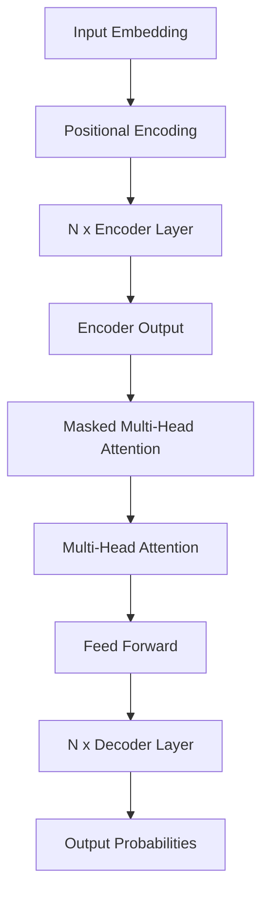

# Transformer 模型 原理与代码实例讲解

## 1.背景介绍

在自然语言处理和机器学习领域,Transformer模型是一种革命性的架构,它完全摒弃了传统的循环神经网络和卷积神经网络,而是基于注意力机制来捕捉输入序列中的长程依赖关系。自2017年被提出以来,Transformer模型在机器翻译、文本生成、语音识别等多个领域取得了令人瞩目的成就,成为了序列数据建模的主导范式。

Transformer的核心思想是利用注意力机制来捕捉输入序列中任意两个位置之间的依赖关系,从而更好地建模长期依赖。与循环神经网络相比,Transformer具有并行计算的优势,可以更高效地利用现代硬件资源。此外,Transformer还具有更好的可解释性,注意力分数可以显示模型关注的部分。

## 2.核心概念与联系

### 2.1 注意力机制(Attention Mechanism)

注意力机制是Transformer的核心,它允许模型在编码输入序列时,对每个位置的表示关注其他位置的信息。具体来说,对于每个位置,注意力机制会计算一个注意力分数向量,表示该位置对其他位置的注意力程度。然后,将注意力分数与对应位置的表示相乘并求和,得到该位置的新表示。

注意力机制可以形式化为:

$$\text{Attention}(Q, K, V) = \text{softmax}(\frac{QK^T}{\sqrt{d_k}})V$$

其中 $Q$ 为查询(Query)向量, $K$ 为键(Key)向量, $V$ 为值(Value)向量, $d_k$ 为缩放因子。

### 2.2 多头注意力(Multi-Head Attention)

为了捕捉不同的子空间表示,Transformer采用了多头注意力机制。具体来说,将查询/键/值先进行线性投影,得到多组查询/键/值,然后分别计算注意力,最后将所有注意力的结果拼接起来作为最终的注意力表示。

多头注意力可以表示为:

```
MultiHead(Q, K, V) = Concat(head_1, ..., head_h)W^O
where head_i = Attention(QW_i^Q, KW_i^K, VW_i^V)
```

其中 $W_i^Q$、$W_i^K$、$W_i^V$ 和 $W^O$ 是可学习的线性投影参数。

### 2.3 编码器(Encoder)和解码器(Decoder)

Transformer由编码器和解码器组成。编码器的作用是将输入序列编码为一系列连续的表示,解码器则根据这些表示生成输出序列。

编码器是多层的,每一层包含两个子层:多头自注意力层和前馈全连接层。解码器也是多层的,每一层包含三个子层:掩码多头自注意力层、多头编码器-解码器注意力层和前馈全连接层。

编码器和解码器的计算过程如下所示:



## 3.核心算法原理具体操作步骤

Transformer的核心算法原理可以分为以下几个步骤:

### 3.1 输入表示

首先,将输入序列(如文本序列)映射为embeddings,然后添加位置编码(positional encoding),以保留序列的位置信息。

### 3.2 编码器(Encoder)

1. 将embedded输入序列输入到编码器的第一层。
2. 在每一层,首先进行多头自注意力计算,得到注意力表示。
3. 将注意力表示通过残差连接与输入相加,然后进行层归一化(Layer Normalization)。
4. 将归一化后的表示输入前馈全连接网络,再进行残差连接与归一化。
5. 将该层的输出作为下一层的输入,重复上述步骤直到最后一层。
6. 最后一层编码器的输出即为编码器的输出表示。

### 3.3 解码器(Decoder)

1. 将输出序列映射为embeddings,添加位置编码。
2. 在每一层,首先进行掩码多头自注意力计算,以确保每个位置只能关注之前的位置。
3. 将自注意力表示通过残差连接与输入相加,然后进行层归一化。
4. 将归一化后的表示与编码器输出进行多头注意力计算,得到注意力表示。
5. 将注意力表示通过残差连接与输入相加,然后进行层归一化。
6. 将归一化后的表示输入前馈全连接网络,再进行残差连接与归一化。
7. 将该层的输出作为下一层的输入,重复上述步骤直到最后一层。
8. 最后一层解码器的输出即为解码器的输出表示。

### 3.4 输出概率计算

将解码器的输出表示通过线性层和softmax计算,得到下一个token的概率分布。

### 3.5 训练

利用最大似然估计,最小化模型输出的交叉熵损失,通过反向传播算法更新模型参数。

## 4.数学模型和公式详细讲解举例说明

### 4.1 注意力计算

注意力机制的核心是计算注意力分数,用于衡量一个位置对其他位置的注意力程度。具体计算过程如下:

1. 对查询(Query)、键(Key)和值(Value)进行线性投影:

$$\begin{aligned}
Q &= XW^Q\\
K &= XW^K\\
V &= XW^V
\end{aligned}$$

其中 $X$ 为输入序列的表示, $W^Q$、$W^K$ 和 $W^V$ 为可学习的权重矩阵。

2. 计算注意力分数:

$$\text{Attention}(Q, K, V) = \text{softmax}(\frac{QK^T}{\sqrt{d_k}})V$$

其中 $d_k$ 为缩放因子,用于防止较深层次的注意力值过大导致梯度消失或爆炸。

3. 对于多头注意力,将上述过程在不同的线性投影下独立进行 $h$ 次,然后将结果拼接:

$$\begin{aligned}
\text{head}_i &= \text{Attention}(QW_i^Q, KW_i^K, VW_i^V)\\
\text{MultiHead}(Q, K, V) &= \text{Concat}(\text{head}_1, \dots, \text{head}_h)W^O
\end{aligned}$$

其中 $W_i^Q$、$W_i^K$、$W_i^V$ 和 $W^O$ 为可学习的投影矩阵。

以下是一个简单的示例,说明注意力机制是如何工作的。假设我们有一个长度为6的输入序列 $X = [x_1, x_2, x_3, x_4, x_5, x_6]$,我们希望计算第3个位置 $x_3$ 的注意力表示。

1. 对 $x_3$ 进行线性投影,得到查询向量 $q_3$。
2. 对整个输入序列 $X$ 进行线性投影,得到键向量 $K = [k_1, k_2, k_3, k_4, k_5, k_6]$ 和值向量 $V = [v_1, v_2, v_3, v_4, v_5, v_6]$。
3. 计算 $q_3$ 与每个键向量 $k_i$ 的点积,得到未缩放的注意力分数 $e_i = q_3 \cdot k_i$。
4. 对注意力分数进行缩放和softmax归一化,得到归一化的注意力分数向量 $\alpha = [\alpha_1, \alpha_2, \alpha_3, \alpha_4, \alpha_5, \alpha_6]$。
5. 将注意力分数与值向量相乘并求和,得到 $x_3$ 的注意力表示 $z_3 = \sum_{i=1}^6 \alpha_i v_i$。

通过上述过程,模型可以自动学习到对于不同的位置,应该如何分配注意力。

### 4.2 位置编码(Positional Encoding)

由于Transformer没有使用循环或卷积结构,因此需要一种方法来注入序列的位置信息。位置编码就是为此目的而设计的。

对于序列中的每个位置,位置编码会为其分配一个位置向量。该向量是通过正弦和余弦函数计算得到的,公式如下:

$$\begin{aligned}
PE_{(pos, 2i)} &= \sin\left(pos / 10000^{2i / d_\text{model}}\right)\\
PE_{(pos, 2i+1)} &= \cos\left(pos / 10000^{2i / d_\text{model}}\right)
\end{aligned}$$

其中 $pos$ 为位置索引, $i$ 为维度索引, $d_\text{model}$ 为模型维度。

通过这种方式构造的位置编码向量具有一些有利的性质:

- 不同位置的向量是不同的,因此可以很好地编码位置信息。
- 对于特定的偏移量,向量之间的关系是恒定的,这使得模型可以很好地学习到相对位置的模式。
- 向量的值在 $(-1, 1)$ 范围内,这有助于模型的收敛。

在实际应用中,位置编码向量会直接加到输入embeddings上,成为Transformer的输入。

### 4.3 层归一化(Layer Normalization)

层归一化是一种常用的归一化技术,可以加快模型收敛并提高模型性能。在Transformer中,每个子层的输出都会进行层归一化处理。

具体来说,对于一个输入向量 $\boldsymbol{x} = [x_1, x_2, \dots, x_n]$,层归一化的计算过程如下:

1. 计算均值和方差:

$$\begin{aligned}
\mu &= \frac{1}{n}\sum_{i=1}^n x_i\\
\sigma^2 &= \frac{1}{n}\sum_{i=1}^n (x_i - \mu)^2
\end{aligned}$$

2. 归一化:

$$\hat{x}_i = \frac{x_i - \mu}{\sqrt{\sigma^2 + \epsilon}}$$

其中 $\epsilon$ 是一个很小的常数,用于防止分母为0。

3. 缩放和偏移:

$$y_i = \gamma \hat{x}_i + \beta$$

其中 $\gamma$ 和 $\beta$ 是可学习的缩放和偏移参数。

层归一化可以帮助梯度更好地传播,从而加快模型收敛。同时,它还能一定程度上缓解过拟合问题。

## 5.项目实践:代码实例和详细解释说明

以下是一个使用PyTorch实现的Transformer模型示例,包含了编码器(Encoder)和解码器(Decoder)的实现。

```python
import math
import torch
import torch.nn as nn

class PositionalEncoding(nn.Module):
    def __init__(self, d_model, dropout=0.1, max_len=5000):
        super(PositionalEncoding, self).__init__()
        self.dropout = nn.Dropout(p=dropout)

        pe = torch.zeros(max_len, d_model)
        position = torch.arange(0, max_len, dtype=torch.float).unsqueeze(1)
        div_term = torch.exp(torch.arange(0, d_model, 2).float() * (-math.log(10000.0) / d_model))
        pe[:, 0::2] = torch.sin(position * div_term)
        pe[:, 1::2] = torch.cos(position * div_term)
        pe = pe.unsqueeze(0)
        self.register_buffer('pe', pe)

    def forward(self, x):
        x = x + self.pe[:, :x.size(1), :]
        return self.dropout(x)

class MultiHeadAttention(nn.Module):
    def __init__(self, d_model, num_heads):
        super(MultiHeadAttention, self).__init__()
        self.num_heads = num_heads
        self.d_model = d_model

        self.W_q = nn.Linear(d_model, d_model)
        self.W_k = nn.Linear(d_model, d_model)
        self.W_v = nn.Linear(d_model, d_model)
        self.W_o = nn.Linear(d_model, d_model)

    def forward(self, query, key, value, mask=None):
        batch_size = query.shape[0]

        query = self.W_q(query).view(batch_size, -1, self.num_heads, self.d_model // self.num_heads).transpose(1, 2)
        key = self.W_k(key).view(batch_size, -1, self.num_heads, self.d_model // self.num_heads).transpose(