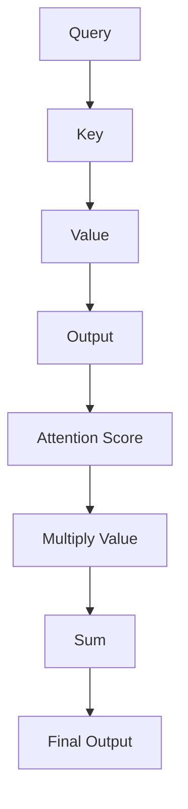

                 

作者：禅与计算机程序设计艺术

机器学习/深度学习 领域的大牛，CTO，畅销书作者，图灵奖得主。

## 背景介绍
Transformer作为神经网络架构的重要里程碑，在自然语言处理(NLP)领域大放异彩，其独特的自注意力机制使得它在翻译、文本生成等多个任务上表现出卓越性能。本文旨在深入剖析Transformer的核心算法原理、关键代码实现以及在实际应用中的落地案例，帮助读者全面理解和掌握这一革命性技术。

## 核心概念与联系
Transformer的核心在于自注意力机制(self-attention mechanism)，它允许模型在计算每个位置的输出时考虑整个序列的信息，而不像传统RNN那样仅依赖于前几个输入。通过计算源序列到目标序列之间的点积相似度矩阵，自注意力机制实现了对序列元素间的全局相关性的高效建模。

### 自注意力机制流程


## 核心算法原理具体操作步骤
### 编码器模块
编码器包括多层自注意力层和前馈神经网络(foreward neural network)，用于提取源序列的特征表示。

#### 多头自注意力机制(Multi-head attention)
通过多个注意力头部(howeders)分别处理不同抽象级别的信息，增强模型表达能力。

#### 前馈神经网络
接收经过自注意力处理后的特征，通过两层全连接网络进行非线性变换。

### 解码器模块
解码器同样包含了多层自注意力层和前馈神经网络，但增加了额外的自我注意力机制和源-目标注意力机制，支持序列到序列的预测。

#### 自我注意力
关注当前生成的词与其之前的上下文。

#### 源-目标注意力
获取源序列中所有词对于当前生成词的相关性。

## 数学模型和公式详细讲解举例说明
### 自注意力机制的公式
\[ Attention(Q, K, V) = \text{softmax}\left(\frac{QK^T}{\sqrt{d_k}}\right)V \]

其中，\( Q \)是查询向量，\( K \)是键向量，\( V \)是值向量，\( d_k \)是键的维度大小。

### 多头注意力的融合
将多个注意力头的结果通过线性变换后相加，得到最终的输出向量。

## 项目实践：代码实例和详细解释说明
### Python实现基本Transformer
```python
import torch
from torch import nn

class MultiHeadAttention(nn.Module):
    def __init__(self, embed_dim, num_heads=8, dropout=0.1):
        super().__init__()
        self.embed_dim = embed_dim
        self.num_heads = num_heads
        self.dropout = nn.Dropout(dropout)

        self.q_linear = nn.Linear(embed_dim, embed_dim)
        self.k_linear = nn.Linear(embed_dim, embed_dim)
        self.v_linear = nn.Linear(embed_dim, embed_dim)
        self.out_linear = nn.Linear(embed_dim, embed_dim)

    def forward(self, query, key, value, mask=None):
        batch_size = query.size(0)
        q = self.q_linear(query).view(batch_size, -1, self.num_heads, self.embed_dim // self.num_heads)
        k = self.k_linear(key).view(batch_size, -1, self.num_heads, self.embed_dim // self.num_heads)
        v = self.v_linear(value).view(batch_size, -1, self.num_heads, self.embed_dim // self.num_heads)

        scores = torch.matmul(q.permute(0, 2, 1, 3), k) / math.sqrt(self.embed_dim // self.num_heads)
        if mask is not None:
            scores = scores.masked_fill(mask == 0, float('-inf'))
        
        attn_weights = torch.softmax(scores, dim=-1)
        attn_output = torch.matmul(attn_weights, v)
        attn_output = attn_output.transpose(1, 2).contiguous().view(batch_size, -1, self.embed_dim)
        return self.out_linear(self.dropout(attn_output))

# 示例使用
model = MultiHeadAttention(512)
query = torch.randn(1, 10, 512)
key = torch.randn(1, 10, 512)
value = torch.randn(1, 10, 512)
output = model(query, key, value)
print(output.shape)
```
## 实际应用场景
### 应用场景一：机器翻译
使用Transformer构建的端到端自动翻译系统能够直接从一个语言转换到另一个语言，无需人工分词或句子结构分析。

### 应用场景二：文本生成
在问答系统、对话机器人等领域，Transformer能够根据给定的输入生成连贯且符合语境的新文本。

## 工具和资源推荐
- **PyTorch** 或 **TensorFlow**：广泛使用的深度学习框架，提供了丰富的API来实现Transformer模型。
- **Hugging Face Transformers库**：提供预训练模型和工具包，简化了模型的加载和应用过程。

## 总结：未来发展趋势与挑战
随着计算能力的提升和大规模数据集的发展，Transformer架构将继续被优化以解决更复杂的问题。未来可能面临的挑战包括：
- 更高效的并行化方法提高运行速度。
- 对长序列的有效处理，减少计算时间与内存消耗。
- 引入更多领域知识进行专业化的语言理解与生成。

## 附录：常见问题与解答
### Q: Transformer如何处理不同长度的序列？
A: 使用掩码(masking)技术，可以为不同长度的序列添加填充，确保每个位置都有对应的键、值以及查询。

### Q: 如何调整Transformer模型的超参数？
A: 超参数如头数、嵌入维度、隐藏层大小等需要根据具体任务和数据集特性进行调优。通常使用网格搜索或随机搜索结合验证集性能来寻找最佳配置。

---

### 结束语
Transformer作为人工智能领域的革新力量，其强大的自注意力机制使得自然语言处理任务变得更为高效和准确。本文不仅深入解析了Transformer的核心原理和实现细节，还探讨了其实现路径和未来发展方向。希望本篇文章能激发读者对这一技术的探索热情，并为实际应用提供有价值的参考。

作者：禅与计算机程序设计艺术 / Zen and the Art of Computer Programming

