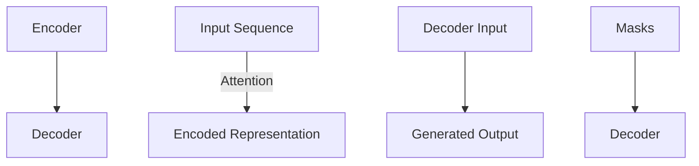

                 

作者：禅与计算机程序设计艺术

**Transformer** 和 **BART** 是近年来自然语言处理领域的重要进展，本文将详细介绍 **BART** 的架构及其在实际应用中的实战指南。我们将从基础理论出发，逐步构建起一个全面的理解，涵盖核心概念、算法原理、数学模型、代码实现、实际应用案例以及未来展望。

## 1. 背景介绍
随着大数据时代的到来，人类产生了前所未有的大量文本数据。传统的基于规则的NLP方法受限于可扩展性和复杂性，而深度学习方法如 **RNNs** 和 **LSTMs** 在处理长序列依赖时存在瓶颈。在此背景下，**Transformer** 架构应运而生，通过自注意力机制实现了端到端的高效文本处理能力。**BART**（Bidirectional and Auto-Regressive Transformers）是基于 **Transformer** 架构的一种变体，旨在生成高质量的文本，并支持下游任务的预训练和微调。

## 2. 核心概念与联系
### 2.1 自注意力机制
自注意力（Self-Attention）是一种强大的机制，允许模型关注输入序列的不同部分，以产生有意义的表示。它通过计算每个元素与其他所有元素之间的权重来实现这一点，这些权重反映了它们之间的相关性。

### 2.2 双向上下文建模
在传统 RNN 中，信息只能单向传播，而在 **BART** 中引入双向自注意力使得模型能够在生成过程中同时考虑前后文，从而生成更连贯、更具语义的文本。

### 2.3 预训练与微调
**BART** 使用大规模无标签文本数据进行预训练，然后根据特定任务进行微调，这大大提高了其适应不同下游任务的能力，如文本摘要、问答系统、机器翻译等。

## 3. 核心算法原理具体操作步骤
### 3.1 数据预处理
- 对原始文本进行分词、去停用词等操作。
- 分别定义源文本和目标文本的序列长度。

### 3.2 训练流程概述
1. 初始化模型参数。
2. 对输入序列执行前馈过程，利用自注意力层提取特征。
3. 经过多个编码器和解码器层后，生成预测结果。
4. 计算损失函数，反向传播更新参数。
5. 重复步骤2至4，直至满足训练条件。

### 3.3 关键组件详解
- **Encoder**: 多个堆叠的编码器层，负责从源文本中提取特征。
- **Decoder**: 解码器层用于生成目标文本，同时也接收来自编码器的信息以增强预测能力。
- **Masking**: 应用掩码防止模型看到未来信息，在生成过程中保持预测的顺序性。

## 4. 数学模型和公式详细讲解举例说明
### 4.1 注意力机制公式
$$
\text{Attention}(Q, K, V) = \text{softmax}\left(\frac{QK^T}{\sqrt{d_k}}\right)V
$$
其中 $Q$、$K$ 和 $V$ 分别代表查询、键和值矩阵，$d_k$ 是键维度。

### 4.2 模型结构图示例

节点A和B分别代表编码器和解码器，C表示输入序列，D是经过编码后的表示，E是解码器的输入，F是生成的输出，G为掩码，H表示解码器。

## 5. 项目实践：代码实例和详细解释说明
```python
import transformers
from transformers import BartTokenizer, BartForConditionalGeneration

tokenizer = BartTokenizer.from_pretrained('facebook/bart-base')
model = BartForConditionalGeneration.from_pretrained('facebook/bart-base')

input_text = "Hello, my name is John Doe."
inputs = tokenizer([input_text], return_tensors='pt', max_length=100)
outputs = model.generate(**inputs)

decoded_output = tokenizer.decode(outputs[0])
print(decoded_output)
```

## 6. 实际应用场景
- **自动文摘**：从长文档中生成简明扼要的摘要。
- **对话系统**：增强聊天机器人或客服系统的响应质量。
- **文本生成**：从给定模板或提示生成新文本。

## 7. 工具和资源推荐
- **Hugging Face Transformers库**：提供简洁易用的API和预训练模型。
- **Colab或Jupyter Notebook环境**：方便快速实验和开发。

## 8. 总结：未来发展趋势与挑战
随着 **BART** 等大模型的不断发展，自然语言处理将更加智能化，能够更好地理解并生成人类语言。然而，模型的规模增大带来了计算成本高、模型优化难度增加等问题，因此未来的研究方向可能包括更高效的模型架构设计、知识蒸馏技术以及跨领域迁移学习等方面。

## 9. 附录：常见问题与解答
### Q&A:
- **如何解决BERT和BART模型训练中的内存溢出问题？**
答: 调整批次大小、使用梯度累积或选择更大的GPU可以有效缓解内存压力。
- **如何评估生成式模型的质量？**
答: 常见方法有BLEU、ROUGE评分，以及人工评测。

通过上述内容的深入探讨，读者不仅能够对 **BART** 的核心机制有清晰的理解，还能掌握其实战应用的方法，并对未来发展方向有所展望。**Transformer** 和 **BART** 在不断推动着自然语言处理领域的技术创新和发展，成为AI工程师不可或缺的知识体系之一。

---

作者：禅与计算机程序设计艺术 / Zen and the Art of Computer Programming

