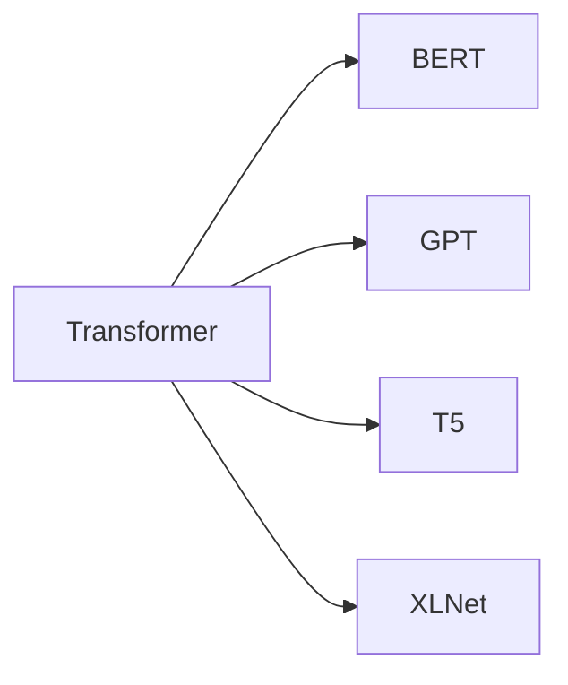

# Transformer大模型实战 BERT-base

## 1. 背景介绍
### 1.1 Transformer的发展历程
### 1.2 BERT的诞生与意义
### 1.3 BERT在NLP领域的应用现状

## 2. 核心概念与联系
### 2.1 Transformer架构解析
#### 2.1.1 Encoder
#### 2.1.2 Decoder  
#### 2.1.3 Attention机制
### 2.2 BERT模型结构
#### 2.2.1 Transformer Encoder
#### 2.2.2 输入表示
#### 2.2.3 预训练任务
### 2.3 Transformer与BERT的关系



## 3. 核心算法原理具体操作步骤
### 3.1 Transformer的Self-Attention
#### 3.1.1 计算Query、Key、Value
#### 3.1.2 计算Attention Scores
#### 3.1.3 计算Attention Value
### 3.2 BERT的预训练
#### 3.2.1 Masked Language Model
#### 3.2.2 Next Sentence Prediction
### 3.3 BERT的微调
#### 3.3.1 下游任务输入处理
#### 3.3.2 微调训练过程

## 4. 数学模型和公式详细讲解举例说明
### 4.1 Self-Attention计算公式
$Attention(Q,K,V) = softmax(\frac{QK^T}{\sqrt{d_k}})V$
其中，$Q$是查询矩阵，$K$是键矩阵，$V$是值矩阵，$d_k$是$K$的维度。
### 4.2 多头注意力机制
$$MultiHead(Q,K,V) = Concat(head_1,...,head_h)W^O$$
$$head_i = Attention(QW_i^Q, KW_i^K, VW_i^V)$$
其中，$W_i^Q, W_i^K, W_i^V, W^O$是可学习的参数矩阵。
### 4.3 位置编码
$$PE_{(pos,2i)} = sin(pos/10000^{2i/d_{model}})$$
$$PE_{(pos,2i+1)} = cos(pos/10000^{2i/d_{model}})$$
其中，$pos$是位置，$i$是维度，$d_{model}$是词嵌入维度。

## 5. 项目实践：代码实例和详细解释说明 
### 5.1 安装transformers库
```bash
!pip install transformers
```
### 5.2 加载BERT模型和分词器
```python
from transformers import BertTokenizer, BertModel

tokenizer = BertTokenizer.from_pretrained('bert-base-uncased')  
model = BertModel.from_pretrained('bert-base-uncased')
```
### 5.3 文本编码
```python
text = "Hello, how are you?"
encoded_input = tokenizer(text, return_tensors='pt')
```
### 5.4 获取BERT输出
```python
output = model(**encoded_input)
```

## 6. 实际应用场景
### 6.1 文本分类
#### 6.1.1 情感分析
#### 6.1.2 主题分类
### 6.2 命名实体识别
### 6.3 问答系统
### 6.4 文本摘要

## 7. 工具和资源推荐
### 7.1 Hugging Face Transformers库
### 7.2 Google Research BERT
### 7.3 微软 MT-DNN
### 7.4 哈工大 BERT-WWM

## 8. 总结：未来发展趋势与挑战
### 8.1 更大更强的预训练模型
### 8.2 模型压缩与加速
### 8.3 模型可解释性
### 8.4 知识融合与推理

## 9. 附录：常见问题与解答
### 9.1 BERT与GPT的区别？ 
BERT采用双向Transformer编码器结构，擅长自然语言理解任务；GPT采用单向Transformer解码器结构，擅长文本生成任务。
### 9.2 BERT预训练的mask策略？
对输入序列的token以一定概率随机mask，然后预测被mask的token，训练目标是最小化预测误差。
### 9.3 如何利用BERT进行迁移学习？
通过在下游任务的训练数据上微调预训练好的BERT模型，同时调整输入输出层以适应具体任务。
### 9.4 BERT的局限性？
对长文本建模能力有限；对小规模数据集效果欠佳；推理速度较慢；缺乏常识性知识。

Transformer作为一种强大的注意力机制模型，彻底改变了自然语言处理的格局。以Transformer为基础的BERT更是将NLP推向了新的高度。通过在大规模无监督数据上的预训练，BERT能够学习到语言的通用表示，进而在下游任务上取得了显著的性能提升。

BERT的成功启发了众多后续工作，如何设计更高效的预训练目标和模型结构，如何融入先验知识，如何实现轻量化和推理加速等，都是当前研究的热点方向。此外，探索将BERT扩展到多模态、多语言、多领域场景，挖掘其在更广阔AI应用中的潜力，也是一个充满机遇与挑战的课题。

相信通过学界和业界的共同努力，Transformer和BERT必将引领NLP技术向更高的台阶迈进，为人工智能的发展做出更大的贡献。让我们拭目以待！

作者：禅与计算机程序设计艺术 / Zen and the Art of Computer Programming