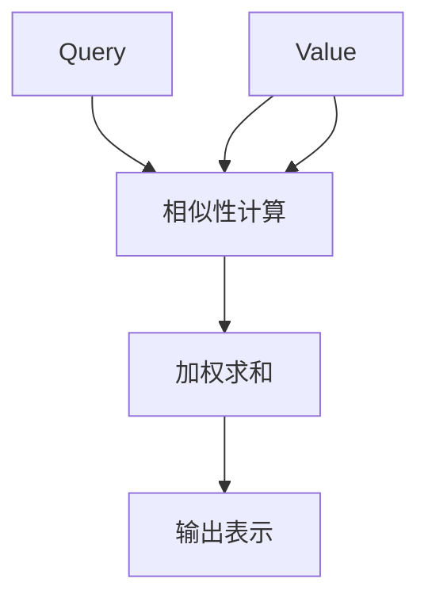
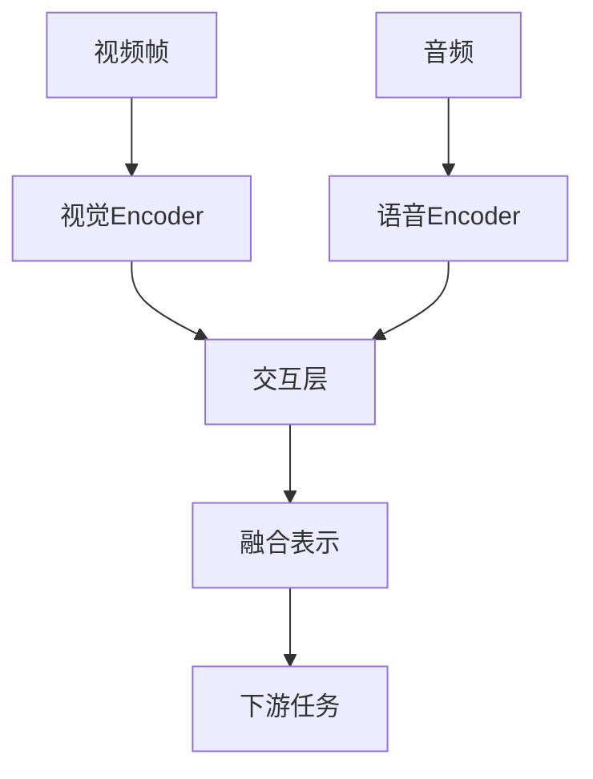

# Transformer大模型实战 VideoBERT模型和BART模型

## 1.背景介绍

在当今的数字时代,视频数据的爆炸式增长带来了新的挑战和机遇。传统的自然语言处理(NLP)技术主要关注文本数据,而视频理解则需要同时处理视觉和语音信息。为了解决这一问题,研究人员提出了VideoBERT和BART等Transformer大模型,旨在实现视频和语音的多模态融合学习。

### 1.1 视频理解的重要性

视频数据在许多领域扮演着重要角色,如在线教育、视频监控、人机交互等。有效地理解和分析视频内容对于提高这些应用的性能至关重要。然而,视频理解是一项极具挑战性的任务,需要同时处理视觉、语音和文本等多模态信息。

### 1.2 Transformer在NLP中的成功

自2017年Transformer模型被提出以来,它在自然语言处理领域取得了巨大成功。Transformer通过自注意力机制有效地捕获长距离依赖关系,显著提高了模型的性能。由于其卓越的表现,Transformer被广泛应用于机器翻译、文本生成、问答系统等多个NLP任务中。

### 1.3 Transformer在视频理解中的应用

鉴于Transformer在NLP领域的成功,研究人员开始尝试将其应用于视频理解任务。VideoBERT和BART等大模型通过融合视觉和语音模态,实现了视频和文本之间的双向理解,为视频理解任务带来了突破性的进展。

## 2.核心概念与联系

### 2.1 Transformer模型

Transformer是一种基于自注意力机制的序列到序列模型,主要由编码器(Encoder)和解码器(Decoder)两个部分组成。编码器将输入序列映射为上下文表示,解码器则基于编码器的输出生成目标序列。


### 2.2 自注意力机制

自注意力机制是Transformer的核心,它允许模型在计算表示时关注整个输入序列中的不同位置。通过计算查询(Query)、键(Key)和值(Value)之间的相似性,自注意力机制可以捕获长距离依赖关系,从而提高模型的表现。



### 2.3 VideoBERT模型

VideoBERT是一种用于视频理解的双流Transformer模型。它由两个单独的Transformer编码器组成,分别处理视觉和语音模态。两个编码器的输出在特定层级进行交互,实现视觉和语音信息的融合。



### 2.4 BART模型

BART是一种用于序列生成任务的Transformer模型,它将编码器和解码器的架构进行了改进。BART采用了一种新颖的预训练方式,通过掩码和permutation操作同时学习双向和自回归语言模型,从而提高了模型的泛化能力。


## 3.核心算法原理具体操作步骤

### 3.1 VideoBERT模型原理

VideoBERT模型的核心思想是将视觉和语音信息融合到统一的表示空间中,从而实现视频和文本之间的双向理解。该模型由两个单独的Transformer编码器组成,分别处理视频帧和音频数据。

1. **视觉编码器(Visual Encoder)**:
   - 将视频帧输入到一个预训练的2D或3D卷积神经网络(如ResNet或I3D)中,提取视觉特征。
   - 将提取的视觉特征输入到Transformer编码器,获得视觉表示。

2. **语音编码器(Audio Encoder)**:
   - 将音频数据输入到一个预训练的语音特征提取器(如VGGish或PANNs)中,提取语音特征。
   - 将提取的语音特征输入到另一个Transformer编码器,获得语音表示。

3. **交互层(Interaction Layer)**:
   - 在特定的Transformer层级,视觉编码器和语音编码器的输出进行交互,实现视觉和语音信息的融合。
   - 交互方式可以是简单的元素级相加,也可以是更复杂的门控融合或自注意力机制。

4. **融合表示(Fused Representation)**:
   - 通过交互层获得融合了视觉和语音信息的表示。
   - 该融合表示可用于下游任务,如视频描述、视频问答等。

### 3.2 BART模型原理

BART是一种用于序列生成任务的Transformer模型,它采用了一种新颖的预训练方式,通过掩码和permutation操作同时学习双向和自回归语言模型。

1. **预训练阶段**:
   - 掩码操作(Masked Language Modeling):随机掩码输入序列的一部分token,模型需要预测被掩码的token。
   - Permutation操作:打乱输入序列的顺序,模型需要重建原始序列。

2. **微调阶段**:
   - 将预训练的BART模型应用于特定的序列生成任务,如机器翻译、文本摘要等。
   - 在微调过程中,模型的编码器将输入序列映射为上下文表示,解码器则基于编码器的输出生成目标序列。

BART模型的优势在于预训练方式的创新性,它不仅学习了双向语言模型(通过掩码操作),还学习了自回归语言模型(通过permutation操作)。这种预训练策略使得BART在序列生成任务上表现出色,同时也具有更强的泛化能力。

## 4.数学模型和公式详细讲解举例说明

### 4.1 Transformer的自注意力机制

自注意力机制是Transformer模型的核心,它允许模型在计算表示时关注整个输入序列中的不同位置。下面我们详细介绍自注意力机制的数学原理。

给定一个输入序列 $X = (x_1, x_2, \dots, x_n)$,我们需要计算其对应的输出表示 $Y = (y_1, y_2, \dots, y_n)$。自注意力机制的计算过程如下:

1. **查询(Query)、键(Key)和值(Value)的计算**:
   $$Q = XW^Q, K = XW^K, V = XW^V$$
   其中 $W^Q, W^K, W^V$ 分别是查询、键和值的权重矩阵。

2. **计算注意力分数**:
   $$\text{Attention}(Q, K, V) = \text{softmax}\left(\frac{QK^T}{\sqrt{d_k}}\right)V$$
   其中 $d_k$ 是缩放因子,用于防止点积过大导致梯度消失。

3. **多头注意力(Multi-Head Attention)**:
   为了捕获不同的子空间表示,Transformer采用了多头注意力机制。具体计算过程如下:
   $$\begin{aligned}
   \text{MultiHead}(Q, K, V) &= \text{Concat}(head_1, \dots, head_h)W^O\\
   \text{where } head_i &= \text{Attention}(QW_i^Q, KW_i^K, VW_i^V)
   \end{aligned}$$
   其中 $W_i^Q, W_i^K, W_i^V$ 分别是第 $i$ 个注意力头的查询、键和值的权重矩阵, $W^O$ 是用于线性变换的权重矩阵。

通过自注意力机制,Transformer能够有效地捕获输入序列中的长距离依赖关系,从而提高模型的表现。

### 4.2 VideoBERT中的视觉-语音融合

在VideoBERT模型中,视觉和语音信息需要在特定的Transformer层级进行融合。常见的融合方式包括元素级相加、门控融合和自注意力机制等。下面我们以门控融合为例,介绍其数学原理。

假设视觉编码器和语音编码器在第 $l$ 层的输出分别为 $V^l$ 和 $A^l$,我们希望将它们融合为统一的表示 $F^l$。门控融合的计算过程如下:

1. **门控权重的计算**:
   $$g_v = \sigma(W_v[V^l; A^l] + b_v), \quad g_a = \sigma(W_a[V^l; A^l] + b_a)$$
   其中 $\sigma$ 是sigmoid激活函数, $W_v, W_a, b_v, b_a$ 是可学习的权重和偏置。

2. **融合表示的计算**:
   $$F^l = g_v \odot V^l + g_a \odot A^l$$
   其中 $\odot$ 表示元素级乘积。

通过门控融合机制,VideoBERT能够自适应地控制视觉和语音信息在融合表示中的贡献程度,从而实现更有效的多模态融合。

## 5.项目实践:代码实例和详细解释说明

为了更好地理解VideoBERT和BART模型的实现细节,我们提供了一些代码示例和详细的解释说明。

### 5.1 VideoBERT代码示例

下面是一个使用PyTorch实现的VideoBERT模型的简化版本:

```python
import torch
import torch.nn as nn
from transformers import BertModel, BertConfig

class VideoBERT(nn.Module):
    def __init__(self, visual_dim, audio_dim, bert_config):
        super(VideoBERT, self).__init__()
        self.visual_encoder = BertModel(bert_config)
        self.audio_encoder = BertModel(bert_config)
        self.fusion_layer = nn.Linear(bert_config.hidden_size * 2, bert_config.hidden_size)
        self.visual_proj = nn.Linear(visual_dim, bert_config.hidden_size)
        self.audio_proj = nn.Linear(audio_dim, bert_config.hidden_size)

    def forward(self, visual_input, audio_input):
        visual_features = self.visual_proj(visual_input)
        audio_features = self.audio_proj(audio_input)
        visual_output = self.visual_encoder(inputs_embeds=visual_features)[0]
        audio_output = self.audio_encoder(inputs_embeds=audio_features)[0]
        fused_output = self.fusion_layer(torch.cat((visual_output, audio_output), dim=-1))
        return fused_output
```

在这个示例中,我们使用了预训练的BERT模型作为视觉和语音编码器的基础。视觉和语音特征首先被投影到BERT的隐藏维度,然后分别输入到视觉编码器和语音编码器中。在最后一层,视觉和语音编码器的输出被concatenate在一起,并通过一个线性层进行融合。

### 5.2 BART代码示例

下面是一个使用PyTorch实现的BART模型的简化版本:

```python
import torch
import torch.nn as nn
from transformers import BartForConditionalGeneration, BartConfig

class BARTModel(nn.Module):
    def __init__(self, bart_config):
        super(BARTModel, self).__init__()
        self.bart = BartForConditionalGeneration(bart_config)

    def forward(self, input_ids, attention_mask, decoder_input_ids, decoder_attention_mask):
        outputs = self.bart(input_ids=input_ids,
                            attention_mask=attention_mask,
                            decoder_input_ids=decoder_input_ids,
                            decoder_attention_mask=decoder_attention_mask)
        return outputs.logits
```

在这个示例中,我们直接使用了Hugging Face Transformers库中的BartForConditionalGeneration模型。该模型接受输入序列和目标序列作为输入,并输出目标序列的预测logits。在实际应用中,您可以根据具体任务对输入和输出进行相应的处理。

## 6.实际应用场景

VideoBERT和BART模型在多个领域都有广泛的应用前景,包括但不限于:

### 6.1 视频描述

视频描述任务旨在自动生成描述视频内容的自然语言文本。VideoBERT模型能够有效地融合视觉和语音信息,从而生成更准确、更丰富的视频描述。

### 6.2 视频问答

视频问答系统需要理解视频内容并回答相关问题。VideoBERT模型可以将视频和问题映射到统一的表