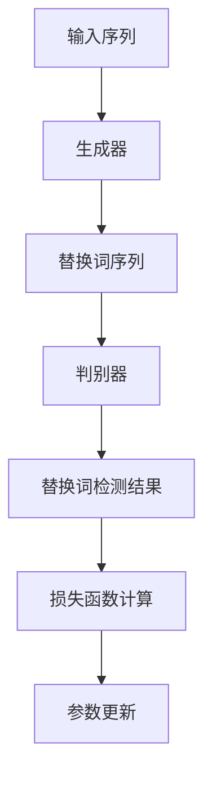

# Transformer大模型实战 了解ELECTRA

## 1.背景介绍

在自然语言处理（NLP）领域，Transformer模型自从2017年被提出以来，迅速成为了主流的架构。其自注意力机制和并行处理能力使得它在各种任务中表现出色。然而，随着模型规模的不断扩大，训练成本和计算资源的需求也随之增加。为了应对这些挑战，研究人员提出了各种优化和改进方法，其中ELECTRA（Efficiently Learning an Encoder that Classifies Token Replacements Accurately）便是一个重要的创新。

ELECTRA模型通过一种新的预训练任务——替换词检测（Replaced Token Detection, RTD），在保持高性能的同时显著降低了计算成本。本文将深入探讨ELECTRA的核心概念、算法原理、数学模型、实际应用以及未来发展趋势。

## 2.核心概念与联系

### 2.1 Transformer模型概述

Transformer模型由编码器和解码器组成，主要依赖于自注意力机制来捕捉序列中的长距离依赖关系。其主要优点包括并行处理能力和高效的训练速度。

### 2.2 预训练与微调

预训练和微调是现代NLP模型的两个关键步骤。预训练阶段，模型在大规模无标签数据上进行训练，以学习通用的语言表示。微调阶段，模型在特定任务的数据上进行训练，以适应具体的应用场景。

### 2.3 ELECTRA的创新点

ELECTRA的主要创新在于其预训练任务。传统的BERT模型使用掩码语言模型（Masked Language Model, MLM），而ELECTRA则使用替换词检测（RTD）。这种方法不仅提高了训练效率，还在多个NLP任务中表现出色。

## 3.核心算法原理具体操作步骤

### 3.1 替换词检测任务

ELECTRA的预训练任务是替换词检测。具体来说，模型首先使用一个生成器（Generator）来替换输入序列中的部分词语，然后使用一个判别器（Discriminator）来判断哪些词语被替换了。

### 3.2 生成器与判别器

生成器通常是一个小型的BERT模型，用于生成替换词。判别器则是一个标准的Transformer编码器，用于检测哪些词语被替换了。

### 3.3 训练过程

1. **输入序列**：将输入序列通过生成器，生成替换词。
2. **替换词检测**：将生成的序列输入判别器，判别器输出每个词是否被替换的概率。
3. **损失函数**：计算判别器的交叉熵损失和生成器的MLM损失，并进行反向传播和参数更新。

以下是ELECTRA的训练流程图：



## 4.数学模型和公式详细讲解举例说明

### 4.1 生成器的MLM损失

生成器的目标是生成合理的替换词，其损失函数与BERT的MLM损失类似：

$$
L_{MLM} = -\sum_{i \in M} \log P(x_i | x_{/i})
$$

其中，$M$表示被掩码的词语集合，$x_i$表示第$i$个词语，$x_{/i}$表示去掉第$i$个词语的序列。

### 4.2 判别器的RTD损失

判别器的目标是检测哪些词语被替换了，其损失函数为：

$$
L_{RTD} = -\sum_{i=1}^{N} [y_i \log P(y_i | x) + (1 - y_i) \log (1 - P(y_i | x))]
$$

其中，$N$表示序列长度，$y_i$表示第$i$个词语是否被替换的标签，$P(y_i | x)$表示判别器输出的第$i$个词语被替换的概率。

### 4.3 总损失函数

ELECTRA的总损失函数是生成器和判别器损失的加权和：

$$
L = L_{RTD} + \lambda L_{MLM}
$$

其中，$\lambda$是一个超参数，用于平衡生成器和判别器的损失。

## 5.项目实践：代码实例和详细解释说明

### 5.1 环境准备

首先，确保你已经安装了必要的Python库，如TensorFlow或PyTorch，以及Hugging Face的Transformers库。

```bash
pip install transformers
pip install torch
```

### 5.2 数据准备

使用Hugging Face的datasets库加载预训练数据集。

```python
from datasets import load_dataset

dataset = load_dataset('wikipedia', '20200501.en')
```

### 5.3 模型定义

定义生成器和判别器模型。

```python
from transformers import ElectraTokenizer, ElectraForPreTraining, ElectraConfig

tokenizer = ElectraTokenizer.from_pretrained('google/electra-small-discriminator')
generator_config = ElectraConfig.from_pretrained('google/electra-small-generator')
discriminator_config = ElectraConfig.from_pretrained('google/electra-small-discriminator')

generator = ElectraForPreTraining.from_pretrained('google/electra-small-generator', config=generator_config)
discriminator = ElectraForPreTraining.from_pretrained('google/electra-small-discriminator', config=discriminator_config)
```

### 5.4 训练过程

定义训练循环，并进行模型训练。

```python
from transformers import Trainer, TrainingArguments

training_args = TrainingArguments(
    output_dir='./results',
    num_train_epochs=3,
    per_device_train_batch_size=32,
    save_steps=10_000,
    save_total_limit=2,
)

trainer = Trainer(
    model=discriminator,
    args=training_args,
    train_dataset=dataset['train'],
)

trainer.train()
```

### 5.5 模型评估

使用验证集评估模型性能。

```python
results = trainer.evaluate()
print(results)
```

## 6.实际应用场景

### 6.1 文本分类

ELECTRA在文本分类任务中表现出色，能够有效地捕捉文本中的细微差别。

### 6.2 命名实体识别

在命名实体识别任务中，ELECTRA通过其高效的预训练任务，能够准确地识别文本中的实体。

### 6.3 机器翻译

虽然ELECTRA主要用于编码器任务，但其生成器部分也可以用于机器翻译任务。

### 6.4 问答系统

ELECTRA在问答系统中表现优异，能够准确地理解问题并生成合理的答案。

## 7.工具和资源推荐

### 7.1 Hugging Face Transformers

Hugging Face的Transformers库提供了丰富的预训练模型和工具，方便用户进行NLP任务。

### 7.2 TensorFlow和PyTorch

这两个深度学习框架是实现和训练ELECTRA模型的主要工具。

### 7.3 数据集

推荐使用Hugging Face的datasets库加载各种预训练数据集，如Wikipedia、BookCorpus等。

## 8.总结：未来发展趋势与挑战

ELECTRA通过其创新的预训练任务，在保持高性能的同时显著降低了计算成本。未来，随着计算资源的进一步优化和新技术的不断涌现，ELECTRA及其变种有望在更多NLP任务中发挥重要作用。然而，如何进一步提高模型的效率和泛化能力，仍然是一个值得研究的方向。

## 9.附录：常见问题与解答

### 9.1 ELECTRA与BERT的主要区别是什么？

ELECTRA使用替换词检测任务，而BERT使用掩码语言模型任务。前者在训练效率和性能上有显著优势。

### 9.2 如何选择生成器和判别器的规模？

通常，生成器的规模可以比判别器小，以减少计算成本。具体选择取决于任务需求和计算资源。

### 9.3 ELECTRA适用于哪些NLP任务？

ELECTRA适用于各种NLP任务，如文本分类、命名实体识别、问答系统等。

### 9.4 如何调优ELECTRA模型？

可以通过调整超参数（如学习率、批量大小等）和使用更大的预训练数据集来调优ELECTRA模型。

### 9.5 ELECTRA的未来发展方向是什么？

未来，ELECTRA有望在更多NLP任务中发挥作用，并通过进一步优化提高效率和性能。

---

作者：禅与计算机程序设计艺术 / Zen and the Art of Computer Programming