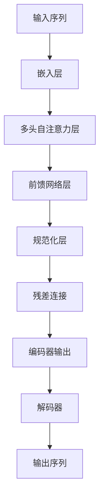

# Transformer大模型实战 使用BART模型执行文本摘要任务

## 1. 背景介绍

### 1.1 文本摘要任务的重要性

在当今信息时代,我们每天都会接收到大量的文本数据,包括新闻报道、社交媒体帖子、技术文档等。然而,由于时间和注意力的有限,很难仔细阅读每一篇文章。因此,自动文本摘要技术应运而生,它能够从冗长的文本中提取出最核心、最有价值的信息,为用户节省时间并提高效率。

文本摘要任务在多个领域都有广泛的应用,例如:

- 新闻行业:自动生成新闻摘要,方便读者快速了解核心内容
- 科研领域:对论文进行摘要,帮助研究人员快速获取论文要点
- 企业场景:对会议记录、邮件等文本生成摘要,提高工作效率
- 个人助理:智能手机、智能音箱等设备可以对用户接收的信息进行自动摘要

### 1.2 文本摘要任务的挑战

尽管文本摘要技术带来了诸多好处,但它也面临着一些挑战:

- 语义理解:准确理解文本的语义内涵并捕捉核心信息是一个艰巨的任务
- 上下文关联:生成的摘要需要保持连贯性,体现文本的上下文逻辑关系
- 信息压缩:如何在有限的字数内尽可能保留原文的关键信息
- 领域迁移:不同领域的文本风格和语义特征差异较大,通用模型的泛化能力有待提高

### 1.3 Transformer大模型的优势

传统的文本摘要方法通常基于规则或统计特征,缺乏对语义的深入理解。而近年来,基于深度学习的自然语言处理技术取得了长足进步,尤其是Transformer模型在捕捉长距离依赖关系方面表现出色。

Transformer大模型具有以下优势:

- 自注意力机制:能够有效捕捉文本中的长距离依赖关系
- 大规模预训练:在海量文本数据上预训练,学习到丰富的语义知识
- 多任务能力:可以在同一模型上完成多种自然语言任务,如文本生成、分类等
- 可解释性:通过注意力可视化,可以解释模型的决策过程

因此,Transformer大模型在文本摘要任务上具有巨大的潜力,是当前研究的热点方向。

## 2. 核心概念与联系

### 2.1 Transformer模型架构

Transformer模型是一种全新的基于自注意力机制的序列到序列(Seq2Seq)模型,它完全摒弃了传统的RNN和CNN结构,使用多头自注意力层和前馈网络层构建了编码器(Encoder)和解码器(Decoder)。

Transformer模型的核心组件包括:

1. **嵌入层(Embedding Layer)**: 将输入序列转换为嵌入向量表示
2. **多头自注意力层(Multi-Head Attention)**: 捕捉序列中元素之间的长距离依赖关系
3. **前馈网络层(Feed-Forward Network)**: 对序列中的每个元素进行独立的非线性变换
4. **规范化层(Normalization Layer)**: 加速训练收敛并提高模型性能
5. **残差连接(Residual Connection)**: 缓解梯度消失问题,促进信息传递

Transformer模型架构的 Mermaid 流程图如下:



### 2.2 BART模型

BART (Bidirectional and Auto-Regressive Transformers) 是一种基于 Transformer 的序列到序列生成模型,由 Facebook AI 研究院提出。它的核心思想是将文本生成任务统一为文本到文本的转换问题,通过掩码语言模型 (Mask Language Model) 和自回归语言模型 (Auto-Regressive Language Model) 的联合训练,实现了强大的文本生成能力。

BART 模型的主要特点包括:

1. **双向编码**: 利用双向 Transformer 编码器捕捉输入文本的上下文信息
2. **自回归解码**: 使用自回归 Transformer 解码器生成输出文本
3. **掩码语言模型**: 通过随机掩码部分输入tokens,预测被掩码的tokens
4. **自回归语言模型**: 基于输入文本和部分输出,预测下一个token
5. **多任务学习**: 在多个文本生成任务上联合训练,提高泛化能力

BART 模型在文本摘要、机器翻译、对话系统等多个任务上表现出色,成为了文本生成领域的重要模型之一。

## 3. 核心算法原理具体操作步骤

BART 模型在执行文本摘要任务时,主要分为以下几个步骤:

### 3.1 输入表示

首先,将原始文本转换为 BART 模型可以理解的输入表示形式。具体步骤如下:

1. 对原始文本进行分词(Tokenization),将其转换为一系列 token 序列
2. 将 token 序列映射为对应的词嵌入向量(Word Embeddings)
3. 添加特殊标记符号,如 `<s>` 表示序列开始, `</s>` 表示序列结束
4. 对输入序列进行位置编码(Positional Encoding),赋予每个 token 位置信息

### 3.2 双向编码

接下来,将表示后的输入序列输入到 BART 模型的双向编码器中,利用多头自注意力机制捕捉输入序列中 token 之间的长距离依赖关系,生成编码器输出。

### 3.3 掩码语言模型预训练

在预训练阶段,BART 模型采用了掩码语言模型 (Mask Language Model) 的训练目标。具体操作如下:

1. 随机选择输入序列中的一部分 token,用特殊的 `<mask>` 标记替换
2. 将带有掩码的输入序列输入编码器,得到编码器输出
3. 将编码器输出输入解码器,目标是预测被掩码的 token

通过掩码语言模型预训练,BART 模型可以学习到丰富的语义和上下文信息,为后续的文本生成任务奠定基础。

### 3.4 自回归解码

在生成摘要时,BART 模型采用自回归 (Auto-Regressive) 解码策略,每次生成一个 token。具体步骤如下:

1. 将原始文本输入编码器,得到编码器输出
2. 将编码器输出和特殊标记 `<s>` 输入解码器,作为初始输入
3. 解码器根据当前输入,预测下一个 token
4. 将预测的 token 追加到输出序列中,作为下一步的输入
5. 重复步骤 3 和 4,直到预测到特殊标记 `</s>` 或达到最大长度

通过自回归解码,BART 模型可以生成连贯、流畅的文本摘要。

## 4. 数学模型和公式详细讲解举例说明

### 4.1 自注意力机制

自注意力机制是 Transformer 模型的核心,它能够捕捉输入序列中任意两个元素之间的关系。给定一个输入序列 $X = (x_1, x_2, \dots, x_n)$,自注意力机制的计算过程如下:

1. 计算查询向量(Query)、键向量(Key)和值向量(Value):

$$
Q = XW^Q, K = XW^K, V = XW^V
$$

其中 $W^Q, W^K, W^V$ 分别为查询、键和值的线性变换矩阵。

2. 计算注意力分数:

$$
\text{Attention}(Q, K, V) = \text{softmax}\left(\frac{QK^T}{\sqrt{d_k}}\right)V
$$

其中 $d_k$ 为缩放因子,用于防止内积过大导致的梯度消失问题。

3. 多头自注意力机制通过并行计算多个注意力头,并将它们的结果拼接在一起:

$$
\text{MultiHead}(Q, K, V) = \text{Concat}(head_1, \dots, head_h)W^O
$$

$$
\text{where } head_i = \text{Attention}(QW_i^Q, KW_i^K, VW_i^V)
$$

其中 $W_i^Q, W_i^K, W_i^V$ 分别为第 $i$ 个注意力头的查询、键和值的线性变换矩阵, $W^O$ 为最终的线性变换矩阵。

通过自注意力机制,Transformer 模型可以有效捕捉输入序列中任意两个元素之间的依赖关系,为后续的文本生成任务提供有力支持。

### 4.2 掩码语言模型目标函数

在预训练阶段,BART 模型采用了掩码语言模型 (Mask Language Model) 的训练目标。给定一个带有掩码的输入序列 $X = (x_1, x_2, \dots, x_n)$,其中某些位置被掩码替换为特殊标记 `<mask>`。模型的目标是最大化被掩码位置的预测概率:

$$
\mathcal{L}_{\text{MLM}} = -\mathbb{E}_{X, \text{mask}} \left[ \sum_{i \in \text{mask}} \log P(x_i | X_{\backslash i}) \right]
$$

其中 $X_{\backslash i}$ 表示除去第 $i$ 个位置的输入序列, $P(x_i | X_{\backslash i})$ 为模型预测第 $i$ 个位置的 token 为 $x_i$ 的概率。

通过最小化掩码语言模型的损失函数,BART 模型可以学习到丰富的语义和上下文信息,为后续的文本生成任务奠定基础。

## 5. 项目实践: 代码实例和详细解释说明

在本节中,我们将通过一个实际的代码示例,演示如何使用 BART 模型执行文本摘要任务。我们将使用 Hugging Face 的 Transformers 库,它提供了预训练的 BART 模型和方便的API接口。

### 5.1 安装依赖库

首先,我们需要安装所需的依赖库:

```bash
pip install transformers
```

### 5.2 导入必要模块

```python
from transformers import BartForConditionalGeneration, BartTokenizer
```

我们从 `transformers` 库中导入 `BartForConditionalGeneration` 和 `BartTokenizer` 类,分别用于加载预训练的 BART 模型和对输入文本进行分词。

### 5.3 加载预训练模型和分词器

```python
model = BartForConditionalGeneration.from_pretrained('facebook/bart-large-cnn')
tokenizer = BartTokenizer.from_pretrained('facebook/bart-large-cnn')
```

我们使用 `from_pretrained` 方法加载预训练的 BART 模型和分词器。这里我们选择了 `facebook/bart-large-cnn` 模型,它是在 CNN 新闻数据集上预训练的大型 BART 模型。

### 5.4 定义文本摘要函数

```python
def summarize(text, max_length=150, min_length=30, do_sample=False):
    input_ids = tokenizer.batch_encode_plus([text], return_tensors='pt', max_length=1024, truncation=True)['input_ids']
    summary_ids = model.generate(input_ids, max_length=max_length, min_length=min_length, do_sample=do_sample, early_stopping=True)
    summary = tokenizer.decode(summary_ids.squeeze(), skip_special_tokens=True)
    return summary
```

我们定义了一个 `summarize` 函数,用于将给定的文本输入到 BART 模型中,并生成对应的摘要文本。具体步骤如下:

1. 使用分词器将输入文本转换为 token 序列,并编码为模型可以理解的输入张量 `input_ids`
2. 调用 BART 模型的 `generate` 方法,将编码后的输入 `input_ids` 输入模型,生成摘要的 token 序列 `summary_ids`
3. 使用分词器将 `summary_ids` 解码为原始的文本形式,得到最终的摘要文本 `summary`

在 `generate` 方法中,我们可以设置一些参数来控制生成的摘要长度和策略:

- `