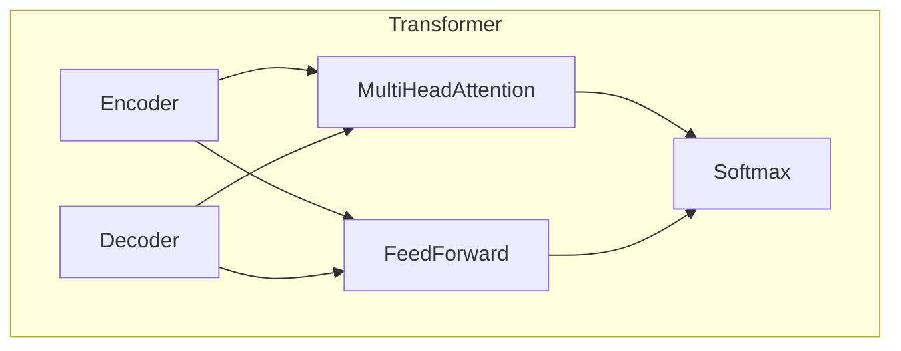
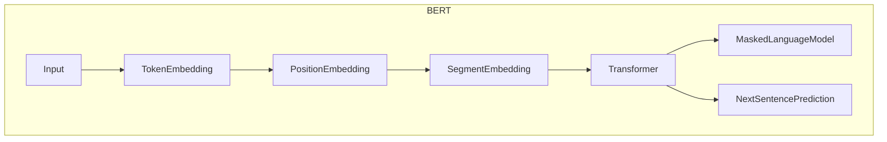

# Transformer大模型实战 意大利语的UmBERTo模型

## 1.背景介绍

在自然语言处理(NLP)领域,Transformer模型凭借其卓越的性能,已成为主导架构。作为Transformer预训练语言模型的一种,BERT(Bidirectional Encoder Representations from Transformers)模型在2018年问世后,掀起了NLP领域的新浪潮。

随后,各种针对不同语言和场景的BERT变体模型如雨后春笋般涌现。其中,UmBERTo(Unitary Multilingual BERT)是针对意大利语优化的BERT模型,由Istituto di Informatica e Telematica del CNR(意大利国家研究委员会信息学和远程通信研究所)和Fondazione Bruno Kessler(布鲁诺·克斯勒基金会)合作开发。

## 2.核心概念与联系

### 2.1 Transformer模型

Transformer是一种基于注意力机制(Attention Mechanism)的序列到序列(Seq2Seq)模型,最初被提出用于机器翻译任务。它完全摒弃了传统序列模型中的循环神经网络(RNN)和卷积神经网络(CNN)结构,纯粹基于注意力机制对输入序列进行编码和解码。

Transformer的核心组件包括:

- **编码器(Encoder)**: 将输入序列映射到一系列连续的向量表示。
- **解码器(Decoder)**: 接收编码器的输出,生成目标序列。
- **多头注意力机制(Multi-Head Attention)**: 捕捉输入序列中不同位置特征之间的相关性。
- **位置编码(Positional Encoding)**: 注入序列顺序信息。

Transformer架构的创新之处在于完全依赖注意力机制,避免了RNN/CNN结构中的递归计算,从而更易于并行计算,显著提高了训练效率。



### 2.2 BERT模型

BERT(Bidirectional Encoder Representations from Transformers)是一种基于Transformer的预训练语言模型,在2018年由Google AI推出。BERT的核心创新在于采用了Masked Language Model(MLM)和Next Sentence Prediction(NSP)两种任务的预训练方式,使模型能够同时获取双向上下文信息。

BERT预训练过程包括两个阶段:

1. **预训练(Pre-training)**: 在大规模无标注语料上训练MLM和NSP任务,学习通用语言表示。
2. **微调(Fine-tuning)**: 将预训练模型的参数作为初始化,在特定的有标注数据集上进行进一步训练,以适应下游的NLP任务,如文本分类、命名实体识别等。

BERT模型在多项NLP基准测试中取得了同期最佳成绩,极大推动了NLP技术的发展。但由于其巨大的参数量和计算需求,也面临着推理效率低下、无法处理长文本等挑战。



### 2.3 UmBERTo模型

UmBERTo(Unitary Multilingual BERT)是针对意大利语优化的BERT模型,由Istituto di Informatica e Telematica del CNR和Fondazione Bruno Kessler合作开发。它在原始BERT的基础上,引入了一些创新:

1. **语料扩展**: 除了使用原始BERT的多语言语料外,UmBERTo还利用了大量的意大利语语料进行预训练,使模型能够更好地理解意大利语的语义和语法特征。

2. **词元化策略优化**: 针对意大利语的特点,采用了基于字节对编码(BPE)的新词元化策略,提高了对意大利语单词的切分和表示能力。

3. **语言特定微调**: 在BERT的微调阶段,UmBERTo在多项意大利语NLP任务的数据集上进行了语言特定的微调训练,进一步提升了模型在意大利语场景下的性能表现。

通过上述优化,UmBERTo模型在多项意大利语NLP基准测试中展现出了卓越的性能,成为意大利语NLP领域的重要资源。

## 3.核心算法原理具体操作步骤 

UmBERTo模型的核心算法原理与BERT模型类似,主要分为预训练和微调两个阶段。

### 3.1 预训练阶段

UmBERTo的预训练过程包括以下步骤:

1. **语料准备**: 收集大量的意大利语语料,包括维基百科、书籍、新闻等多种来源。同时也利用了BERT原始的多语种语料。

2. **词元化**: 采用基于BPE的新词元化策略,将文本切分为词元序列,构建词元表。

3. **输入表示**: 将词元序列映射为embeddings,并加入位置编码和分段编码。

4. **Masked LM预训练**: 随机遮蔽部分词元,使用Transformer编码器对其余词元进行编码,然后预测被遮蔽词元。

5. **Next Sentence Prediction预训练**: 判断两个句子是否相邻,使模型学习捕捉句子间的关系。

6. **模型更新**: 基于MLM和NSP的损失函数,使用优化算法(如Adam)更新Transformer模型参数。

通过上述无监督预训练,UmBERTo模型学习到了意大利语的语义和语法知识,为后续的微调奠定基础。

### 3.2 微调阶段

在预训练的基础上,UmBERTo进一步在有标注的意大利语NLP任务数据集上进行微调训练,使模型适应特定的下游任务。微调步骤如下:

1. **任务数据准备**: 收集针对特定NLP任务(如文本分类、命名实体识别等)的有标注意大利语数据集。

2. **输入处理**: 对任务数据进行预处理,将文本转换为词元序列,并构建输入表示。

3. **微调训练**: 将预训练的UmBERTo模型参数作为初始化,在任务数据集上进行有监督的微调训练。根据任务类型,可能需要对模型输出层进行修改。

4. **模型评估**: 在任务的验证集或测试集上评估微调后模型的性能,计算相应的评估指标。

5. **模型优化**: 根据评估结果,可能需要调整超参数、数据预处理策略等,重复训练直至达到满意的性能。

通过针对性的微调,UmBERTo模型能够在特定的意大利语NLP任务上发挥最大潜力。

## 4.数学模型和公式详细讲解举例说明

UmBERTo模型的核心是Transformer架构,其中涉及了多头注意力机制、位置编码等关键模块。我们将详细介绍它们的数学原理。

### 4.1 缩放点积注意力

注意力机制是Transformer的核心,它能够捕捉输入序列中不同位置特征之间的相关性。缩放点积注意力(Scaled Dot-Product Attention)是Transformer中使用的一种注意力机制,定义如下:

$$
\text{Attention}(Q, K, V) = \text{softmax}\left(\frac{QK^T}{\sqrt{d_k}}\right)V
$$

其中:
- $Q$是查询(Query)向量序列: $Q\in\mathbb{R}^{n\times d_k}$
- $K$是键(Key)向量序列: $K\in\mathbb{R}^{n\times d_k}$  
- $V$是值(Value)向量序列: $V\in\mathbb{R}^{n\times d_v}$
- $n$是序列长度
- $d_k$是Query和Key的维度
- $d_v$是Value的维度

该机制首先计算Query与所有Key的缩放点积,得到一个注意力分数向量。然后通过Softmax函数对分数进行归一化,得到注意力权重向量。最后,将注意力权重与Value序列进行加权求和,得到注意力输出。

缩放点积的作用是防止较长的输入序列导致点积值过大,从而使Softmax函数的梯度较小,影响模型收敛。$\sqrt{d_k}$的目的是将点积的数值控制在合理范围内。

### 4.2 多头注意力机制

为了捕捉不同子空间的相关性,Transformer采用了多头注意力机制(Multi-Head Attention),它将Query、Key和Value线性投影到不同的子空间,并在每个子空间上并行计算注意力,最后将所有子空间的注意力输出进行拼接:

$$
\begin{aligned}
\text{MultiHead}(Q, K, V) &= \text{Concat}(\text{head}_1, \dots, \text{head}_h)W^O\\
\text{where\ head}_i &= \text{Attention}(QW_i^Q, KW_i^K, VW_i^V)
\end{aligned}
$$

其中:
- $h$是注意力头数
- $W_i^Q\in\mathbb{R}^{d_{\text{model}}\times d_k}$、$W_i^K\in\mathbb{R}^{d_{\text{model}}\times d_k}$、$W_i^V\in\mathbb{R}^{d_{\text{model}}\times d_v}$是线性投影矩阵
- $W^O\in\mathbb{R}^{hd_v\times d_{\text{model}}}$是最终的线性变换矩阵

多头注意力机制能够从不同的表示子空间获取信息,提高了模型对长范围依赖的建模能力。

### 4.3 位置编码

由于Transformer没有递归或卷积结构,因此需要一种方法来注入序列的位置信息。位置编码(Positional Encoding)就是用来解决这个问题的技术手段。

对于位置$p$,其位置编码$PE(p,2i)$和$PE(p,2i+1)$分别为:

$$
\begin{aligned}
PE(p, 2i) &= \sin\left(\frac{p}{10000^{\frac{2i}{d_{\text{model}}}}}\right)\\
PE(p, 2i+1) &= \cos\left(\frac{p}{10000^{\frac{2i}{d_{\text{model}}}}}\right)
\end{aligned}
$$

其中$i$是维度索引,模型维度$d_{\text{model}}$必须是偶数。

位置编码是预先计算好的,并直接加到输入embeddings上,使模型能够学习到序列的位置信息。

## 5.项目实践:代码实例和详细解释说明

为了更好地理解UmBERTo模型的实现细节,我们将通过一个基于Hugging Face Transformers库的代码示例,演示如何加载预训练模型、对输入文本进行预处理、执行推理以及微调模型等操作。

### 5.1 加载预训练模型

```python
from transformers import AutoTokenizer, AutoModel

# 加载意大利语UmBERTo预训练模型和分词器
tokenizer = AutoTokenizer.from_pretrained("umberto-mt/umberto-mt-commoncrawl-cased-v1")
model = AutoModel.from_pretrained("umberto-mt/umberto-mt-commoncrawl-cased-v1")
```

上述代码使用`AutoTokenizer`和`AutoModel`从Hugging Face模型中心加载意大利语UmBERTo预训练模型和分词器。

### 5.2 文本预处理和编码

```python
text = "La mela è rossa."
encoded_input = tokenizer(text, return_tensors='pt')
```

我们首先定义一个意大利语文本样例"La mela è rossa."(意思是"苹果是红色的")。然后使用分词器对文本进行编码,得到一个包含输入id、掩码和分段id的字典。`return_tensors='pt'`表示返回PyTorch张量形式。

### 5.3 模型推理

```python
output = model(**encoded_input)
```

我们将编码后的输入传递给预训练模型,执行推理并获取模型输出。输出是一个元组,包含最后一个隐藏层的表示。

### 5.4 微调模型

为了在特定的下游任务上获得更好的性能,我们需要在有标注数据集上对预训练模型进行微调。以文本分类任务为例:

```python
from transformers import AutoModelForSequenceClassification, TrainingArguments, Trainer

# 加载微调模型
model = AutoModelForSequenceClassification.from_pretrained("umberto-mt/umberto-mt-commoncrawl-cased-v1", num_labels=2)

#