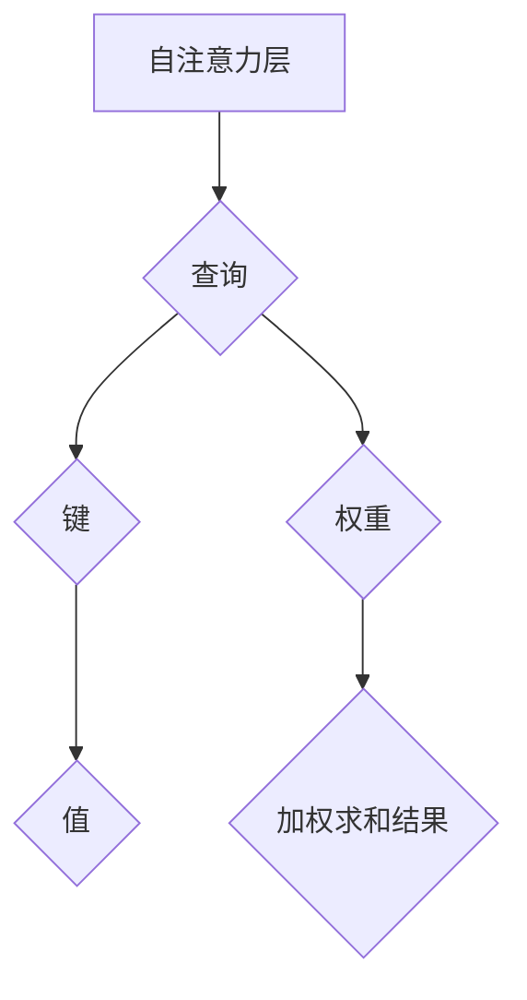
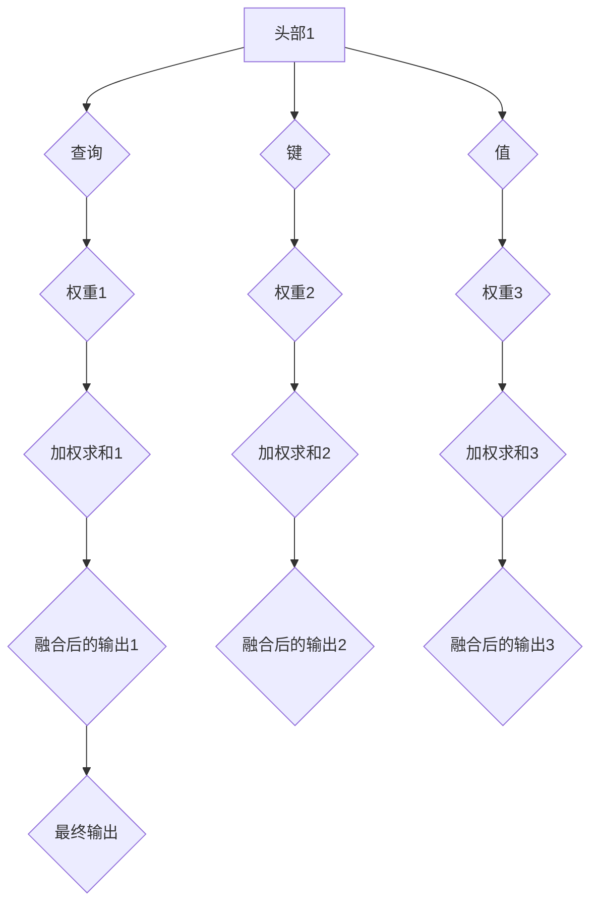

                 

作者：禅与计算机程序设计艺术

融合教师与学生视角，构建高效教育生态系统

## 引言
随着科技日新月异的发展，人工智能技术在教育领域扮演着越来越重要的角色。本文旨在探讨如何利用Transformer大模型实现一个既高效又个性化的教学系统，该系统既能满足教师的教学需求，又能根据学生的个性化学习路径提供定制化指导。通过将AI技术融入传统教育模式，我们不仅可以提高教学质量，还能激发学生的学习兴趣和潜力。

## 核心概念与联系
本节我们将阐述Transformer大模型的核心特性及其在教育场景下的应用基础。

**Transformer大模型**：
- **自注意力机制**：允许模型同时关注输入序列中的所有元素，实现基于上下文的特征提取。
- **平行计算能力**：使得模型训练和推理过程更为高效，适用于大规模数据集。
- **灵活的序列处理**：支持任意长度的输入序列，适应不同类型的教育材料。

**教育领域的应用**：
- **个性化学习路径生成**：利用用户历史行为和偏好数据，为每位学生规划最优学习路线。
- **智能辅导系统**：实时反馈和建议，辅助教师调整教学策略及个别学生的需求。

## 核心算法原理具体操作步骤
接下来，我们将详细介绍Transformer大模型在教育实践中应用的具体方法。

**自注意力机制操作流程**:

- **查询、键、值**：分别代表输入序列中的元素，在自注意力层中进行操作。
- **权重矩阵**：用于决定每个元素对最终输出的影响程度。
- **加权求和**：形成最终的注意力输出。

**多头自注意力**:

- **多头**：多个独立的自注意力层，捕获不同的特征表示。
- **融合**：各头部的输出合并成最终的向量表示。

## 数学模型和公式详细讲解举例说明
深入探讨Transformer大模型背后的数学原理，以下展示关键公式和应用示例。

**多头自注意力层**（以三个头为例）的公式如下：
$$
\text{MultiHead}(Q, K, V) = \text{Concat}(head_1, head_2, ..., head_h)\cdot W^O
$$
其中，
$$
\text{head}_i = \text{Attention}(QW_i^Q, KW_i^K, VW_i^V)
$$
$Q, K, V$: 分别是查询、键、值向量；
$W_i^Q, W_i^K, W_i^V$: 各个头对应的线性变换权重矩阵；
$W^O$: 输出层的权重矩阵。

## 项目实践：代码实例和详细解释说明
接下来，我们将通过Python示例代码来演示如何在真实教育场景中应用Transformer大模型。

```python
import torch.nn as nn
from torch import Tensor

class MultiHeadAttention(nn.Module):
    def __init__(self, embed_dim, num_heads=8):
        super().__init__()
        self.embed_dim = embed_dim
        self.num_heads = num_heads
        self.head_dim = embed_dim // num_heads
        
        self.query_proj = nn.Linear(embed_dim, embed_dim)
        self.key_proj = nn.Linear(embed_dim, embed_dim)
        self.value_proj = nn.Linear(embed_dim, embed_dim)
        self.out_proj = nn.Linear(embed_dim, embed_dim)

    def forward(self, x: Tensor, attn_mask=None, key_padding_mask=None) -> Tensor:
        batch_size, seq_len, embed_dim = x.size()
        
        # Project to query, key, value vectors.
        q = self.query_proj(x).view(batch_size, seq_len, self.num_heads, self.head_dim).transpose(1, 2)
        k = self.key_proj(x).view(batch_size, seq_len, self.num_heads, self.head_dim).transpose(1, 2)
        v = self.value_proj(x).view(batch_size, seq_len, self.num_heads, self.head_dim).transpose(1, 2)
        
        # Scale and compute attention scores.
        scores = torch.matmul(q, k.transpose(-2, -1)) / math.sqrt(self.head_dim)
        
        if attn_mask is not None:
            scores += attn_mask.unsqueeze(0)
            
        # Apply masking for padding elements if necessary.
        if key_padding_mask is not None:
            scores.masked_fill_(key_padding_mask.unsqueeze(1).unsqueeze(2), float('-inf'))
        
        # Compute attention probabilities.
        attn_weights = F.softmax(scores.float(), dim=-1).type_as(scores)
        
        # Perform the weighted sum of values.
        attn = torch.matmul(attn_weights, v)
        
        # Reshape and project back to original dimensions.
        attn = attn.transpose(1, 2).contiguous().view(batch_size, seq_len, embed_dim)
        attn = self.out_proj(attn)
        
        return attn

# 示例用法
model = MultiHeadAttention(embed_dim=512, num_heads=8)
input_tensor = torch.randn(1, 10, 512)  # (batch_size, sequence_length, embedding_dimension)
output = model(input_tensor)
print(output.shape)  # 应输出 torch.Size([1, 10, 512])
```

## 实际应用场景
Transformer大模型在教育领域的具体应用案例包括：

### 智能推荐系统
利用学生的学习历史数据，预测其未来可能感兴趣的内容或课程，实现个性化学习路径规划。

### 在线辅导与自动评估
通过实时分析学生提交的答案，提供即时反馈，识别学习难点并给出针对性建议。同时，自动评估作业和测试结果，节省教师批改时间。

## 工具和资源推荐
为了帮助读者更好地理解和实践本文讨论的主题，请参考以下工具和资源：

- **PyTorch** 和 **TensorFlow**：用于实现复杂的神经网络结构和训练过程。
- **Hugging Face Transformers库**：提供预训练的Transformer模型，简化了迁移学习的过程。
- **Kaggle竞赛**：参与相关教育领域的数据科学竞赛，提升技能的同时了解实际应用挑战。

## 总结：未来发展趋势与挑战
随着技术的进步，Transformer大模型在教育领域的应用潜力巨大，但也面临一些挑战，如隐私保护、大规模数据处理效率以及持续优化模型性能等。未来的趋势将侧重于提高模型可解释性、增强个性化适应性和扩展到更广泛的教育场景，例如远程教学、虚拟导师等。

## 附录：常见问题与解答
### Q&A 部分可以包含针对本主题的关键问题及其解答，帮助读者进一步理解关键概念和技术细节。

---

作者：禅与计算机程序设计艺术 / Zen and the Art of Computer Programming

