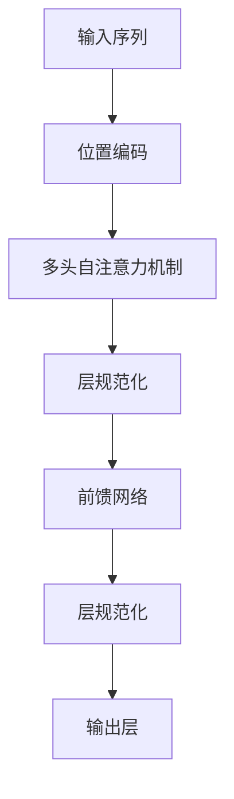

                 

作者：禅与计算机程序设计艺术

**[角色]** | 时间线：**[年份]**
---

## 背景介绍

随着自然语言处理(NLP)技术的不断发展，Transformer模型因其强大的自注意力机制，在文本分类任务上展现出卓越的表现。从BERT、GPT到最近的通义千问，这些基于Transformer的大规模预训练模型不仅在学术界引起了轰动，也在工业界得到了广泛的应用。本文旨在探索Transformer模型在文本分类任务中的应用，通过详细的理论解析、代码实现及实际案例分析，为读者提供一个全面的实践指南。

## 核心概念与联系

### 自注意力机制
自注意力机制是Transformer的核心创新之一，它允许模型在编码过程中同时考虑所有位置上的输入元素，通过计算每个元素与其他所有元素之间的相似度来生成加权表示，从而捕捉长距离依赖关系。这一特性使得Transformer能在处理大量数据时保持高效性和准确性。

### 多头注意力
多头注意力机制进一步增强了Transformer的能力，通过并行计算多个不同维度的注意力矩阵，使模型能够学习更多层次的相关性，从而提高模型的表达能力。

### 前馈网络层
前馈网络层用于增强Transformer的非线性表示能力，通常由两层全连接神经网络组成，包括一个隐藏层和输出层。这一层能够捕捉复杂的关系模式，促进特征的整合和抽象。

### 层规范化与残差连接
为了防止梯度消失和爆炸的问题，Transformer采用层规范化(Layer Normalization)和残差连接(Residual Connections)，保证了训练过程中的稳定性和收敛速度。

## 核心算法原理具体操作步骤

Transformer的主流程如下所示：



### 输入序列
将原始文本序列进行分词，得到一系列单词令牌。

### 位置编码
为每个单词令牌添加位置信息，以便模型能识别词汇顺序的重要性。

### 多头自注意力机制
执行多个注意力头部，每头关注不同的上下文信息，然后聚合结果。

### 层规范化
通过归一化各层的输出，减少内部相关性，加速训练。

### 前馈网络
通过两个全连接层（可选激活函数）来提取深层次特征。

### 输出层
最终经过适当的后处理（如Softmax）生成概率分布，完成分类预测。

## 数学模型和公式详细讲解举例说明

对于多头自注意力机制，其核心公式如下：

$$
\text{MultiHead}(Q, K, V) = \text{Concat}(head_1,...,head_n)W^O \\
\text{where } head_i = \text{Attention}(\text{Linear}(Q)W_Q, \text{Linear}(K)W_K, \text{Linear}(V)W_V)
$$

其中$Q, K, V$分别代表查询、键和值的矩阵，$\text{Linear}$表示线性变换，$W_Q, W_K, W_V, W_O$分别是对应的权重矩阵，$\text{Attention}$定义了注意力函数如何计算各个元素间的相似度。

## 项目实践：代码实例和详细解释说明

下面是一个简单的Python示例，展示了如何使用`transformers`库构建一个基础的文本分类模型：

```python
from transformers import AutoTokenizer, AutoModelForSequenceClassification
import torch

# 加载预训练模型和分词器
tokenizer = AutoTokenizer.from_pretrained('bert-base-uncased')
model = AutoModelForSequenceClassification.from_pretrained('bert-base-uncased', num_labels=2)

# 准备样本数据
inputs = tokenizer("Hello, my dog is cute", return_tensors="pt")
labels = torch.tensor([1]).unsqueeze(0) # 二分类问题

# 进行预测
outputs = model(**inputs, labels=labels)
loss = outputs.loss
logits = outputs.logits
```

## 实际应用场景

文本分类在诸如情感分析、垃圾邮件过滤、新闻分类等领域有着广泛的应用。例如，在社交媒体监控中，可以自动检测用户情绪或品牌提及的情感倾向；在电子商务中，对产品评论进行分类以评估商品质量等。

## 工具和资源推荐

- **Hugging Face Transformers库**：提供了丰富的预训练模型和易于使用的API。
- **Jupyter Notebook**：适合初学者搭建实验环境。
- **Colab**：云端运行代码，无需安装任何软件。

## 总结：未来发展趋势与挑战

随着大规模预训练模型的涌现以及算力成本的下降，Transformer将在更多的NLP任务中发挥关键作用。然而，面对海量数据和复杂的语境理解需求，如何优化模型效率、提升泛化能力和处理跨模态数据将是未来研究的重要方向。

## 附录：常见问题与解答

### Q: 如何选择合适的预训练模型？
A: 选择预训练模型应根据具体任务类型和数据集规模而定。一般而言，较大的预训练模型在复杂任务上表现更优，但需要更多的计算资源。

### Q: Transformer模型为何难以应用于低资源语言？
A: 对于低资源语言，缺乏足够的标注数据导致预训练效果不佳。针对此类情况，可以探索知识蒸馏、多语言联合预训练等方式来改进性能。

---

本文旨在提供一个全面且深入的指南，帮助读者理解和掌握基于Transformer的大模型在文本分类任务中的应用。通过理论解析、实际案例及代码实现，希望为AI领域从业者和爱好者带来实用的技术洞察和实践指导。

