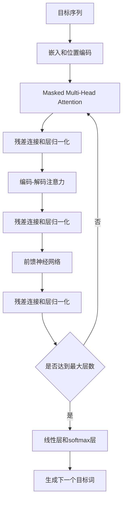

# Transformer大模型实战 理解解码器

## 1. 背景介绍
### 1.1 Transformer模型概述
#### 1.1.1 Transformer的诞生
#### 1.1.2 Transformer的核心思想
#### 1.1.3 Transformer的优势

### 1.2 解码器在Transformer中的作用
#### 1.2.1 解码器的功能
#### 1.2.2 解码器与编码器的关系
#### 1.2.3 解码器在生成任务中的重要性

## 2. 核心概念与联系
### 2.1 自注意力机制
#### 2.1.1 自注意力机制的定义
#### 2.1.2 自注意力机制的计算过程
#### 2.1.3 自注意力机制在解码器中的应用

### 2.2 位置编码
#### 2.2.1 位置编码的作用
#### 2.2.2 位置编码的实现方式
#### 2.2.3 位置编码在解码器中的应用

### 2.3 残差连接与层归一化
#### 2.3.1 残差连接的作用
#### 2.3.2 层归一化的作用
#### 2.3.3 残差连接与层归一化在解码器中的应用

### 2.4 Masked Multi-Head Attention
#### 2.4.1 Masked Multi-Head Attention的定义
#### 2.4.2 Masked Multi-Head Attention的计算过程
#### 2.4.3 Masked Multi-Head Attention在解码器中的应用

### 2.5 前馈神经网络
#### 2.5.1 前馈神经网络的结构
#### 2.5.2 前馈神经网络的作用
#### 2.5.3 前馈神经网络在解码器中的应用

## 3. 核心算法原理具体操作步骤
### 3.1 解码器的整体架构
#### 3.1.1 解码器的输入与输出
#### 3.1.2 解码器的内部结构
#### 3.1.3 解码器的计算流程

### 3.2 Masked Multi-Head Attention的计算步骤
#### 3.2.1 生成查询、键、值矩阵
#### 3.2.2 计算注意力权重
#### 3.2.3 应用注意力掩码
#### 3.2.4 计算注意力输出

### 3.3 编码-解码注意力机制的计算步骤
#### 3.3.1 生成查询、键、值矩阵
#### 3.3.2 计算注意力权重
#### 3.3.3 计算注意力输出

### 3.4 前馈神经网络的计算步骤
#### 3.4.1 第一层线性变换
#### 3.4.2 激活函数
#### 3.4.3 第二层线性变换

### 3.5 残差连接与层归一化的计算步骤
#### 3.5.1 残差连接的计算
#### 3.5.2 层归一化的计算

## 4. 数学模型和公式详细讲解举例说明
### 4.1 自注意力机制的数学表示
#### 4.1.1 查询、键、值矩阵的计算
#### 4.1.2 注意力权重的计算
#### 4.1.3 注意力输出的计算

### 4.2 位置编码的数学表示
#### 4.2.1 正弦位置编码的计算
#### 4.2.2 余弦位置编码的计算

### 4.3 残差连接与层归一化的数学表示
#### 4.3.1 残差连接的数学表示
#### 4.3.2 层归一化的数学表示

### 4.4 Masked Multi-Head Attention的数学表示
#### 4.4.1 注意力掩码的生成
#### 4.4.2 注意力权重的计算
#### 4.4.3 注意力输出的计算

### 4.5 前馈神经网络的数学表示
#### 4.5.1 第一层线性变换的数学表示
#### 4.5.2 激活函数的数学表示
#### 4.5.3 第二层线性变换的数学表示

## 5. 项目实践：代码实例和详细解释说明
### 5.1 解码器的PyTorch实现
#### 5.1.1 解码器类的定义
#### 5.1.2 解码器前向传播的实现
#### 5.1.3 解码器的初始化

### 5.2 Masked Multi-Head Attention的PyTorch实现
#### 5.2.1 注意力掩码的生成
#### 5.2.2 查询、键、值矩阵的计算
#### 5.2.3 注意力权重的计算
#### 5.2.4 注意力输出的计算

### 5.3 编码-解码注意力机制的PyTorch实现
#### 5.3.1 查询、键、值矩阵的计算
#### 5.3.2 注意力权重的计算
#### 5.3.3 注意力输出的计算

### 5.4 前馈神经网络的PyTorch实现
#### 5.4.1 第一层线性变换的实现
#### 5.4.2 激活函数的实现
#### 5.4.3 第二层线性变换的实现

### 5.5 残差连接与层归一化的PyTorch实现
#### 5.5.1 残差连接的实现
#### 5.5.2 层归一化的实现

## 6. 实际应用场景
### 6.1 机器翻译
#### 6.1.1 Transformer在机器翻译中的应用
#### 6.1.2 解码器在机器翻译中的作用
#### 6.1.3 机器翻译的实例演示

### 6.2 文本摘要
#### 6.2.1 Transformer在文本摘要中的应用
#### 6.2.2 解码器在文本摘要中的作用
#### 6.2.3 文本摘要的实例演示

### 6.3 对话生成
#### 6.3.1 Transformer在对话生成中的应用
#### 6.3.2 解码器在对话生成中的作用
#### 6.3.3 对话生成的实例演示

### 6.4 图像描述生成
#### 6.4.1 Transformer在图像描述生成中的应用
#### 6.4.2 解码器在图像描述生成中的作用
#### 6.4.3 图像描述生成的实例演示

## 7. 工具和资源推荐
### 7.1 PyTorch
#### 7.1.1 PyTorch的安装与配置
#### 7.1.2 PyTorch的基本使用
#### 7.1.3 PyTorch的官方文档与教程

### 7.2 Hugging Face Transformers库
#### 7.2.1 Hugging Face Transformers库的安装
#### 7.2.2 Hugging Face Transformers库的使用
#### 7.2.3 Hugging Face Transformers库的官方文档与示例

### 7.3 Google Colab
#### 7.3.1 Google Colab的介绍
#### 7.3.2 在Google Colab中运行Transformer模型
#### 7.3.3 Google Colab的优势与限制

### 7.4 预训练模型资源
#### 7.4.1 BERT预训练模型
#### 7.4.2 GPT预训练模型
#### 7.4.3 T5预训练模型
#### 7.4.4 其他预训练模型资源

## 8. 总结：未来发展趋势与挑战
### 8.1 Transformer模型的发展趋势
#### 8.1.1 模型规模的增大
#### 8.1.2 预训练任务的多样化
#### 8.1.3 跨模态Transformer模型的发展

### 8.2 解码器的发展趋势
#### 8.2.1 自回归解码器的改进
#### 8.2.2 非自回归解码器的探索
#### 8.2.3 解码器的效率优化

### 8.3 Transformer模型面临的挑战
#### 8.3.1 计算资源的限制
#### 8.3.2 模型的可解释性
#### 8.3.3 模型的公平性与偏见
#### 8.3.4 模型的鲁棒性与安全性

## 9. 附录：常见问题与解答
### 9.1 如何选择合适的Transformer模型？
### 9.2 如何微调预训练的Transformer模型？
### 9.3 如何处理Transformer模型的过拟合问题？
### 9.4 如何提高Transformer模型的推理速度？
### 9.5 如何解释Transformer模型的预测结果？

作者：禅与计算机程序设计艺术 / Zen and the Art of Computer Programming

Transformer模型自2017年提出以来，迅速成为自然语言处理领域的主流模型。Transformer的核心思想是使用自注意力机制来捕捉序列中的长距离依赖关系，同时利用位置编码来引入序列的位置信息。与传统的循环神经网络和卷积神经网络相比，Transformer在并行计算和长序列建模方面具有显著优势。

在Transformer模型中，解码器扮演着至关重要的角色。解码器的主要功能是根据编码器的输出和已生成的序列，逐步生成目标序列。解码器与编码器之间通过注意力机制进行交互，使得解码器能够根据输入序列的信息来生成输出序列。在生成任务中，如机器翻译、文本摘要、对话生成等，解码器的性能直接影响着生成结果的质量。

解码器的核心组件包括自注意力机制、编码-解码注意力机制和前馈神经网络。自注意力机制允许解码器的每个位置都能够attend to解码器序列中的其他位置，捕捉序列内部的依赖关系。编码-解码注意力机制使得解码器能够attend to编码器的输出，获取输入序列的相关信息。前馈神经网络则用于对注意力的输出进行非线性变换，增强模型的表达能力。

除了这些核心组件外，解码器还使用了位置编码来引入序列的位置信息，残差连接和层归一化来促进梯度的传播和训练的稳定性。

在实际应用中，解码器的计算过程可以总结为以下步骤：

1. 对输入的目标序列进行嵌入和位置编码。
2. 通过Masked Multi-Head Attention计算自注意力，捕捉目标序列内部的依赖关系。
3. 通过编码-解码注意力机制，利用编码器的输出计算注意力，获取输入序列的相关信息。
4. 将自注意力和编码-解码注意力的输出传递给前馈神经网络，进行非线性变换。
5. 通过残差连接和层归一化，将前馈神经网络的输出与输入相加，并进行归一化。
6. 重复步骤2-5，构建多个解码器层。
7. 将最后一层的输出传递给线性层和softmax层，生成下一个目标词。

下面是解码器的计算流程图，使用Mermaid绘制：



在数学表示方面，解码器的核心组件可以用以下公式来表示：

1. 自注意力机制：
$$
\text{Attention}(Q, K, V) = \text{softmax}(\frac{QK^T}{\sqrt{d_k}})V
$$

其中，$Q$, $K$, $V$分别表示查询、键、值矩阵，$d_k$为键向量的维度。

2. 位置编码：
$$
\text{PE}_{(pos,2i)} = \sin(pos / 10000^{2i/d_{model}})
$$
$$
\text{PE}_{(pos,2i+1)} = \cos(pos / 10000^{2i/d_{model}})
$$

其中，$pos$表示位置，$i$表示维度，$d_{model}$为嵌入维度。

3. 残差连接与层归一化：
$$
\text{LayerNorm}(x + \text{Sublayer}(x))
$$

其中，$x$表示输入，$\text{Sublayer}(x)$表示子层（如自注意力或前馈神经网络）的输出。

在实践中，可以使用PyTorch等深度学习框架来实现解码器。以下是一个简化版的解码器PyTorch实现示例：

```python
class Decoder(nn.Module):
    def __init__(self, d_model, nhead, num_layers, dim_feedforward, dropout=0.1):
        super(Decoder, self).__init__()
        self.layers = nn.ModuleList([DecoderLayer(d_model, nhead, dim_feedforward, dropout) for _ in