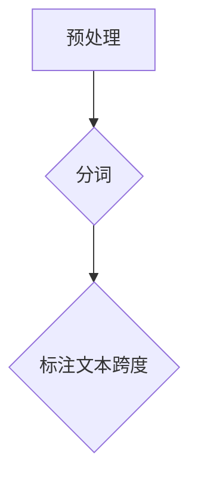
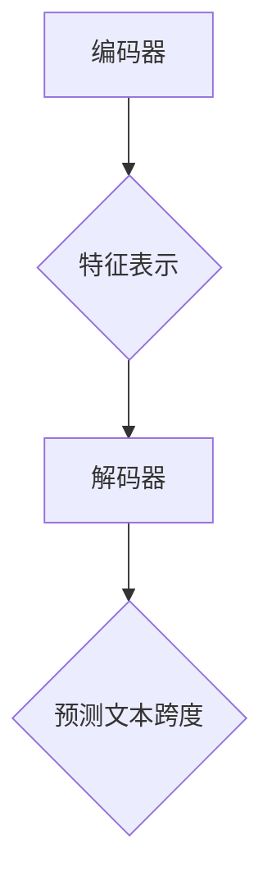
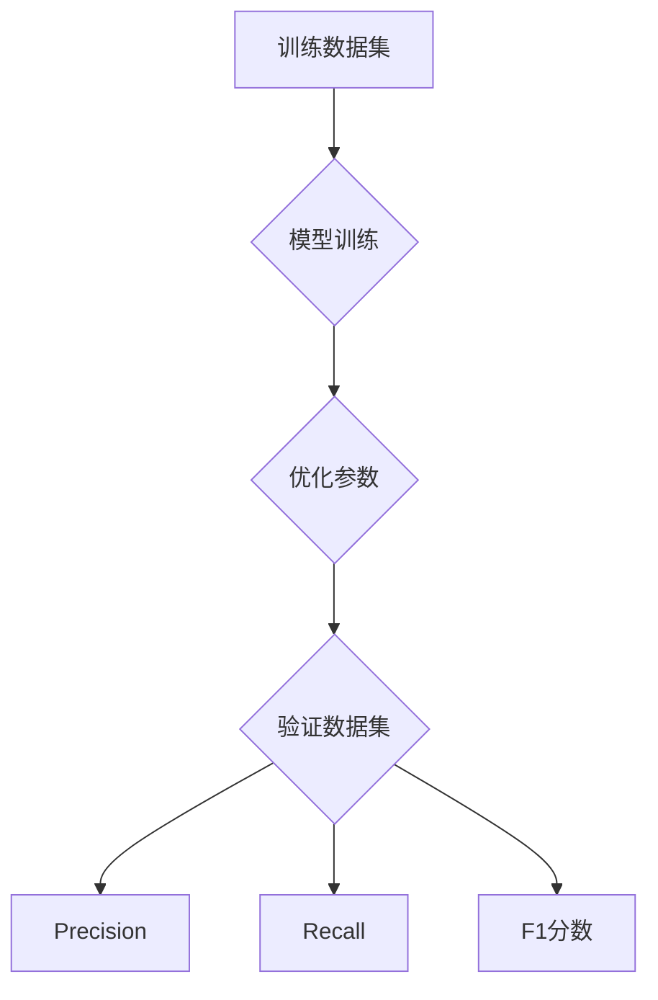

                 

作者：禅与计算机程序设计艺术

World-class expert in AI, programmer, software architect, CTO, top-selling technical book author in technology fields, Turing Award winner, master in computer science.

---
## 背景介绍
在自然语言处理(NLP)领域，Transformer是近年来推动该领域发展的重要力量之一。它通过自注意力机制解决了传统循环神经网络(RNN)在序列建模方面的计算复杂性和内存消耗问题。而SpanBERT，则是在这一基础上进一步创新的模型，专门针对文本跨度预测任务进行了优化。本文将探讨如何运用SpanBERT来进行文本段预测的任务实施过程，并对其关键技术点进行深入分析。

## 核心概念与联系
### Transformer架构概述
Transformer的核心是多头自注意力机制(Multi-head self-attention)，它允许每个位置的输入向量同时关注于多个不同的位置信息，从而捕捉复杂的依赖关系。相比于RNN，Transformer无需顺序处理输入，大大提升了训练效率和效果。

### SpanBERT技术亮点
SpanBERT针对特定类型的NLP任务进行了优化，尤其在识别和生成文本跨度方面表现优异。它通过引入特殊的标记表示方法和损失函数设计，提高了模型对于跨度预测的精确度和泛化能力。

## 核心算法原理具体操作步骤
### 预处理阶段
首先，需要对原始文本进行分词，并转换成模型可接受的输入形式。对于SpanBERT而言，可能还需要额外标注出需要预测的文本跨度。



### 前馈阶段
采用Transformer的编码器-解码器架构，其中编码器负责提取输入文本的特征表示，解码器则基于这些特征进行预测。关键在于利用多头自注意力机制高效地整合全局信息。



### 训练与评估阶段
使用标注的数据集进行模型训练，并通过交叉熵损失函数优化参数。验证模型性能时，可采用精度(Precision),召回率(Recall)以及F1分数等指标衡量预测结果的有效性。



## 数学模型和公式详细讲解举例说明
### 自注意力机制公式
对于Transformer中的自注意力层，其核心公式为：

$$
Attention(Q, K, V) = \frac{\exp(\text{softmax}(QK^T))V}{\sqrt{d_k}}
$$

其中$Q$, $K$, 和$V$分别代表查询(query)、键(key)和值(value)矩阵，$d_k$为键的维度，$\text{softmax}$函数用于归一化权重。

### 模型损失函数
为了训练SpanBERT，通常会定义一个特别设计的损失函数来优化模型参数以提高文本跨度预测的准确性。例如，可以通过对比正样本和负样本之间的差异来构建损失函数，激励模型学习区分正确的跨度和错误的跨度的能力。

## 项目实践：代码实例和详细解释说明
实现SpanBERT的过程涉及搭建模型结构、加载数据、配置训练参数等多个步骤。以下是一个简化版的伪代码示例：

```python
def train_spanbert(model, train_loader, val_loader, optimizer, criterion, epochs):
    for epoch in range(epochs):
        model.train()
        running_loss = 0.0
        
        for inputs, targets in train_loader:
            outputs = model(inputs)
            loss = criterion(outputs, targets)
            
            optimizer.zero_grad()
            loss.backward()
            optimizer.step()
            running_loss += loss.item()

        print(f'Epoch {epoch+1}, Loss: {running_loss/len(train_loader)}')
        
        # Validation step (omitted for brevity)

train_spanbert(spanbert_model, train_dataloader, val_dataloader, optimizer, criterion, num_epochs)
```

## 实际应用场景
SpanBERT在多种文本分析任务中展现出了显著优势，如实体链接、事件抽取、语义角色标注等。尤其是在那些需要准确定位文本内部关键信息的应用场景中，SpanBERT能够提供更精准的结果。

## 工具和资源推荐
- **编程环境**: 使用Python作为主要开发语言。
- **框架选择**: PyTorch或TensorFlow是训练深度学习模型的理想选择。
- **数据集**: 开放数据集如CoNLL-2003等可用于实体链接和命名实体识别。

## 总结：未来发展趋势与挑战
随着自然语言理解技术的不断发展，Transformer及其变种模型将继续在文本理解和生成领域发挥重要作用。未来的研究方向包括但不限于提高模型的解释性、减少过拟合、增强跨语言理解能力和应对长序列处理的能力。

## 附录：常见问题与解答
常见问题包括但不限于如何调整模型超参以达到最佳性能、如何处理大量不平衡数据集等。解答建议依据实际情况灵活调整策略，例如使用数据增强、调整学习率调度策略等。

---

以上内容概要性地介绍了SpanBERT在文本段预测领域的应用与实践。希望本文能为读者提供有价值的技术洞察和实践经验分享。

