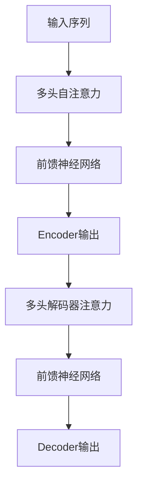
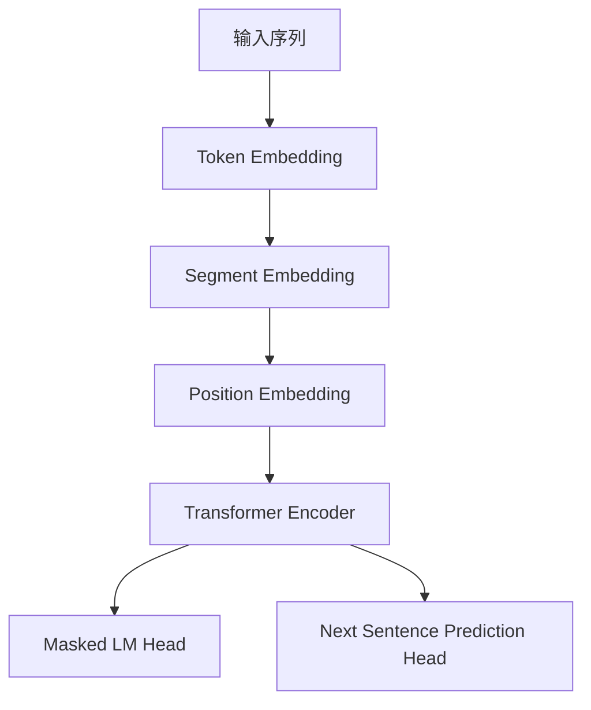

# Transformer大模型实战 葡萄牙语的BERTimbau模型

## 1.背景介绍

### 1.1 自然语言处理的重要性

在当今的数字时代,自然语言处理(NLP)已经成为一个不可或缺的技术领域。它使计算机能够理解、解释和生成人类语言,为各种应用程序提供强大的语言智能支持。无论是智能助手、机器翻译、情感分析还是问答系统,NLP都扮演着关键角色。

### 1.2 Transformer模型的崛起

传统的NLP模型如RNN和LSTM存在着一些固有的缺陷,如长距离依赖问题和计算效率低下。2017年,Transformer模型应运而生,它完全基于注意力机制,摆脱了循环神经网络的限制,在诸多NLP任务上取得了卓越的表现。自此,Transformer模型成为NLP领域的新标杆。

### 1.3 BERT模型的影响

2018年,谷歌推出了BERT(Bidirectional Encoder Representations from Transformers)模型,这是第一个真正成功的预训练语言模型。BERT在大规模无标注语料上进行预训练,学习到了丰富的语义和语法知识,只需在下游任务上进行少量微调,就能获得出色的性能表现。BERT的出现,掀起了NLP领域的新浪潮。

### 1.4 BERTimbau的诞生

葡萄牙语是世界上使用人数最多的语言之一,但一直缺乏大型预训练语言模型的支持。为了解决这一问题,巴西的研究人员基于BERT模型,利用大量的葡萄牙语语料训练出了BERTimbau模型。它是第一个面向葡萄牙语的大型预训练Transformer模型,为葡语NLP应用的发展注入了新的动力。

## 2.核心概念与联系

### 2.1 Transformer模型

Transformer是一种全新的基于注意力机制的序列到序列模型,主要由编码器(Encoder)和解码器(Decoder)两部分组成。它不再依赖RNN或CNN,而是通过自注意力机制来捕捉输入序列中任意两个位置之间的依赖关系,从而有效解决了长距离依赖问题。

### 2.2 BERT模型

BERT是一种基于Transformer的双向预训练语言模型,它的关键创新在于引入了Masked Language Model(MLM)和Next Sentence Prediction(NSP)两个预训练任务。MLM通过随机掩蔽输入序列中的部分词元,并以预测被掩蔽词元为目标进行训练,从而学习到双向语境信息。NSP则旨在捕捉句子之间的关系。

### 2.3 BERTimbau模型

BERTimbau是一个基于BERT模型的大型预训练Transformer模型,专门针对葡萄牙语进行了优化和训练。它采用了与BERT相同的预训练任务和模型架构,但使用了大量的葡萄牙语语料进行训练,从而学习到了丰富的葡语语义和语法知识。BERTimbau可以在各种葡语NLP任务上发挥强大的性能,如文本分类、命名实体识别、机器阅读理解等。

## 3.核心算法原理具体操作步骤

### 3.1 Transformer模型架构

Transformer模型主要由编码器(Encoder)和解码器(Decoder)两部分组成,它们都是由多个相同的层组成的堆栈结构。每一层都包含了多头自注意力(Multi-Head Attention)和前馈神经网络(Feed-Forward Neural Network)两个子层。

1. **编码器(Encoder)**

编码器的作用是将输入序列映射为一系列连续的表示向量。其具体操作步骤如下:

a) 对输入序列进行词嵌入(Word Embedding)和位置编码(Positional Encoding)。
b) 将嵌入后的序列输入到编码器的第一层。
c) 在每一层中,先进行多头自注意力计算,捕捉输入序列中任意两个位置之间的依赖关系。
d) 然后通过前馈神经网络对注意力输出进行非线性映射。
e) 将该层的输出传递给下一层,重复上述步骤。
f) 最终得到编码器的输出,即输入序列的连续表示向量。

2. **解码器(Decoder)**

解码器的作用是基于编码器的输出和目标序列,生成相应的输出序列。其具体操作步骤如下:

a) 对目标序列进行词嵌入和位置编码。
b) 将嵌入后的序列输入到解码器的第一层。
c) 在每一层中,先进行掩蔽多头自注意力计算,只允许关注当前位置之前的信息。
d) 然后进行编码器-解码器注意力计算,将解码器的输出与编码器的输出进行注意力融合。
e) 通过前馈神经网络对注意力输出进行非线性映射。
f) 将该层的输出传递给下一层,重复上述步骤。
g) 最终得到解码器的输出,即目标序列的预测结果。

### 3.2 BERT预训练任务

BERT模型的核心创新在于引入了两个预训练任务:Masked Language Model(MLM)和Next Sentence Prediction(NSP)。

1. **Masked Language Model(MLM)**

MLM任务的目标是根据上下文预测被掩蔽的词元。具体操作步骤如下:

a) 从输入序列中随机选择15%的词元进行掩蔽,其中80%直接替换为[MASK]标记,10%替换为随机词元,剩余10%保持不变。
b) 将掩蔽后的序列输入到BERT模型中。
c) 对于每个被掩蔽的词元位置,BERT模型需要基于上下文预测出该位置最可能的词元。
d) 将预测结果与实际词元进行交叉熵损失计算,并通过梯度下降优化模型参数。

2. **Next Sentence Prediction(NSP)** 

NSP任务的目标是判断两个句子是否相邻。具体操作步骤如下:

a) 从语料库中随机抽取成对的句子作为输入,50%的概率将它们并列,50%的概率将它们分开。
b) 在输入序列中添加一个特殊标记[SEP]来分隔两个句子。
c) 将序列输入到BERT模型中,模型需要预测[SEP]标记之后的句子是否为下一个句子。
d) 将预测结果与实际标签进行交叉熵损失计算,并通过梯度下降优化模型参数。

通过上述两个预训练任务,BERT模型能够学习到丰富的语义和语法知识,为后续的下游任务奠定基础。

### 3.3 BERTimbau预训练过程

BERTimbau模型的预训练过程与BERT基本相同,主要区别在于使用了大量的葡萄牙语语料进行训练。具体步骤如下:

1. **数据预处理**

收集大量的葡萄牙语文本语料,包括网页、书籍、新闻等多种来源。对语料进行标记化、分词、过滤等预处理操作。

2. **词表构建**

基于预处理后的语料,构建BERTimbau模型的词表(Vocabulary)。通常采用WordPiece或BPE等算法,将单词分解为多个子词元(Subword)。

3. **模型初始化**

初始化BERTimbau模型的参数,包括词嵌入矩阵、Transformer编码器和解码器等模块。

4. **预训练阶段**

a) 对预处理后的语料进行掩蔽和句子对构建,生成MLM和NSP的训练样本。
b) 将训练样本输入到BERTimbau模型中,执行MLM和NSP两个预训练任务。
c) 计算预测结果与实际标签的损失,并通过梯度下降算法优化模型参数。
d) 在大量语料上反复训练,直至模型收敛。

5. **模型保存**

将预训练完成的BERTimbau模型参数保存下来,用于后续的下游任务微调。

通过上述预训练过程,BERTimbau模型能够学习到丰富的葡萄牙语语义和语法知识,为各种葡语NLP应用奠定基础。

## 4.数学模型和公式详细讲解举例说明

### 4.1 注意力机制(Attention Mechanism)

注意力机制是Transformer模型的核心,它能够捕捉输入序列中任意两个位置之间的依赖关系。给定一个查询向量(Query)和一组键值对(Key-Value Pairs),注意力机制会根据查询向量与各个键向量之间的相关性,对值向量进行加权求和,得到注意力输出。

$$\text{Attention}(Q, K, V) = \text{softmax}\left(\frac{QK^T}{\sqrt{d_k}}\right)V$$

其中:
- $Q$表示查询向量(Query)
- $K$表示键向量(Key)
- $V$表示值向量(Value)
- $d_k$是缩放因子,用于防止点积过大导致梯度饱和

多头注意力(Multi-Head Attention)机制则是将注意力机制运用在多个不同的子空间上,最后将各个子空间的结果拼接起来。

$$\text{MultiHead}(Q, K, V) = \text{Concat}(head_1, ..., head_h)W^O$$
$$\text{where } head_i = \text{Attention}(QW_i^Q, KW_i^K, VW_i^V)$$

- $W_i^Q$、$W_i^K$、$W_i^V$分别是查询、键值的线性投影矩阵
- $W^O$是最终的线性变换矩阵

通过多头注意力机制,模型能够从不同的表示子空间获取不同的信息,提高了模型的表达能力。

### 4.2 位置编码(Positional Encoding)

由于Transformer模型没有循环或卷积结构,无法直接获取序列的位置信息。因此,需要在输入embedding中加入位置编码,显式地提供位置信息。

位置编码是一个由正弦和余弦函数构成的矩阵,其公式如下:

$$PE_{(pos, 2i)} = \sin\left(pos / 10000^{2i/d_{model}}\right)$$
$$PE_{(pos, 2i+1)} = \cos\left(pos / 10000^{2i/d_{model}}\right)$$

其中:
- $pos$表示词元的位置索引
- $i$表示embedding向量的维度索引
- $d_{model}$是embedding的维度大小

位置编码矩阵会与输入embedding相加,从而将位置信息融入到模型中。

### 4.3 BERT损失函数

BERT模型在预训练阶段需要优化两个损失函数,分别对应MLM和NSP两个任务。

1. **Masked Language Model损失函数**

对于MLM任务,BERT需要预测被掩蔽的词元。损失函数定义为所有掩蔽位置的交叉熵损失之和:

$$\mathcal{L}_{\text{MLM}} = -\sum_{i=1}^{N} \mathbb{1}_{i \in \mathcal{M}}\log P(x_i|X)$$

其中:
- $N$是输入序列的长度
- $\mathcal{M}$是被掩蔽的词元位置集合
- $x_i$是第$i$个位置的实际词元
- $P(x_i|X)$是BERT模型预测第$i$个位置为$x_i$的概率

2. **Next Sentence Prediction损失函数**

对于NSP任务,BERT需要判断两个句子是否相邻。损失函数定义为二分类交叉熵损失:

$$\mathcal{L}_{\text{NSP}} = -\log P(y|X_1, X_2)$$

其中:
- $y$是实际标签,表示两个句子是否相邻
- $P(y|X_1, X_2)$是BERT模型预测两个句子关系的概率

最终,BERT的总损失函数是MLM损失和NSP损失的加权和:

$$\mathcal{L} = \mathcal{L