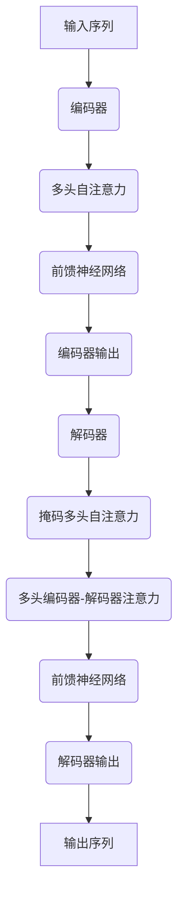

# Transformer大模型实战 预训练策略

## 1.背景介绍

在深度学习的浪潮中,Transformer模型凭借其出色的性能和高效的并行计算能力,成为了自然语言处理(NLP)和计算机视觉(CV)领域的关键技术。作为一种全新的基于注意力机制的神经网络架构,Transformer不仅在机器翻译任务上取得了突破性的成果,而且还被广泛应用于文本生成、语音识别、图像分类等多个领域,展现出了巨大的潜力。

随着模型规模的不断扩大,预训练(Pre-training)策略变得越来越重要。合理的预训练不仅可以加速模型收敛,还能显著提高模型的泛化能力。本文将重点探讨Transformer大模型的预训练策略,包括数据准备、模型初始化、训练技巧等多个方面,旨在为读者提供实用的技术指导。

## 2.核心概念与联系

### 2.1 Transformer模型架构

Transformer是一种全新的基于注意力机制的序列到序列(Seq2Seq)模型,它完全摒弃了传统的卷积和循环神经网络结构。Transformer的核心组件包括编码器(Encoder)和解码器(Decoder),两者均由多个相同的层组成。每一层都包含一个多头自注意力(Multi-Head Attention)子层和一个前馈神经网络(Feed-Forward Neural Network)子层。



### 2.2 自注意力机制

自注意力机制是Transformer模型的核心,它允许模型在计算当前位置的表示时,充分利用其他位置的信息。与循环神经网络和卷积神经网络不同,自注意力机制可以直接捕获序列中任意两个位置之间的依赖关系,从而更好地建模长距离依赖。

### 2.3 预训练策略

预训练是指在大规模无监督数据上训练模型,获得一个良好的初始化参数,然后在下游任务上进行微调(Fine-tuning)。合理的预训练策略可以显著提高模型的泛化能力,尤其是对于大规模的Transformer模型。常见的预训练策略包括掩码语言模型(Masked Language Model)、下一句预测(Next Sentence Prediction)等。

## 3.核心算法原理具体操作步骤

### 3.1 数据准备

高质量的预训练数据是训练出优秀Transformer大模型的关键。一般来说,我们需要准备大规模的无监督文本数据,例如网页数据、书籍数据、新闻数据等。数据预处理步骤包括:

1. **数据清洗**: 去除HTML标签、垃圾数据等。
2. **分词**: 将文本切分为词元(Token)序列。
3. **构建词表**: 统计词元出现频率,构建词表(Vocabulary)。
4. **数值化**: 将词元序列转换为数值序列,作为模型输入。

### 3.2 模型初始化

Transformer大模型的参数初始化对模型性能有着重要影响。一般采用以下策略:

1. **嵌入层初始化**: 通常使用正态分布或均匀分布随机初始化词嵌入和位置嵌入。
2. **Transformer层初始化**: 使用Xavier初始化或Kaiming初始化等方法,确保梯度在前向和反向传播时不会过度衰减或爆炸。
3. **层归一化参数初始化**: 将层归一化的$\gamma$参数初始化为1,$\beta$参数初始化为0。

### 3.3 预训练目标

常见的Transformer预训练目标包括:

1. **掩码语言模型(Masked Language Model, MLM)**: 随机掩码输入序列中的一部分词元,模型需要预测被掩码的词元。
2. **下一句预测(Next Sentence Prediction, NSP)**: 给定两个句子,模型需要预测它们是否为连续的句子。

预训练目标的损失函数通常为交叉熵损失函数:

$$\mathcal{L}=-\sum_{i=1}^{N}y_i\log\hat{y}_i$$

其中$y_i$为真实标签,$\hat{y}_i$为模型预测的概率分布。

### 3.4 训练技巧

训练Transformer大模型时,需要注意以下几点:

1. **梯度裁剪(Gradient Clipping)**: 防止梯度爆炸,常用的方法是根据梯度的范数对梯度进行裁剪。
2. **学习率warmup**: 在训练初期使用较小的学习率,防止模型陷入局部最优。
3. **Label Smoothing**: 将"硬"标签(0或1)平滑为"软"标签,以提高模型的泛化能力。
4. **梯度累积(Gradient Accumulation)**: 由于显存有限,可以将梯度累积多个批次后再进行一次参数更新,以支持更大的批量大小。

此外,还可以采用混合精度训练、多GPU训练等策略来加速训练过程。

## 4.数学模型和公式详细讲解举例说明

### 4.1 注意力机制

注意力机制是Transformer模型的核心,它能够自动捕获输入序列中不同位置之间的依赖关系。给定一个查询向量$\mathbf{q}$、键向量$\mathbf{K}$和值向量$\mathbf{V}$,注意力机制的计算过程如下:

1. 计算注意力分数:

$$\text{Attention}(\mathbf{q}, \mathbf{K}, \mathbf{V}) = \text{softmax}\left(\frac{\mathbf{q}\mathbf{K}^\top}{\sqrt{d_k}}\right)\mathbf{V}$$

其中$d_k$是缩放因子,用于防止点积过大导致softmax函数的梯度较小。

2. 多头注意力机制通过将查询、键和值投影到不同的表示子空间,并执行多个注意力操作,最后将结果拼接起来:

$$\begin{aligned}
\text{MultiHead}(\mathbf{Q}, \mathbf{K}, \mathbf{V}) &= \text{Concat}(\text{head}_1, \dots, \text{head}_h)\mathbf{W}^O\\
\text{where}\  \text{head}_i &= \text{Attention}(\mathbf{Q}\mathbf{W}_i^Q, \mathbf{K}\mathbf{W}_i^K, \mathbf{V}\mathbf{W}_i^V)
\end{aligned}$$

其中$\mathbf{W}_i^Q\in\mathbb{R}^{d_\text{model}\times d_k}$、$\mathbf{W}_i^K\in\mathbb{R}^{d_\text{model}\times d_k}$、$\mathbf{W}_i^V\in\mathbb{R}^{d_\text{model}\times d_v}$和$\mathbf{W}^O\in\mathbb{R}^{hd_v\times d_\text{model}}$是可学习的线性投影参数。

### 4.2 位置编码

由于Transformer没有使用卷积或循环神经网络来捕获序列的位置信息,因此需要显式地将位置信息编码到输入序列中。位置编码公式如下:

$$\begin{aligned}
\text{PE}_{(pos, 2i)} &= \sin\left(\frac{pos}{10000^{\frac{2i}{d_\text{model}}}}\right)\\
\text{PE}_{(pos, 2i+1)} &= \cos\left(\frac{pos}{10000^{\frac{2i}{d_\text{model}}}}\right)
\end{aligned}$$

其中$pos$是词元的位置索引,而$i$是维度的索引。位置编码会被加到输入的词嵌入中,从而为模型提供位置信息。

### 4.3 层归一化

为了加速训练过程并提高模型性能,Transformer采用了层归一化(Layer Normalization)操作。层归一化的计算公式如下:

$$\begin{aligned}
\mu &= \frac{1}{H}\sum_{i=1}^{H}x_i\\
\sigma^2 &= \frac{1}{H}\sum_{i=1}^{H}(x_i - \mu)^2\\
\hat{x}_i &= \gamma\left(\frac{x_i - \mu}{\sqrt{\sigma^2 + \epsilon}}\right) + \beta
\end{aligned}$$

其中$x_i$是输入向量的第$i$个元素,$H$是向量的长度,$\gamma$和$\beta$是可学习的缩放和偏移参数,而$\epsilon$是一个很小的常数,用于避免分母为零。

通过层归一化,模型可以更好地处理不同尺度的输入数据,从而加快收敛速度并提高泛化能力。

## 5.项目实践:代码实例和详细解释说明

为了更好地理解Transformer模型的预训练过程,我们提供了一个基于PyTorch的代码示例。该示例实现了一个小规模的Transformer模型,并在WikiText-2数据集上进行了预训练。

### 5.1 数据准备

```python
import torchtext

# 构建词表
text_pipeline = lambda x: x.split()
vocab = torchtext.vocab.build_vocab_from_iterator(map(text_pipeline, iter(train_data)), specials=["<unk>", "<pad>", "<bos>", "<eos>"])

# 构建数据集
text_transform = lambda x: [vocab[token] for token in text_pipeline(x)]
train_dataset = torchtext.data.Dataset(train_data, text_transform)
val_dataset = torchtext.data.Dataset(val_data, text_transform)
```

在这个示例中,我们使用torchtext库来构建词表和数据集。首先,我们定义了一个简单的分词函数`text_pipeline`,然后使用`build_vocab_from_iterator`函数从训练数据中构建词表。接下来,我们使用`text_transform`函数将文本转换为词元索引序列,并构建训练集和验证集。

### 5.2 模型定义

```python
import torch.nn as nn

class TransformerModel(nn.Module):
    def __init__(self, vocab_size, d_model, nhead, num_layers, dropout=0.5):
        super().__init__()
        self.embedding = nn.Embedding(vocab_size, d_model)
        self.pos_encoder = PositionalEncoding(d_model, dropout)
        encoder_layers = nn.TransformerEncoderLayer(d_model, nhead, dim_feedforward=512, dropout=dropout)
        self.transformer_encoder = nn.TransformerEncoder(encoder_layers, num_layers)
        self.decoder = nn.Linear(d_model, vocab_size)

    def forward(self, src, src_mask):
        src = self.embedding(src) * math.sqrt(self.embedding.embedding_dim)
        src = self.pos_encoder(src)
        output = self.transformer_encoder(src, src_mask)
        output = self.decoder(output)
        return output
```

在这个示例中,我们定义了一个简化版的Transformer模型,包括词嵌入层、位置编码层、Transformer编码器层和线性解码层。`forward`函数实现了模型的前向传播过程,包括词嵌入、位置编码、Transformer编码器和线性解码。

### 5.3 训练过程

```python
import torch.optim as optim

model = TransformerModel(len(vocab), d_model=128, nhead=4, num_layers=2)
criterion = nn.CrossEntropyLoss(ignore_index=vocab["<pad>"])
optimizer = optim.Adam(model.parameters(), lr=0.001)

for epoch in range(num_epochs):
    for batch in train_loader:
        optimizer.zero_grad()
        output = model(batch.text, src_key_padding_mask=batch.text == vocab["<pad>"])
        loss = criterion(output.view(-1, len(vocab)), batch.text.view(-1))
        loss.backward()
        optimizer.step()
```

在训练过程中,我们首先实例化模型、损失函数和优化器。然后,我们遍历训练数据,计算模型输出和损失值,并通过反向传播更新模型参数。注意,我们使用`src_key_padding_mask`掩码来忽略填充词元对注意力计算的影响。

### 5.4 评估

```python
model.eval()
total_loss = 0
with torch.no_grad():
    for batch in val_loader:
        output = model(batch.text, src_key_padding_mask=batch.text == vocab["<pad>"])
        loss = criterion(output.view(-1, len(vocab)), batch.text.view(-1))
        total_loss += loss.item()
print(f"Validation Loss: {total_loss / len(val_loader)}")
```

在评估阶段,我们将模型设置为评估模式,并在验证集上计算损失值。由于评估时不需要更新模型参数,因此我们使用`torch.no_gra