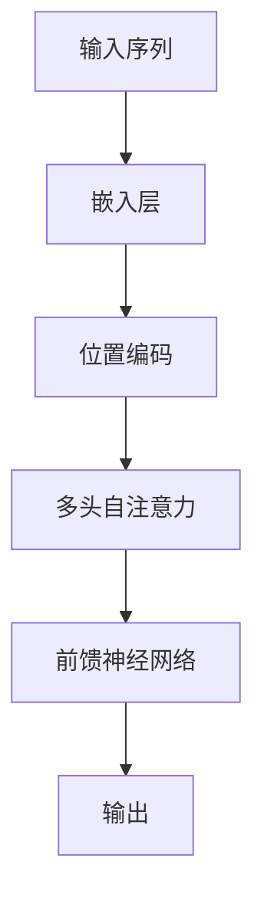

# Transformer大模型实战 高效的训练方法

## 1.背景介绍

Transformer模型自从2017年由Vaswani等人提出以来，已经成为自然语言处理（NLP）领域的主流模型。其独特的架构和强大的性能使其在各种任务中表现出色，如机器翻译、文本生成和问答系统等。然而，Transformer模型的训练过程复杂且计算资源消耗巨大，如何高效地训练Transformer大模型成为了一个重要的研究课题。

## 2.核心概念与联系

### 2.1 Transformer架构

Transformer模型的核心架构由编码器和解码器组成，每个编码器和解码器包含多个层，每层由多头自注意力机制和前馈神经网络组成。其主要特点是完全基于注意力机制，摒弃了传统的循环神经网络（RNN）和卷积神经网络（CNN）。

### 2.2 自注意力机制

自注意力机制是Transformer的核心创新点，它允许模型在处理输入序列时关注序列中的不同位置，从而捕捉到全局信息。自注意力机制的计算复杂度为 $O(n^2)$，其中 $n$ 是序列长度。

### 2.3 多头注意力

多头注意力机制通过并行计算多个自注意力机制，使模型能够关注输入序列的不同子空间，从而提高模型的表达能力。

### 2.4 位置编码

由于Transformer模型没有内置的序列信息，需要通过位置编码来引入序列位置信息。位置编码通常采用正弦和余弦函数来生成。



## 3.核心算法原理具体操作步骤

### 3.1 数据预处理

数据预处理是训练Transformer模型的第一步，包括文本清洗、分词、词嵌入等步骤。高质量的数据预处理可以显著提高模型的性能。

### 3.2 模型初始化

模型初始化是训练的关键步骤，良好的初始化可以加速模型的收敛。常用的初始化方法包括Xavier初始化和He初始化。

### 3.3 损失函数

Transformer模型通常使用交叉熵损失函数来衡量预测结果与真实标签之间的差异。对于序列生成任务，还可以使用序列到序列的损失函数。

### 3.4 优化算法

常用的优化算法包括Adam和AdaGrad。为了提高训练效率，可以使用学习率调度器，如Warmup和Cosine Annealing。

### 3.5 正则化技术

为了防止过拟合，可以使用正则化技术，如Dropout和Layer Normalization。

## 4.数学模型和公式详细讲解举例说明

### 4.1 自注意力机制公式

自注意力机制的计算公式如下：

$$
\text{Attention}(Q, K, V) = \text{softmax}\left(\frac{QK^T}{\sqrt{d_k}}\right)V
$$

其中，$Q$、$K$ 和 $V$ 分别表示查询、键和值矩阵，$d_k$ 是键的维度。

### 4.2 多头注意力公式

多头注意力机制的计算公式如下：

$$
\text{MultiHead}(Q, K, V) = \text{Concat}(\text{head}_1, \ldots, \text{head}_h)W^O
$$

其中，每个头的计算公式为：

$$
\text{head}_i = \text{Attention}(QW_i^Q, KW_i^K, VW_i^V)
$$

### 4.3 位置编码公式

位置编码的计算公式如下：

$$
PE_{(pos, 2i)} = \sin\left(\frac{pos}{10000^{2i/d_{model}}}\right)
$$

$$
PE_{(pos, 2i+1)} = \cos\left(\frac{pos}{10000^{2i/d_{model}}}\right)
$$

其中，$pos$ 表示位置，$i$ 表示维度索引，$d_{model}$ 表示模型的维度。

## 5.项目实践：代码实例和详细解释说明

### 5.1 数据预处理

```python
import torch
from transformers import BertTokenizer

tokenizer = BertTokenizer.from_pretrained('bert-base-uncased')
text = "Hello, how are you?"
tokens = tokenizer.tokenize(text)
input_ids = tokenizer.convert_tokens_to_ids(tokens)
input_tensor = torch.tensor([input_ids])
```

### 5.2 模型定义

```python
import torch.nn as nn
from transformers import BertModel

class TransformerModel(nn.Module):
    def __init__(self):
        super(TransformerModel, self).__init__()
        self.bert = BertModel.from_pretrained('bert-base-uncased')
        self.fc = nn.Linear(768, 2)  # 假设是二分类任务

    def forward(self, input_ids):
        outputs = self.bert(input_ids)
        cls_output = outputs[1]  # [CLS] token的输出
        logits = self.fc(cls_output)
        return logits
```

### 5.3 模型训练

```python
import torch.optim as optim

model = TransformerModel()
criterion = nn.CrossEntropyLoss()
optimizer = optim.Adam(model.parameters(), lr=2e-5)

for epoch in range(10):
    model.train()
    optimizer.zero_grad()
    outputs = model(input_tensor)
    loss = criterion(outputs, torch.tensor([1]))  # 假设标签为1
    loss.backward()
    optimizer.step()
    print(f"Epoch {epoch}, Loss: {loss.item()}")
```

## 6.实际应用场景

### 6.1 机器翻译

Transformer模型在机器翻译任务中表现出色，尤其是在英法、英德等语言对的翻译中，Transformer模型已经超越了传统的RNN和CNN模型。

### 6.2 文本生成

Transformer模型在文本生成任务中也表现优异，如GPT系列模型在生成高质量的文本段落、对话生成等任务中表现出色。

### 6.3 问答系统

Transformer模型在问答系统中也有广泛应用，如BERT模型在SQuAD数据集上的表现已经达到了人类水平。

## 7.工具和资源推荐

### 7.1 预训练模型

- BERT: https://github.com/google-research/bert
- GPT-3: https://github.com/openai/gpt-3
- T5: https://github.com/google-research/text-to-text-transfer-transformer

### 7.2 数据集

- SQuAD: https://rajpurkar.github.io/SQuAD-explorer/
- WMT: http://www.statmt.org/wmt20/translation-task.html
- GLUE: https://gluebenchmark.com/

### 7.3 开源框架

- Hugging Face Transformers: https://github.com/huggingface/transformers
- Fairseq: https://github.com/pytorch/fairseq
- OpenNMT: https://github.com/OpenNMT/OpenNMT-py

## 8.总结：未来发展趋势与挑战

Transformer模型在NLP领域取得了巨大的成功，但也面临一些挑战，如计算资源消耗巨大、训练时间长等。未来的发展趋势包括模型压缩、分布式训练和自监督学习等技术，以提高模型的训练效率和性能。

## 9.附录：常见问题与解答

### 9.1 Transformer模型为什么比RNN和CNN更强大？

Transformer模型完全基于注意力机制，能够捕捉全局信息，而RNN和CNN在处理长序列时存在信息丢失的问题。

### 9.2 如何解决Transformer模型的计算资源消耗问题？

可以通过模型压缩、分布式训练和使用高效的硬件加速器（如TPU和GPU）来解决计算资源消耗问题。

### 9.3 Transformer模型在小数据集上的表现如何？

Transformer模型在小数据集上的表现可能不如大数据集，但可以通过数据增强和迁移学习等技术来提高其在小数据集上的性能。

---

作者：禅与计算机程序设计艺术 / Zen and the Art of Computer Programming