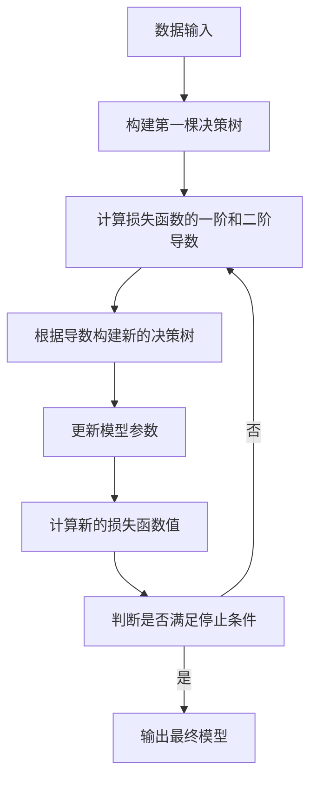

# XGBoost 原理与代码实战案例讲解

## 1.背景介绍

### 1.1 机器学习与决策树

机器学习是一门研究如何让计算机从数据中自动学习知识的科学,其中决策树是一种常用的监督学习算法。决策树模型具有可解释性强、可视化直观等优点,但也存在过拟合的风险。

### 1.2 提高决策树性能的boosting算法

为了提高决策树的性能,提出了多种boosting算法,例如AdaBoost、Gradient Boosting等。这些boosting算法通过构建多棵决策树,并将它们组合成一个强大的模型,从而提高了预测准确性。

### 1.3 XGBoost的诞生

XGBoost(Extreme Gradient Boosting)是一种高效的梯度提升决策树算法,由陈天奇等人于2016年提出。它在计算速度和模型效果上都有出色表现,被广泛应用于多个领域,并在许多机器学习竞赛中表现出色。

## 2.核心概念与联系

### 2.1 决策树

决策树是一种树形结构,内部节点表示对特征的判断条件,叶节点表示预测的结果。它通过递归地将数据划分为更小的子集,从而构建出一个预测模型。

### 2.2 Boosting算法

Boosting算法是一种集成学习方法,通过构建多个弱学习器(如决策树),并将它们线性组合成一个强大的模型。每一轮迭代时,boosting算法会根据前一轮的错误率调整样本权重,使得后续的弱学习器更关注那些难以预测的样本。

### 2.3 梯度提升

梯度提升(Gradient Boosting)是一种boosting算法,它通过最小化损失函数的负梯度来生成新的决策树。每一棵新树都是为了尽可能地减小当前模型的残差,从而逐步优化整体模型。

### 2.4 XGBoost的创新点

XGBoost在传统梯度提升算法的基础上做出了以下创新:

1. 使用了二阶泰勒展开近似代替一阶展开,提高了算法的准确性。
2. 引入了正则化项,控制模型的复杂度,防止过拟合。
3. 支持并行和分布式计算,大大提高了计算效率。
4. 支持缺失值处理,可以自动学习缺失值的处理方式。
5. 支持多种损失函数,适用于分类、回归等多种任务。

## 3.核心算法原理具体操作步骤

XGBoost的核心算法流程如下:



1. **输入数据**:将训练数据和标签输入到XGBoost算法中。

2. **构建第一棵决策树**:根据初始化参数,构建第一棵决策树。这棵树通常比较简单,只能对数据做出粗糙的拟合。

3. **计算损失函数的一阶和二阶导数**:计算当前模型在每个样本上的损失函数值,并计算损失函数的一阶和二阶导数。这些导数将用于构建下一棵决策树。

4. **构建新的决策树**:根据计算得到的一阶和二阶导数,构建一棵新的决策树。这棵树的目标是尽可能地减小当前模型的残差。

5. **更新模型参数**:将新构建的决策树加入到当前模型中,并更新模型参数。

6. **计算新的损失函数值**:计算更新后的模型在训练数据上的损失函数值。

7. **判断是否满足停止条件**:检查模型是否已经达到预设的停止条件,如最大迭代次数、损失函数值小于阈值等。如果满足条件,则停止迭代,输出最终模型;否则,返回步骤3,继续迭代。

在上述过程中,XGBoost还引入了一些正则化项,用于控制模型的复杂度,防止过拟合。此外,XGBoost还支持并行和分布式计算,可以大大提高算法的计算效率。

## 4.数学模型和公式详细讲解举例说明

### 4.1 目标函数

XGBoost的目标函数由两部分组成:损失函数和正则化项。损失函数衡量模型对数据的拟合程度,正则化项控制模型的复杂度。目标函数可以表示为:

$$\mathrm{obj}^{(t)} = \sum_{i=1}^n l(y_i, \hat{y}_i^{(t-1)} + f_t(x_i)) + \Omega(f_t)$$

其中:

- $l$是损失函数,衡量预测值与真实值之间的差距。
- $y_i$是第$i$个样本的真实标签。
- $\hat{y}_i^{(t-1)}$是前$t-1$棵树对第$i$个样本的预测值。
- $f_t(x_i)$是第$t$棵树对第$i$个样本的预测值。
- $\Omega(f_t)$是正则化项,用于控制模型复杂度。

### 4.2 损失函数

XGBoost支持多种损失函数,包括:

- 回归任务:均方误差损失函数 $l(y, \hat{y}) = (y - \hat{y})^2$
- 分类任务:对数损失函数 $l(y, \hat{y}) = -[y\ln(\hat{y}) + (1-y)\ln(1-\hat{y})]$

### 4.3 正则化项

XGBoost的正则化项包括树的复杂度和叶节点权重的惩罚项:

$$\Omega(f_t) = \gamma T + \frac{1}{2}\lambda \sum_{j=1}^T w_j^2$$

其中:

- $T$是决策树的叶节点个数。
- $\gamma$是控制树复杂度的参数。
- $\lambda$是控制叶节点权重的参数。
- $w_j$是第$j$个叶节点的权重。

通过调整$\gamma$和$\lambda$的值,可以控制模型的复杂度,防止过拟合。

### 4.4 算法优化

为了提高算法的计算效率,XGBoost采用了以下优化策略:

1. **二阶近似**:使用二阶泰勒展开近似代替一阶展开,提高了算法的准确性。
2. **并行计算**:利用多线程和分布式计算,加速树的构建和预测过程。
3. **缺失值处理**:自动学习缺失值的处理方式,无需人工干预。
4. **列式存储**:采用列式存储数据,提高了内存访问效率。

## 5.项目实践:代码实例和详细解释说明

以下是使用Python和XGBoost库进行二元分类任务的代码示例:

```python
import xgboost as xgb
from sklearn.datasets import load_breast_cancer
from sklearn.model_selection import train_test_split
from sklearn.metrics import accuracy_score

# 加载乳腺癌数据集
data = load_breast_cancer()
X, y = data.data, data.target

# 划分训练集和测试集
X_train, X_test, y_train, y_test = train_test_split(X, y, test_size=0.2, random_state=42)

# 创建DMatrix对象
dtrain = xgb.DMatrix(X_train, label=y_train)
dtest = xgb.DMatrix(X_test, label=y_test)

# 设置参数
params = {
    'max_depth': 3,  # 树的最大深度
    'eta': 0.3,  # 学习率
    'objective': 'binary:logistic',  # 二元分类任务
    'eval_metric': 'logloss'  # 评估指标
}

# 训练模型
num_rounds = 100  # 迭代次数
watchlist = [(dtrain, 'train')]
model = xgb.train(params, dtrain, num_rounds, watchlist)

# 预测
y_pred = model.predict(dtest)
y_pred = [1 if x > 0.5 else 0 for x in y_pred]

# 计算准确率
accuracy = accuracy_score(y_test, y_pred)
print(f"Accuracy: {accuracy:.2f}")
```

代码解释:

1. 导入必要的库和加载数据集。
2. 将数据集划分为训练集和测试集。
3. 创建`DMatrix`对象,用于存储训练数据和测试数据。
4. 设置XGBoost的参数,包括树的最大深度、学习率、目标函数和评估指标等。
5. 使用`xgb.train`函数训练模型,指定参数、训练数据和迭代次数。
6. 在测试集上进行预测,将预测值转换为0或1。
7. 计算预测准确率。

上述代码展示了如何使用XGBoost进行二元分类任务。您可以根据需求调整参数,并将其应用于其他任务,如回归或多分类问题。

## 6.实际应用场景

XGBoost由于其出色的性能,已被广泛应用于多个领域,包括但不限于:

1. **金融风控**:用于信用评分、欺诈检测等任务。
2. **广告推荐**:根据用户特征预测点击率,提高广告效果。
3. **计算机视觉**:用于图像分类、目标检测等任务。
4. **自然语言处理**:文本分类、情感分析等任务。
5. **生物信息学**:基因表达数据分析、蛋白质结构预测等。
6. **天文学**:星系分类、暗物质分布预测等。

XGBoost在多个领域的应用都取得了优异的表现,成为了机器学习从业者的必备工具之一。

## 7.工具和资源推荐

如果您想进一步学习和使用XGBoost,以下是一些推荐的工具和资源:

1. **XGBoost官方文档**:提供了详细的API说明、参数介绍和示例代码。
2. **XGBoost Paper**:XGBoost的原论文,详细阐述了算法的原理和创新点。
3. **XGBoost Tutorials**:包含了多个领域的实战教程,可以帮助您快速入门。
4. **XGBoost Notebooks**:GitHub上的Jupyter Notebook示例,涵盖了多种任务和场景。
5. **XGBoost视频教程**:来自机器学习大师的视频讲解,深入浅出。
6. **XGBoost源码**:阅读源码有助于深入理解算法细节。
7. **XGBoost社区**:加入XGBoost社区,与其他用户交流经验和问题。

通过利用这些工具和资源,您可以更好地掌握XGBoost,并将其应用于实际项目中。

## 8.总结:未来发展趋势与挑战

XGBoost自诞生以来,已经取得了巨大的成功,成为了机器学习领域的一颗明星。未来,XGBoost仍将在以下几个方面继续发展:

1. **自动化参数调优**:通过自动化技术,减少人工调参的工作量。
2. **分布式计算优化**:进一步提高分布式计算的效率和稳定性。
3. **支持更多任务类型**:扩展到更多的任务类型,如排序、异常检测等。
4. **解释性和可解释性**:提高模型的解释性,让结果更加可解释。
5. **与深度学习的融合**:将XGBoost与深度学习模型相结合,发挥各自的优势。

同时,XGBoost也面临一些挑战,如:

1. **高维稀疏数据处理**:如何更好地处理高维稀疏数据。
2. **在线学习和增量学习**:支持在线学习和增量学习,适应动态变化的数据。
3. **隐私保护和安全性**:保护模型和数据的隐私和安全性。
4. **硬件加速**:利用GPU、TPU等硬件加速计算。

总的来说,XGBoost作为一种优秀的机器学习算法,未来仍将在多个领域发挥重要作用,同时也需要不断创新和发展,以适应新的需求和挑战。

## 9.附录:常见问题与解答

1. **XGBoost与随机森林的区别是什么?**

   XGBoost和随机森林都是基于决策树的集成学习算法,但有以下几个主要区别:
   - XGBoost