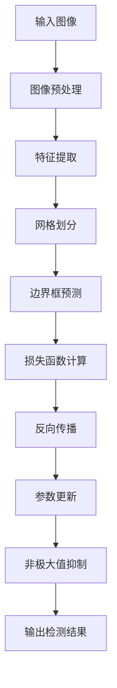

# YOLOv1原理与代码实例讲解

## 1.背景介绍

在计算机视觉领域，目标检测一直是一个重要且具有挑战性的任务。传统的目标检测方法通常需要先进行区域提议（Region Proposal），然后再进行分类和定位，这种方法不仅复杂，而且计算开销大。YOLO（You Only Look Once）系列算法的出现，彻底改变了这一现状。YOLOv1作为该系列的开山之作，以其端到端的检测方式和实时性，迅速成为了目标检测领域的明星算法。

YOLOv1的核心思想是将目标检测问题转化为一个单一的回归问题，通过一个神经网络直接预测图像中的边界框和类别概率。这种方法不仅简化了检测流程，还大大提高了检测速度。

## 2.核心概念与联系

### 2.1 单阶段检测器

YOLOv1属于单阶段检测器，与传统的两阶段检测器（如R-CNN系列）不同，单阶段检测器直接从输入图像生成目标的类别和位置预测。其主要优点是速度快，适合实时应用。

### 2.2 网格划分

YOLOv1将输入图像划分为 $S \times S$ 的网格，每个网格负责预测一个或多个目标的边界框和类别概率。每个网格单元预测固定数量的边界框，并为每个边界框提供一个置信度得分。

### 2.3 边界框预测

每个网格单元预测 $B$ 个边界框，每个边界框包含5个参数：中心坐标 $(x, y)$、宽度 $w$、高度 $h$ 和置信度得分 $c$。置信度得分表示该边界框包含目标的概率以及边界框的准确性。

### 2.4 类别概率

每个网格单元还预测 $C$ 个类别概率，这些概率表示该网格单元包含某个类别目标的可能性。

### 2.5 损失函数

YOLOv1的损失函数由三部分组成：定位损失、置信度损失和分类损失。定位损失用于衡量预测边界框与真实边界框之间的差异，置信度损失用于衡量预测置信度与实际置信度之间的差异，分类损失用于衡量预测类别概率与实际类别之间的差异。

## 3.核心算法原理具体操作步骤

### 3.1 输入图像预处理

首先，将输入图像调整为固定大小（如 $448 \times 448$），并进行归一化处理。

### 3.2 特征提取

使用一个卷积神经网络（如Darknet）提取图像的特征。特征提取网络的最后一层输出一个 $S \times S \times (B \times 5 + C)$ 的张量。

### 3.3 网格划分与边界框预测

将特征图划分为 $S \times S$ 的网格，每个网格单元预测 $B$ 个边界框和 $C$ 个类别概率。

### 3.4 损失函数计算

计算定位损失、置信度损失和分类损失，并将它们加权求和，得到总损失。

### 3.5 反向传播与参数更新

使用反向传播算法计算梯度，并更新网络参数，以最小化总损失。

### 3.6 非极大值抑制

对预测的边界框进行非极大值抑制，去除重叠的边界框，保留置信度最高的边界框。

以下是YOLOv1的核心流程图：



## 4.数学模型和公式详细讲解举例说明

### 4.1 边界框参数化

每个边界框由5个参数表示：中心坐标 $(x, y)$、宽度 $w$、高度 $h$ 和置信度得分 $c$。这些参数的计算公式如下：

$$
x = \sigma(t_x) + c_x
$$

$$
y = \sigma(t_y) + c_y
$$

$$
w = p_w e^{t_w}
$$

$$
h = p_h e^{t_h}
$$

其中，$(c_x, c_y)$ 是网格单元的左上角坐标，$p_w$ 和 $p_h$ 是先验框的宽度和高度，$t_x, t_y, t_w, t_h$ 是网络预测的偏移量。

### 4.2 置信度得分

置信度得分 $c$ 表示边界框包含目标的概率以及边界框的准确性，其计算公式为：

$$
c = P(object) \times IOU_{pred}^{truth}
$$

其中，$P(object)$ 是边界框包含目标的概率，$IOU_{pred}^{truth}$ 是预测边界框与真实边界框的交并比。

### 4.3 损失函数

YOLOv1的损失函数由定位损失、置信度损失和分类损失组成，其公式为：

$$
L = \lambda_{coord} \sum_{i=0}^{S^2} \sum_{j=0}^{B} \mathbb{1}_{ij}^{obj} [(x_i - \hat{x}_i)^2 + (y_i - \hat{y}_i)^2 + (w_i - \hat{w}_i)^2 + (h_i - \hat{h}_i)^2] + \sum_{i=0}^{S^2} \sum_{j=0}^{B} \mathbb{1}_{ij}^{obj} (C_i - \hat{C}_i)^2 + \lambda_{noobj} \sum_{i=0}^{S^2} \sum_{j=0}^{B} \mathbb{1}_{ij}^{noobj} (C_i - \hat{C}_i)^2 + \sum_{i=0}^{S^2} \mathbb{1}_{i}^{obj} \sum_{c \in classes} (p_i(c) - \hat{p}_i(c))^2
$$

其中，$\lambda_{coord}$ 和 $\lambda_{noobj}$ 是权重参数，$\mathbb{1}_{ij}^{obj}$ 和 $\mathbb{1}_{ij}^{noobj}$ 是指示函数，$C_i$ 是置信度得分，$p_i(c)$ 是类别概率。

## 5.项目实践：代码实例和详细解释说明

### 5.1 环境配置

首先，确保你的开发环境中安装了以下依赖：

- Python 3.x
- PyTorch
- OpenCV
- Numpy

### 5.2 数据集准备

下载并准备COCO或Pascal VOC数据集，并将其转换为YOLO格式。

### 5.3 模型定义

定义YOLOv1模型的网络结构：

```python
import torch
import torch.nn as nn

class YOLOv1(nn.Module):
    def __init__(self, S=7, B=2, C=20):
        super(YOLOv1, self).__init__()
        self.S = S
        self.B = B
        self.C = C
        self.conv_layers = nn.Sequential(
            nn.Conv2d(3, 64, kernel_size=7, stride=2, padding=3),
            nn.LeakyReLU(0.1),
            nn.MaxPool2d(kernel_size=2, stride=2),
            # 继续添加卷积层和池化层
        )
        self.fc_layers = nn.Sequential(
            nn.Linear(1024 * S * S, 4096),
            nn.LeakyReLU(0.1),
            nn.Linear(4096, S * S * (B * 5 + C))
        )

    def forward(self, x):
        x = self.conv_layers(x)
        x = x.view(x.size(0), -1)
        x = self.fc_layers(x)
        x = x.view(-1, self.S, self.S, self.B * 5 + self.C)
        return x
```

### 5.4 损失函数定义

定义YOLOv1的损失函数：

```python
class YoloLoss(nn.Module):
    def __init__(self, S=7, B=2, C=20, lambda_coord=5, lambda_noobj=0.5):
        super(YoloLoss, self).__init__()
        self.S = S
        self.B = B
        self.C = C
        self.lambda_coord = lambda_coord
        self.lambda_noobj = lambda_noobj

    def forward(self, predictions, target):
        # 计算定位损失、置信度损失和分类损失
        # 返回总损失
        pass
```

### 5.5 训练模型

定义训练循环：

```python
def train(model, dataloader, criterion, optimizer, num_epochs=50):
    for epoch in range(num_epochs):
        for images, targets in dataloader:
            outputs = model(images)
            loss = criterion(outputs, targets)
            optimizer.zero_grad()
            loss.backward()
            optimizer.step()
        print(f'Epoch [{epoch+1}/{num_epochs}], Loss: {loss.item():.4f}')
```

### 5.6 测试模型

定义测试函数：

```python
def test(model, dataloader):
    model.eval()
    with torch.no_grad():
        for images, targets in dataloader:
            outputs = model(images)
            # 进行非极大值抑制，输出检测结果
```

## 6.实际应用场景

YOLOv1由于其高效的检测速度和较高的准确性，广泛应用于各种实际场景中：

### 6.1 实时监控

在安防监控系统中，YOLOv1可以实时检测视频流中的目标，如行人、车辆等，帮助安防人员及时发现异常情况。

### 6.2 自动驾驶

在自动驾驶系统中，YOLOv1可以实时检测道路上的行人、车辆、交通标志等，为自动驾驶决策提供重要信息。

### 6.3 无人机巡检

在无人机巡检系统中，YOLOv1可以实时检测巡检区域中的目标，如电力设备、建筑物等，帮助巡检人员及时发现问题。

### 6.4 医疗影像分析

在医疗影像分析中，YOLOv1可以用于检测医学影像中的病灶，如肿瘤、病变等，辅助医生进行诊断。

## 7.工具和资源推荐

### 7.1 开发工具

- **PyTorch**：一个开源的深度学习框架，支持动态计算图，适合YOLOv1的实现。
- **OpenCV**：一个开源的计算机视觉库，提供了丰富的图像处理函数，适合YOLOv1的图像预处理和后处理。

### 7.2 数据集

- **COCO**：一个大规模的图像数据集，包含多种类别的目标，适合YOLOv1的训练和测试。
- **Pascal VOC**：一个经典的目标检测数据集，包含20个类别的目标，适合YOLOv1的训练和测试。

### 7.3 参考文献

- **YOLOv1论文**：Redmon, J., Divvala, S., Girshick, R., & Farhadi, A. (2016). You Only Look Once: Unified, Real-Time Object Detection. In Proceedings of the IEEE Conference on Computer Vision and Pattern Recognition (CVPR).

## 8.总结：未来发展趋势与挑战

YOLOv1作为目标检测领域的开创性算法，虽然在速度和准确性上取得了显著的平衡，但仍存在一些不足之处，如对小目标的检测效果不佳、定位精度较低等。未来的发展趋势和挑战主要包括以下几个方面：

### 8.1 提高检测精度

未来的研究可以通过改进网络结构、引入更高级的特征提取方法等手段，提高YOLO系列算法的检测精度，特别是对小目标和复杂场景的检测效果。

### 8.2 降低计算开销

虽然YOLOv1已经在速度上取得了显著优势，但在一些资源受限的设备上（如移动设备、嵌入式系统），仍需要进一步降低计算开销，提高算法的效率。

### 8.3 多任务学习

未来的目标检测算法可以结合多任务学习的思想，同时进行目标检测、语义分割、姿态估计等任务，提高算法的通用性和实用性。

### 8.4 迁移学习与自监督学习

通过引入迁移学习和自监督学习的方法，可以在数据量有限的情况下，提升YOLO系列算法的性能，减少对大规模标注数据的依赖。

## 9.附录：常见问题与解答

### 9.1 YOLOv1与其他目标检测算法的区别是什么？

YOLOv1与传统的两阶段检测器（如R-CNN系列）不同，采用单阶段检测方式，将目标检测问题转化为一个回归问题，直接预测边界框和类别概率。其主要优点是速度快，适合实时应用。

### 9.2 如何解决YOLOv1对小目标检测效果不佳的问题？

可以通过增加网络的分辨率、引入多尺度特征融合等方法，提高YOLOv1对小目标的检测效果。此外，后续版本的YOLO（如YOLOv3、YOLOv4）在这方面也进行了改进。

### 9.3 YOLOv1的损失函数是如何设计的？

YOLOv1的损失函数由定位损失、置信度损失和分类损失组成，通过加权求和的方式，综合衡量预测结果与真实结果之间的差异。

### 9.4 YOLOv1适合哪些应用场景？

YOLOv1适合需要实时目标检测的应用场景，如安防监控、自动驾驶、无人机巡检、医疗影像分析等。

### 9.5 如何提高YOLOv1的检测精度？

可以通过改进网络结构、引入更高级的特征提取方法、增加数据增强手段等方法，提高YOLOv1的检测精度。此外，后续版本的YOLO（如YOLOv3、YOLOv4）在这方面也进行了改进。

---

作者：禅与计算机程序设计艺术 / Zen and the Art of Computer Programming