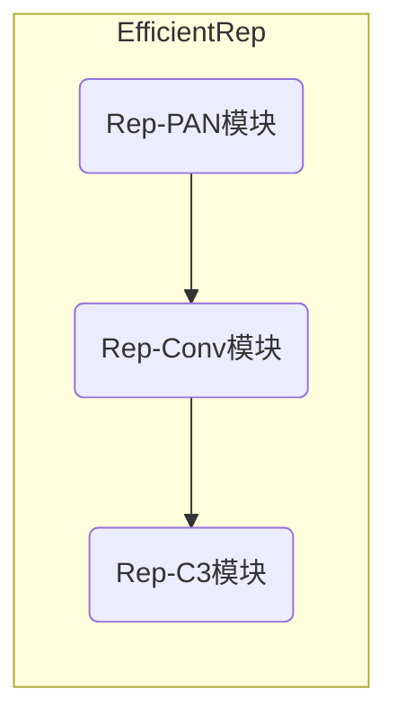

# YOLOv6原理与代码实例讲解

## 1.背景介绍

### 1.1 目标检测的重要性

在计算机视觉领域,目标检测是一项基础且极其重要的任务。它旨在从图像或视频中定位并识别感兴趣的目标。目标检测广泛应用于各个领域,如安防监控、自动驾驶、机器人视觉等。随着深度学习技术的快速发展,基于深度卷积神经网络的目标检测算法取得了长足的进步,精度和速度都有了大幅提升。

### 1.2 YOLO系列算法的发展历程

YOLO(You Only Look Once)是一种开创性的基于深度学习的目标检测算法,由Joseph Redmon等人于2016年提出。相比传统的基于区域提取的两阶段目标检测算法,YOLO将目标检测任务看作一个回归问题,直接从整张图像中预测边界框和类别概率,因此具有更高的检测速度。

YOLO系列算法经历了多个版本的迭代,包括YOLOv2、YOLOv3、YOLOv4和YOLOv5等。每个新版本都在网络结构、训练策略和预测方式等方面进行了优化,使得检测精度和速度不断提高。其中,YOLOv5是一个全新的YOLO系列实现,具有更好的推理速度和更强的鲁棒性。

### 1.3 YOLOv6的重大改进

最新发布的YOLOv6是YOLO系列算法的又一次重大升级。它在网络结构、训练策略和后处理等多个方面进行了创新,显著提升了目标检测的精度和速度。YOLOv6的主要改进包括:

1. 采用全新的网络结构EfficientRep,融合了RepVGG和EfficientNet的优点。
2. 引入自适应图像缩放策略,提高训练数据的多样性。
3. 使用更高效的编码器-解码器结构,增强特征表示能力。
4. 优化锚点分配和NMS后处理,提高小目标检测能力。
5. 采用更先进的训练技术,如EMA、CutMix等。

凭借这些创新,YOLOv6在多个公开数据集上取得了业界最佳水平的精度和速度表现,是目标检测领域的一大突破。

## 2.核心概念与联系

### 2.1 目标检测任务的形式化描述

目标检测任务可以形式化为:给定一张输入图像$I$,目标是从中找出所有感兴趣目标的边界框$B=(x,y,w,h)$和对应的类别标签$C$,其中$(x,y)$是边界框的中心坐标,$(w,h)$是边界框的宽度和高度。

目标检测算法需要学习一个映射函数$f$,将输入图像$I$映射到一组预测的边界框和类别标签$(B,C)$:

$$f(I) = \{(B_1, C_1), (B_2, C_2), ..., (B_n, C_n)\}$$

其中$n$是图像中目标的数量。这个映射函数$f$由深度神经网络来拟合和学习。

### 2.2 单阶段和两阶段目标检测

目标检测算法通常分为两大类:单阶段(One-Stage)和两阶段(Two-Stage)。

**两阶段目标检测算法**先使用区域提取网络(Region Proposal Network,RPN)生成候选边界框,然后再对每个候选框进行分类和精细化。代表算法有R-CNN、Fast R-CNN、Faster R-CNN等。这种方法精度较高,但速度较慢。

**单阶段目标检测算法**则直接从整张图像中同时预测目标边界框和类别,避免了候选框生成的过程。代表算法有YOLO、SSD等。这种方法速度更快,但精度相对较低。

YOLO系列算法属于单阶段目标检测范畴,通过端到端的网络直接预测目标边界框和类别,具有极高的检测速度。

### 2.3 YOLO检测原理概览

YOLO算法将输入图像划分为$S \times S$个网格,每个网格需要预测$B$个边界框,每个边界框除了需要预测其坐标$(x,y,w,h)$之外,还需要预测该边界框包含目标的置信度$Conf$以及$C$个条件类别概率$P(C_i|Object)$。

因此,YOLO算法的输出是一个$S \times S \times (B \times 5 + C)$的张量,包含了每个网格预测的所有边界框坐标、置信度和条件类别概率。在预测时,通过一定的解码方式和非极大值抑制(NMS)后处理,即可获得最终的目标检测结果。

YOLO算法的核心在于使用端到端的卷积神经网络直接从图像预测目标边界框和类别,避免了传统目标检测算法中复杂的候选框生成和分类过程,因此具有更高的计算效率。

## 3.核心算法原理具体操作步骤 

### 3.1 网络结构

YOLOv6采用了一种全新的网络结构EfficientRep,融合了RepVGG和EfficientNet的优点。EfficientRep主要由三个模块组成:Rep-PAN(Repvgg Parallel Attetion Network)、Rep-Conv(Repvgg Convolution)和Rep-C3(Repvgg C3 Module)。

1. **Rep-PAN模块**融合了RepVGG和PAN(Parallel Attetion Network)的优点,通过并行注意力机制增强特征表达能力。

2. **Rep-Conv模块**是一种新型的卷积模块,将传统的卷积核分解为一系列可训练的3x3和1x1卷积核的组合,减少了参数量和计算复杂度。

3. **Rep-C3模块**是YOLOv6的基础模块,由Rep-Conv、ShortCut连接和SPP(Spatial Pyramid Pooling)模块组成,用于特征融合和提取。

通过堆叠多个Rep-C3模块,YOLOv6构建了一个高效且强大的编码器-解码器结构,用于从输入图像中提取丰富的语义特征。

### 3.2 锚点分配策略

在YOLO系列算法中,锚点(Anchor)的设计对于精确预测目标边界框至关重要。YOLOv6采用了一种自适应的锚点分配策略,根据数据集中目标的形状自动生成锚点,避免了手动设置锚点的缺陷。

具体来说,YOLOv6首先计算数据集中所有目标的宽高比,然后使用K-Means聚类算法将这些宽高比划分为$N$类,每一类的中心点就作为一个锚点。这种方式可以最大程度地覆盖数据集中的目标形状,提高检测精度。

### 3.3 预测头设计

YOLOv6的预测头采用了一种新颖的解耦设计,将边界框回归和目标分类解耦为两个独立的分支。这种设计有助于提高小目标检测能力,因为小目标的边界框回归和分类往往存在一定差异。

具体来说,YOLOv6的预测头包含以下几个部分:

1. **边界框回归分支**:预测边界框的坐标$(x,y,w,h)$以及目标置信度$Conf$。

2. **目标分类分支**:预测每个边界框包含目标的条件类别概率$P(C_i|Object)$。

3. **目标存在分支**:预测每个网格中是否存在目标的概率$P(Object)$。

在解码和后处理阶段,YOLOv6会根据这些预测结果计算最终的边界框坐标、置信度和类别概率,从而获得目标检测结果。

### 3.4 自适应图像缩放

为了增强训练数据的多样性,YOLOv6采用了一种自适应图像缩放策略。在每个训练批次中,输入图像会被随机缩放到不同的尺寸,包括原始尺寸、较小尺寸和较大尺寸。这种策略可以增强模型对不同尺度目标的检测能力,提高泛化性能。

具体来说,YOLOv6定义了一个缩放范围$[s_{min}, s_{max}]$,在每个批次中随机采样一个缩放比例$s$,然后将输入图像缩放到$s \times S$的尺寸,其中$S$是网络的输入尺寸。这种自适应缩放策略可以有效地增强训练数据的多样性,提高模型的鲁棒性。

### 3.5 训练策略

为了进一步提升YOLOv6的检测精度,作者采用了多种先进的训练技术,包括:

1. **EMA(Exponential Moving Average)**:在训练过程中,使用指数移动平均的方式更新模型权重,可以提高模型的泛化能力。

2. **CutMix数据增强**:在训练时,随机将两张图像的一部分区域进行混合,可以增强模型对遮挡和occlusion的鲁棒性。

3. **DropBlock正则化**:在卷积特征图上随机丢弃一些区域,可以防止模型过拟合。

4. **焦点损失(Focal Loss)**:一种改进的交叉熵损失函数,可以有效处理正负样本不平衡问题。

5. **CIOU损失**:一种改进的边界框回归损失函数,可以更好地拟合目标边界框的形状。

通过这些训练策略的综合应用,YOLOv6在保持高速推理的同时,实现了业界领先的检测精度。

### 3.6 后处理

在获得YOLOv6网络的原始预测结果后,还需要进行一系列后处理步骤,以获得最终的目标检测输出。主要包括以下几个步骤:

1. **解码**:根据预测头的输出,解码出最终的边界框坐标、置信度和类别概率。

2. **NMS(Non-Maximum Suppression)**:对于重叠的边界框,保留置信度最高的一个,抑制其他冗余的边界框。

3. **Score Filtering**:过滤掉置信度低于阈值的检测结果。

4. **EAR(Efficient Anchor Ratio)**:一种新颖的锚点比例编码方式,可以提高小目标检测能力。

5. **NABR(Normalized Anchor Box Regression)**:一种新的边界框回归方式,可以提高边界框的精确度。

通过这些后处理步骤,YOLOv6可以从原始预测中获得高质量的最终检测结果,实现了极高的检测精度和鲁棒性。

## 4.数学模型和公式详细讲解举例说明

### 4.1 YOLO目标检测损失函数

YOLO系列算法的损失函数由三部分组成:边界框回归损失、置信度损失和分类损失。YOLOv6在此基础上进行了一些改进和优化。

#### 4.1.1 边界框回归损失

边界框回归损失用于拟合预测的边界框坐标与真实边界框之间的差异。YOLOv6采用了CIOU(Complete IoU)损失,它是IoU损失的一种改进版本,不仅考虑了两个边界框的重叠区域,还包括了它们的长宽比和中心点偏移。CIOU损失可以更好地拟合目标边界框的形状和位置。

CIOU损失的公式如下:

$$L_{bbox} = 1 - CIOU + \alpha v$$

其中,$\alpha$是一个平衡参数,用于控制边界框回归损失和置信度损失之间的权重。$v$是一个小常数,避免出现对数0的情况。

#### 4.1.2 置信度损失

置信度损失用于衡量预测的目标置信度与真实情况之间的差异。YOLOv6采用了焦点损失(Focal Loss),可以有效处理正负样本不平衡的问题。

焦点损失的公式如下:

$$L_{conf} = \begin{cases} 
-(1-p)^\gamma log(p) & \text{if object exists} \\
-(1-p)^\gamma log(1-p) & \text{otherwise}
\end{cases}$$

其中,$p$是预测的置信度,$\gamma$是一个调节因子,用于调整难易样本的权重。对于难以区分的负样本,焦点损失会给予更高的权重,从而使模型更加