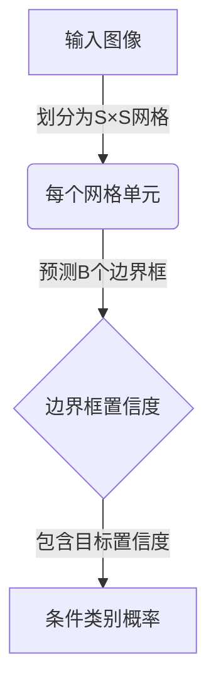

# YOLOv7原理与代码实例讲解

## 1.背景介绍

在计算机视觉领域,目标检测是一项非常重要和具有挑战性的任务。它旨在从给定的图像或视频中定位并识别出感兴趣的目标对象。目标检测技术在诸多领域都有广泛的应用,例如安防监控、自动驾驶、机器人视觉等。

传统的目标检测算法通常采用两阶段方法,首先使用区域候选算法(如选择性搜索)生成目标区域建议框,然后对每个建议框内的图像区域进行分类。这种方法虽然可以获得较高的检测精度,但由于两个串行的步骤,导致了计算效率低下的问题。

为了解决这一问题,YOLO(You Only Look Once)算法应运而生。YOLO算法将目标检测任务重新构建为一个端到端的回归问题,通过单个神经网络直接从图像像素数据预测出目标边界框的坐标和相应的类别概率,从而实现了极高的检测速度。自2015年首次提出以来,YOLO系列算法经历了多次迭代,其精度和速度都得到了极大的提升,成为目标检测领域最受欢迎的算法之一。

YOLOv7是YOLO系列算法的最新版本,于2022年4月发布。它在保留YOLO系列算法简单高效的优势的同时,通过一系列创新性的改进,使得检测精度和推理速度都达到了新的高度。本文将详细介绍YOLOv7的核心原理、算法流程、关键创新点,并结合代码示例进行讲解,希望能够帮助读者深入理解这一领先的目标检测算法。

## 2.核心概念与联系

### 2.1 YOLO系列算法核心思想

YOLO(You Only Look Once)算法的核心思想是将目标检测任务建模为一个端到端的回归问题。具体来说,YOLO算法将输入图像划分为S×S个网格单元,每个单元需要预测B个边界框以及每个边界框所含物体的置信度。置信度由两部分组成:包含目标的置信度和条件类别概率。



这种设计思路与传统的基于区域候选框生成和分类的两阶段方法不同,使得YOLO算法能够以端到端的方式高效地完成目标检测任务。

### 2.2 YOLOv7算法创新点

相较于前代YOLOv5等版本,YOLOv7在以下几个方面进行了重大创新和改进:

1. **骨干网络(Backbone)**: 采用了更强大的骨干网络EfficientRep,提升了特征提取能力。
2. **注意力机制(Attention)**: 引入了ReparamBatchNorm、SIRattn等注意力模块,增强了模型对目标的关注度。
3. **训练策略(Training Tricks)**: 采用了标签平滑(Label Smoothing)、混合精度训练(Mixed Precision Training)等训练技巧,提高了模型的泛化能力。
4. **后处理(Post-Processing)**: 使用了新的NMS(Non-Maximum Suppression)算法DIoU-NMS,提升了不同尺度目标的检测效果。
5. **模型压缩(Model Compression)**: 引入了模型剪枝(Pruning)和量化(Quantization)等压缩技术,降低了模型的计算和存储开销。

这些创新点的引入使得YOLOv7在保持YOLO系列算法简单高效的同时,检测精度和推理速度都有了显著的提升。

## 3.核心算法原理具体操作步骤

YOLOv7算法的核心原理可以概括为以下几个关键步骤:

### 3.1 图像预处理

1. 将输入图像缩放到指定尺寸(如640×640像素),以满足网络输入要求。
2. 对图像像素值进行归一化处理,使其值位于0-1之间。
3. 构建输入张量,添加必要的批次维度。

### 3.2 特征提取

1. 输入图像经过EfficientRep骨干网络的多次下采样和卷积操作,提取出不同尺度的特征图。
2. 在特征提取过程中,引入了注意力模块(如ReparamBatchNorm、SIRattn等),增强了模型对目标的关注度。

### 3.3 目标检测头

1. 将从骨干网络输出的特征图输入到YOLO检测头。
2. 检测头将特征图划分为S×S个网格单元。
3. 每个网格单元预测B个边界框,以及每个边界框所含物体的置信度和条件类别概率。

### 3.4 非极大值抑制(NMS)

1. 对检测头输出的边界框进行解码,获得其在原始图像上的实际坐标。
2. 应用新的DIoU-NMS算法,移除重叠度较高的冗余边界框。
3. 根据置信度阈值和类别概率阈值,过滤掉低置信度的检测结果。

### 3.5 后处理

1. 对最终保留的检测结果进行进一步的处理,如绘制边界框、添加类别标签等。
2. 可选地应用模型压缩技术(如剪枝、量化等),降低模型的计算和存储开销。

通过上述步骤,YOLOv7算法能够高效地从输入图像中检测并定位出感兴趣的目标对象。

## 4.数学模型和公式详细讲解举例说明

在YOLOv7算法中,涉及到了多个数学模型和公式,下面将对其中几个关键部分进行详细讲解。

### 4.1 边界框编码

YOLOv7算法需要预测每个边界框的坐标和尺寸信息。为了简化这一回归任务,YOLO系列算法采用了一种特殊的边界框编码方式。

对于每个网格单元,需要预测B个边界框。每个边界框由以下5个值编码:

$$
\begin{aligned}
t_x &= \frac{(x - x_c)}{w_c} \\
t_y &= \frac{(y - y_c)}{h_c} \\
t_w &= \log\left(\frac{w}{w_c}\right) \\
t_h &= \log\left(\frac{h}{h_c}\right) \\
t_o &= \text{objectness}
\end{aligned}
$$

其中:

- $(x, y)$是边界框的中心坐标
- $(w, h)$是边界框的宽度和高度
- $(x_c, y_c, w_c, h_c)$是网格单元的中心坐标和宽高
- $t_o$是包含目标的置信度(objectness)

通过这种编码方式,模型只需要预测5个值,就能够唯一确定每个边界框在图像中的位置和大小。在训练阶段,这些编码值将作为模型的回归目标;在推理阶段,则需要对编码值进行解码,以获得最终的边界框坐标。

### 4.2 类别概率

除了边界框坐标,YOLOv7还需要预测每个边界框所含物体的条件类别概率。假设有C个目标类别,则对于每个边界框,模型需要输出一个C维的向量,表示该边界框包含每个类别目标的概率。

在训练阶段,对于包含ground-truth目标的边界框,其对应类别的概率将被设置为1,其他类别的概率为0。而对于不包含目标的边界框,所有类别的概率都将被设置为0。

在推理阶段,将选取概率值最大的类别作为该边界框的预测类别。同时,还需要将该概率值与包含目标的置信度相乘,作为最终的置信度分数,用于后续的非极大值抑制等后处理步骤。

### 4.3 DIoU-NMS

YOLOv7算法引入了一种新的非极大值抑制(NMS)算法,称为DIoU-NMS。这是基于之前提出的DIoU(Distance-IoU)损失函数而设计的NMS变体。

DIoU损失函数不仅考虑了边界框之间的交并比(IoU),还包括了它们之间的中心点距离和长宽比的差异。具体来说,DIoU损失函数的定义如下:

$$
\text{DIoU} = \text{IoU} - \frac{\rho^2(b, b^{gt})}{c^2} - \frac{v}{c^2}
$$

其中:

- $\rho(b, b^{gt})$是边界框$b$与ground-truth边界框$b^{gt}$的中心点距离
- $c$是两个边界框的最小闭包的对角线长度
- $v$是两个边界框的长宽比的差异

在NMS过程中,DIoU-NMS算法将保留具有最大DIoU值的边界框,而抑制掉与之重叠度较高的其他边界框。相比于传统的基于IoU的NMS算法,DIoU-NMS能够更好地处理不同尺度和长宽比的目标,从而提升检测效果。

## 5.项目实践:代码实例和详细解释说明

为了帮助读者更好地理解YOLOv7算法的实现细节,下面将提供一个基于PyTorch的代码示例,并对其中的关键部分进行详细解释。

### 5.1 导入必要的库

```python
import torch
import torch.nn as nn
from utils.general import non_max_suppression
```

这里导入了PyTorch库、PyTorch的神经网络模块,以及自定义的非极大值抑制函数`non_max_suppression`。

### 5.2 定义YOLOv7模型

```python
class YOLOv7(nn.Module):
    def __init__(self, num_classes=80):
        super().__init__()
        
        # 初始化骨干网络和检测头
        self.backbone = EfficientRep()
        self.head = YOLOHead(num_classes)
        
    def forward(self, x):
        # 特征提取
        feats = self.backbone(x)
        
        # 目标检测
        outputs = self.head(feats)
        
        return outputs
```

在这个简化的示例中,`YOLOv7`模型由两个主要部分组成:骨干网络`EfficientRep`和检测头`YOLOHead`。在前向传播过程中,输入图像首先通过骨干网络提取特征,然后将提取到的特征图输入到检测头,进行目标检测。

### 5.3 YOLO检测头

```python
class YOLOHead(nn.Module):
    def __init__(self, num_classes):
        super().__init__()
        
        # 初始化检测头的卷积层
        self.conv_layers = nn.Sequential(
            # ... (省略具体层定义)
        )
        
        # 设置边界框数量和类别数
        self.num_anchors = 3
        self.num_classes = num_classes
        
    def forward(self, x):
        # 特征图通过卷积层
        outputs = self.conv_layers(x)
        
        # 解码边界框和类别概率
        bboxes, scores, classes = self.decode_outputs(outputs)
        
        return bboxes, scores, classes
    
    def decode_outputs(self, outputs):
        # 实现边界框和类别概率的解码逻辑
        # ... (省略具体实现细节)
        return bboxes, scores, classes
```

在这个示例中,`YOLOHead`模块负责从特征图中预测出边界框坐标、置信度分数和类别概率。它包含一系列卷积层,用于从特征图中提取出必要的信息。`decode_outputs`函数则实现了将模型输出解码为实际的边界框坐标、置信度分数和类别概率的逻辑。

### 5.4 非极大值抑制

```python
def non_max_suppression(bboxes, scores, classes, iou_threshold=0.5):
    # 对输入的边界框、置信度分数和类别进行非极大值抑制
    # 使用DIoU-NMS算法
    
    keep_bboxes = []
    keep_scores = []
    keep_classes = []
    
    for cls in range(num_classes):
        # 获取当前类别的边界框和置信度分数
        cls_bboxes = bboxes[classes == cls]
        cls_scores = scores[classes == cls]
        
        # 对当前类别应用NMS
        nms_indices = non_max_suppression(cls_bboxes, cls_scores, iou_threshold)
        
        # 保留通过NMS的边界框和置信度分数
        keep_bboxes.extend(cls_bboxes[nms_indices])