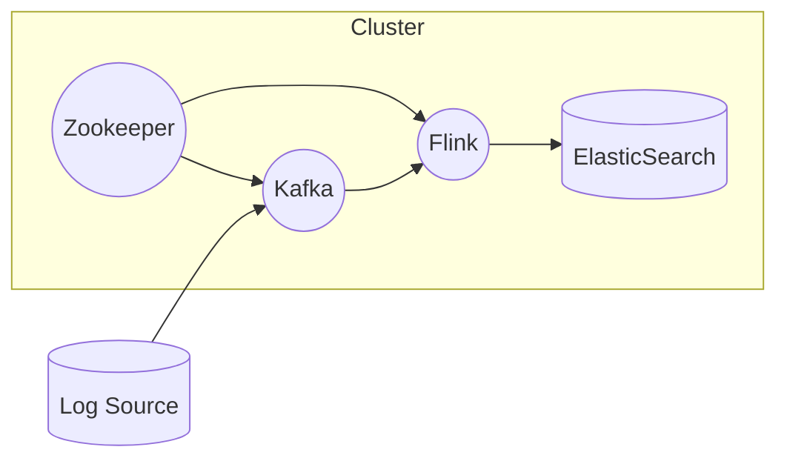

# Zookeeper与分布式数据流处理的实现与应用

## 1.背景介绍

在当今快速发展的数字时代,随着大数据、物联网、人工智能等新兴技术的兴起,海量数据的实时处理和分析成为了一个迫切的需求。传统的数据处理系统已经无法满足这种需求,因此分布式数据流处理应运而生。分布式数据流处理系统能够实时处理大规模数据流,具有高吞吐量、低延迟、容错性强等优点,广泛应用于金融风控、网络监控、物联网数据处理等领域。

Apache Zookeeper作为一个分布式协调服务,在分布式数据流处理系统中扮演着关键角色。它提供了一种高效、可靠的分布式协调机制,可以有效管理分布式应用程序中的数据,并为分布式系统提供同步、集群管理、配置管理等功能。通过与Zookeeper的紧密集成,分布式数据流处理系统可以更加高效、可靠地运行。

## 2.核心概念与联系

### 2.1 Zookeeper核心概念

Zookeeper是一个开源的分布式协调服务,它主要用于维护配置信息、命名、提供分布式同步和提供组服务。Zookeeper的核心概念包括:

1. **数据模型**:Zookeeper采用层次化的目录树结构,类似于文件系统,每个节点都可以存储数据和子节点。

2. **会话(Session)**:客户端与Zookeeper服务器之间的TCP长连接称为会话。

3. **版本(Version)**:每个ZNode都有一个版本号,用于实现乐观锁和有序性。

4. **Watcher(事件监听器)**:客户端可以在指定节点注册Watcher,当节点数据发生变化时,Zookeeper会通知客户端。

5. **ACL(访问控制列表)**:用于对节点的读写权限进行控制。

### 2.2 分布式数据流处理核心概念

分布式数据流处理系统通常包含以下核心概念:

1. **数据流(Data Stream)**:连续不断的数据序列,可以是来自各种数据源的消息或事件。

2. **数据源(Source)**:产生数据流的起点,如消息队列、日志文件等。

3. **数据处理(Processing)**:对数据流进行各种转换和计算操作。

4. **数据接收器(Sink)**:最终接收处理后的数据流,如数据库、文件系统等。

5. **窗口(Window)**:将无限数据流划分为有限大小的数据块进行处理。

6. **状态(State)**:处理过程中需要维护的中间状态信息。

7. **容错(Fault Tolerance)**:系统能够自动从故障中恢复。

### 2.3 Zookeeper与分布式数据流处理的联系

Zookeeper在分布式数据流处理系统中发挥着至关重要的作用:

1. **元数据管理**:Zookeeper可以存储和管理分布式数据流处理系统的元数据,如作业配置、数据源信息等。

2. **集群协调**:Zookeeper可以协调分布式数据流处理系统中的多个节点,实现负载均衡、故障转移等功能。

3. **状态管理**:Zookeeper可以存储和管理分布式数据流处理系统中的状态信息,以实现精确一次处理和容错恢复。

4. **分布式锁**:Zookeeper提供了分布式锁机制,可以确保分布式数据流处理系统中的并发操作的正确性。

5. **发布/订阅**:Zookeeper可以实现发布/订阅模式,方便分布式数据流处理系统中的组件进行通信和协作。

## 3.核心算法原理具体操作步骤

### 3.1 Zookeeper核心算法原理

Zookeeper的核心算法是**Zab原子广播协议**,它是一种支持崩溃恢复的原子消息广播协议。Zab协议的主要目标是将客户端的写请求以事务的形式原子广播到整个集群,并保证所有非崩溃的服务器节点对这些事务最终达成一致。

Zab协议的具体操作步骤如下:

1. **Leader选举**:集群启动时,各个服务器节点通过投票选举出一个Leader节点。

2. **事务请求**:客户端将事务请求发送给Leader节点。

3. **消息广播**:Leader节点将事务请求广播给所有Follower节点。

4. **消息确认**:Follower节点接收到事务请求后,向Leader节点发送ACK确认消息。

5. **事务提交**:当Leader节点收到超过半数Follower节点的ACK确认消息后,就可以将事务提交到磁盘上的事务日志中。

6. **数据同步**:Leader节点将事务的提交结果发送给所有Follower节点,Follower节点将事务应用到内存数据库中。

7. **崩溃恢复**:如果Leader节点崩溃,集群将重新进行Leader选举。新的Leader节点将从事务日志中恢复数据,并继续处理新的事务请求。

### 3.2 分布式数据流处理核心算法原理

分布式数据流处理系统的核心算法主要包括以下几个方面:

1. **数据分区**:将数据流划分为多个分区,每个分区由一个或多个任务处理。常用的分区策略包括键值分区、轮询分区等。

2. **数据缓冲**:由于数据流的速率不均匀,需要使用缓冲区对数据流进行缓冲,平滑数据流的波动。

3. **窗口计算**:对数据流进行窗口划分,在有限的窗口内进行计算和聚合操作。常用的窗口类型包括滚动窗口、滑动窗口、会话窗口等。

4. **状态管理**:由于数据流处理是有状态的,需要维护中间计算结果的状态信息,以实现精确一次处理。常用的状态管理方式包括内存状态、磁盘状态等。

5. **容错恢复**:分布式数据流处理系统需要具备容错能力,能够自动从故障中恢复。常用的容错恢复机制包括检查点(Checkpoint)、重放(Replay)等。

6. **负载均衡**:将数据流任务合理分配到多个节点上,实现负载均衡和资源利用最大化。常用的负载均衡策略包括基于数据分区的负载均衡、基于资源利用率的负载均衡等。

## 4.数学模型和公式详细讲解举例说明

在分布式数据流处理系统中,通常需要使用一些数学模型和公式来描述和计算各种指标,以下是一些常见的数学模型和公式:

### 4.1 数据流模型

数据流可以看作是一个无限序列,用数学表示如下:

$$
S = \{s_1, s_2, s_3, \ldots, s_n, \ldots\}
$$

其中,$s_i$表示第$i$个数据元素。

### 4.2 窗口模型

窗口是对数据流进行分块处理的一种方式,常见的窗口类型包括:

1. **滚动窗口(Tumbling Window)**:固定大小的非重叠窗口,用数学表示如下:

$$
W_i = \{s_k | (i-1) \times w < k \leq i \times w\}
$$

其中,$W_i$表示第$i$个窗口,$w$表示窗口大小。

2. **滑动窗口(Sliding Window)**:固定大小的重叠窗口,用数学表示如下:

$$
W_i = \{s_k | (i-1) \times s < k \leq i \times s + w - 1\}
$$

其中,$W_i$表示第$i$个窗口,$w$表示窗口大小,$s$表示滑动步长。

3. **会话窗口(Session Window)**:根据数据元素之间的时间间隔动态划分窗口。

### 4.3 状态管理模型

由于数据流处理是有状态的,需要维护中间计算结果的状态信息。常见的状态管理模型包括:

1. **键控状态(Keyed State)**:将状态与键(Key)关联,用数学表示如下:

$$
state(k) = f(s_1, s_2, \ldots, s_n)
$$

其中,$state(k)$表示与键$k$关联的状态,$f$表示状态更新函数。

2. **操作符状态(Operator State)**:将状态与整个操作符关联,用数学表示如下:

$$
state = f(s_1, s_2, \ldots, s_n)
$$

其中,$state$表示操作符的状态,$f$表示状态更新函数。

### 4.4 负载均衡模型

负载均衡是分布式数据流处理系统中的一个重要问题,常见的负载均衡模型包括:

1. **基于数据分区的负载均衡**:将数据流划分为多个分区,每个分区由一个或多个任务处理。假设有$n$个分区,$m$个节点,则每个节点需要处理$\frac{n}{m}$个分区。

2. **基于资源利用率的负载均衡**:根据每个节点的资源利用率(CPU、内存等)动态调整任务分配。假设节点$i$的资源利用率为$u_i$,则节点$i$应该分配的任务数量与$\frac{1}{u_i}$成反比。

### 4.5 容错恢复模型

容错恢复是分布式数据流处理系统中的另一个重要问题,常见的容错恢复模型包括:

1. **检查点(Checkpoint)**:定期将状态信息持久化到外部存储系统,用于故障恢复。假设检查点间隔为$T$,故障发生时需要重放$T$时间内的数据流。

2. **重放(Replay)**:从上一个检查点或源头重新读取数据流,重新计算状态。假设重放速率为$r$,重放时间为$t$,则需要重放$r \times t$条数据。

通过合理设计和应用这些数学模型和公式,可以更好地描述和优化分布式数据流处理系统的各个方面。

## 5.项目实践:代码实例和详细解释说明

为了更好地理解Zookeeper与分布式数据流处理的实现,我们将通过一个实际的项目实践来进行讲解。这个项目是一个基于Apache Kafka和Apache Flink的实时日志分析系统,它能够实时处理日志数据流,并将分析结果存储到ElasticSearch中进行可视化展示。

在这个项目中,我们将使用Zookeeper来管理Kafka集群和Flink集群的元数据,并利用Zookeeper的分布式协调功能来实现容错和高可用。

### 5.1 项目架构

该项目的整体架构如下所示:



1. **Log Source**:日志数据源,可以是Web服务器、应用程序等。
2. **Kafka**:用于接收和缓冲日志数据流,由Zookeeper管理元数据。
3. **Flink**:实时处理日志数据流,由Zookeeper管理作业元数据和状态。
4. **ElasticSearch**:存储日志分析结果,用于可视化展示。
5. **Zookeeper**:管理Kafka和Flink的元数据,提供分布式协调服务。

### 5.2 Zookeeper配置

首先,我们需要配置Zookeeper集群。以下是一个简单的`zoo.cfg`配置文件示例:

```
# Zookeeper数据目录
dataDir=/path/to/zookeeper/data

# Zookeeper服务器ID
server.1=localhost:2888:3888

# 初始化myid文件
initLimit=5
syncLimit=2
```

在`dataDir`目录下,需要创建一个`myid`文件,内容为服务器ID,如`1`。

### 5.3 Kafka配置

接下来,我们需要配置Kafka集群,并将其与Zookeeper集成。以下是一个简单的`server.properties`配置文件示例:

```
# Kafka broker ID
broker.id=0

# Zookeeper连接字符串
zookeeper.connect=localhost:2181

# 日志目录
log.dirs=/path/to/kafka/logs

# 开启自动主题创建
auto.create.topics.enable=true
```

### 5.4 Flink配置

然后,我们需要配置Flink