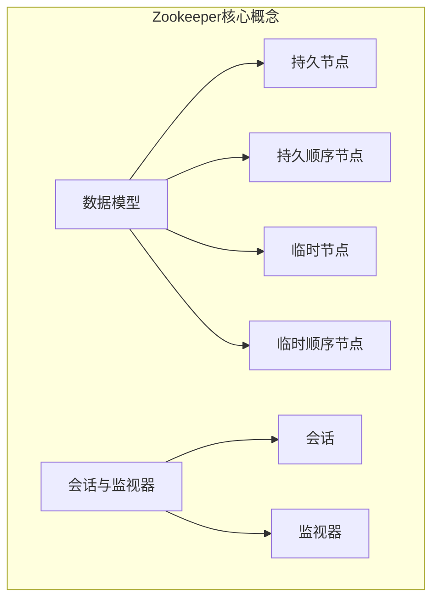
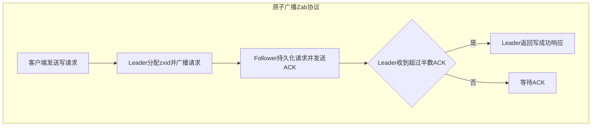

# Zookeeper与分布式系统原理与应用

## 1.背景介绍

在当今快速发展的数字时代,分布式系统已经成为了支撑大型网站、云计算和大数据应用的关键基础架构。随着业务系统的复杂性和规模不断扩大,确保分布式环境中的可靠性、一致性和高可用性变得至关重要。这就引入了Zookeeper这一分布式协调服务,它为分布式应用提供了一种集中式的服务,用于维护配置信息、命名、提供分布式同步和提供组服务等。

Zookeeper最初是Apache Hadoop项目的一个子项目,旨在解决Hadoop集群中的协调问题。随着时间的推移,它已经发展成为一个通用的分布式协调框架,被广泛应用于许多其他分布式系统中,如Apache HBase、Apache Kafka、Dubbo等。Zookeeper的设计理念是简单、健壮、高性能,能够为分布式应用提供高可用性和严格的顺序访问控制。

## 2.核心概念与联系

### 2.1 数据模型

Zookeeper使用一种树形的层次化命名空间来组织数据,类似于文件系统。每个节点都被称为znode,可以存储数据和元数据。每个znode都有一个唯一的路径标识,例如/app1/host1。

Znode分为以下几种类型:

- 持久节点(PERSISTENT)
- 持久顺序节点(PERSISTENT_SEQUENTIAL)
- 临时节点(EPHEMERAL)
- 临时顺序节点(EPHEMERAL_SEQUENTIAL)

持久节点在创建后会一直存在,直到被删除。临时节点在客户端会话结束时会自动删除。顺序节点在创建时会自动附加一个递增的序号。

### 2.2 会话与监视器

客户端需要先与Zookeeper服务器建立会话,然后才能进行读写操作。会话具有超时时间,如果在指定时间内客户端与服务器之间没有任何通信,会话就会过期。

Zookeeper支持监视器(Watcher)机制,客户端可以在指定的znode上设置监视器,一旦znode发生变化(数据变更、删除等),监视器就会被触发并通知客户端。这种机制使得分布式应用能够及时响应数据的变化。



## 3.核心算法原理具体操作步骤

### 3.1 原子广播(Zab协议)

Zookeeper使用原子广播(Zab)协议来确保分布式系统中的数据一致性。Zab协议基于主备模式,由一个主节点(Leader)和多个备节点(Follower)组成。所有写请求都需要先发送给Leader,Leader再将写请求广播给所有Follower。只有当超过半数的Follower节点接收并持久化了该写请求,Leader才会向客户端返回成功响应。

Zab协议的核心步骤如下:

1. **领导者选举(Leader Election)**:当集群启动或者Leader节点出现故障时,剩余的Follower节点会进行新一轮的Leader选举,选举算法基于zxid(事务id)。

2. **原子广播(Atomic Broadcast)**:
   - 客户端将写请求发送给Leader
   - Leader为请求分配一个新的zxid,并将请求广播给所有Follower
   - Follower接收请求并持久化,向Leader发送ACK响应
   - 当Leader收到超过半数Follower的ACK响应后,就会向客户端返回写成功的响应

3. **崩溃恢复(Crash Recovery)**:当Follower节点重启后,会从Leader节点同步数据,使自身状态与Leader保持一致。



### 3.2 快照和日志

为了提高性能并减少数据同步的开销,Zookeeper会定期将内存中的数据快照写入磁盘,并在内存中维护一个增量日志文件。

当服务器重启时,会先从磁盘加载最新的快照,然后从日志文件中重放增量更新,以恢复内存中的最新数据状态。这种设计可以避免在每次写操作时都需要将整个数据集持久化到磁盘,从而提高了性能。

## 4.数学模型和公式详细讲解举例说明

### 4.1 Zab协议的一致性证明

Zab协议的一致性可以通过以下定理和证明来保证:

**定理**: 如果一个服务器从领导者处收到一个值 v 与 zxid,那么 v 就是被赋予该 zxid 的值。

**证明**:由反证法。假设存在一个不同的值 v' 与相同的 zxid 被广播给了另一个服务器。这意味着两个不同的值具有相同的 zxid,这与原子广播的定义相矛盾。因此,该假设不成立,定理得证。

**推论**:如果一个服务器为 zxid 持久化了一个值 v,那么所有其他服务器为该 zxid 持久化的值也必须是 v。

这个推论保证了在给定的 zxid 下,所有服务器最终都会持久化相同的值,从而实现了数据的一致性。

### 4.2 Leader选举算法

Zookeeper使用一种基于zxid的Leader选举算法。每个服务器在启动时会从持久化存储中读取最后处理的zxid,称为 ZXID。集群中的ZXID最大的服务器将被选举为新的Leader。

如果有多个服务器具有相同的ZXID,则会比较服务器的编号(myid),编号较大的服务器会被选举为Leader。

Leader选举过程可以用以下伪代码表示:

```
def elect_leader(servers):
    highest_zxid = 0
    leader = None
    
    for server in servers:
        zxid, server_id = server.get_zxid_and_id()
        if zxid > highest_zxid:
            highest_zxid = zxid
            leader = server
        elif zxid == highest_zxid:
            if server_id > leader.server_id:
                leader = server
    
    return leader
```

通过这种算法,Zookeeper可以在Leader节点出现故障时快速选举出一个新的Leader,从而确保整个系统的可用性和一致性。

## 5.项目实践:代码实例和详细解释说明

本节将通过一个简单的Java示例来演示如何使用Zookeeper客户端API进行基本的读写操作。

### 5.1 创建Zookeeper实例

首先,我们需要创建一个ZooKeeper实例,并连接到Zookeeper集群:

```java
// 连接字符串,可以是单个主机或多个主机列表
String connectionString = "127.0.0.1:2181";

// 会话超时时间,单位为毫秒
int sessionTimeout = 3000;

// 创建Zookeeper实例
ZooKeeper zk = new ZooKeeper(connectionString, sessionTimeout, new Watcher() {
    @Override
    public void process(WatchedEvent event) {
        // 监视器回调函数
    }
});
```

### 5.2 创建Znode

创建一个新的znode:

```java
// 创建一个持久节点
zk.create("/myapp", "Hello World".getBytes(), ZooDefs.Ids.OPEN_ACL_UNSAFE, CreateMode.PERSISTENT);

// 创建一个临时顺序节点
String path = zk.create("/myapp/instance", "Instance data".getBytes(), ZooDefs.Ids.OPEN_ACL_UNSAFE, CreateMode.EPHEMERAL_SEQUENTIAL);
```

### 5.3 读取Znode数据

读取znode的数据和元数据:

```java
// 读取节点数据
byte[] data = zk.getData("/myapp", false, null);
String dataString = new String(data);

// 读取节点元数据
Stat stat = zk.exists("/myapp", false);
```

### 5.4 监视器示例

设置一个监视器,监视znode的数据变化:

```java
// 设置监视器
zk.getData("/myapp", new Watcher() {
    @Override
    public void process(WatchedEvent event) {
        if (event.getType() == Event.EventType.NodeDataChanged) {
            // 节点数据发生变化
        }
    }
}, null);
```

### 5.5 更新和删除Znode

更新znode的数据:

```java
// 更新节点数据
Stat stat = zk.setData("/myapp", "Updated data".getBytes(), -1);
```

删除znode:

```java
// 删除节点
zk.delete("/myapp/instance", -1);
```

通过这些示例,你可以了解到如何使用Zookeeper Java客户端API执行基本的创建、读取、更新和删除操作,以及如何设置监视器来监视znode的变化。

## 6.实际应用场景

Zookeeper作为一种通用的分布式协调服务,在许多分布式系统中发挥着重要作用。以下是一些典型的应用场景:

### 6.1 配置管理

在分布式系统中,通常需要将配置信息同步到多个节点。Zookeeper可以作为一个高可用的配置中心,将配置数据存储在znode中,并通过监视器机制实时通知客户端配置的变化。

### 6.2 命名服务

Zookeeper可以为分布式系统提供命名服务,类似于DNS。每个节点可以在Zookeeper中注册自己的地址和元数据,其他节点可以通过路径查找并获取这些信息。这在构建服务发现和负载均衡系统时非常有用。

### 6.3 分布式锁

Zookeeper可以实现分布式锁的功能,确保在分布式环境中对共享资源的访问是互斥的。通过在znode上创建临时顺序节点,可以实现类似于队列的锁机制,从而避免死锁和饥饿问题。

### 6.4 集群管理

在Hadoop、Kafka等大数据框架中,Zookeeper被广泛用于集群的管理和协调。它可以监视节点的状态变化,选举主节点,并将元数据同步到整个集群。

### 6.5 消息系统

Zookeeper也可以用于构建可靠的消息系统。生产者可以将消息写入znode,消费者可以通过监视znode来获取新的消息。Zookeeper的顺序一致性特性可以确保消息的有序性。

## 7.工具和资源推荐

### 7.1 Zookeeper管理工具

- **ZooInspector**: 一款开源的Zookeeper客户端工具,提供了友好的GUI界面,可以方便地浏览和编辑znode数据。
- **ZooKeeper Web UI**: Zookeeper官方提供的基于Web的管理界面,可以直接部署在Zookeeper集群中。
- **Apache Curator**: Apache提供的Zookeeper客户端框架,提供了高级API和实用工具,简化了Zookeeper的使用。

### 7.2 学习资源

- **Zookeeper官方文档**: Zookeeper项目的官方文档,包含了详细的概念介绍、配置指南和API参考。
- **Zookeeper: Distributed Process Coordination**: Zookeeper的经典参考书籍,由Zookeeper的创始人之一撰写,深入探讨了Zookeeper的设计原理和实现细节。
- **Apache Curator官方文档**: Apache Curator框架的官方文档,提供了丰富的示例和最佳实践。

## 8.总结:未来发展趋势与挑战

Zookeeper作为一种成熟的分布式协调服务,在未来仍将扮演着重要的角色。然而,它也面临着一些挑战和发展趋势:

### 8.1 可扩展性

随着分布式系统规模的不断扩大,Zookeeper的可扩展性也受到了挑战。目前,Zookeeper集群的规模通常被限制在几十个节点以内,因为它采用了全序广播的协议。未来可能需要探索更高效的协议和架构,以支持更大规模的集群。

### 8.2 云原生支持

随着云计算和容器技术的兴起,分布式系统越来越倾向于采用云原生的架构。Zookeeper需要更好地与Kubernetes、Docker等技术集成,以适应这一趋势。

### 8.3 安全性和