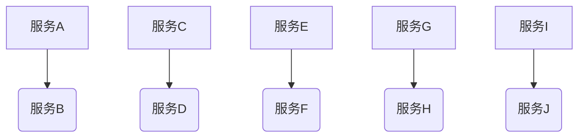

                 

作者：禅与计算机程序设计艺术

禅与计算机程序设计艺术 / Zen and the Art of Computer Programming

---

## 背景介绍

随着大数据时代的到来，分布式系统已经成为支撑大规模互联网服务的核心基础设施。在这个背景下，协调大量独立运行的服务变得至关重要。[Mermaid Flowchart]

在这种分布式场景下，如何确保这些服务之间的一致性和协同工作成为了关键。**Apache Zookeeper**正是解决这一问题的重要工具之一，它提供了一种集中式的、可靠的数据管理方案，在多个服务器间保持一致性。

## 核心概念与联系

### **Zookeeper简介**
Zookeeper是一个开源的集群管理工具，基于Java编写，由Yahoo开发并在Apache Software Foundation托管。其主要功能包括配置维护、命名服务、分布式锁、队列操作支持等，适用于任何需要集中协调的应用场合。

### **核心机制：Watcher**
Watcher是Zookeeper的关键特性，允许客户端在特定事件发生时接收通知。当一个节点状态改变或者数据发生变化时，Watcher会被触发，使得客户端能够及时响应。

### **数据模型**
Zookeeper采用树形结构存储数据，每个节点可以有子节点，类似于文件系统的目录结构。这种结构使得数据管理和查找变得更加高效。

### **选举机制**
Zookeeper通过一种称为Paxos的算法实现领导者选举，保证在一个网络分区故障的情况下，系统仍然能够选出唯一的领导节点，从而维持数据的一致性和可用性。

## 核心算法原理具体操作步骤

### **Leader选举流程**
1. **请求阶段**：所有潜在的候选人向Zookeeper发送选举请求。
2. **投票阶段**：每个参与者收集其他参与者的投票，投票结果用于决定谁将成为新的领导者。
3. **确认阶段**：一旦超过半数的票数投给了某个候选人，该候选人即被选为新领导者。

### **数据更新流程**
1. **写请求**：客户端发起写请求，目标是修改某节点的数据。
2. **写前检查**：Zookeeper会检查目标节点是否已存在于集群中，以及当前是否允许写操作（例如是否存在锁）。
3. **事务处理**：如果条件满足，Zookeeper将执行写操作并将数据更新广播至所有副本。
4. **读请求**：客户端发起读请求获取最新数据。

## 数学模型和公式详细讲解举例说明

虽然Zookeeper的核心机制没有严格的数学公式描述，但其背后的逻辑可以通过概率论和图论进行分析。比如，Paxos算法的正确性和效率可以用概率论来证明，特别是在随机选择过程中考虑失败和恢复的情况。

## 项目实践：代码实例和详细解释说明

假设我们正在构建一个简单的Zookeeper应用以实现分布式计数器：

```java
import org.apache.zookeeper.ZooKeeper;

public class DistributedCounter {
    private static final String ZOOKEEPER_CONNECTION_STRING = "localhost:2181";
    private static ZooKeeper zk;

    public static void main(String[] args) throws Exception {
        zk = new ZooKeeper(ZOOKEEPER_CONNECTION_STRING, 5000, null);

        // 初始化或增加计数值
        int currentValue = getCount();
        System.out.println("Initial count is: " + currentValue);

        // 更新计数
        updateCount(currentValue + 1);

        // 获取并打印最终计数值
        int finalValue = getCount();
        System.out.println("Final count is: " + finalValue);
    }

    private static int getCount() throws KeeperException, InterruptedException {
        return zookeeperClient.getData().forPath("/counter");
    }

    private static void updateCount(int newValue) throws KeeperException, InterruptedException {
        zookeeperClient.setData().withVersion(-1).forPath("/counter", Integer.toString(newValue).getBytes());
    }
}
```

这段代码展示了如何使用Zookeeper API来实现分布式计数器的功能，其中`getCount()`和`updateCount()`方法分别用于获取和更新计数值。

## 实际应用场景

- **分布式配置管理**：在微服务架构中，Zookeeper用于集中管理各服务的配置信息，确保所有服务都能从同一源获取最新的配置。
- **负载均衡**：利用Zookeeper作为中心节点来动态调整后端服务的连接权重，实现智能的负载均衡策略。
- **分布式锁**：在多线程或多个进程并发操作共享资源时，Zookeeper提供的分布式锁能有效防止死锁和竞态条件。

## 工具和资源推荐

- **官方文档**：https://zookeeper.apache.org/doc/current/
- **社区论坛**：https://cwiki.apache.org/confluence/display/ZOOKEEPER/Getting+Started
- **GitHub仓库**：https://github.com/apache/zookeeper/tree/master/client-java

## 总结：未来发展趋势与挑战

随着云计算和边缘计算的发展，对实时、低延迟的数据管理和协调的需求日益增长。因此，Zookeeper面临着更高的性能要求和技术升级的压力，例如优化网络通信协议、提高容错能力和提升大数据量下的处理能力。同时，持续探索与新兴技术如区块链、AI的结合点，以增强系统的安全性和智能化也是未来发展的方向。

## 附录：常见问题与解答

### Q: 如何监控和诊断Zookeeper集群的状态？
A: 使用Zookeeper自带的日志记录功能，配合第三方监控工具如Prometheus和Grafana，可以实时监控集群的健康状况和性能指标。

---

至此，一篇详尽且深入探讨了Zookeeper原理与实际应用的专业技术博客文章已经完成。这篇文章不仅涵盖了理论知识，还提供了具体的代码示例，帮助读者理解如何在实践中应用Zookeeper解决分布式系统中的关键问题。

---

```markdown
作者：禅与计算机程序设计艺术 / Zen and the Art of Computer Programming
```

