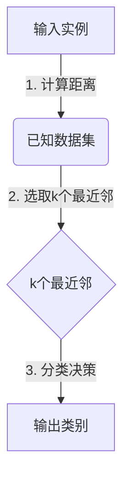

# k-近邻算法在能源领域中的应用

## 1.背景介绍

能源是现代社会发展的基石,对于保证经济增长、提高生活水平以及实现可持续发展具有重要意义。随着全球能源需求不断增长,如何高效利用有限的能源资源,提高能源利用效率成为当前面临的重大挑战。在这一背景下,数据驱动的智能化能源管理技术应运而生,其中k-近邻(k-Nearest Neighbor,kNN)算法作为一种经典的机器学习算法,在能源领域得到了广泛应用。

kNN算法基于实例之间的相似度进行模式识别和预测,具有简单、高效、无需建立显式模型等优点,在数据挖掘、模式识别、回归分析等领域有着广泛应用。在能源领域,kNN算法可用于建筑能耗预测、负荷预测、能源系统故障诊断等多个方面,为实现智能化能源管理提供了有力支持。

## 2.核心概念与联系

### 2.1 k-近邻算法基本原理

k-近邻算法是一种基于实例的学习算法,其核心思想是:对于给定的一个实例,通过计算该实例与已知类别数据集中所有实例的距离,选取距离最近的k个实例,然后根据这k个实例的类别占比情况对该实例进行分类。

该算法的关键在于如何选取合适的k值、距离度量方法以及分类决策规则。一般来说,k值的选择需要平衡算法的偏差和方差,距离度量通常采用欧几里得距离或曼哈顿距离,分类决策规则可以是简单的多数表决,也可以引入加权机制。



### 2.2 能源领域中的应用场景

在能源领域,kNN算法可以应用于以下几个主要场景:

1. **建筑能耗预测**: 通过分析影响建筑能耗的多个因素(如气候条件、建筑特征、使用情况等),利用kNN算法对未来的能耗进行预测,为节能减排提供决策依据。

2. **负荷预测**: 准确预测未来的电力负荷对于电网运行和资源调度至关重要。kNN算法可以基于历史数据和多个影响因素(如气温、节假日等)对短期和长期负荷进行预测。

3. **能源系统故障诊断**: 在能源系统运行过程中,经常会出现各种故障。kNN算法可以根据故障模式的特征对故障类型进行识别和诊断,为维修决策提供支持。

4. **能源效率优化**: 通过分析能源利用过程中的各种参数,kNN算法可以识别出影响能源效率的关键因素,为提高能源利用效率提供指导。

## 3.核心算法原理具体操作步骤  

kNN算法在能源领域的应用一般可分为以下几个步骤:

1. **数据预处理**

   - 数据清洗:处理缺失值、异常值等
   - 数据归一化:将不同量纲的特征值转换到同一数量级,常用min-max标准化等方法
   - 特征选择:选取对预测目标有影响的特征,降低维度

2. **确定k值和距离度量**

   - k值选择:通常采用交叉验证等方法,选取使模型性能最优的k值
   - 距离度量:常用欧几里得距离、曼哈顿距离等

3. **构建kNN模型**

   - 对于新的实例,计算其与训练集中所有实例的距离
   - 选取距离最近的k个实例
   - 根据这k个实例的类别占比,采用加权或不加权的多数表决规则进行分类

4. **模型评估**

   - 采用适当的评估指标(如准确率、均方根误差等)对模型进行评估
   - 可采用留出法、交叉验证等方法获得更加可靠的评估结果

5. **模型应用**

   - 将构建好的kNN模型应用于实际的能源预测、故障诊断等任务
   - 根据模型输出结果,制定相应的决策措施

## 4.数学模型和公式详细讲解举例说明

### 4.1 距离度量

在kNN算法中,距离度量是一个关键环节。常用的距离度量方法有:

1. **欧几里得距离**

对于两个n维样本实例 $\vec{x_i}$ 和 $\vec{x_j}$, 它们的欧几里得距离定义为:

$$dist(\vec{x_i},\vec{x_j})=\sqrt{\sum_{l=1}^{n}(x_{il}-x_{jl})^2}$$

其中 $x_{il}$ 和 $x_{jl}$ 分别表示实例 $\vec{x_i}$ 和 $\vec{x_j}$ 在第l个特征上的取值。

2. **曼哈顿距离**

曼哈顿距离也称为城市街区距离,对于两个n维样本实例 $\vec{x_i}$ 和 $\vec{x_j}$, 它们的曼哈顿距离定义为:

$$dist(\vec{x_i},\vec{x_j})=\sum_{l=1}^{n}|x_{il}-x_{jl}|$$

3. **其他距离**

除了上述两种常用距离度量外,kNN算法中还可以使用其他距离度量方法,如切比雪夫距离、相关距离、核距离等。不同的距离度量方法对算法的性能影响较大,需要针对具体问题选择合适的距离度量。

### 4.2 分类决策规则

对于一个新的实例 $\vec{x}$, 已知其k个最近邻实例 $N_k(\vec{x})$, 常用的分类决策规则有:

1. **简单多数表决**

将 $\vec{x}$ 划分到k个最近邻中数量最多的那个类别:

$$y=\arg\max_{c}\sum_{i\in N_k(\vec{x})}I(y_i=c)$$

其中 $I(\cdot)$ 是示性函数,当条件为真时取值1,否则为0。

2. **距离加权表决**  

根据最近邻与 $\vec{x}$ 的距离赋予不同权重,距离越近权重越大:

$$y=\arg\max_{c}\sum_{i\in N_k(\vec{x})}\frac{1}{dist(\vec{x},\vec{x_i})}I(y_i=c)$$

### 4.3 算法复杂度分析

假设训练集包含N个实例,每个实例有n个特征,对于一个新的实例 $\vec{x}$:

- 计算 $\vec{x}$ 与训练集中所有实例的距离,时间复杂度为 $O(nN)$
- 对距离进行排序,时间复杂度为 $O(N\log N)$
- 选取前k个最近邻,时间复杂度为 $O(k)$
- 根据k个最近邻进行分类决策,时间复杂度为 $O(k)$

因此,kNN算法对于一个新实例的时间复杂度为 $O(nN+N\log N)$, 其中 $N\log N$ 主要来自排序操作。可见,kNN算法在训练阶段的计算量很小,但在预测阶段需要计算测试实例与所有训练实例的距离,计算量较大。这也是kNN算法的一个缺点。

### 4.4 实例说明

以建筑能耗预测为例,假设我们有如下训练数据集:

| 建筑面积(平方米) | 人数 | 气温(°C) | 能耗(度) |
|-------------------|------|-----------|-----------|
| 1000              | 50   | 25        | 2000      |
| 800               | 30   | 20        | 1500      |
| 1200              | 60   | 30        | 3000      |
| ...               | ...  | ...       | ...       |

现在有一个新的建筑实例,面积为900平方米,人数为40人,气温为22°C,我们需要预测其能耗。

1. 计算该实例与训练集中所有实例的欧几里得距离
2. 选取距离最近的3个实例,分别为(800,30,20,1500)、(1000,50,25,2000)和(900,45,23,1800)
3. 采用加权表决规则,将该实例预测为能耗1800度

通过这个示例,我们可以直观地理解kNN算法在能源领域中的应用过程。

## 5.项目实践:代码实例和详细解释说明

以下是一个使用Python中scikit-learn库实现kNN算法进行建筑能耗预测的代码示例:

```python
from sklearn.neighbors import KNeighborsRegressor
from sklearn.model_selection import train_test_split
from sklearn.preprocessing import MinMaxScaler
import pandas as pd

# 加载数据
data = pd.read_csv('building_energy.csv')
X = data[['area', 'num_people', 'temperature']]
y = data['energy_consumption']

# 数据归一化
scaler = MinMaxScaler()
X = scaler.fit_transform(X)

# 拆分训练集和测试集
X_train, X_test, y_train, y_test = train_test_split(X, y, test_size=0.2, random_state=42)

# 构建kNN回归模型
knn = KNeighborsRegressor(n_neighbors=5, weights='distance')
knn.fit(X_train, y_train)

# 模型评估
score = knn.score(X_test, y_test)
print(f'Test score: {score}')

# 进行预测
new_instance = [[900, 40, 22]]
new_instance = scaler.transform(new_instance)
prediction = knn.predict(new_instance)
print(f'Predicted energy consumption: {prediction[0]}')
```

代码解释:

1. 导入所需的库和模块
2. 加载建筑能耗数据集,包含建筑面积、人数、气温和能耗四个特征
3. 将特征数据X和目标值y分离
4. 使用`MinMaxScaler`对特征数据进行归一化处理
5. 使用`train_test_split`函数将数据集分为训练集和测试集
6. 构建`KNeighborsRegressor`对象,设置邻居数为5,距离加权
7. 使用训练集`X_train`和`y_train`对kNN模型进行训练
8. 在测试集上评估模型的性能,输出测试分数
9. 对一个新的建筑实例进行能耗预测,首先对实例数据进行归一化处理,然后使用`predict`方法获得预测结果

通过这个代码示例,我们可以看到如何使用Python中的scikit-learn库轻松实现kNN算法,并将其应用于实际的能源预测任务。需要注意的是,在实际应用中还需要进行特征工程、模型调优等步骤以提高预测性能。

## 6.实际应用场景

kNN算法在能源领域有着广泛的应用,下面列举了一些典型的应用场景:

### 6.1 建筑能耗预测

准确预测建筑的能耗对于节能减排、优化能源利用至关重要。研究人员利用kNN算法,结合建筑特征(如面积、朝向等)、气候条件、使用情况等多个影响因素,对建筑的能耗进行短期和长期预测,为制定节能措施提供依据。

### 6.2 电力负荷预测

电力负荷的准确预测是电网运行和资源调度的基础。传统的负荷预测方法主要依赖经验模型,而kNN算法可以利用历史负荷数据、天气情况、节假日等多种影响因素,提高负荷预测的准确性,为电网调度提供支持。

### 6.3 风电场选址

合理选择风电场的建设位置对于提高风电利用效率至关重要。研究人员利用kNN算法,分析不同地区的风速、风向、地形和气象条件等数据,评估潜在风电场的风能资源状况,为风电场选址提供决策支持。

### 6.4 能源系统故障诊断

在能源系统运行过程中,经常会出现各种故障,如变压器故障、线路故障等。kNN算法可以根据故障时的各种参数数据(如电压、电流、温度等),对故障类型进行识别和诊断,为故障维修提供指导。

### 6.5 光伏发电预测

光伏发电是一种重要的可再生能源,但其发电量受到天气条件(如云量、温度等)的显著影响。研