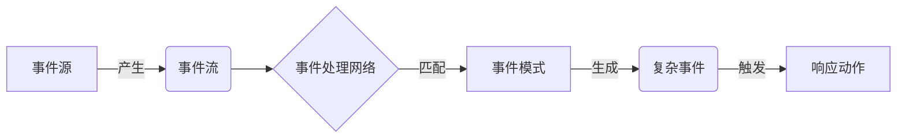
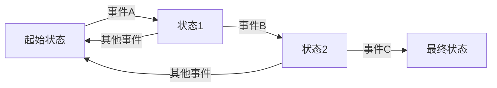
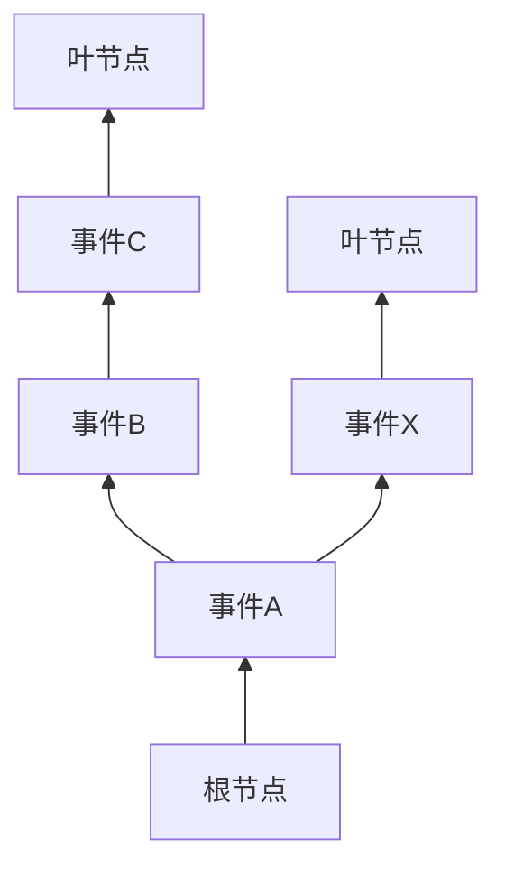
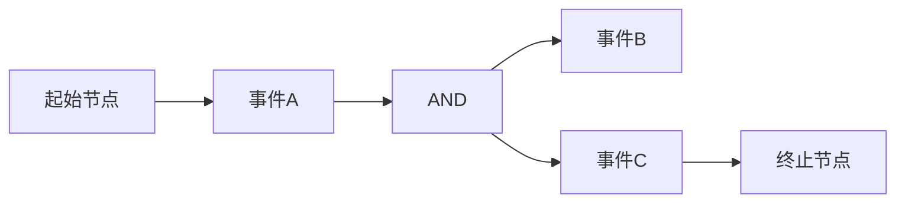

# 【AI大数据计算原理与代码实例讲解】CEP

## 1.背景介绍

在当今大数据时代，实时处理海量数据流成为了一个关键的需求。传统的数据库系统难以满足这种需求,因为它们主要针对静态数据集进行存储和查询操作。为了解决这个问题,复杂事件处理(Complex Event Processing,CEP)应运而生。

CEP是一种软件架构,旨在实时监控和处理来自多个数据源的事件流。它能够从大量的原始事件数据中发现有意义的事件模式,并根据这些模式采取相应的行动。CEP广泛应用于金融交易监控、网络安全、物联网等领域。

## 2.核心概念与联系

CEP涉及以下几个关键概念:

1. **事件(Event)**: 事件是CEP系统的基本单位,表示发生的一个动作或状态变化。事件通常包含时间戳、来源、类型和相关数据等属性。

2. **事件流(Event Stream)**: 事件流是一系列按时间顺序排列的事件序列。CEP系统从各种数据源接收事件流作为输入。

3. **事件模式(Event Pattern)**: 事件模式定义了一组需要检测的条件或规则,用于从事件流中识别出特定的事件序列或组合。事件模式可以包括时间窗口、逻辑运算符等约束。

4. **复杂事件(Complex Event)**: 当一个事件模式被满足时,CEP系统会生成一个复杂事件,表示已经检测到该模式。复杂事件可以触发预定义的操作或进一步处理。

5. **事件处理网络(Event Processing Network,EPN)**: EPN是CEP系统的核心,由多个事件处理代理(EPA)组成。EPA执行特定的事件处理逻辑,如过滤、转换、模式匹配等。EPN定义了事件流在各个EPA之间的流动路径。

这些概念之间的关系如下所示:



## 3.核心算法原理具体操作步骤

CEP系统的核心是事件模式匹配算法,用于从事件流中识别出符合特定模式的事件序列。常见的算法包括:

### 3.1 有限状态机(Finite State Machine)

有限状态机是一种基于状态转移的模式匹配算法。每个状态代表事件模式的一部分,当接收到特定事件时,状态机会根据当前状态和事件类型进行状态转移。当达到最终状态时,即匹配到完整的事件模式。

有限状态机的工作步骤如下:

1. 初始化状态机,进入起始状态。
2. 从事件流中读取一个事件。
3. 根据当前状态和事件类型,查找状态转移表确定下一个状态。
4. 如果存在有效的状态转移,则更新当前状态;否则,回到起始状态。
5. 如果达到最终状态,则报告模式匹配成功。
6. 重复步骤2-5,直到事件流结束。



### 3.2 树形结构(Tree Structure)

树形结构算法将事件模式表示为一棵树,每个节点代表模式的一部分。当一个事件到达时,算法会从根节点开始,沿着与事件匹配的路径向下遍历,直到到达叶节点或无法继续匹配为止。

树形结构算法的工作步骤如下:

1. 构建模式树,根节点表示空模式。
2. 从事件流中读取一个事件。
3. 从根节点开始,查找与事件匹配的子节点。
4. 如果找到匹配的子节点,则沿着该路径继续遍历;否则,回到根节点。
5. 如果到达叶节点,则报告模式匹配成功。
6. 重复步骤2-5,直到事件流结束。



### 3.3 网络结构(Network Structure)

网络结构算法将事件模式表示为一个有向图,每个节点代表一个事件类型或逻辑运算符。当一个事件到达时,算法会从起始节点开始,沿着与事件匹配的边遍历图形,直到到达终止节点或无法继续匹配为止。

网络结构算法的工作步骤如下:

1. 构建模式图,起始节点表示空模式。
2. 从事件流中读取一个事件。
3. 从起始节点开始,查找与事件匹配的出边。
4. 如果找到匹配的出边,则沿着该边继续遍历;否则,回到起始节点。
5. 如果到达终止节点,则报告模式匹配成功。
6. 重复步骤2-5,直到事件流结束。



上述算法各有优缺点,在实际应用中需要根据具体场景和需求进行选择和优化。此外,还有其他算法如Petri网等,在特定情况下也可以用于事件模式匹配。

## 4.数学模型和公式详细讲解举例说明

在CEP系统中,事件模式通常使用一种特殊的事件处理语言(EPL)来定义。EPL基于一阶逻辑和正则表达式,能够精确描述复杂的时间和逻辑约束。

### 4.1 事件模式语法

一个典型的事件模式由以下部分组成:

- 事件流表达式: 指定要监控的事件流。
- 模式表达式: 定义需要匹配的事件序列和约束条件。
- 视图投影: 指定输出的结果格式。

模式表达式是最关键的部分,它使用一系列运算符和谓词来描述事件之间的关系。常见的运算符包括:

- 序列运算符(->): 指定事件的时间顺序。
- 逻辑运算符(and, or, not): 组合多个模式。
- 量词运算符(every, some): 指定事件出现的次数。
- 时间窗口: 限制事件的有效时间范围。

例如,以下模式表达式匹配三个事件A、B、C按顺序出现,且B和C事件之间的时间间隔不超过5秒:

```
A -> B -> C where C.time - B.time <= 5 sec
```

### 4.2 事件模式匹配算法

事件模式匹配算法的目标是高效地从事件流中识别出符合给定模式的事件序列。这可以被形式化为一个约束满足问题(Constraint Satisfaction Problem,CSP)。

设$E=\{e_1, e_2, \dots, e_n\}$为一个事件流,每个事件$e_i$包含时间戳$t_i$和其他属性。给定一个事件模式$P$,我们需要找到$E$中所有满足$P$的事件子序列$S=\{e_{i_1}, e_{i_2}, \dots, e_{i_m}\}$,使得:

$$
\begin{align*}
&t_{i_1} < t_{i_2} < \dots < t_{i_m} \\
&\text{且 } S \models P
\end{align*}
$$

其中$\models$表示满足模式的语义约束。

这个问题可以被转化为一个约束优化问题(Constraint Optimization Problem,COP),目标是最小化一个代价函数$f(S)$,该函数测量$S$与模式$P$的偏离程度。通过求解COP,我们可以找到最佳的事件子序列作为模式匹配的结果。

例如,对于上述模式$A \rightarrow B \rightarrow C \text{ where } C.time - B.time \leq 5$,我们可以定义代价函数为:

$$
f(S) = \begin{cases}
0 & \text{if } S \models P \\
C.time - B.time - 5 & \text{if } S \not\models P \text{ and } C.time > B.time \\
\infty & \text{otherwise}
\end{cases}
$$

通过最小化$f(S)$,我们可以找到满足时间约束的最佳事件子序列。

不同的模式匹配算法采用不同的策略来求解这个约束优化问题,例如有限状态机、树形结构和网络结构等。它们的核心思想是将模式表示为一种紧凑的数据结构,然后在该结构上进行高效的搜索和匹配操作。

## 5.项目实践:代码实例和详细解释说明

为了更好地理解CEP系统的工作原理,我们来看一个使用Python实现的简单示例。在这个示例中,我们将构建一个基于有限状态机的CEP系统,用于监控股票交易数据并检测特定的事件模式。

### 5.1 定义事件和事件流

首先,我们定义一个`StockTradeEvent`类来表示股票交易事件:

```python
from dataclasses import dataclass
from datetime import datetime

@dataclass
class StockTradeEvent:
    symbol: str
    price: float
    volume: int
    timestamp: datetime

    def __repr__(self):
        return f"StockTradeEvent(symbol='{self.symbol}', price={self.price}, volume={self.volume}, timestamp={self.timestamp})"
```

每个`StockTradeEvent`对象包含股票代码、交易价格、交易量和时间戳信息。

接下来,我们定义一个`EventStream`类来模拟事件流:

```python
from typing import Iterator

class EventStream:
    def __init__(self, events):
        self.events = events

    def get_events(self) -> Iterator[StockTradeEvent]:
        for event in self.events:
            yield event
```

`EventStream`类接受一个`StockTradeEvent`对象列表作为输入,并提供一个迭代器来获取事件流中的事件。

### 5.2 实现有限状态机

我们使用一个字典来表示有限状态机的状态转移表:

```python
from typing import Callable, Dict, Tuple

State = str
Event = StockTradeEvent
TransitionFunction = Callable[[State, Event], State]

class FiniteStateMachine:
    def __init__(self, initial_state: State, transition_func: TransitionFunction, final_states: Set[State]):
        self.current_state = initial_state
        self.transition_func = transition_func
        self.final_states = final_states

    def process_event(self, event: Event) -> Tuple[State, bool]:
        next_state = self.transition_func(self.current_state, event)
        is_final_state = next_state in self.final_states
        self.current_state = next_state
        return next_state, is_final_state
```

`FiniteStateMachine`类维护当前状态、状态转移函数和最终状态集合。`process_event`方法用于处理一个事件,根据当前状态和事件类型计算下一个状态,并检查是否达到最终状态。

### 5.3 定义事件模式

现在,我们定义一个事件模式,用于检测股票价格在短时间内快速上涨和下跌的情况。该模式可以表示为:

```
快速上涨 -> 快速下跌
```

其中,"快速上涨"表示股票价格在5分钟内上涨超过5%,"快速下跌"表示股票价格在10分钟内下跌超过3%。

我们首先定义一个辅助函数来检查事件是否满足"快速上涨"或"快速下跌"条件:

```python
from datetime import timedelta

def is_rapid_increase(event: StockTradeEvent, prev_event: StockTradeEvent) -> bool:
    if prev_event is None:
        return False
    time_diff = event.timestamp - prev_event.timestamp
    price_diff_percent = (event.price - prev_event.price) / prev_event.price * 100
    return time_diff <= timedelta(minutes=5) and price_diff_percent >= 5

def is_rapid_decrease(event: StockTradeEvent, prev_event: StockTradeEvent) -> bool:
    if prev_event is None:
        return False
    time_diff = event.timestamp - prev_event.timestamp
    price_diff_percent = (prev_event.price - event.price) / event.price * 100
    return time_diff <= timedelta(minutes=10) and price_diff