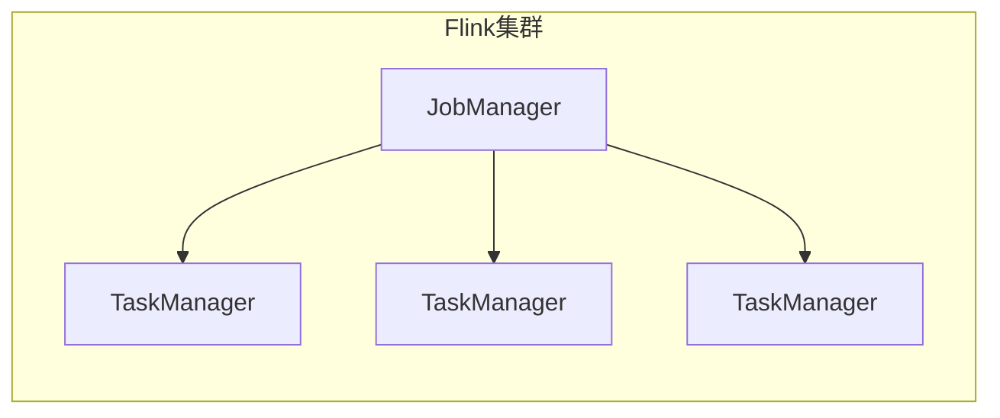
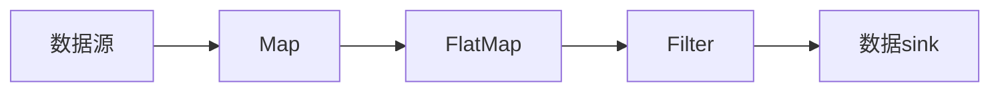
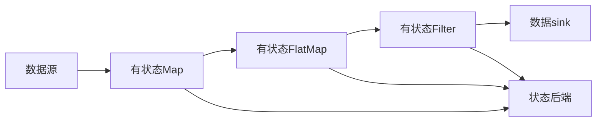
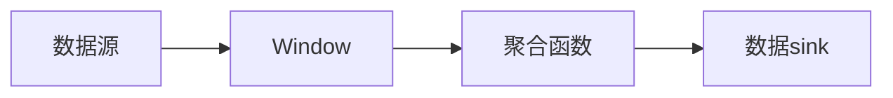
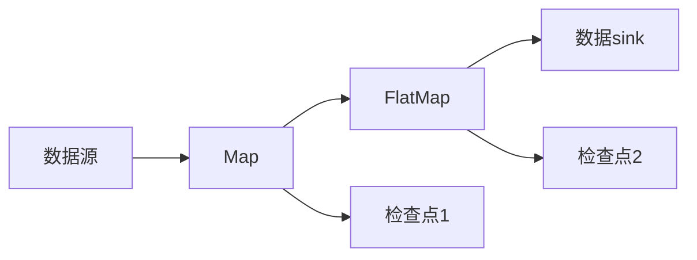

# 【AI大数据计算原理与代码实例讲解】Flink

## 1. 背景介绍

### 1.1 大数据时代的到来

在当今时代,随着互联网、物联网、移动互联网等新兴技术的快速发展,海量的数据被持续产生。根据IDC(国际数据公司)的预测,到2025年,全球数据量将达到175ZB(1ZB=1万亿GB)。这些数据来自于各个领域,如社交媒体、电子商务、物联网设备等。传统的数据处理系统已经无法满足如此庞大数据量的处理需求,因此迫切需要一种新的数据处理范式来应对这一挑战。

### 1.2 大数据处理的演进

为了解决大数据带来的挑战,Apache Hadoop作为一个开源的分布式计算框架应运而生。Hadoop采用了MapReduce编程模型,可以在廉价的硬件集群上并行处理海量数据。然而,MapReduce只能进行批处理,无法满足对实时数据处理的需求。

随后,流式处理引擎(Stream Processing Engine)应运而生,如Apache Storm、Apache Spark Streaming等,它们能够实时处理持续到来的数据流。但这些系统往往只关注于低延迟的数据处理,缺乏对状态管理的支持,难以处理有状态的数据流。

### 1.3 Apache Flink的崛起

Apache Flink作为新一代的分布式流式数据处理框架,被誉为"流处理的统一解决方案"。它不仅能够实时处理数据流,还能够支持有状态的流处理,并提供了基于流的批处理能力。Flink具有低延迟、高吞吐、精确一次语义等优点,可以广泛应用于实时分析、机器学习、图计算等多个领域。

## 2. 核心概念与联系

### 2.1 Flink架构概览

Apache Flink采用主从架构,由一个JobManager(主服务器)和多个TaskManager(从服务器)组成。JobManager负责调度和协调作业的执行,而TaskManager则负责实际执行任务。



### 2.2 流式数据处理模型

Flink基于流式数据处理模型,将无界数据流(如事件流、消息流等)看作是一种逻辑数据集。程序通过转换算子(Transformation)对数据流进行处理,形成数据流拓扑。



### 2.3 有状态流处理

与传统的流处理系统不同,Flink支持有状态的流处理。每个算子可以维护自己的状态,并在处理过程中对状态进行读写操作。Flink通过状态管理器(State Backend)来管理和维护这些状态,确保状态的一致性和容错性。



### 2.4 窗口操作

在流式数据处理中,窗口(Window)是一种将无界数据流切分为有界数据集的机制。Flink支持多种窗口类型,如滚动窗口(Tumbling Window)、滑动窗口(Sliding Window)、会话窗口(Session Window)等,可以根据时间或数据条目进行分割。



### 2.5 容错机制

Flink采用基于流水线的执行模型,将作业拆分为多个任务(Task),并以流水线的方式执行。如果某个任务失败,Flink会自动重新启动该任务,并从最近一次检查点(Checkpoint)恢复状态,保证了精确一次(Exactly-Once)语义。



## 3. 核心算法原理具体操作步骤

### 3.1 数据流拓扑构建

在Flink中,数据流拓扑是通过连接各种转换算子(Transformation)来构建的。每个算子都会消费一个或多个数据流,并产生一个或多个输出数据流。

1. 获取执行环境(ExecutionEnvironment)
2. 从数据源(Source)获取初始数据流
3. 对数据流应用转换算子(如Map、FlatMap、Filter等)
4. 将最终结果数据流写入数据sink(Sink)

```java
// 1. 获取执行环境
StreamExecutionEnvironment env = StreamExecutionEnvironment.getExecutionEnvironment();

// 2. 从数据源获取初始数据流
DataStream<String> textStream = env.readTextFile("file:///path/to/file");

// 3. 应用转换算子
DataStream<String> filteredStream = textStream
    .flatMap(new MyFlatMapper())
    .filter(new MyFilter());

// 4. 写入数据sink
filteredStream.print();

// 5. 执行作业
env.execute("My Flink Job");
```

### 3.2 有状态流处理

Flink支持有状态的流处理,每个算子都可以维护自己的状态。状态由状态后端(State Backend)管理,可以选择内存状态后端或者RocksDB状态后端。

```java
// 1. 创建有状态的FlatMap函数
StatefulFlatMapFunction<String, String> flatMapper = new StatefulFlatMapFunction<String, String>() {
    // 定义状态描述符
    ValueStateDescriptor<Long> state = new ValueStateDescriptor<>("count", Long.class);

    @Override
    public void flatMap(String value, Context ctx) throws Exception {
        // 访问和更新状态
        Long count = ctx.getState(state).value();
        ctx.getState(state).update(count + 1);

        // 发出数据
        ctx.collect(value + ", count: " + count);
    }
};

// 2. 在DataStream上应用有状态的FlatMap算子
textStream.flatMap(flatMapper);
```

### 3.3 窗口操作

窗口操作可以将无界数据流切分为有界数据集,并对每个窗口内的数据进行聚合或其他操作。Flink支持多种窗口类型,如时间窗口、计数窗口等。

```java
// 1. 定义窗口策略
DataStream<String> windowedStream = textStream
    .map(value -> Tuple2.of(value, 1L))
    .keyBy(tuple -> tuple.f0)
    .window(TumblingEventTimeWindows.of(Time.seconds(10)))
    .sum(1);

// 2. 应用窗口函数
DataStream<String> result = windowedStream
    .apply(new WindowFunction<Tuple2<String, Long>, String, String, TimeWindow>() {
        @Override
        public void apply(String key, TimeWindow window, Iterable<Tuple2<String, Long>> values, Collector<String> out) {
            long sum = 0;
            for (Tuple2<String, Long> value : values) {
                sum += value.f1;
            }
            out.collect("Key: " + key + ", Sum: " + sum + ", Window: " + window);
        }
    });
```

### 3.4 容错机制

Flink通过检查点(Checkpoint)和状态恢复机制实现了精确一次(Exactly-Once)语义。当作业出现故障时,Flink会自动从最近一次检查点恢复状态,并重新执行失败的任务。

```java
// 1. 启用检查点
env.enableCheckpointing(60000); // 每60秒执行一次检查点

// 2. 设置检查点存储位置
env.setStateBackend(new FsStateBackend("hdfs://namenode:port/flink/checkpoints"));

// 3. 设置精确一次语义
env.getCheckpointConfig().setCheckpointingMode(CheckpointingMode.EXACTLY_ONCE);
```

## 4. 数学模型和公式详细讲解举例说明

在大数据处理领域,常常需要对数据进行统计和分析。这里介绍一些常用的数学模型和公式,并给出具体的示例说明。

### 4.1 平均值和标准差

平均值(Mean)和标准差(Standard Deviation)是描述数据集中心趋势和离散程度的两个重要指标。

平均值公式:

$$\overline{x} = \frac{1}{n}\sum_{i=1}^{n}x_i$$

标准差公式:

$$\sigma = \sqrt{\frac{1}{n}\sum_{i=1}^{n}(x_i - \overline{x})^2}$$

其中,$x_i$表示第$i$个数据点,$n$表示数据集的大小。

示例:计算数据集$\{1, 2, 3, 4, 5\}$的平均值和标准差。

```java
double[] data = {1, 2, 3, 4, 5};
double sum = 0;
for (double value : data) {
    sum += value;
}
double mean = sum / data.length; // 平均值为3.0

double squaredDiffSum = 0;
for (double value : data) {
    squaredDiffSum += Math.pow(value - mean, 2);
}
double stdDev = Math.sqrt(squaredDiffSum / data.length); // 标准差为1.58
```

### 4.2 线性回归

线性回归(Linear Regression)是一种常用的监督学习算法,用于建立自变量和因变量之间的线性关系模型。

线性回归模型:

$$y = \theta_0 + \theta_1x_1 + \theta_2x_2 + ... + \theta_nx_n$$

其中,$y$是因变量,$x_i$是自变量,$\theta_i$是模型参数。

我们可以使用最小二乘法来估计模型参数$\theta_i$,目标是最小化残差平方和:

$$\min_{\theta_0, \theta_1, ..., \theta_n} \sum_{i=1}^{m}(y_i - \theta_0 - \theta_1x_{i1} - ... - \theta_nx_{in})^2$$

示例:使用线性回归拟合数据点$(1, 1), (2, 3), (3, 2), (4, 5)$。

```java
double[] x = {1, 2, 3, 4};
double[] y = {1, 3, 2, 5};

// 计算theta0和theta1
double sumX = 0, sumY = 0, sumXY = 0, sumXX = 0;
for (int i = 0; i < x.length; i++) {
    sumX += x[i];
    sumY += y[i];
    sumXY += x[i] * y[i];
    sumXX += x[i] * x[i];
}
double theta1 = (x.length * sumXY - sumX * sumY) / (x.length * sumXX - sumX * sumX);
double theta0 = (sumY - theta1 * sumX) / x.length;

// 输出结果
System.out.println("theta0 = " + theta0); // theta0 = -0.5
System.out.println("theta1 = " + theta1); // theta1 = 1.5
```

## 5. 项目实践：代码实例和详细解释说明

### 5.1 WordCount示例

WordCount是一个经典的大数据处理示例,它统计给定文本文件中每个单词出现的次数。下面是使用Flink DataStream API实现WordCount的代码示例:

```java
// 1. 获取执行环境
StreamExecutionEnvironment env = StreamExecutionEnvironment.getExecutionEnvironment();

// 2. 从数据源获取初始数据流
DataStream<String> textStream = env.readTextFile("file:///path/to/file");

// 3. 应用转换算子
DataStream<Tuple2<String, Integer>> wordCountStream = textStream
    .flatMap(new FlatMapFunction<String, Tuple2<String, Integer>>() {
        @Override
        public void flatMap(String value, Collector<Tuple2<String, Integer>> out) throws Exception {
            String[] words = value.split(" ");
            for (String word : words) {
                out.collect(Tuple2.of(word, 1));
            }
        }
    })
    .keyBy(0) // 按单词分组
    .sum(1); // 求和统计单词出现次数

// 4. 写入数据sink
wordCountStream.print();

// 5. 执行作业
env.execute("WordCount Example");
```

代码解释:

1. 首先获取执行环境`StreamExecutionEnvironment`。
2. 从文本文件中读取初始数据流`textStream`。
3. 应用`flatMap`算子将每行文本