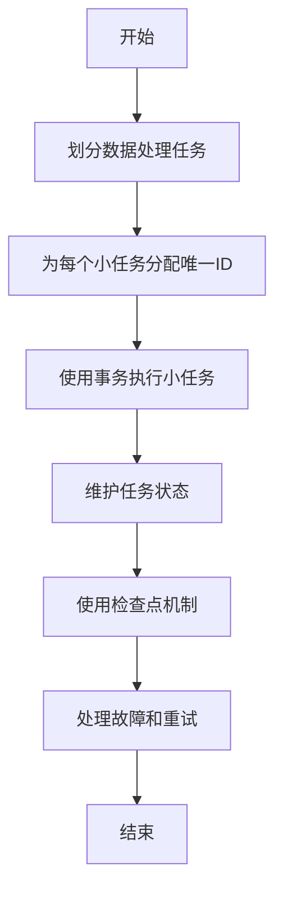

# 【AI大数据计算原理与代码实例讲解】exactly-once语义

## 1.背景介绍

在大数据处理和分布式系统中,exactly-once语义是一个极其重要的概念。它指的是确保每个数据记录只被精确处理一次,不会重复处理或遗漏。这对于金融交易、库存管理、数据分析等场景至关重要,因为重复处理或遗漏数据可能会导致严重的后果。

传统的数据处理系统通常采用两阶段提交(Two-Phase Commit, 2PC)协议来实现exactly-once语义。但在大数据和分布式环境下,2PC协议存在一些缺陷,如性能低下、可用性差等。因此,需要新的方法来实现exactly-once语义。

### 1.1 分布式数据处理的挑战

在分布式系统中,由于网络故障、节点故障等原因,数据处理过程可能会中断。这种情况下,需要重新启动处理过程,但如何确保已处理的数据不会重复处理,未处理的数据也不会遗漏,就成为了一个挑战。

此外,大数据场景下,数据量巨大,处理过程通常需要分布在多个节点上并行执行。如何在这种情况下实现exactly-once语义,也是一个需要解决的难题。

### 1.2 为什么需要exactly-once语义?

exactly-once语义对于以下场景至关重要:

- **金融交易**: 重复处理或遗漏交易记录可能导致资金损失或账户不平衡。
- **库存管理**: 重复处理或遗漏订单记录可能导致库存数据不准确。
- **数据分析**: 重复处理或遗漏数据可能导致分析结果失真。
- **事件处理**: 重复处理或遗漏事件可能导致系统反应错误。

因此,在这些场景下,实现exactly-once语义是一个必须解决的问题。

## 2.核心概念与联系

实现exactly-once语义涉及到以下几个核心概念:

### 2.1 幂等性(Idempotence)

幂等性是指对同一个操作执行一次或多次,结果是相同的。在数据处理中,如果一个操作具有幂等性,那么即使它被重复执行多次,也不会对最终结果产生影响。

例如,在数据库中执行`INSERT`操作时,如果主键已经存在,则不会插入新记录。这种操作就具有幂等性。

幂等性是实现exactly-once语义的一个重要基础。

### 2.2 事务(Transaction)

事务是一系列操作的逻辑单元,要么全部执行,要么全部不执行。事务具有ACID特性:

- **原子性(Atomicity)**: 事务是一个不可分割的整体,要么全部执行,要么全部不执行。
- **一致性(Consistency)**: 事务执行前后,数据都必须保持一致性。
- **隔离性(Isolation)**: 并发执行的事务之间不会相互影响。
- **持久性(Durability)**: 事务一旦提交,对数据的修改就是永久性的。

在实现exactly-once语义时,通常需要将数据处理过程封装成事务,以确保其原子性和一致性。

### 2.3 检查点(Checkpoint)

检查点是指在数据处理过程中,将当前状态持久化存储的一种机制。如果处理过程中断,可以从最近的检查点恢复,而不必从头开始。

检查点机制可以提高系统的容错性和可恢复性,是实现exactly-once语义的一种常用技术。

### 2.4 幂等性、事务和检查点的关系

这三个概念之间存在密切的联系:

- 幂等性是实现exactly-once语义的基础,确保重复执行操作不会影响最终结果。
- 事务可以保证数据处理过程的原子性和一致性,防止出现部分数据处理、部分未处理的情况。
- 检查点机制可以在处理过程中断时,从最近的一致状态恢复,避免重复处理已处理的数据。

通过将这三个概念结合起来,可以实现exactly-once语义。

## 3.核心算法原理具体操作步骤

实现exactly-once语义的核心算法原理可以概括为以下几个步骤:

### 3.1 划分数据处理任务

首先,将整个数据处理任务划分为多个小任务,每个小任务都是幂等的。这样即使小任务被重复执行,也不会影响最终结果。

### 3.2 为每个小任务分配唯一ID

为每个小任务分配一个全局唯一的ID,用于跟踪和管理任务的执行状态。

### 3.3 使用事务执行小任务

将每个小任务封装为一个事务,确保其原子性和一致性。如果事务执行失败,可以回滚到之前的一致状态。

### 3.4 维护任务状态

在执行小任务之前,先检查其状态。如果状态为"已完成",则跳过该任务;如果状态为"未完成",则执行该任务。

执行完成后,将任务状态更新为"已完成"。

### 3.5 使用检查点机制

在执行一系列小任务时,定期保存检查点。如果执行过程中断,可以从最近的一致检查点恢复,避免重复处理已完成的任务。

### 3.6 处理故障和重试

如果某个小任务执行失败,可以根据策略进行重试。重试时,需要确保不会重复处理已完成的任务。

### 3.7 流程图

以下是实现exactly-once语义的核心算法流程图:



通过这一系列步骤,可以确保每个数据记录只被精确处理一次,实现exactly-once语义。

## 4.数学模型和公式详细讲解举例说明

在实现exactly-once语义的算法中,有一些数学模型和公式需要注意。

### 4.1 任务ID生成算法

为了确保每个小任务的ID是全局唯一的,通常需要使用一种高效的ID生成算法。一种常见的方法是使用UUID(Universally Unique Identifier)算法。

UUID算法基于几个不同的组件,包括当前时间戳、随机数和机器ID等,通过特定的计算方式生成一个128位的ID。UUID算法可以确保在给定的时空范围内,生成的ID是唯一的,概率冲突极小。

UUID的数学模型可以表示为:

$$
UUID = f(time, random, machine\_id, ...)
$$

其中,`f`是一个特定的计算函数,将时间戳、随机数、机器ID等组件作为输入,输出一个128位的UUID。

### 4.2 检查点间隔计算

在使用检查点机制时,需要决定检查点的保存间隔。过于频繁的检查点会导致性能下降,而间隔过长又可能导致在故障时需要重新处理大量数据。

一种常见的方法是根据数据处理速率和可用存储空间,计算出合理的检查点间隔。假设数据处理速率为`r`(记录/秒),可用存储空间为`s`(字节),每条记录的大小为`d`(字节),则检查点间隔`t`可以计算为:

$$
t = \frac{s}{r \times d}
$$

这样可以确保在可用存储空间耗尽之前,至少可以保存一个检查点。

### 4.3 重试策略

在处理故障和重试时,需要制定一个合理的重试策略。常见的重试策略包括:

- **固定间隔重试**: 每次重试之间间隔固定时间`T`。
- **指数退避重试**: 每次重试之间的间隔按照指数方式增长,例如`T、2T、4T、8T...`。
- **最大重试次数**: 限制最大重试次数为`N`次,超过`N`次则放弃。

假设固定间隔重试的间隔为`T`,最大重试次数为`N`,则第`i`次重试的时间`t_i`可以表示为:

$$
t_i = (i-1) \times T \quad (1 \leq i \leq N)
$$

指数退避重试的时间`t_i`可以表示为:

$$
t_i = 2^{i-1} \times T \quad (1 \leq i \leq N)
$$

通过合理的重试策略,可以提高系统的容错能力和可靠性。

## 5.项目实践:代码实例和详细解释说明

为了更好地理解实现exactly-once语义的算法,我们来看一个基于Apache Kafka的实际代码示例。

Apache Kafka是一个分布式流处理平台,广泛应用于大数据领域。它提供了一些特性来支持exactly-once语义,如幂等性producer、事务等。

### 5.1 准备工作

首先,我们需要安装并启动Kafka环境。具体步骤请参考官方文档。

接下来,创建一个Maven项目,并添加以下依赖项:

```xml
<dependency>
    <groupId>org.apache.kafka</groupId>
    <artifilId>kafka-clients</artifilId>
    <version>2.8.0</version>
</dependency>
```

### 5.2 幂等性Producer

Kafka提供了幂等性Producer,可以确保在重试时不会产生重复的消息。我们先来看一个简单的示例:

```java
Properties props = new Properties();
props.put(ProducerConfig.BOOTSTRAP_SERVERS_CONFIG, "localhost:9092");
props.put(ProducerConfig.CLIENT_ID_CONFIG, "exactly-once-producer");
props.put(ProducerConfig.ENABLE_IDEMPOTENCE_CONFIG, "true");

Producer<String, String> producer = new KafkaProducer<>(props);

for (int i = 0; i < 10; i++) {
    String message = "Message " + i;
    producer.send(new ProducerRecord<>("topic", message));
}

producer.flush();
producer.close();
```

在这个示例中,我们创建了一个Kafka Producer,并启用了幂等性特性(`ENABLE_IDEMPOTENCE_CONFIG=true`)。然后,我们发送了10条消息到Kafka主题。

由于启用了幂等性,即使在发送过程中出现重试,也不会产生重复的消息。

### 5.3 事务Producer

Kafka还提供了事务Producer,可以将一系列操作作为一个事务来执行,确保原子性和一致性。我们来看一个示例:

```java
Properties props = new Properties();
props.put(ProducerConfig.BOOTSTRAP_SERVERS_CONFIG, "localhost:9092");
props.put(ProducerConfig.CLIENT_ID_CONFIG, "exactly-once-producer");
props.put(ProducerConfig.ENABLE_IDEMPOTENCE_CONFIG, "true");
props.put(ProducerConfig.TRANSACTIONAL_ID_CONFIG, "tx-id");

Producer<String, String> producer = new KafkaProducer<>(props, new StringSerializer(), new StringSerializer());
producer.initTransactions();

try {
    producer.beginTransaction();
    producer.send(new ProducerRecord<>("topic1", "Message 1"));
    producer.send(new ProducerRecord<>("topic2", "Message 2"));
    producer.commitTransaction();
} catch (Exception e) {
    producer.abortTransaction();
}

producer.close();
```

在这个示例中,我们首先创建了一个事务Producer,并为其分配了一个事务ID(`TRANSACTIONAL_ID_CONFIG`)。然后,我们开启一个事务,在事务中发送两条消息到不同的主题。如果发送成功,我们提交事务;如果发生异常,我们中止事务。

通过使用事务,可以确保这两条消息要么都被成功发送,要么都不发送,从而保证了原子性和一致性。

### 5.4 检查点示例

最后,我们来看一个使用检查点机制的示例。这个示例基于Apache Flink,一个流处理框架。

```java
StreamExecutionEnvironment env = StreamExecutionEnvironment.getExecutionEnvironment();

DataStream<String> stream = env.addSource(new FlinkKafkaConsumer<>("topic", new SimpleStringSchema(), props));

stream
    .map(value -> value.toUpperCase())
    .addSink(new FlinkKafkaProducer<>("output-topic", new SimpleStringSchema(), props));

env.enableCheckpointing(10000); // 每10秒保存一次检查点
env.execute("Exactly Once Example");
```

在这个示例中,我们从Kafka主题读取数据流,将其转换为大写形式,然后将结果写入另一个Kafka主题。

我们使用`env.enableCheckpointing(10000)`启用了检查点机制,每10秒钟会保存一次检查点。如果作业失败,可以从最近的一致检查点恢复