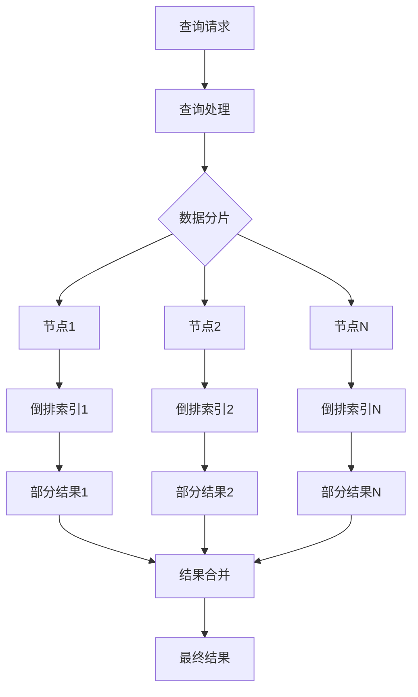

# 【AI大数据计算原理与代码实例讲解】分布式搜索

## 1. 背景介绍

在大数据时代,海量数据的存储和处理已成为各行各业面临的共同挑战。传统的集中式搜索架构难以满足日益增长的数据规模和实时性需求。分布式搜索作为一种高效、可扩展的解决方案应运而生,在电商、搜索引擎、社交网络等领域得到广泛应用。

### 1.1 分布式搜索的定义与特点

分布式搜索是指将搜索任务分散到多个节点上并行执行,通过协同工作提高搜索效率和吞吐量的技术。它具有以下特点:

- 水平扩展性:可以通过增加节点数来线性提升系统性能。
- 高可用性:单点故障不会影响整个系统的可用性。
- 负载均衡:搜索请求可以均匀分发到各个节点,充分利用集群资源。
- 数据分片:将大规模数据集切分成若干子集,提高检索效率。

### 1.2 分布式搜索的应用场景

分布式搜索广泛应用于以下场景:

- 搜索引擎:如Google、Baidu等,为海量网页数据提供实时检索服务。
- 电子商务:淘宝、京东等电商平台,支持亿级商品的快速搜索和推荐。  
- 社交网络:Facebook、微博等,对海量用户生成内容进行实时索引和查询。
- 日志分析:收集分布在多台服务器上的日志,进行集中式搜索和分析。

## 2. 核心概念与联系

理解分布式搜索的核心概念,是掌握其工作原理的基础。本节将介绍构建分布式搜索系统的关键组件,并阐述它们之间的联系。

### 2.1 数据分片(Data Sharding)

数据分片是指将大规模数据集切分成若干更小的子集,每个子集称为一个分片(Shard)。通过数据分片,可以将数据分布存储在多个节点上,实现存储和计算能力的水平扩展。常见的分片策略有:

- 范围分片(Range Sharding):按照数据的某个属性值划分范围。
- 哈希分片(Hash Sharding):使用哈希函数对数据进行分片。

### 2.2 倒排索引(Inverted Index)  

倒排索引是实现分布式搜索的核心数据结构。它将每个关键词映射到包含它的文档列表,便于快速检索。倒排索引通常由以下两部分组成:

- 词典(Term Dictionary):存储所有不重复的关键词。
- 倒排列表(Postings List):存储每个关键词对应的文档ID列表。

倒排索引的构建过程如下:


### 2.3 查询处理(Query Processing)

查询处理是将用户输入的查询转化为系统可以理解和执行的过程。主要步骤包括:

- 查询解析:将用户输入的自然语言查询转换为规范化的查询表达式。
- 查询改写:对查询进行等价变换和优化,生成更高效的执行计划。
- 查询路由:根据查询词和数据分布,将查询请求路由到相关的节点上。
- 结果合并:将各个节点返回的结果进行汇总、排序和过滤,生成最终结果。

### 2.4 节点通信(Node Communication)

在分布式搜索中,节点间需要频繁通信和数据交换。常见的节点通信方式有:

- RPC(Remote Procedure Call):通过远程过程调用实现节点间的请求/响应交互。
- 消息队列:使用消息中间件在节点间传递查询请求和响应结果。

下图展示了分布式搜索系统的核心组件及其交互关系:



## 3. 核心算法原理具体操作步骤

分布式搜索的核心算法主要包括倒排索引构建、查询处理和相关性排序等。本节将详细介绍这些算法的原理和具体操作步骤。

### 3.1 倒排索引构建算法

倒排索引的构建可以分为以下几个步骤:

1. 文本预处理:对原始文档进行分词、去停用词、词干化等操作,得到规范化的词条。
2. 词条统计:统计每个词条在每篇文档中的出现频率(TF)和文档频率(DF)。
3. 生成倒排列表:对于每个词条,生成包含它的文档ID列表,并记录词频信息。
4. 合并倒排索引:将各个节点生成的局部倒排索引合并成全局倒排索引。

伪代码如下:

```python
def build_inverted_index(documents):
    term_freq = {}
    doc_freq = {}
    inverted_index = {}
    
    for doc_id, doc in enumerate(documents):
        terms = preprocess(doc)
        for term in terms:
            if term not in term_freq:
                term_freq[term] = {}
            if doc_id not in term_freq[term]:
                term_freq[term][doc_id] = 0
            term_freq[term][doc_id] += 1
            
            if term not in doc_freq:
                doc_freq[term] = 0
            doc_freq[term] += 1
            
    for term, freq_dict in term_freq.items():
        inverted_index[term] = [(doc_id, freq) for doc_id, freq in freq_dict.items()]
        
    return inverted_index, doc_freq
```

### 3.2 查询处理算法

查询处理的主要任务是根据用户输入的查询词,检索出相关的文档。具体步骤如下:

1. 查询解析:将用户输入的查询词进行分词、规范化处理。
2. 查询路由:根据查询词和数据分布,将查询请求发送到相关的节点。
3. 本地检索:每个节点根据收到的查询词,在本地倒排索引中查找相关文档。
4. 结果合并:将各节点返回的文档结果进行汇总、去重和排序,生成最终结果。

伪代码如下:

```python
def search(query, index_shards):
    query_terms = preprocess(query)
    doc_scores = {}
    
    for term in query_terms:
        for shard in index_shards:
            if term in shard:
                for doc_id, freq in shard[term]:
                    if doc_id not in doc_scores:
                        doc_scores[doc_id] = 0
                    doc_scores[doc_id] += freq
                    
    sorted_docs = sorted(doc_scores.items(), key=lambda x: x[1], reverse=True)
    return [doc_id for doc_id, score in sorted_docs]
```

### 3.3 相关性排序算法

为了提高搜索结果的质量,需要对检索出的文档进行相关性排序。常用的相关性度量方法有:

- TF-IDF:综合考虑词条在文档中的频率(TF)和在整个文档集中的稀疏程度(IDF)。

$$
score(q,d) = \sum_{t \in q} tf(t,d) \cdot idf(t)
$$

其中,$tf(t,d)$表示词条$t$在文档$d$中的频率,$idf(t)$表示词条$t$的逆文档频率,计算公式为:

$$
idf(t) = \log \frac{N}{df(t)}
$$

$N$为文档总数,$df(t)$为包含词条$t$的文档数。

- BM25:在TF-IDF的基础上,引入文档长度归一化和词频饱和度等因素。

$$
score(q,d) = \sum_{t \in q} idf(t) \cdot \frac{tf(t,d) \cdot (k_1 + 1)}{tf(t,d) + k_1 \cdot (1-b+b \cdot \frac{|d|}{avgdl})}
$$

其中,$k_1$和$b$为调节因子,$|d|$为文档长度,$avgdl$为平均文档长度。

## 4. 数学模型和公式详细讲解举例说明

在分布式搜索中,常用的数学模型和公式包括TF-IDF、BM25等。本节将通过具体的例子,详细讲解这些模型的原理和计算过程。

### 4.1 TF-IDF模型

TF-IDF(Term Frequency-Inverse Document Frequency)是一种用于评估词条重要性的统计方法。它由两部分组成:

- TF(词频):衡量词条在文档中出现的频率。
- IDF(逆文档频率):衡量词条在整个文档集中的稀疏程度。

假设有以下三篇文档:

- D1: "The cat sat on the mat"
- D2: "The dog lay on the rug"
- D3: "The cat lay on the rug"

对于查询"cat rug",计算每篇文档的TF-IDF得分:

1. 计算词频TF:

|      | cat | rug |
|------|-----|-----|
| D1   | 1   | 0   |
| D2   | 0   | 1   |
| D3   | 1   | 1   |

2. 计算逆文档频率IDF:

$idf("cat") = \log \frac{3}{2} \approx 0.176$

$idf("rug") = \log \frac{3}{2} \approx 0.176$

3. 计算TF-IDF得分:

$score(D1) = 1 \times 0.176 + 0 \times 0.176 = 0.176$

$score(D2) = 0 \times 0.176 + 1 \times 0.176 = 0.176$

$score(D3) = 1 \times 0.176 + 1 \times 0.176 = 0.352$

可以看出,D3的得分最高,与查询最相关。

### 4.2 BM25模型

BM25是一种基于概率论的排序函数,考虑了文档长度对相关性的影响。其计算公式为:

$$
score(q,d) = \sum_{t \in q} idf(t) \cdot \frac{tf(t,d) \cdot (k_1 + 1)}{tf(t,d) + k_1 \cdot (1-b+b \cdot \frac{|d|}{avgdl})}
$$

其中:

- $k_1$:调节词频饱和度的参数,通常取值在1.2~2.0之间。
- $b$:调节文档长度归一化的参数,通常取值在0.5~0.8之间。

仍以上述三篇文档为例,假设$k_1=1.5$,$b=0.75$,平均文档长度$avgdl=6$,计算BM25得分:

1. 计算词频TF和文档长度:

|      | cat | rug | 文档长度 |
|------|-----|-----|---------|
| D1   | 1   | 0   | 6       |
| D2   | 0   | 1   | 6       |
| D3   | 1   | 1   | 6       |

2. 计算逆文档频率IDF(同TF-IDF)。

3. 计算BM25得分:

$score(D1) = 0.176 \times \frac{1 \times 2.5}{1 + 1.5 \times 0.75} + 0.176 \times \frac{0 \times 2.5}{0 + 1.5 \times 0.75} \approx 0.153$

$score(D2) = 0.176 \times \frac{0 \times 2.5}{0 + 1.5 \times 0.75} + 0.176 \times \frac{1 \times 2.5}{1 + 1.5 \times 0.75} \approx 0.153$

$score(D3) = 0.176 \times \frac{1 \times 2.5}{1 + 1.5 \times 0.75} + 0.176 \times \frac{1 \times 2.5}{1 + 1.5 \times 0.75} \approx 0.306$

可以看出,BM25的结果与TF-IDF类似,但考虑了文档长度的影响,得分更加合理。

## 5. 项目实践:代码实例和详细解释说明

本节将通过一个简单的Python代码实例,演示如何实现分布式搜索的核心功能。

### 5.1 倒排索引构建

首先,定义一个倒排索引