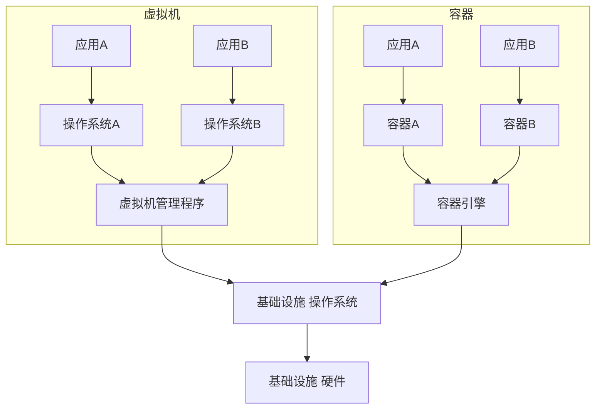

# 【AI大数据计算原理与代码实例讲解】容器

## 1.背景介绍

在当今大数据和人工智能快速发展的时代，容器技术已经成为支撑大规模分布式计算和机器学习平台不可或缺的基础设施。容器不仅提供了一种轻量级的虚拟化方案，实现应用的快速部署和弹性伸缩，而且为AI系统的可移植性、可复现性提供了有力保障。本文将深入探讨容器在AI大数据计算中的核心原理，并结合代码实例进行详细讲解，帮助读者全面理解容器技术的内在机理和实际应用。

## 2.核心概念与联系

### 2.1 容器的定义与特点

容器是一种操作系统级虚拟化技术，通过对进程进行隔离和资源限制，实现类似于虚拟机的功能，但比虚拟机更加轻量和高效。每个容器都有自己独立的文件系统、网络和进程空间，多个容器共享宿主机的操作系统内核。

容器的主要特点包括：
- 轻量：容器共享宿主机内核，避免了操作系统的开销，启动速度快，资源占用少。
- 一致：容器将应用及其依赖打包在一起，保证了不同环境下的一致性。
- 可移植：容器可以方便地在不同系统间迁移和部署，具有很强的可移植性。
- 安全：容器之间相互隔离，一个容器的故障不会影响其他容器和宿主机。

### 2.2 容器与虚拟机的区别

容器与传统虚拟机都提供了资源隔离的功能，但二者在实现原理上有本质区别：

- 虚拟机通过模拟完整的操作系统和硬件环境实现隔离，每个虚拟机都有独立的内核，因此开销较大。
- 容器直接利用宿主机的内核，通过namespace实现进程隔离，通过cgroups实现资源限制，避免了内核的开销，因此更加轻量高效。

下图展示了容器与虚拟机的架构区别：



### 2.3 容器与AI大数据计算的关系

容器技术为AI大数据计算提供了高效、灵活、可扩展的基础架构，主要体现在以下几个方面：

1. 环境一致性：容器可将AI应用的代码、依赖库、配置文件等打包在一起，确保在不同环境下运行的一致性，避免了环境差异导致的问题。

2. 快速部署：容器化后的AI应用可以快速启动，缩短了应用的交付周期，提高了开发和部署效率。

3. 资源隔离：容器实现了进程和资源的隔离，避免了不同AI任务之间的相互干扰，保证了系统的稳定性。

4. 动态伸缩：容器可以根据AI任务的负载情况动态调整资源，实现弹性伸缩，提高资源利用率。

5. 分布式支持：容器为分布式AI计算提供了天然的支持，可以方便地将AI任务拆分到多个容器中并行执行，实现计算能力的水平扩展。

## 3.核心算法原理具体操作步骤

容器的核心原理是通过Linux内核的Namespace和Cgroups机制实现进程隔离和资源限制。下面详细介绍这两种机制的工作原理和具体实现步骤。

### 3.1 Namespace原理与实现

Namespace是Linux内核提供的一种资源隔离方案，可以将进程的视图隔离到不同的Namespace中，每个Namespace有自己独立的资源，如进程树、网络、文件系统等。

Linux内核目前提供了以下几种Namespace：

- Mount Namespace：隔离文件系统挂载点
- UTS Namespace：隔离主机名和域名
- IPC Namespace：隔离进程间通信
- PID Namespace：隔离进程ID
- Network Namespace：隔离网络设备、协议栈、端口等
- User Namespace：隔离用户和用户组

通过Namespace，可以实现容器内进程与宿主机进程的隔离。容器引擎在创建容器时，会调用以下系统调用创建并进入新的Namespace：

```c
int clone(int (*child_func)(void *), void *child_stack, int flags, void *arg);
int unshare(int flags);
int setns(int fd, int nstype);
```

其中，clone用于创建一个新进程并将其加入新的Namespace，unshare用于将当前进程加入新的Namespace，setns用于将当前进程加入到已有的Namespace。

下面的代码演示了如何使用clone系统调用创建一个新的进程并加入新的Mount Namespace：

```c
#define _GNU_SOURCE
#include <sys/types.h>
#include <sys/wait.h>
#include <sys/mount.h>
#include <stdio.h>
#include <sched.h>
#include <signal.h>
#include <unistd.h>

#define STACK_SIZE (1024 * 1024)

static char child_stack[STACK_SIZE];

int child_func(void *arg) {
    printf("在子进程中!\n");
    sethostname("container",10); // 设置hostname
    mount("proc", "/proc", "proc", 0, NULL); // mount proc文件系统
    execv("/bin/bash", NULL); // 执行/bin/bash
    return 0;
}

int main() {
    printf("程序开始: \n");
    int child_pid = clone(child_func, child_stack+STACK_SIZE, CLONE_NEWNS | SIGCHLD, NULL);
    waitpid(child_pid, NULL, 0);
    printf("已退出\n");
    return 0;
}
```

以上代码创建了一个新的子进程，并为其设置了独立的Mount Namespace，然后在子进程中设置hostname，挂载proc文件系统，最后执行/bin/bash。这实现了容器内文件系统与宿主机的隔离。

### 3.2 Cgroups原理与实现

Cgroups是Linux内核提供的一种限制进程组所使用的物理资源的机制，如CPU、内存、磁盘I/O等。通过Cgroups可以限制容器的资源使用，避免一个容器占用过多资源影响整个系统。

Cgroups的核心概念包括：

- 任务：进程或线程
- 控制族群：按某种资源控制标准划分的任务组，包含一个或多个子系统
- 子系统：一种资源控制器，如cpu、内存等
- 层级：一个或多个子系统的组合，层级中的控制族群形成一个树状结构

在容器引擎中，每创建一个容器就会在Cgroups的各个子系统中创建一个控制族群，然后将容器进程加入对应的控制族群，从而实现对容器资源的限制。

下面的代码演示了如何使用Cgroups限制容器的内存使用：

```bash
# 创建memory子系统的层级
mkdir /sys/fs/cgroup/memory/test
# 设置内存限制为100M 
echo "100000000" > /sys/fs/cgroup/memory/test/memory.limit_in_bytes
# 将当前进程加入控制族群
echo $$ > /sys/fs/cgroup/memory/test/tasks
```

以上命令首先在memory子系统中创建了一个名为test的控制族群，然后设置其内存限制为100MB，最后将当前进程加入该控制族群。这样当前进程及其子进程的内存使用就被限制在100MB以内。

## 4.数学模型和公式详细讲解举例说明

容器技术的核心是通过Namespace实现资源隔离，通过Cgroups实现资源限制，从而达到类似虚拟机的效果。这里我们对Namespace和Cgroups的数学模型进行简要分析。

### 4.1 Namespace的数学模型

Namespace可以看作是将进程按某种等价关系划分的商集，每个等价类即为一个Namespace。设$P$为所有进程的集合，$\sim$为某种等价关系，则商集$P/\sim$表示所有的Namespace。

例如，如果我们定义$\sim$为"两个进程访问相同的主机名"，则$P/\sim$就表示UTS Namespace将进程划分的情况。下图展示了不同Namespace的划分效果：


从图中可以看出，每个Namespace都有独立的资源视图，如主机名、进程树等，从而实现了资源隔离的效果。

### 4.2 Cgroups的数学模型

Cgroups可以看作是一个有向无环图（DAG），顶点表示控制族群，边表示控制族群之间的层级关系。设$V$为所有控制族群的集合，$E$为所有有向边的集合，则Cgroups可以表示为二元组$G=(V,E)$。

例如，下图展示了一个Cgroups的层级结构：


其中，$V=\{A,B,C,D\}$，$E=\{(A,B),(A,C),(C,D)\}$。控制族群之间的层级关系决定了资源控制的继承和隔离效果。子控制族群可以继承父控制族群的资源限制，不同子树之间则相互隔离。

在实际使用时，可以用树状结构表示Cgroups，树的每个节点对应一个控制族群，每个节点可以设置对应的资源限制参数。例如：

```
                  root
                /      \
           cpu          memory
          /    \         /    \
      cpu_A  cpu_B   mem_C  mem_D
```

以上树形结构表示了一个包含cpu和memory两个子系统的Cgroups层级，其中cpu_A和cpu_B共享父控制族群cpu的CPU限制，mem_C和mem_D共享父控制族群memory的内存限制。

## 5.项目实践：代码实例和详细解释说明

下面我们通过一个具体的代码实例，演示如何使用Go语言创建并运行一个简单的容器。该容器实现了以下功能：

1. 创建一个独立的根文件系统，容器内的进程只能访问该文件系统
2. 为容器进程创建独立的PID、Mount、UTS等Namespace
3. 在容器内运行指定的命令

```go
package main

import (
    "fmt"
    "os"
    "os/exec"
    "syscall"
)

func main() {
    switch os.Args[1] {
    case "run":
        run()
    case "child":
        child()
    default:
        panic("请指定 run 或 child")
    }
}

func run() {
    cmd := exec.Command("/proc/self/exe", append([]string{"child"}, os.Args[2:]...)...)
    cmd.Stdin = os.Stdin
    cmd.Stdout = os.Stdout
    cmd.Stderr = os.Stderr
    cmd.SysProcAttr = &syscall.SysProcAttr{
        Cloneflags: syscall.CLONE_NEWUTS | syscall.CLONE_NEWPID | syscall.CLONE_NEWNS,
    }
    must(cmd.Run())
}

func child() {
    fmt.Printf("running %v as PID %d\n", os.Args[2:], os.Getpid())

    cg()

    cmd := exec.Command(os.Args[2], os.Args[3:]...)
    cmd.Stdin = os.Stdin
    cmd.Stdout = os.Stdout
    cmd.Stderr = os.Stderr

    must(syscall.Sethostname([]byte("container")))
    must(syscall.Chroot("/home/user/ubuntufs"))
    must(os.Chdir("/"))
    must(syscall.Mount("proc", "proc", "proc", 0, ""))

    must(cmd.Run())

    must(syscall.Unmount("proc", 0))
}

func cg() {
    cgroups := "/sys/fs/cgroup/"
    pids := filepath.Join(cgroups, "pids")
    os.Mkdir(filepath.Join(pids, "liz"), 0755)
    must(ioutil.WriteFile(filepath.Join(pids, "liz/pids.max"), []byte("20"), 0700))
    // 将容器进程加入cgroup
    must(ioutil.WriteFile(filepath.Join(pids, "liz/cgroup.procs"), []byte(strconv.Itoa(os.Getpid())), 0700))
}

func must(err error) {
    if err != nil {
        panic(err)
    }
}
```

以上代码的主要步