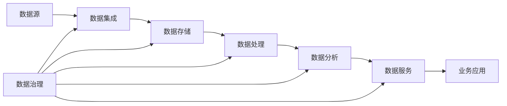

# 【AI大数据计算原理与代码实例讲解】数据治理

## 1. 背景介绍

在当今大数据时代,企业和组织面临着海量数据的挑战。如何有效地管理、组织和利用这些数据,已成为一个关键问题。数据治理作为一种全面的数据管理方法,旨在确保数据的质量、安全性、可访问性和一致性,从而支持业务决策和运营。

### 1.1 数据治理的重要性

- 提高数据质量
- 增强数据安全性
- 促进数据共享和协作
- 支持业务决策和创新

### 1.2 数据治理面临的挑战

- 数据孤岛和不一致性
- 数据质量问题
- 数据安全和隐私风险
- 缺乏统一的数据标准和流程

## 2. 核心概念与联系

### 2.1 数据治理的定义

数据治理是一套管理数据资产的过程、策略、标准、角色和责任,旨在提高数据质量、可用性、一致性和安全性,从而支持组织的业务目标。

### 2.2 数据治理的核心要素

- 数据质量管理
- 元数据管理
- 主数据管理
- 数据安全与隐私
- 数据架构与标准
- 数据生命周期管理

### 2.3 数据治理与相关概念的关系

- 数据管理:数据治理是数据管理的一个重要组成部分
- 数据架构:数据治理需要建立在合理的数据架构基础上
- 数据质量:数据治理的目标之一是提高数据质量
- 数据安全:数据治理需要确保数据的安全性和隐私性

## 3. 核心算法原理具体操作步骤

### 3.1 数据质量评估算法

- 数据完整性评估
- 数据一致性评估
- 数据准确性评估
- 数据及时性评估

#### 3.1.1 数据完整性评估步骤

1. 确定评估对象和范围
2. 定义完整性规则和指标
3. 扫描数据并识别缺失值
4. 计算完整性得分
5. 生成评估报告

### 3.2 数据去重算法

- 基于规则的去重
- 基于机器学习的去重

#### 3.2.1 基于规则的去重步骤

1. 确定去重字段和规则
2. 对数据进行清洗和标准化
3. 生成去重键
4. 对去重键进行分组和合并
5. 保留每组中的代表记录

### 3.3 数据标准化算法

- 基于词典的标准化
- 基于模式匹配的标准化

#### 3.3.1 基于词典的标准化步骤

1. 构建标准化词典
2. 对数据进行清洗和分词
3. 匹配词典并替换非标准词
4. 重新组合标准化后的词
5. 更新数据库中的标准化结果

## 4. 数学模型和公式详细讲解举例说明

### 4.1 数据质量评分模型

数据质量评分可以用一个加权平均模型来表示:

$$
DQ\_Score = \sum_{i=1}^{n} w_i \times q_i
$$

其中:
- $DQ\_Score$表示数据质量总评分
- $w_i$表示第$i$个质量维度的权重
- $q_i$表示第$i$个质量维度的得分
- $n$表示质量维度的数量

例如,考虑三个质量维度:完整性、一致性和准确性,权重分别为0.3、0.3、0.4。如果完整性得分为0.9,一致性得分为0.8,准确性得分为0.7,则数据质量总评分为:

$$
DQ\_Score = 0.3 \times 0.9 + 0.3 \times 0.8 + 0.4 \times 0.7 = 0.79
$$

### 4.2 数据去重的Jaccard相似度

Jaccard相似度可用于比较两条记录的相似程度,公式如下:

$$
J(A, B) = \frac{|A \cap B|}{|A \cup B|}
$$

其中:
- $A$和$B$表示两条记录的属性集合
- $|A \cap B|$表示两条记录共有属性的数量
- $|A \cup B|$表示两条记录所有属性的数量

例如,记录A的属性为{姓名,电话,邮箱},记录B的属性为{姓名,电话,地址},则它们的Jaccard相似度为:

$$
J(A, B) = \frac{|\{姓名,电话\}|}{|\{姓名,电话,邮箱,地址\}|} = \frac{2}{4} = 0.5
$$

## 5. 项目实践:代码实例和详细解释说明

### 5.1 数据质量评估代码实例

```python
import pandas as pd

# 加载数据
data = pd.read_csv('data.csv')

# 定义质量规则
rules = {
    'completeness': lambda x: x.notnull().mean(),
    'consistency': lambda x: (x == x.mode()[0]).mean(),
    'accuracy': lambda x: (x >= x.quantile(0.05)) & (x <= x.quantile(0.95)).mean()  
}

# 计算每个字段的质量得分
scores = {}
for col in data.columns:
    scores[col] = {rule: func(data[col]) for rule, func in rules.items()}
    
# 计算总评分
weights = {'completeness': 0.3, 'consistency': 0.3, 'accuracy': 0.4}
total_score = sum(score * weights[rule] for col, col_scores in scores.items() 
                  for rule, score in col_scores.items()) / len(data.columns)

print(f"Data Quality Score: {total_score:.2f}")
```

代码解释:
1. 加载数据集为DataFrame对象
2. 定义质量规则,包括完整性、一致性和准确性,用lambda函数表示计算逻辑
3. 对每个字段应用质量规则,计算得分
4. 设定每个质量维度的权重,计算加权平均得到总评分
5. 输出数据质量总评分

### 5.2 数据去重代码实例

```python
import pandas as pd

# 加载数据
data = pd.read_csv('data.csv')

# 定义去重规则
dedup_rules = ['Name', 'Phone']

# 生成去重键
data['dedup_key'] = data[dedup_rules].apply(lambda x: '_'.join(x), axis=1)

# 去重并保留第一条记录
deduped_data = data.drop_duplicates(subset='dedup_key', keep='first')

# 删除去重键
deduped_data = deduped_data.drop('dedup_key', axis=1)

print(f"Original data: {len(data)} records")
print(f"Deduped data: {len(deduped_data)} records")
```

代码解释:
1. 加载数据集为DataFrame对象
2. 定义去重规则,指定用于去重的字段
3. 根据去重字段生成去重键,使用apply函数和join方法
4. 对去重键进行去重,保留每组的第一条记录
5. 删除去重键字段
6. 输出原始数据和去重后数据的记录数

## 6. 实际应用场景

### 6.1 客户数据管理

- 问题:客户数据分散在多个系统中,存在重复、不一致和不完整的情况
- 解决方案:实施客户主数据管理,建立统一的客户视图,提高数据质量和一致性

### 6.2 金融风控

- 问题:风险评估依赖于准确和完整的数据,但数据质量参差不齐
- 解决方案:实施数据质量管理,识别和修复数据质量问题,确保风控模型的输入数据可靠

### 6.3 供应链优化

- 问题:供应链数据分散在不同的系统和合作伙伴中,缺乏整合和共享
- 解决方案:实施供应链主数据管理,建立统一的产品、供应商和位置主数据,促进数据共享和协作

## 7. 工具和资源推荐

### 7.1 数据质量工具

- Talend Data Quality
- IBM InfoSphere Information Server
- SAP Data Services
- Oracle Enterprise Data Quality

### 7.2 元数据管理工具

- Collibra Data Governance Center
- Alation Data Catalog
- IBM InfoSphere Information Governance Catalog
- Informatica Enterprise Data Catalog

### 7.3 主数据管理工具

- Informatica MDM
- IBM InfoSphere MDM
- Oracle Product MDM
- SAP Master Data Governance

### 7.4 数据治理框架和最佳实践

- DAMA DMBOK (Data Management Body of Knowledge)
- DGI Data Governance Framework
- IBM Data Governance Council Maturity Model
- Gartner's Data Governance Framework

## 8. 总结:未来发展趋势与挑战

### 8.1 数据治理的发展趋势

- 数据治理与业务战略的深度融合
- AI和机器学习技术在数据治理中的应用
- 云环境下的数据治理实践
- 数据治理与数据隐私合规的结合

### 8.2 数据治理面临的挑战

- 组织文化和变革管理
- 数据治理与业务需求的平衡
- 复杂数据环境下的治理难度
- 数据治理人才的培养和配备

## 9. 附录:常见问题与解答

### 9.1 数据治理与数据管理有何区别?

数据管理是一个广泛的概念,涵盖了数据的整个生命周期,包括数据架构、建模、集成、存储、处理和分析等。而数据治理则侧重于制定策略、标准和流程,以确保数据管理活动符合组织的目标和要求。数据治理是数据管理的一个重要组成部分。

### 9.2 如何评估数据治理成熟度?

可以使用数据治理成熟度模型,如IBM Data Governance Council Maturity Model或Gartner's Data Governance Framework,评估组织在数据治理各个维度上的成熟度,包括组织结构、政策和标准、数据质量管理、元数据管理等,从而识别差距和改进方向。

### 9.3 如何推动数据治理文化的建设?

建设数据治理文化需要高层领导的支持、明确的数据治理愿景和战略、持续的沟通和培训、数据治理角色和责任的明确定义、数据治理绩效考核机制等。通过这些举措,可以提高全组织的数据治理意识和参与度,形成良好的数据治理文化。

### 9.4 数据治理与数据隐私合规的关系是什么?

数据隐私合规是数据治理的重要组成部分。数据治理需要确保组织收集、存储、处理和共享数据的方式符合相关的数据隐私法规,如GDPR、CCPA等。这需要在数据治理框架中纳入数据隐私政策、流程和技术控制,并与合规部门密切合作。

### 9.5 数据治理如何支持数据驱动决策?

数据治理通过提高数据质量、可访问性和一致性,为数据驱动决策奠定了基础。高质量的数据可以提高分析和预测的准确性,统一的数据定义和标准可以促进跨部门的数据共享和协作,从而支持更及时、准确的业务决策。数据治理还可以确保敏感数据的安全访问,保护隐私的同时满足业务需求。



以上是一个简化的数据治理在数据管理流程中的作用示意图。数据治理贯穿数据集成、存储、处理、分析和服务的全过程,通过制定策略、标准和流程,确保每个环节的数据管理活动符合组织的目标和要求,支持业务应用和决策。

作者:禅与计算机程序设计艺术 / Zen and the Art of Computer Programming