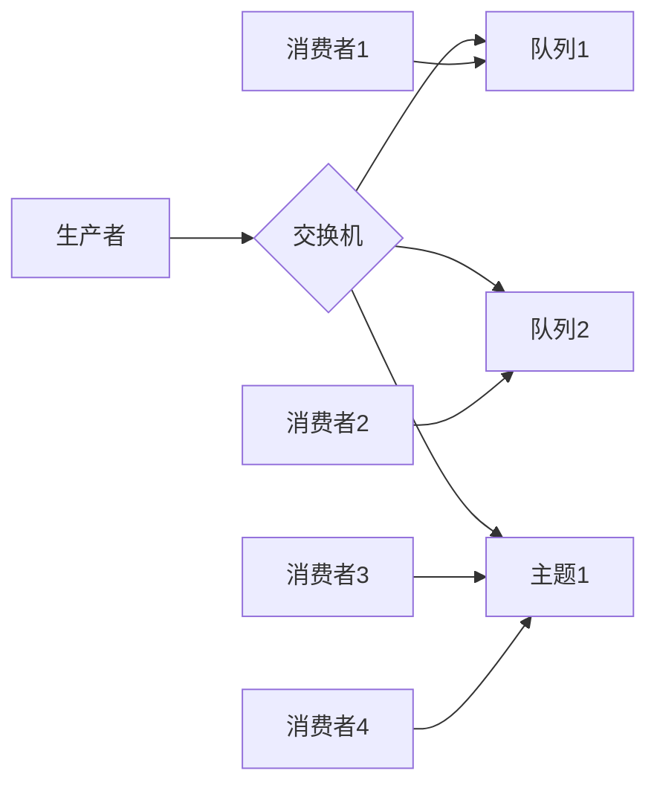

# 【AI大数据计算原理与代码实例讲解】消息队列

## 1.背景介绍

### 1.1 什么是消息队列

在现代分布式系统中,组件之间通常通过异步消息传递进行通信。消息队列(Message Queue)作为一种重要的异步通信机制,允许应用程序之间通过传递消息进行解耦和异步通信。消息队列可确保消息可靠传递,并为发送和接收应用程序提供临时缓冲区。

消息队列通过以下几个关键概念工作:

- 生产者(Producer): 消息的发送者,将消息发送到消息队列。
- 消费者(Consumer): 消息的接收者,从消息队列中获取并处理消息。
- 消息代理(Message Broker): 消息队列服务器,负责接收、存储和路由消息。

消息队列具有以下主要优势:

1. 解耦生产者和消费者,提高系统灵活性和可扩展性。
2. 异步通信,避免发送方和接收方同步等待。
3. 缓冲消息,应对突发流量,提高系统可靠性。
4. 支持消息持久化,保证消息不会丢失。
5. 支持消息路由,实现复杂的消息流程。

### 1.2 消息队列的应用场景

消息队列广泛应用于各种分布式系统,以下是一些常见的应用场景:

- 异步处理: 将耗时操作(如发送电子邮件、处理大文件上传等)排队异步处理。
- 应用程序解耦: 允许独立组件通过消息队列进行通信,降低耦合度。
- 流量削峰: 通过消息队列缓冲突发流量,保护应用程序免受高负载的影响。
- 日志处理: 将日志消息发送到消息队列,由专门的日志处理程序进行持久化存储和分析。
- 事件驱动架构: 构建基于事件驱动的架构,通过消息队列传递事件通知。

## 2.核心概念与联系

### 2.1 消息队列的核心概念

消息队列涉及以下几个核心概念:

1. **消息(Message)**: 消息是消息队列中传递的基本数据单元,通常包含消息头(元数据)和消息体(实际数据)。

2. **队列(Queue)**: 队列是一种先进先出(FIFO)的数据结构,用于临时存储消息。生产者将消息发送到队列,消费者从队列中获取并处理消息。

3. **主题(Topic)**: 主题是一种发布/订阅模式,允许多个消费者订阅同一个主题,从而接收相同的消息。与队列不同,主题中的消息会被传递给所有订阅者。

4. **交换机(Exchange)**: 在某些消息队列系统(如RabbitMQ)中,交换机用于接收生产者发送的消息,并根据路由键将消息路由到相应的队列或主题。

5. **绑定(Binding)**: 绑定定义了交换机和队列或主题之间的关联关系,指定了消息如何从交换机路由到队列或主题。

6. **持久化(Persistence)**: 消息队列通常支持将消息持久化到磁盘或其他存储介质,以确保消息在系统崩溃或重启后不会丢失。

### 2.2 消息队列的工作流程

消息队列的典型工作流程如下:

1. 生产者将消息发送到消息队列(通常是交换机)。
2. 交换机根据路由键和绑定规则,将消息路由到相应的队列或主题。
3. 消费者从队列或主题中获取消息,并进行相应的处理。
4. 消息队列可以选择将消息持久化到磁盘或其他存储介质,以确保消息不会丢失。

消息队列的工作流程可以用以下 Mermaid 流程图表示:



在上图中,生产者将消息发送到交换机,交换机根据绑定规则将消息路由到相应的队列或主题。消费者从队列或主题中获取并处理消息。

## 3.核心算法原理具体操作步骤

消息队列的核心算法原理主要包括以下几个方面:

### 3.1 消息发送算法

消息发送算法描述了生产者如何将消息发送到消息队列。典型的消息发送算法步骤如下:

1. 生产者建立与消息代理(Message Broker)的连接。
2. 生产者创建一个新的消息,包括消息头和消息体。
3. 生产者选择合适的交换机(Exchange),并指定路由键(Routing Key)。
4. 生产者将消息发送到交换机。
5. 交换机根据绑定规则和路由键,将消息路由到相应的队列或主题。
6. 生产者关闭与消息代理的连接。

消息发送算法的伪代码如下:

```
连接消息代理
创建消息(消息头和消息体)
选择交换机和路由键
发送消息到交换机
关闭连接
```

### 3.2 消息接收算法

消息接收算法描述了消费者如何从消息队列中获取并处理消息。典型的消息接收算法步骤如下:

1. 消费者建立与消息代理的连接。
2. 消费者选择要订阅的队列或主题。
3. 消费者从队列或主题中获取消息。
4. 消费者处理消息。
5. 消费者确认(Acknowledge)或拒绝(Reject)消息。
6. 消费者关闭与消息代理的连接。

消息接收算法的伪代码如下:

```
连接消息代理
选择要订阅的队列或主题
循环:
    获取消息
    处理消息
    确认或拒绝消息
关闭连接
```

### 3.3 消息路由算法

消息路由算法描述了交换机如何根据绑定规则和路由键将消息路由到相应的队列或主题。典型的消息路由算法步骤如下:

1. 交换机接收生产者发送的消息和路由键。
2. 交换机查找与该路由键匹配的绑定规则。
3. 交换机将消息发送到与绑定规则匹配的队列或主题。

消息路由算法的伪代码如下:

```
接收消息和路由键
查找与路由键匹配的绑定规则
遍历匹配的绑定规则:
    将消息发送到绑定的队列或主题
```

### 3.4 消息持久化算法

消息持久化算法描述了如何将消息持久化到磁盘或其他存储介质,以确保消息在系统崩溃或重启后不会丢失。典型的消息持久化算法步骤如下:

1. 消息代理接收生产者发送的消息。
2. 消息代理将消息写入持久化存储(如磁盘或数据库)。
3. 消息代理确认消息已成功持久化。
4. 消费者从持久化存储中获取并处理消息。

消息持久化算法的伪代码如下:

```
接收消息
将消息写入持久化存储
确认消息已持久化
消费者从持久化存储中获取并处理消息
```

## 4.数学模型和公式详细讲解举例说明

在消息队列中,我们可以使用一些数学模型和公式来描述和分析系统的性能和可靠性。

### 4.1 小顶堆模型

消息队列中的队列通常使用小顶堆(Min Heap)数据结构来实现,以确保消息按照先进先出(FIFO)的顺序被处理。小顶堆是一种完全二叉树,其中每个节点的值都小于或等于其子节点的值。

在小顶堆中,插入和删除操作的时间复杂度为 $O(\log n)$,其中 $n$ 是堆中元素的数量。

小顶堆的插入操作伪代码如下:

```
插入(值):
    将值添加到堆的末尾
    上浮(值)

上浮(节点):
    如果节点小于父节点:
        交换节点和父节点
        上浮(父节点)
```

小顶堆的删除操作伪代码如下:

```
删除():
    如果堆为空:
        返回错误
    else:
        值 = 堆顶元素
        用堆的最后一个元素替换堆顶元素
        下沉(根节点)
        返回值

下沉(节点):
    如果节点大于任一子节点:
        与较小的子节点交换
        下沉(较小的子节点)
```

### 4.2 队列长度模型

队列长度是衡量消息队列性能的一个重要指标。我们可以使用一些数学模型来描述和分析队列长度的变化。

假设消息以平均速率 $\lambda$ 进入队列,并以平均速率 $\mu$ 离开队列。根据队列论中的 M/M/1 模型,当 $\rho = \lambda / \mu < 1$ 时,队列长度的平均值 $L$ 可以用以下公式计算:

$$
L = \frac{\rho}{1 - \rho}
$$

当 $\rho \geq 1$ 时,队列长度将无限增长,导致系统饱和。

另一个常用的指标是队列长度的概率分布,即队列中有 $n$ 个消息的概率 $P_n$。根据 M/M/1 模型,当 $\rho < 1$ 时,概率分布可以用以下公式计算:

$$
P_n = (1 - \rho) \rho^n
$$

这些数学模型可以帮助我们预测和优化消息队列的性能,例如确定合适的消费者数量,避免队列过载等。

### 4.3 可靠性模型

消息队列的可靠性是一个关键指标,它描述了系统在一定时间内正常运行的概率。我们可以使用一些数学模型来分析和优化消息队列的可靠性。

假设消息队列系统由 $n$ 个独立的组件组成,每个组件的可靠性为 $R_i$,则整个系统的可靠性 $R_s$ 可以用以下公式计算:

$$
R_s = \prod_{i=1}^{n} R_i
$$

如果我们希望提高系统的可靠性,可以采取以下策略:

1. 提高每个组件的可靠性 $R_i$。
2. 增加冗余组件,使系统具有容错能力。

假设我们增加 $k$ 个冗余组件,且任意 $m$ 个组件正常运行即可保证系统正常运行,则系统的可靠性 $R_s$ 可以用以下公式计算:

$$
R_s = \sum_{i=m}^{n+k} \binom{n+k}{i} R^i (1-R)^{n+k-i}
$$

其中 $R$ 是每个组件的可靠性。

通过这些数学模型,我们可以量化分析消息队列的可靠性,并采取适当的措施(如增加冗余组件、提高单个组件的可靠性等)来提高整个系统的可靠性。

## 5.项目实践:代码实例和详细解释说明

在本节中,我们将通过实际代码示例来演示如何使用消息队列进行异步通信。我们将使用 RabbitMQ 作为消息队列服务器,并使用 Python 编写生产者和消费者程序。

### 5.1 安装和配置 RabbitMQ

首先,我们需要安装和配置 RabbitMQ 服务器。可以按照官方文档在不同操作系统上进行安装。

安装完成后,启动 RabbitMQ 服务器:

```bash
# 在 Linux 上启动 RabbitMQ
sudo rabbitmq-server
```

### 5.2 生产者程序

以下是一个简单的 Python 生产者程序,它将连接到 RabbitMQ 服务器,并每隔一秒向队列发送一条消息。

```python
import pika
import time

# 连接到 RabbitMQ 服务器
connection = pika.BlockingConnection(pika.ConnectionParameters('localhost'))
channel = connection.channel()

# 声明一个队列
channel.queue_declare(queue='hello')

# 发送消息
for i in range(10):
    message = f'Hello, World! {i}'
    channel.basic_publish(exchange='',
                          routing_key='hello',