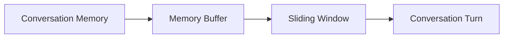

# 【LangChain编程：从入门到实践】ConversationBufferWindowMemory

## 1. 背景介绍
在构建对话系统和聊天机器人时,一个关键的挑战是如何有效地管理和利用对话的上下文信息。传统的方法通常是将整个对话历史记录作为输入,但这会导致处理效率低下和信息冗余。为了解决这个问题,LangChain引入了ConversationBufferWindowMemory,它是一种基于滑动窗口的对话记忆机制,能够灵活高效地管理对话上下文。

### 1.1 对话系统中的上下文管理
对话系统需要根据当前的对话状态和之前的对话内容来生成恰当的响应。上下文管理在对话系统中扮演着至关重要的角色,它决定了系统如何理解用户的意图并生成连贯的回复。

### 1.2 传统方法的局限性
传统的上下文管理方法,如将整个对话历史作为输入,存在以下局限性:

- 处理效率低:随着对话的进行,历史记录会不断增长,导致处理时间变长。
- 信息冗余:早期的对话内容可能与当前话题无关,包含冗余信息。
- 难以捕捉长距离依赖:重要的上下文信息可能分布在对话历史的不同位置。

### 1.3 ConversationBufferWindowMemory的优势
ConversationBufferWindowMemory通过引入滑动窗口机制,有效地解决了传统方法的局限性:

- 提高处理效率:只保留固定长度的对话历史,减少了处理时间。
- 减少信息冗余:通过调整窗口大小,可以灵活控制上下文的范围。
- 捕捉长距离依赖:滑动窗口能够覆盖对话历史中的关键信息。

## 2. 核心概念与联系
要深入理解ConversationBufferWindowMemory,需要掌握以下核心概念:

### 2.1 对话记忆 Conversation Memory
对话记忆是指在对话过程中积累和维护的上下文信息。它包括了之前的对话内容、用户提问、系统响应等。对话记忆为生成连贯、相关的响应提供了重要的上下文支持。

### 2.2 滑动窗口 Sliding Window
滑动窗口是一种数据结构,它维护了一个固定大小的缓冲区,只保留最近的N个元素。当有新元素到来时,最早进入窗口的元素会被移除,保证窗口大小恒定。滑动窗口常用于处理数据流或时间序列数据。

### 2.3 记忆缓冲区 Memory Buffer
记忆缓冲区是ConversationBufferWindowMemory的核心组件,它基于滑动窗口的思想,维护了对话的最近N轮交互。每个对话轮次包括用户提问和系统响应。当对话轮次超过缓冲区大小时,最早的轮次会被淘汰。

### 2.4 对话轮次 Conversation Turn
对话轮次是指用户提问和系统响应的一次完整交互。在ConversationBufferWindowMemory中,每个对话轮次都被存储在记忆缓冲区中,以备后续使用。

下图展示了这些核心概念之间的关系:



## 3. 核心算法原理与具体操作步骤
ConversationBufferWindowMemory的核心算法基于滑动窗口和记忆缓冲区。下面详细介绍其工作原理和操作步骤:

### 3.1 初始化记忆缓冲区
1. 创建一个空的记忆缓冲区,用于存储对话轮次。
2. 设置缓冲区的最大大小N,即滑动窗口的大小。

### 3.2 存储对话轮次
1. 当新的对话轮次(用户提问和系统响应)到来时,将其添加到记忆缓冲区的末尾。
2. 如果缓冲区的大小超过了最大大小N,则移除缓冲区头部的最早轮次,保证缓冲区大小不超过N。

### 3.3 检索相关上下文
1. 当需要生成响应时,从记忆缓冲区中检索最近的N个对话轮次。
2. 将检索到的对话轮次按照时间顺序组合成一个上下文字符串。
3. 将上下文字符串与当前用户提问一起输入到语言模型中,生成响应。

### 3.4 更新记忆缓冲区
1. 将新生成的响应与用户提问组成一个新的对话轮次。
2. 将新的对话轮次添加到记忆缓冲区的末尾,并根据需要移除最早的轮次,保证缓冲区大小不超过N。

通过以上步骤,ConversationBufferWindowMemory能够有效地管理和利用对话上下文,生成连贯、相关的响应。

## 4. 数学模型和公式详细讲解举例说明
ConversationBufferWindowMemory可以用数学模型来形式化描述。假设我们有以下定义:

- $N$:记忆缓冲区的最大大小,即滑动窗口的大小。
- $Q_i$:第$i$轮用户提问。
- $A_i$:第$i$轮系统响应。
- $T_i$:第$i$个对话轮次,由$Q_i$和$A_i$组成。

则记忆缓冲区$M$可以表示为一个有序列表:

$$M = [T_{i-N+1}, T_{i-N+2}, ..., T_{i-1}, T_i]$$

其中,$i$表示当前对话轮次的索引。当一个新的对话轮次$T_{i+1}$到来时,记忆缓冲区更新如下:

$$M' = [T_{i-N+2}, T_{i-N+3}, ..., T_i, T_{i+1}]$$

如果$i+1 > N$,则移除最早的对话轮次$T_{i-N+1}$,保证缓冲区大小不超过$N$。

举例说明,假设$N=3$,当前对话轮次如下:

- $T_1 = (Q_1, A_1)$
- $T_2 = (Q_2, A_2)$
- $T_3 = (Q_3, A_3)$
- $T_4 = (Q_4, A_4)$

则记忆缓冲区的变化过程为:

1. 初始状态:$M = []$
2. 添加$T_1$:$M = [T_1]$
3. 添加$T_2$:$M = [T_1, T_2]$
4. 添加$T_3$:$M = [T_1, T_2, T_3]$
5. 添加$T_4$:$M = [T_2, T_3, T_4]$,移除最早的轮次$T_1$

通过滑动窗口和记忆缓冲区,ConversationBufferWindowMemory能够高效地管理和利用对话上下文。

## 5. 项目实践:代码实例和详细解释说明
下面通过Python代码演示如何使用ConversationBufferWindowMemory。我们将使用LangChain库中的实现。

```python
from langchain.memory import ConversationBufferWindowMemory

# 创建ConversationBufferWindowMemory实例
window_memory = ConversationBufferWindowMemory(k=3)

# 模拟对话轮次
conversation_turns = [
    ("User", "What is the capital of France?"),
    ("Assistant", "The capital of France is Paris."),
    ("User", "Where is Paris located?"),
    ("Assistant", "Paris is located in north-central France."),
    ("User", "What is the population of Paris?"),
    ("Assistant", "The population of Paris is about 2.1 million people."),
    ("User", "What are some famous landmarks in Paris?")
]

# 遍历对话轮次并更新记忆
for turn in conversation_turns:
    window_memory.save_context(turn[0], turn[1])
    
# 检索当前的对话上下文
context = window_memory.load_memory_variables({})["history"]
print(context)
```

输出结果:
```
Human: Where is Paris located?
Assistant: Paris is located in north-central France.
Human: What is the population of Paris?
Assistant: The population of Paris is about 2.1 million people.
Human: What are some famous landmarks in Paris?
```

代码解释:

1. 首先,我们从langchain.memory中导入ConversationBufferWindowMemory类。
2. 创建一个ConversationBufferWindowMemory实例,设置滑动窗口大小为3。
3. 定义一个包含对话轮次的列表,每个轮次由用户提问和系统响应组成。
4. 遍历对话轮次列表,使用save_context方法将每个轮次保存到记忆中。
5. 调用load_memory_variables方法检索当前的对话上下文,并将其打印出来。

从输出结果可以看到,ConversationBufferWindowMemory成功地维护了最近的3个对话轮次,并将其组合成了上下文字符串。

## 6. 实际应用场景
ConversationBufferWindowMemory在以下实际应用场景中发挥着重要作用:

### 6.1 聊天机器人
在聊天机器人中,使用ConversationBufferWindowMemory可以有效地管理对话上下文,生成连贯、相关的响应。通过调整滑动窗口的大小,可以灵活控制机器人考虑的上下文范围,提高对话的自然性和互动性。

### 6.2 客服系统
在客服系统中,ConversationBufferWindowMemory可以帮助客服代表快速了解客户之前的问题和互动历史,提供更加个性化和针对性的服务。同时,滑动窗口机制也能减少不相关信息的干扰,提高客服响应的效率。

### 6.3 智能助手
智能助手需要根据用户的指令和问题提供准确、相关的信息。ConversationBufferWindowMemory可以帮助智能助手理解用户的意图,并结合之前的对话内容给出恰当的回复,提升用户体验。

### 6.4 教育和培训系统
在教育和培训系统中,ConversationBufferWindowMemory可以用于构建智能导师或教学助手。通过记忆学生之前的提问和互动,系统可以提供个性化的指导和反馈,促进学习效果。

## 7. 工具和资源推荐
以下是一些与ConversationBufferWindowMemory相关的工具和资源:

1. LangChain:一个用于构建语言模型应用的开源库,提供了ConversationBufferWindowMemory的实现。
2. Hugging Face Transformers:一个流行的自然语言处理库,提供了多种预训练语言模型,可以与ConversationBufferWindowMemory结合使用。
3. Rasa:一个开源的对话式AI框架,支持使用ConversationBufferWindowMemory来管理对话上下文。
4. OpenAI GPT系列:强大的语言模型,可以在ConversationBufferWindowMemory的基础上生成高质量的对话响应。
5. 《Chatbot Development with Python》:一本介绍如何使用Python构建聊天机器人的书籍,涵盖了对话管理和上下文处理的相关内容。

## 8. 总结:未来发展趋势与挑战
ConversationBufferWindowMemory为对话系统的上下文管理提供了一种高效、灵活的解决方案。它通过滑动窗口机制,在保留关键上下文信息的同时,减少了处理开销和信息冗余。未来,ConversationBufferWindowMemory有望在以下方面得到进一步发展:

1. 动态窗口大小调整:根据对话的内容和用户的需求,自适应地调整滑动窗口的大小,以获得最优的上下文范围。
2. 结合注意力机制:将ConversationBufferWindowMemory与注意力机制相结合,对对话历史中的关键信息进行加权,提高上下文捕捉的精度。
3. 个性化记忆管理:针对不同用户或场景,构建个性化的记忆管理策略,提供更加定制化的对话体验。
4. 多模态信息融合:将文本、语音、图像等多模态信息纳入记忆管理,实现更全面、准确的上下文理解。

然而,ConversationBufferWindowMemory的应用也面临着一些挑战:

1. 隐私和安全:对话历史可能包含敏感的用户信息,需要采取适当的隐私保护措施。
2. 长期依赖关系:滑动窗口可能无法完全捕捉长距离的依赖关系,需要探索更高级的记忆管理机制。
3. 领域适应性:不同领域的对话特点和需求各异,需要针对特定领域优化记忆管理策略。

尽管存在这些