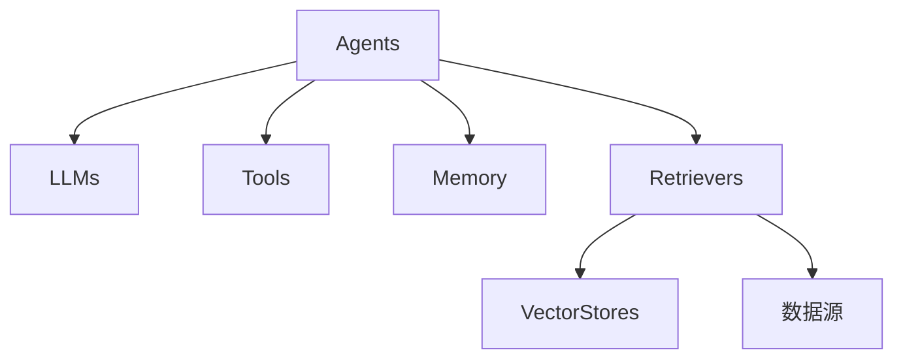

# 【LangChain编程：从入门到实践】LangChain与其他框架的比较

## 1.背景介绍

### 1.1 人工智能发展现状

在当今时代，人工智能(AI)已经成为科技领域的核心驱动力之一。随着计算能力的不断提升和算法的快速发展,AI技术正在渗透到各个行业,为我们的生活带来了前所未有的变革。在这个过程中,Python作为一种流行的编程语言,为AI的发展提供了强有力的支持。

### 1.2 Python在AI领域的应用

Python凭借其简洁易学的语法、丰富的库生态以及活跃的开发者社区,成为了AI领域的主流编程语言之一。从经典的机器学习算法到现代的深度学习框架,Python都扮演着重要的角色。著名的AI框架如TensorFlow、PyTorch、Scikit-learn等,都是基于Python构建的。

### 1.3 LangChain的崛起

然而,在AI的快速发展过程中,我们发现仅仅依赖于单一的AI模型或框架是远远不够的。现实世界中的问题往往需要多个AI模型协同工作,并与其他系统进行交互和集成。这就催生了一种新型的编程范式:AI编程(AI Programming)。

LangChain正是在这种背景下应运而生的。它是一个针对AI编程的Python框架,旨在简化AI系统的构建和部署过程。通过LangChain,开发者可以轻松地组合多个AI模型、数据源和其他组件,构建出复杂且强大的AI应用程序。

### 1.4 本文概述

在本文中,我们将深入探讨LangChain的核心概念、架构和工作原理。同时,我们还将对比LangChain与其他流行的AI框架,分析它们的优缺点和适用场景。最后,我们将展望LangChain的未来发展方向,并讨论AI编程领域所面临的挑战和机遇。

## 2.核心概念与联系

在深入了解LangChain之前,我们需要先掌握一些核心概念。这些概念不仅是LangChain的基础,也是整个AI编程领域的关键组成部分。

### 2.1 AI模型

AI模型是AI系统的核心部分,它通过训练数据学习到特定的模式和规律,从而能够对新的输入数据进行预测或决策。常见的AI模型包括:

- 机器学习模型:如线性回归、决策树、支持向量机等。
- 深度学习模型:如卷积神经网络(CNN)、循环神经网络(RNN)、Transformer等。
- 语言模型:如GPT、BERT、T5等。

在LangChain中,这些AI模型被抽象为`LLM`(Large Language Model,大型语言模型)和`Agents`(智能体)。

### 2.2 数据源

AI模型需要从各种数据源中获取数据进行训练和推理。常见的数据源包括:

- 结构化数据:如数据库、CSV文件等。
- 非结构化数据:如文本文件、网页、PDF等。
- API:如天气API、新闻API等。

在LangChain中,这些数据源被抽象为`Retriever`(检索器)和`VectorStore`(向量存储)。

### 2.3 AI工具

除了AI模型和数据源,AI系统还需要与其他工具进行交互和集成,如:

- 文本生成工具:用于生成自然语言文本。
- 文本分析工具:用于分析文本的情感、主题等。
- 知识库:用于存储和查询结构化知识。

在LangChain中,这些工具被抽象为`Tools`(工具)。

### 2.4 AI编程

AI编程是指将AI模型、数据源和工具组合在一起,构建出复杂的AI应用程序。这种编程范式需要处理以下几个关键问题:

- 模型选择:选择合适的AI模型来解决特定的问题。
- 数据处理:从各种数据源中获取、清洗和转换数据。
- 模型集成:将多个AI模型组合在一起,协同工作。
- 工具集成:与其他工具进行交互和集成。
- 系统部署:将AI应用程序部署到生产环境中。

LangChain旨在通过提供一套统一的接口和工具链,简化AI编程的过程。

### 2.5 LangChain架构概览

LangChain的核心架构由以下几个主要组件组成:

1. **Agents**:智能体,负责协调和控制整个AI系统的工作流程。
2. **LLMs**:大型语言模型,提供自然语言理解和生成能力。
3. **Tools**:各种AI工具,如文本生成、文本分析、知识库等。
4. **Memory**:存储中间结果和上下文信息的内存模块。
5. **Retrievers and VectorStores**:用于从各种数据源中检索和存储数据。

这些组件通过LangChain提供的统一接口进行交互和集成,构建出完整的AI应用程序。



## 3.核心算法原理具体操作步骤

在了解了LangChain的核心概念和架构之后,我们来探讨一下它的核心算法原理和具体操作步骤。

### 3.1 LangChain工作流程

LangChain的工作流程可以概括为以下几个步骤:

1. **输入处理**:接收用户的自然语言输入,并将其转换为LLM可以理解的格式。
2. **Agent选择**:根据输入的内容和目标,选择合适的Agent来处理任务。
3. **Tool调用**:Agent根据需要调用各种Tools,如文本生成、文本分析、知识库查询等。
4. **数据检索**:如果需要外部数据,Agent会通过Retrievers从各种数据源中检索相关信息。
5. **LLM推理**:将处理过的数据输入到LLM中,进行推理和决策。
6. **结果生成**:根据LLM的输出,生成最终的结果,并返回给用户。

在整个过程中,Memory模块会记录中间结果和上下文信息,以便Agent能够跟踪任务状态和进度。

### 3.2 Agent-Tool交互

Agent和Tool之间的交互是LangChain核心算法的关键部分。Agent需要根据任务目标和上下文信息,选择合适的Tools并正确调用它们。

这个过程可以通过以下步骤实现:

1. **Tool发现**:Agent首先需要发现当前可用的Tools及其功能。
2. **Tool选择**:根据任务目标和上下文信息,Agent选择最合适的Tools。
3. **Tool调用**:Agent调用选定的Tools,并提供必要的输入数据。
4. **结果处理**:Agent处理Tools返回的结果,并决定是否需要进一步调用其他Tools。

为了实现这个过程,LangChain提供了一种称为`AgentExecutor`的机制。`AgentExecutor`负责管理Agent和Tools之间的交互,并根据预定义的策略来选择和调用Tools。

### 3.3 数据检索与存储

在许多情况下,AI系统需要从外部数据源中获取数据,或者将中间结果存储起来供后续使用。LangChain通过`Retriever`和`VectorStore`来实现这一功能。

**Retriever**:Retriever负责从各种数据源中检索相关数据,如文本文件、网页、数据库等。LangChain提供了多种Retriever实现,如`TextRetriever`、`WebRetriever`、`SQLRetriever`等。

**VectorStore**:VectorStore用于存储和检索向量化的数据,通常用于构建语义搜索引擎或知识库。LangChain支持多种VectorStore实现,如`Chroma`、`FAISS`、`Weaviate`等。

在LangChain的工作流程中,Agent可以通过Retriever从外部数据源中获取相关数据,并将其传递给LLM进行处理。同时,Agent也可以将中间结果存储到VectorStore中,供后续使用或查询。

### 3.4 LLM集成

LangChain的核心功能之一是与各种大型语言模型(LLM)进行集成。LLM提供了自然语言理解和生成的能力,是AI系统的核心驱动力。

LangChain支持多种流行的LLM,如OpenAI的GPT-3、Google的PaLM、Anthropic的Claude等。同时,它也提供了一种统一的接口,使开发者可以轻松地切换和集成不同的LLM。

在LangChain的工作流程中,LLM扮演着关键的角色。Agent会将处理过的数据和上下文信息传递给LLM,由LLM进行推理和决策。LLM的输出结果将作为最终结果返回给用户,或者被用于进一步的处理和决策。

### 3.5 内存管理

在处理复杂的AI任务时,需要记录和跟踪中间结果和上下文信息。LangChain通过`Memory`模块来实现这一功能。

Memory模块可以存储各种类型的数据,如文本、向量、对象等。Agent可以在任务执行过程中向Memory中写入数据,也可以从Memory中读取之前存储的数据。

这种机制使得Agent能够维护任务状态和上下文信息,从而更好地进行决策和推理。同时,它也为构建持续对话系统或长期记忆系统提供了基础。

LangChain提供了多种Memory实现,如`ConversationBufferMemory`、`VectorStoreRetrieverMemory`等,开发者可以根据需求选择合适的Memory类型。

## 4.数学模型和公式详细讲解举例说明

在AI系统中,数学模型和公式扮演着重要的角色。它们为AI算法提供了理论基础,并帮助我们更好地理解和优化这些算法的性能。

在本节中,我们将探讨一些与LangChain相关的数学模型和公式,并通过具体的例子来说明它们的应用。

### 4.1 向量空间模型

向量空间模型(Vector Space Model)是信息检索和自然语言处理领域中的一种重要模型。它将文本表示为高维向量,并在向量空间中进行相似性计算和查询。

在LangChain中,向量空间模型被广泛应用于数据检索和存储。例如,`VectorStore`就是基于向量空间模型实现的。

假设我们有一个包含多个文档的语料库$D=\{d_1, d_2, \dots, d_n\}$,每个文档$d_i$可以被表示为一个向量$\vec{v_i}$。我们可以使用TF-IDF(Term Frequency-Inverse Document Frequency)或者预训练的语言模型(如BERT)来计算这些向量。

对于一个查询$q$,我们也可以将其转换为一个向量$\vec{q}$。然后,我们可以计算查询向量与每个文档向量之间的相似度,并返回最相关的文档。

常用的相似度度量包括余弦相似度和欧几里得距离:

$$\text{sim}_\text{cosine}(\vec{v_i}, \vec{q}) = \frac{\vec{v_i} \cdot \vec{q}}{||\vec{v_i}|| \cdot ||\vec{q}||}$$

$$\text{dist}_\text{euclidean}(\vec{v_i}, \vec{q}) = \sqrt{\sum_{j=1}^{d}(v_{ij} - q_j)^2}$$

其中$d$是向量的维度。

在LangChain中,我们可以使用`VectorStore`来存储文档向量,并通过`Retriever`进行相似性查询。例如,使用`ChromaRetriever`和`Chroma`作为向量存储:

```python
from langchain.vectorstores import Chroma
from langchain.retrievers import ChromaRetriever

# 创建向量存储
vector_store = Chroma.from_texts(texts=documents, embedding=embeddings, metadatas=metadatas)

# 创建检索器
retriever = ChromaRetriever(vector_store.as_retriever())

# 执行相似性查询
results = retriever.get_relevant_documents(query)
```

### 4.2 语言模型

语言模型是自然语言处理领域中的另一个重要模型。它们旨在学习语言的统计规律,并能够生成自然、流畅的文本。

在LangChain中,语言模型被抽象为`LLM`(Large Language Model)。常见的LLM包括GPT-3、PaLM、Claude等。

语言模型通常基于神经网络架构,如Transformer、LSTM等。它们会在大量的文本数据上进行预训练,学习语言的语法、语义和上下文