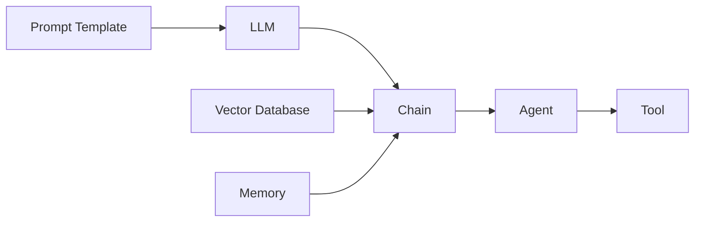

# 【LangChain编程：从入门到实践】LangServe

## 1.背景介绍
### 1.1 人工智能与自然语言处理的发展历程
人工智能(Artificial Intelligence, AI)自1956年达特茅斯会议正式提出以来，经历了从专家系统、机器学习到深度学习的发展历程。其中，自然语言处理(Natural Language Processing, NLP)作为人工智能的一个重要分支，旨在让计算机能够理解、生成和处理人类语言，使人机交互更加自然友好。近年来，随着深度学习技术的突破和大规模语料数据的积累，NLP取得了长足的进步，催生了一系列引人注目的大语言模型(Large Language Model, LLM)，如GPT-3、PaLM、LaMDA等，极大地提升了NLP系统的语言理解和生成能力。

### 1.2 LangChain的诞生与定位
在LLM蓬勃发展的大背景下，LangChain应运而生。LangChain是一个基于LLM的应用开发框架，旨在帮助开发者更轻松地构建LLM驱动的应用程序。它为LLM应用开发提供了一套标准化的工作流程和编程模型，简化了LLM与外部数据和接口的集成，让开发者可以更聚焦于应用逻辑本身。LangChain的出现，极大地降低了LLM应用开发的门槛，推动了一大批创新性的LLM应用涌现，如ChatPDF、AgentGPT等。

### 1.3 LangChain生态系统概览
LangChain提供了一个灵活、模块化的生态系统，主要包括以下几个关键组件：

- 提示模板(Prompt Template)：定义LLM执行任务的输入提示，实现提示工程
- LLM接口：对接各种LLM服务，如OpenAI、Anthropic、Cohere等  
- 文档加载器：从不同来源加载数据，如网页、文件、数据库等
- 索引器：对文档进行向量化索引，实现基于相似度的语义搜索
- 代理：通过LLM自动执行多步骤任务，如信息检索、API调用等
- 链：将LLM和各种组件组合成多步骤的工作流，实现端到端的应用

LangChain生态系统的各个组件可以灵活组合，高度可定制化，使得开发者可以基于LangChain快速搭建出适合特定场景的LLM应用。

## 2.核心概念与联系
### 2.1 提示工程(Prompt Engineering)
提示工程是LangChain的核心概念之一，指的是如何设计LLM的输入文本，引导LLM生成期望的输出。一个优质的提示不仅能明确地描述任务目标，还能给出必要的背景知识和约束条件，避免LLM生成不相关或有害的内容。LangChain通过提示模板组件，让开发者可以用编程的方式来管理和优化提示。

### 2.2 思维链(Chain of Thought)
思维链是LLM推理的一种范式，通过step-by-step的方式，引导LLM进行逐步推理，得出最终结论。相比直接让LLM生成答案，思维链可以提升LLM在逻辑推理、常识问答等任务上的表现。LangChain通过将LLM和其他组件组合成链，让LLM可以执行多步骤的复杂任务，是实现思维链的理想工具。

### 2.3 代理(Agent)与工具(Tool)
代理是一种基于LLM的自主任务执行系统，可以通过对话理解用户意图，调用相关工具完成任务。工具可以是API、数据库、搜索引擎等，代理通过LLM分析用户输入，自动选择合适的工具并生成相应的指令。LangChain提供了代理和工具的标准接口，让开发者可以方便地扩展定制自己的代理系统。

### 2.4 向量数据库(Vector Database)
向量数据库是一种专门用于存储和检索向量化数据的数据库系统。在LLM应用中，我们通常需要将非结构化数据（如文档、图片）向量化，然后通过相似度搜索找到与查询最相关的数据。LangChain集成了一些主流的向量数据库，如Chroma、Pinecone等，让开发者可以轻松实现基于LLM的语义检索。

### 2.5 Memory
Memory是指LLM在多轮对话中记忆之前聊天内容的能力。传统的LLM每次接收固定长度的输入，难以建立长期的对话上下文。LangChain引入了Memory机制，通过缓存之前的对话内容，让LLM能"记住"之前聊过什么，实现多轮连贯对话。

下面是LangChain核心概念的示意图：



## 3.核心算法原理具体操作步骤
### 3.1 提示模板的定义与渲染
在LangChain中，提示模板使用一种类似Python的格式字符串语法，可以定义参数化的提示。例如：

```python
from langchain import PromptTemplate

template = """
你是一个知识渊博的助手，用户问你问题时请尽可能给出详细的回答。
问题：{question}
"""

prompt = PromptTemplate(
    input_variables=["question"],
    template=template,
)
```

上面的代码定义了一个名为`prompt`的提示模板，其中`{question}`是一个参数，在渲染时会被实际值替换。渲染一个提示模板很简单：

```python
question = "火星上有生命存在吗？" 
rendered_prompt = prompt.format(question=question)
print(rendered_prompt)
```

输出：
```
你是一个知识渊博的助手，用户问你问题时请尽可能给出详细的回答。
问题：火星上有生命存在吗？
```

### 3.2 LLM的调用与结果解析
LangChain提供了统一的LLM接口，让开发者可以方便地调用各种LLM服务。以OpenAI的API为例：

```python
from langchain.llms import OpenAI

llm = OpenAI(model_name="text-davinci-003", temperature=0.9)
result = llm(rendered_prompt)
print(result)
```

上面的代码创建了一个OpenAI的LLM实例，指定使用"text-davinci-003"模型，temperature参数控制生成结果的随机性。然后传入渲染后的提示，llm会返回LLM生成的文本。

### 3.3 文档加载与向量化索引
LangChain支持从多种数据源加载文档，包括本地文件、网页、数据库等。以加载本地Markdown文件为例：

```python
from langchain.document_loaders import UnstructuredMarkdownLoader

loader = UnstructuredMarkdownLoader("example.md")
docs = loader.load()
```

加载文档后，我们可以对文档进行分块、向量化，然后存入向量数据库中：

```python
from langchain.text_splitter import CharacterTextSplitter
from langchain.vectorstores import Chroma
from langchain.embeddings import OpenAIEmbeddings

text_splitter = CharacterTextSplitter(chunk_size=1000, chunk_overlap=0)
texts = text_splitter.split_documents(docs)

embeddings = OpenAIEmbeddings()
db = Chroma.from_documents(texts, embeddings)
```

这里我们使用了OpenAI的embedding接口将文本转换为向量，然后存入Chroma向量数据库中。

### 3.4 构建问答链
有了知识库，我们就可以创建一个问答链，实现基于语义相似度的知识问答：

```python
from langchain.chains import RetrievalQA
from langchain.llms import OpenAI

qa = RetrievalQA.from_chain_type(
    llm=OpenAI(), 
    chain_type="stuff", 
    retriever=db.as_retriever()
)
query = "火星上的地形地貌是怎样的？"
result = qa.run(query)
print(result)
```

问答链会首先利用向量数据库检索与问题最相关的文档片段，然后将问题和检索到的上下文一起喂给LLM，生成最终的答案。

## 4.数学模型和公式详细讲解举例说明
### 4.1 文本嵌入(Text Embedding)
文本嵌入是将文本转换为固定维度向量的过程，是实现语义检索和聚类的基础。常见的文本嵌入模型有Word2Vec、GloVe、BERT等。以Word2Vec为例，其核心思想是利用词的上下文信息学习词向量，使得语义相似的词具有相近的向量表示。Word2Vec的目标函数可以表示为：

$$J(\theta) = \frac{1}{T}\sum_{t=1}^{T}\sum_{-m \leq j \leq m, j \neq 0}\log p(w_{t+j}|w_t)$$

其中，$w_t$表示中心词，$w_{t+j}$表示上下文词，$m$为窗口大小，$p(w_{t+j}|w_t)$表示给定中心词生成上下文词的概率，可以用softmax函数建模：

$$p(w_O|w_I) = \frac{\exp(\mathbf{v}_{w_O}'^T\mathbf{v}_{w_I})}{\sum_{w=1}^{V}\exp(\mathbf{v}_w'^T\mathbf{v}_{w_I})}$$

其中，$\mathbf{v}_w$和$\mathbf{v}_w'$分别表示词$w$的输入向量和输出向量，$V$为词表大小。训练时通过最大化目标函数来学习词向量。

### 4.2 相似度计算
在向量空间中，我们通常使用cosine相似度来衡量两个向量的相似程度：

$$\cos(\theta) = \frac{\mathbf{A} \cdot \mathbf{B}}{\|\mathbf{A}\| \|\mathbf{B}\|} = \frac{\sum_{i=1}^{n} A_i B_i}{\sqrt{\sum_{i=1}^{n} A_i^2} \sqrt{\sum_{i=1}^{n} B_i^2}}$$

其中，$\mathbf{A}$和$\mathbf{B}$是两个$n$维向量，$\theta$是它们之间的夹角。cosine相似度的取值范围是$[-1, 1]$，值越大表示两个向量越相似。

在LangChain中，我们可以调用embedding服务计算文本的向量表示，然后利用向量数据库的相似度搜索功能，找到与查询最相似的文档。

## 5.项目实践：代码实例和详细解释说明
下面我们通过一个实际的项目案例，演示如何使用LangChain构建一个基于本地Markdown文件的知识问答系统。

### 5.1 环境准备
首先安装所需的依赖库：

```bash
pip install langchain openai chromadb tiktoken unstructured
```

然后设置OpenAI的API Key：

```bash
export OPENAI_API_KEY=your_api_key
```

### 5.2 加载Markdown文件
假设我们有一个名为`mars.md`的文件，包含了关于火星的知识。我们可以使用`UnstructuredMarkdownLoader`来加载这个文件：

```python
from langchain.document_loaders import UnstructuredMarkdownLoader

loader = UnstructuredMarkdownLoader("mars.md")
docs = loader.load()
```

### 5.3 文本分块与向量化
接下来我们对加载的文档进行分块和向量化：

```python
from langchain.text_splitter import CharacterTextSplitter
from langchain.vectorstores import Chroma
from langchain.embeddings import OpenAIEmbeddings

text_splitter = CharacterTextSplitter(chunk_size=500, chunk_overlap=0)
texts = text_splitter.split_documents(docs)

embeddings = OpenAIEmbeddings()
db = Chroma.from_documents(texts, embeddings)
```

这里我们使用了`CharacterTextSplitter`对文档进行分块，每个块的大小为500个字符。然后使用OpenAI的embedding服务将每个文本块转换为向量，存入Chroma数据库中。

### 5.4 创建问答链
有了知识库，我们就可以创建一个问答链了：

```python
from langchain.chains import RetrievalQA
from langchain.llms import OpenAI

qa = RetrievalQA.from_chain_type(
    llm=OpenAI(), 
    chain_type="stuff", 
    retriever=db.as_retriever()
)
```

这里我们选择了`stuff`类型的问答链，它会将检索到的相关文档片段拼接成一个上下文，然后一次性喂给LLM生成答案。

### 5.5 交互式问答
最后，我们创建一个交互式问答的REPL：

```python
while True:
    query = input("问题：")
    if query == "exit":