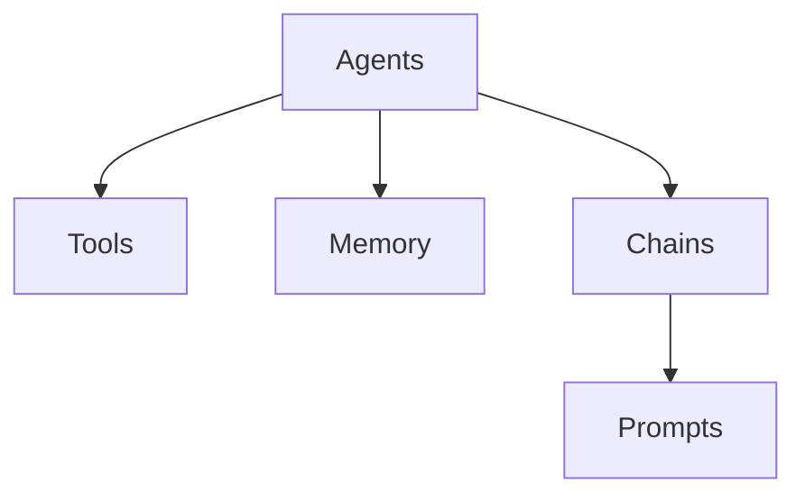
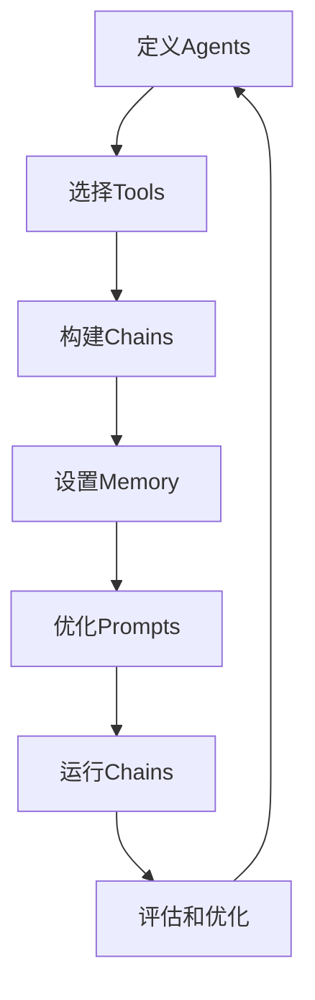
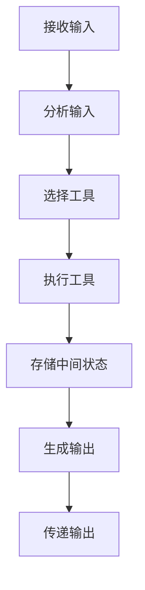

# 【LangChain编程：从入门到实践】astream_log

## 1.背景介绍

### 1.1 人工智能的发展历程

人工智能(Artificial Intelligence, AI)是当代科技发展的重要领域之一,旨在创建出能够模仿人类智能行为的机器系统。自20世纪50年代AI概念被正式提出以来,经历了几个重要的发展阶段:

- 1950s-1960s:AI理论研究萌芽期,主要集中在博弈问题、机器证明和神经网络等领域。
- 1970s-1980s:专家系统和知识库的发展时期,AI开始应用于特定领域。
- 1990s-2000s:机器学习算法的兴起,如支持向量机、决策树等,使AI系统能从数据中自动学习。
- 2010s至今:深度学习技术的爆发式发展,推动AI在计算机视觉、自然语言处理等领域取得突破性进展。

### 1.2 AI系统的构建挑战

尽管AI技术日新月异,但构建一个真正智能的系统仍然面临诸多挑战:

- 知识表示:如何用计算机可理解的形式表示人类的知识和经验?
- 推理能力:如何赋予AI系统推理和解决问题的能力?
- 交互能力:如何使AI系统能够自然地与人类进行交互?
- 学习能力:如何使AI系统具备持续学习和自我完善的能力?
- 安全性和可解释性:如何确保AI系统的安全可靠,并且其决策过程可解释?

### 1.3 LangChain的作用

LangChain是一个Python库,旨在解决AI系统构建过程中的挑战,特别是在知识表示、推理和交互方面。它提供了一种模块化的方式来构建AI应用程序,将不同的组件(如语言模型、知识库、代理等)连接在一起,使开发人员能够专注于应用程序的逻辑,而不必过多关注底层基础设施。

LangChain支持多种知识表示形式,如结构化数据、非结构化文本、PDF等,并提供了多种工具来处理这些数据。此外,它还集成了多种大型语言模型(如GPT、BERT等),使开发人员可以轻松利用这些模型的强大能力。

## 2.核心概念与联系

### 2.1 LangChain的核心概念

LangChain的核心概念包括:

- **Agents**:代理是LangChain中的关键概念,它们是具有特定功能的模块,如查询知识库、调用外部API、执行计算等。代理可以组合在一起形成更复杂的工作流。
- **Tools**:工具是代理用来执行特定任务的函数或API。例如,Wikipedia查询工具可用于从维基百科检索信息。
- **Memory**:内存用于存储代理在执行过程中的中间状态和结果,以供后续使用。
- **Chains**:链是一系列代理和工具的组合,用于完成特定的任务。例如,一个问答链可以包括一个查询代理、一个总结代理和一个最终回答生成代理。
- **Prompts**:提示是用于指导语言模型执行特定任务的文本输入。LangChain提供了多种工具来管理和优化提示。

这些概念相互关联,共同构建了LangChain的核心框架。下面是一个简单的Mermaid流程图,展示了它们之间的关系:



### 2.2 LangChain与其他AI框架的区别

与其他AI框架相比,LangChain的主要特点在于:

- **模块化设计**:LangChain采用模块化设计,使得开发人员可以灵活组合不同的组件来构建AI应用程序。
- **语言模型集成**:LangChain内置了对多种大型语言模型的支持,如GPT、BERT等,使开发人员可以轻松利用这些模型的能力。
- **知识表示多样性**:LangChain支持多种知识表示形式,如结构化数据、非结构化文本、PDF等,使得开发人员可以处理各种类型的数据源。
- **可解释性**:LangChain提供了多种工具来分析和解释语言模型的输出,提高了AI系统的可解释性。

## 3.核心算法原理具体操作步骤  

### 3.1 LangChain的工作流程

LangChain的工作流程通常包括以下步骤:

1. **定义Agents**:根据应用程序的需求,定义一系列代理及其功能。
2. **选择Tools**:为每个代理选择合适的工具,如查询知识库、调用API等。
3. **构建Chains**:将代理和工具组合成一个或多个链,用于完成特定的任务。
4. **设置Memory**:选择合适的内存存储方式,以保存代理执行过程中的中间状态和结果。
5. **优化Prompts**:根据任务需求,优化提示以指导语言模型产生更好的输出。
6. **运行Chains**:执行构建好的链,获取最终结果。
7. **评估和优化**:评估链的执行结果,并根据需要进行优化和迭代。

下面是一个简单的Mermaid流程图,展示了LangChain的工作流程:



### 3.2 代理的执行过程

代理是LangChain中的核心概念,它们负责执行特定的任务。一个代理的执行过程通常包括以下步骤:

1. **接收输入**:代理从上游组件(如其他代理或用户输入)接收输入数据。
2. **分析输入**:代理分析输入数据,确定需要执行的操作。
3. **选择工具**:根据需要执行的操作,代理选择合适的工具。
4. **执行工具**:代理执行选定的工具,获取结果。
5. **存储中间状态**:代理将执行过程中的中间状态和结果存储在内存中。
6. **生成输出**:根据工具的执行结果和中间状态,代理生成最终输出。
7. **传递输出**:代理将输出传递给下游组件(如其他代理或最终用户)。

下面是一个简单的Mermaid流程图,展示了代理的执行过程:



## 4.数学模型和公式详细讲解举例说明

在LangChain中,数学模型和公式主要用于以下几个方面:

### 4.1 语言模型

LangChain集成了多种大型语言模型,如GPT、BERT等。这些模型通常基于深度学习技术,尤其是transformer架构。transformer的核心是自注意力(Self-Attention)机制,它能够捕捉输入序列中任意两个位置之间的依赖关系。

自注意力机制可以用以下公式表示:

$$
\text{Attention}(Q, K, V) = \text{softmax}\left(\frac{QK^T}{\sqrt{d_k}}\right)V
$$

其中:

- $Q$是查询(Query)矩阵,表示当前位置需要关注的信息。
- $K$是键(Key)矩阵,表示其他位置的信息。
- $V$是值(Value)矩阵,表示需要更新的状态信息。
- $d_k$是缩放因子,用于防止点积过大导致梯度消失。

通过计算查询和键之间的点积,自注意力机制可以捕捉输入序列中任意两个位置之间的依赖关系,从而更好地建模序列数据。

### 4.2 知识库查询

LangChain支持从各种知识库(如向量数据库、文档等)中检索信息。在这个过程中,常常需要使用相似度度量来评估查询和知识库条目之间的相关性。

一种常用的相似度度量是余弦相似度,它可以用以下公式表示:

$$
\text{sim}(a, b) = \frac{a \cdot b}{\|a\| \|b\|}
$$

其中$a$和$b$是向量表示的查询和知识库条目,$\cdot$表示向量点积,而$\|\cdot\|$表示向量的$L_2$范数。

余弦相似度的取值范围是$[-1, 1]$,值越接近1表示两个向量越相似。在知识库查询中,通常会选择与查询最相似的前$k$个条目作为结果。

### 4.3 文本摘要

LangChain中的一些代理可能需要对长文本进行摘要,以提取关键信息。一种常用的文本摘要方法是基于句子的抽取式摘要,它通过计算每个句子的重要性分数,然后选择得分最高的句子作为摘要。

句子重要性分数可以基于多种特征计算,例如:

- **词频(TF)**:句子中每个词的出现频率。
- **逆文档频率(IDF)**:词在整个语料库中的稀有程度。
- **位置特征**:句子在文档中的位置(开头、结尾等)。
- **词性特征**:句子中名词、动词等词性的比例。

将这些特征线性组合,可以得到句子重要性分数的公式:

$$
\text{score}(s) = \sum_{w \in s} \text{TF}(w, s) \times \text{IDF}(w) + \alpha \times \text{pos}(s) + \beta \times \text{pos\_tag}(s)
$$

其中$\alpha$和$\beta$是位置特征和词性特征的权重系数。

通过选择得分最高的$n$个句子,就可以生成文本摘要。

以上只是LangChain中可能使用的一些数学模型和公式的示例,在实际应用中还可能涉及到更多的模型和公式。

## 5.项目实践:代码实例和详细解释说明

在这一节,我们将通过一个实际的项目示例,演示如何使用LangChain构建一个简单的问答系统。

### 5.1 项目概述

我们的目标是构建一个问答系统,能够从给定的文本文件中回答相关问题。系统的工作流程如下:

1. 用户提出一个问题。
2. 系统从文本文件中检索相关信息。
3. 系统使用语言模型生成问题的答案。
4. 系统将答案返回给用户。

### 5.2 项目设置

首先,我们需要安装LangChain库和相关依赖项:

```bash
pip install langchain openai
```

接下来,我们需要准备一个文本文件作为知识库。在这个示例中,我们将使用一篇关于"人工智能"的维基百科文章。

### 5.3 代码实现

```python
from langchain.document_loaders import TextLoader
from langchain.indexes import VectorstoreIndexCreator
from langchain.chains import RetrievalQA
from langchain.llms import OpenAI

# 加载文本文件
loader = TextLoader('path/to/file.txt')
documents = loader.load()

# 创建向量存储索引
index = VectorstoreIndexCreator().from_loaders([loader])

# 初始化语言模型
llm = OpenAI(temperature=0)

# 创建问答链
qa = RetrievalQA.from_chain_type(llm=llm, chain_type="stuff", retriever=index.vectorstore.as_retriever())

# 提出问题并获取答案
query = "什么是人工智能?"
result = qa.run(query)
print(result)
```

让我们逐步解释这段代码:

1. 首先,我们使用`TextLoader`加载文本文件,将其转换为`Document`对象列表。

2. 然后,我们使用`VectorstoreIndexCreator`创建一个向量存储索引,用于高效地检索相关文档。

3. 接下来,我们初始化一个OpenAI语言模型,用于生成问题的答案。

4. 使用`RetrievalQA.from_chain_type`方法,我们创建了一个问答链,将语言模型和向量存储索引结合在一起。

5. 最后,我们提出一个问题`"什么是人工智能?"`并调用`qa.run`方法获取答案。

在这个示例中,`RetrievalQA`链会首先使用向量存储索引从文本