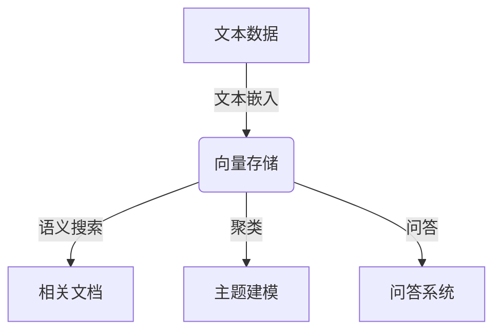

# 【LangChain编程：从入门到实践】向量存储

## 1.背景介绍

在自然语言处理(NLP)和语义搜索等应用中,我们经常需要处理大量的文本数据。传统的文本表示方法,如词袋(Bag-of-Words)模型和TF-IDF,虽然简单高效,但无法捕捉词与词之间的语义关系和上下文信息。为了解决这个问题,向量存储(Vector Store)应运而生。

向量存储是一种将文本映射到高维向量空间的技术,使用机器学习模型(如BERT、GPT等)将文本编码为向量表示。这些向量能够很好地捕捉语义信息,使得我们可以基于语义相似性来搜索、聚类和操作文本数据。向量存储已广泛应用于问答系统、文本摘要、主题建模等领域。

### 1.1 向量存储的优势

- **语义理解**:向量表示能够捕捉词与词之间的语义关系,而不仅仅是字面匹配。
- **上下文感知**:向量编码考虑了单词在句子中的上下文,提高了表示的准确性。
- **相似性计算**:向量空间中的距离度量可用于计算文本之间的语义相似度。
- **可扩展性**:向量存储可以高效地处理大规模文本数据集。

### 1.2 LangChain介绍

LangChain是一个用于构建大型语言模型应用程序的Python库。它提供了一系列模块和工具,使开发人员能够轻松地将大型语言模型(LLM)集成到各种应用中,如问答系统、文本摘要、代码生成等。LangChain的一个核心组件就是向量存储,它为文本数据的语义表示和检索提供了强大的支持。

## 2.核心概念与联系

在深入探讨LangChain的向量存储之前,我们需要了解一些核心概念及其相互关系。

### 2.1 文本嵌入(Text Embedding)

文本嵌入是将文本映射到向量空间的过程。常用的嵌入模型包括BERT、GPT等,它们能够捕捉文本的语义信息并将其编码为高维向量。

$$\text{Embedding Model}: \text{Text} \rightarrow \vec{v} \in \mathbb{R}^n$$

其中,$\vec{v}$是文本的向量表示,维度为$n$。

### 2.2 语义搜索(Semantic Search)

语义搜索是基于文本的语义相似度来检索相关文档的过程。与传统的关键词匹配不同,语义搜索利用向量空间中的距离度量(如余弦相似度)来衡量文本之间的相似程度。

$$\text{Similarity}(\vec{v}_1, \vec{v}_2) = \frac{\vec{v}_1 \cdot \vec{v}_2}{||\vec{v}_1|| \cdot ||\vec{v}_2||}$$

### 2.3 向量存储(Vector Store)

向量存储是一种将文本嵌入与原始文本相关联的数据结构。它通常由以下几个核心组件组成:

1. **Embedding Model**:用于将文本映射到向量空间。
2. **Index**:一种高效的数据结构,用于存储和检索向量。
3. **Metadata Store**:存储原始文本及其相关元数据(如文档ID、段落等)。

在LangChain中,向量存储提供了一个统一的接口,使开发人员能够轻松地集成不同的嵌入模型和索引后端。



## 3.核心算法原理具体操作步骤

在LangChain中,向量存储的核心算法原理可以分为以下几个步骤:

### 3.1 文本切分(Text Splitting)

由于大型语言模型对输入文本长度有限制,因此需要将长文本切分为多个较短的文本块。LangChain提供了多种切分策略,如基于字符数、句子或语义边界的切分。

```python
from langchain.text_splitter import CharacterTextSplitter

text_splitter = CharacterTextSplitter(chunk_size=1000, chunk_overlap=200)
texts = text_splitter.split_text(long_text)
```

### 3.2 文本嵌入(Text Embedding)

使用预训练的语言模型(如BERT、GPT等)将每个文本块映射到向量空间。LangChain支持多种嵌入模型,并提供了统一的接口进行嵌入操作。

```python
from langchain.embeddings import HuggingFaceEmbeddings

embeddings = HuggingFaceEmbeddings()
text_embeddings = [embeddings.embed_query(text) for text in texts]
```

### 3.3 索引构建(Index Building)

将文本嵌入与原始文本及其元数据关联,并构建高效的索引结构,以支持快速的语义搜索和相似性计算。LangChain支持多种索引后端,如FAISS、Pinecone、Weaviate等。

```python
from langchain.vectorstores import FAISS

index = FAISS.from_texts(texts, embeddings)
```

### 3.4 语义搜索(Semantic Search)

使用查询文本的嵌入向量,在索引中搜索最相似的文档。LangChain提供了多种相似度度量方法,如余弦相似度、欧几里得距离等。

```python
query = "What is the capital of France?"
query_embedding = embeddings.embed_query(query)
docs = index.similarity_search(query_embedding, k=3)
```

### 3.5 结果处理(Result Processing)

根据搜索结果,可以执行进一步的操作,如问答、文本摘要、主题建模等。LangChain提供了多种工具和模块,使开发人员能够轻松地构建复杂的语言应用。

```python
from langchain.chains import RetrievalQA

qa = RetrievalQA.from_chain_type(llm, chain_type="stuff", retriever=index.as_retriever())
result = qa({"query": query})
print(result['result'])
```

## 4.数学模型和公式详细讲解举例说明

在向量存储中,文本嵌入和语义相似度计算是两个核心的数学模型。

### 4.1 文本嵌入模型

文本嵌入模型的目标是将文本映射到一个连续的向量空间,使得语义相似的文本在向量空间中彼此靠近。常用的嵌入模型包括BERT、GPT等,它们通常采用transformer架构和自注意力机制来捕捉文本的上下文信息。

以BERT为例,对于一个给定的文本序列$X = [x_1, x_2, \dots, x_n]$,BERT模型首先将每个词token映射到一个初始向量表示,然后通过多层transformer编码器对这些向量进行更新和融合,最终输出每个token的上下文感知向量表示$\vec{h}_i$。文本的最终嵌入向量通常取自特殊的[CLS]标记或者对所有token向量进行平均/最大池化操作。

$$\vec{v} = \text{BERT}(X) = \text{Pooling}([\vec{h}_1, \vec{h}_2, \dots, \vec{h}_n])$$

其中,$\vec{v} \in \mathbb{R}^d$是文本的$d$维嵌入向量。

### 4.2 语义相似度计算

在向量空间中,我们可以使用距离度量来衡量两个向量之间的相似度。常用的距离度量包括余弦相似度、欧几里得距离等。

**余弦相似度**

余弦相似度衡量两个向量之间的夹角余弦值,取值范围在$[-1, 1]$之间。余弦相似度越大,表示两个向量越相似。

$$\text{Cosine Similarity}(\vec{v}_1, \vec{v}_2) = \frac{\vec{v}_1 \cdot \vec{v}_2}{||\vec{v}_1|| \cdot ||\vec{v}_2||}$$

其中,$\vec{v}_1 \cdot \vec{v}_2$表示向量点积,$||\vec{v}||$表示向量$\vec{v}$的$L_2$范数。

**欧几里得距离**

欧几里得距离衡量两个向量之间的直线距离,取值范围在$[0, +\infty)$之间。欧几里得距离越小,表示两个向量越相似。

$$\text{Euclidean Distance}(\vec{v}_1, \vec{v}_2) = \sqrt{\sum_{i=1}^{d} (v_{1i} - v_{2i})^2}$$

其中,$d$是向量的维度。

在LangChain中,我们可以使用`similarity_search`方法基于语义相似度来检索相关文档。

```python
# 使用余弦相似度
docs = index.similarity_search(query_embedding, k=3)

# 使用欧几里得距离
docs = index.similarity_search(query_embedding, k=3, distance_metric='euclidean')
```

## 5.项目实践:代码实例和详细解释说明

让我们通过一个实际的项目来演示如何使用LangChain进行向量存储和语义搜索。我们将构建一个简单的问答系统,基于维基百科文章的语义相似度来回答用户的查询。

### 5.1 安装依赖

首先,我们需要安装LangChain和相关的依赖库。

```bash
pip install langchain faiss-cpu python-dotenv
```

### 5.2 准备数据

我们将使用维基百科上的"自然语言处理"和"机器学习"两篇文章作为示例数据集。你可以从网上下载或者手动复制这些文本内容。

```python
with open('nlp.txt', 'r') as f:
    nlp_text = f.read()

with open('ml.txt', 'r') as f:
    ml_text = f.read()
```

### 5.3 文本切分和嵌入

接下来,我们将文本切分为较短的块,并使用BERT模型将它们映射到向量空间。

```python
from langchain.text_splitter import CharacterTextSplitter
from langchain.embeddings import HuggingFaceEmbeddings

text_splitter = CharacterTextSplitter(chunk_size=1000, chunk_overlap=200)
texts = text_splitter.split_texts([nlp_text, ml_text])

embeddings = HuggingFaceEmbeddings()
text_embeddings = [embeddings.embed_query(text) for text in texts]
```

### 5.4 构建向量存储

我们将使用FAISS作为索引后端来构建向量存储。

```python
from langchain.vectorstores import FAISS

index = FAISS.from_texts(texts, embeddings)
```

### 5.5 语义搜索和问答

现在,我们可以使用向量存储来执行语义搜索和问答操作。

```python
from langchain.chains import RetrievalQA

qa = RetrievalQA.from_chain_type(llm, chain_type="stuff", retriever=index.as_retriever())

query = "What is natural language processing?"
result = qa({"query": query})
print(result['result'])
```

上述代码将根据用户的查询在向量存储中搜索最相关的文本块,并使用大型语言模型(如GPT-3)生成答案。

完整的代码示例如下:

```python
import os
from dotenv import load_dotenv
from langchain.llms import OpenAI
from langchain.text_splitter import CharacterTextSplitter
from langchain.embeddings import HuggingFaceEmbeddings
from langchain.vectorstores import FAISS
from langchain.chains import RetrievalQA

# 加载环境变量
load_dotenv()
openai_api_key = os.getenv('OPENAI_API_KEY')

# 初始化LLM
llm = OpenAI(temperature=0, openai_api_key=openai_api_key)

# 读取文本数据
with open('nlp.txt', 'r') as f:
    nlp_text = f.read()

with open('ml.txt', 'r') as f:
    ml_text = f.read()

# 文本切分和嵌入
text_splitter = CharacterTextSplitter(chunk_size=1000, chunk_overlap=200)
texts = text_splitter.split_texts([nlp_text, ml_text])

embeddings = HuggingFaceEmbeddings()
text_embeddings = [embeddings.embed_query(text) for text in texts]

# 构建向量存储
index = FAISS.from_texts(texts, embeddings)

# 语义搜索和问答
qa = RetrievalQA.from_chain_type(llm, chain_type="stuff", retriever=index.as_retriever())

query = "What is natural language processing?"
result = qa({"query": query})
print(result['result'])
```

在上述示例中,我们首先加载了OpenAI API密钥,并初始化了一个OpenAI LLM实例。然后,我们读取了两篇维基百科文章,并将它们切分为较短的块。接下来,我们使用BERT模型