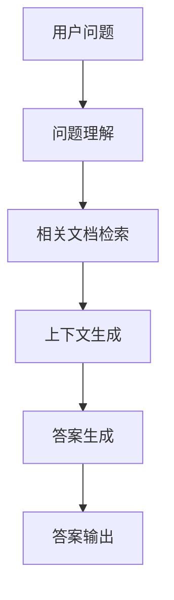

# 【LangChain编程：从入门到实践】基于文档问答场景

## 1.背景介绍

### 1.1 文档问答系统的重要性

在当今信息时代,海量的文档数据被不断产生和积累。无论是企业内部的知识库、政府公开的法律文件,还是网络上的新闻报道和技术文档,这些文本信息都蕴含着宝贵的知识和见解。然而,如何高效地从这些庞大的文档集合中检索和获取所需的信息,一直是一个巨大的挑战。

传统的搜索引擎虽然可以快速定位相关文档,但往往难以直接提供准确的答案。用户不得不亲自阅读大量文档,耗费大量时间和精力。这种低效的信息获取方式严重影响了工作效率和决策质量。因此,构建一个高性能的文档问答系统,能够根据用户的自然语言问题,从海量文档中智能地提取出相关答案,具有极高的现实价值和应用前景。

### 1.2 LangChain:开源AI框架

LangChain是一个由Anthropic公司开发的开源AI框架,旨在帮助开发者更轻松地构建各种基于大型语言模型(LLM)的应用程序。它提供了一系列模块化的Python组件,涵盖了LLM的各种用例,如问答系统、总结、数据增强等。

LangChain的核心理念是将LLM视为一种"工具",通过链式调用的方式,将多个LLM组件灵活组合,从而实现复杂的AI任务。这种模块化设计不仅提高了代码的可重用性和可维护性,而且还支持开发者轻松整合自定义的LLM模型和数据源。

在文档问答领域,LangChain提供了一整套完善的解决方案,支持从文档加载、分块、检索到最终答案生成的全流程。开发者可以基于LangChain快速构建出高性能、可扩展的文档问答应用。

## 2.核心概念与联系

### 2.1 文档问答系统架构

一个典型的文档问答系统通常包括以下几个核心组件:



1. **问题理解(Question Understanding)**: 将用户的自然语言问题转换为系统可以理解的语义表示,比如提取关键词、实体、意图等。

2. **相关文档检索(Document Retrieval)**: 根据问题的语义表示,从文档集合中快速检索出与问题相关的文档子集。

3. **上下文生成(Context Generation)**: 从检索出的相关文档中,提取出最相关的上下文片段,作为答案生成的输入。

4. **答案生成(Answer Generation)**: 基于上下文片段,利用语言模型生成对应的答案文本。

5. **答案输出(Answer Output)**: 将生成的答案以适当的格式呈现给用户。

### 2.2 LangChain中的核心概念

LangChain将上述文档问答系统的核心组件抽象为以下几个关键概念:

1. **文档加载器(Document Loaders)**: 用于从各种数据源(如文件、网页、数据库等)加载原始文档数据。

2. **文本拆分器(Text Splitters)**: 将原始长文档拆分为多个短的文档块,以适应语言模型的输入限制。

3. **向量存储(Vector Stores)**: 将文档块编码为向量,并存储在向量数据库中,用于高效的相似性检索。

4. **检索器(Retrievers)**: 根据查询向量从向量存储中检索最相关的文档块。

5. **语言模型(Language Models)**: 基于检索到的相关文档块生成最终的答案文本。

6. **链(Chains)**: 将上述各个组件链接在一起,实现端到端的文档问答流程。

这些概念相互关联、互为支撑,共同构建了LangChain强大的文档问答能力。

## 3.核心算法原理具体操作步骤 

### 3.1 文档加载

文档加载是文档问答系统的第一步,需要从各种数据源获取原始文档数据。LangChain提供了多种文档加载器,支持从本地文件系统、网页、数据库等不同来源加载文档。

以加载本地文件为例,可以使用`UnstructuredFileLoader`或`TextLoader`等加载器:

```python
from langchain.document_loaders import UnstructuredFileLoader, TextLoader

# 加载单个文件
loader = UnstructuredFileLoader("file.pdf")
data = loader.load()

# 加载多个文件
loaders = UnstructuredFileLoader("docs/")
data = loaders.load()
```

加载器会将文档内容解析为`Document`对象的列表,其中每个`Document`对象包含文档元数据(如文件名、源URL等)和原始文本内容。

### 3.2 文本拆分

由于大型语言模型通常有输入长度限制,因此需要将长文档拆分为多个短的文档块。LangChain提供了多种文本拆分器,如基于长度的拆分、基于句子边界的拆分、基于语义的拆分等。

以基于长度的拆分为例:

```python
from langchain.text_splitter import CharacterTextSplitter

text_splitter = CharacterTextSplitter(chunk_size=1000, chunk_overlap=200)
texts = text_splitter.split_documents(data)
```

`CharacterTextSplitter`会将文档拆分为长度不超过`chunk_size`的块,相邻块之间有`chunk_overlap`的重叠,以保持上下文连贯性。

### 3.3 向量化与向量存储

为了实现高效的相似性检索,需要将文档块转换为向量表示,并存储在向量数据库中。LangChain支持多种向量化方法,如基于Transformer模型的向量化、基于SBERT的向量化等。

以基于HuggingFace Transformer模型的向量化为例:

```python
from langchain.vectorstores import Chroma
from langchain.embeddings import HuggingFaceEmbeddings

embeddings = HuggingFaceEmbeddings()
vectorstore = Chroma.from_documents(texts, embeddings)
```

`HuggingFaceEmbeddings`使用预训练的Transformer模型(如BERT、RoBERTa等)将文档块编码为向量表示。`Chroma`是一种基于Qdrant的向量存储,用于存储和检索这些向量化的文档块。

### 3.4 相关文档检索

当用户提出一个问题时,系统需要从向量存储中检索与该问题最相关的文档块。LangChain提供了多种检索器,如基于相似度的检索、基于最大边缘相关性的检索等。

以基于相似度的检索为例:

```python
from langchain.chains import RetrievalQA

retriever = vectorstore.as_retriever()
qa = RetrievalQA.from_chain_type(llm=llm, chain_type="stuff", retriever=retriever)
query = "What is the capital of France?"
result = qa({"query": query})
```

`vectorstore.as_retriever()`创建一个基于相似度的检索器。`RetrievalQA`是一种检索-生成链,它将用户的问题向量化,然后使用检索器从向量存储中检索最相关的文档块,作为语言模型生成答案的上下文。

### 3.5 答案生成

检索到相关文档块后,系统需要基于这些上下文信息生成对应的答案文本。LangChain支持多种语言模型,如GPT-3、Claude、LLaMA等,用于生成高质量的答案。

```python
from langchain.llms import OpenAI

llm = OpenAI(temperature=0)
qa = RetrievalQA.from_chain_type(llm=llm, chain_type="stuff", retriever=retriever)
query = "What is the capital of France?"
result = qa({"query": query})
print(result['result'])
```

在上面的示例中,我们使用OpenAI的GPT-3语言模型生成答案。`temperature`参数控制了输出的随机性,值越低,答案越确定。`RetrievalQA`链会将检索到的相关文档块作为上下文,提供给语言模型生成最终的答案文本。

## 4.数学模型和公式详细讲解举例说明

在文档问答系统中,向量化是一个关键步骤,它将文档块转换为向量表示,以便进行高效的相似性检索。常用的向量化方法包括基于Transformer模型的向量化和基于SBERT的向量化。

### 4.1 基于Transformer模型的向量化

基于Transformer模型的向量化方法利用预训练的语言模型(如BERT、RoBERTa等)提取文档块的向量表示。这种方法通常能够捕获更丰富的语义信息,从而提高向量的质量。

具体来说,给定一个文档块$D$,我们首先使用Transformer模型对其进行编码,得到一系列向量表示$\{h_1, h_2, \dots, h_n\}$,其中$n$是文档块中的token数量。然后,我们可以采用不同的策略来聚合这些向量,得到文档块的最终向量表示$\vec{v}$。

常见的聚合策略包括:

1. **取[CLS]向量**:直接取Transformer模型输出的第一个特殊token [CLS]对应的向量作为文档向量,即$\vec{v} = h_{\text{[CLS]}}$。

2. **平均池化**:计算所有token向量的平均值作为文档向量,即$\vec{v} = \frac{1}{n}\sum_{i=1}^n h_i$。

3. **最大池化**:取所有token向量的元素最大值作为文档向量,即$\vec{v}_j = \max_{1 \leq i \leq n} h_{i,j}$,其中$j$是向量维度。

4. **加权平均**:给不同位置的token赋予不同权重,计算加权平均作为文档向量,即$\vec{v} = \sum_{i=1}^n \alpha_i h_i$,其中$\alpha_i$是对应位置token的权重。

不同的聚合策略会影响最终向量的质量,需要根据具体任务进行选择和调优。

### 4.2 基于SBERT的向量化

Sentence-BERT(SBERT)是一种专门用于生成句子级别向量表示的模型,它在预训练时加入了特殊的对比损失函数,使得语义相似的句子在向量空间中更加靠近。

对于一个文档块$D$,SBERT模型会直接输出一个固定长度的向量$\vec{v}$作为其向量表示。由于SBERT模型是专门为句子级别向量表示而设计的,因此它在捕获文档块的语义信息方面通常表现更加出色。

不过,SBERT模型的计算成本也相对较高,因为它需要对整个文档块进行编码,而不能像Transformer模型那样分块编码。因此,在实际应用中,需要权衡计算资源和向量质量之间的平衡。

无论采用哪种向量化方法,最终得到的文档块向量$\vec{v}$都可以被存储在向量数据库中,供后续的相似性检索使用。在检索阶段,用户的查询也会被向量化,生成一个查询向量$\vec{q}$。然后,系统会在向量数据库中搜索与$\vec{q}$最相似的文档块向量,并返回对应的文档块作为答案生成的上下文。

常见的相似度度量包括余弦相似度、欧几里得距离等:

$$\text{sim}_\text{cosine}(\vec{v}, \vec{q}) = \frac{\vec{v} \cdot \vec{q}}{||\vec{v}|| \cdot ||\vec{q}||}$$

$$\text{dist}_\text{euclidean}(\vec{v}, \vec{q}) = \sqrt{\sum_{i=1}^d (v_i - q_i)^2}$$

其中$d$是向量的维度。相似度越高(或距离越小),表示文档块与查询越相关。

通过将文档块映射到向量空间,并利用高效的相似性检索算法(如近邻搜索、层次导航编码等),文档问答系统能够快速从海量文档中找到最相关的上下文信息,从而提高答案的准确性和响应速度。

## 5.项目实践:代码实例和详细解释说明

在本节中,我们将通过一个完整的示例项目,演示如何使用LangChain构建一个基于文档的问答系统。我们将从加载文档开始,逐步完成向量化、检索和答案生成等核心步骤。

### 5.1 准备工作

首先,我们需要安装LangCh