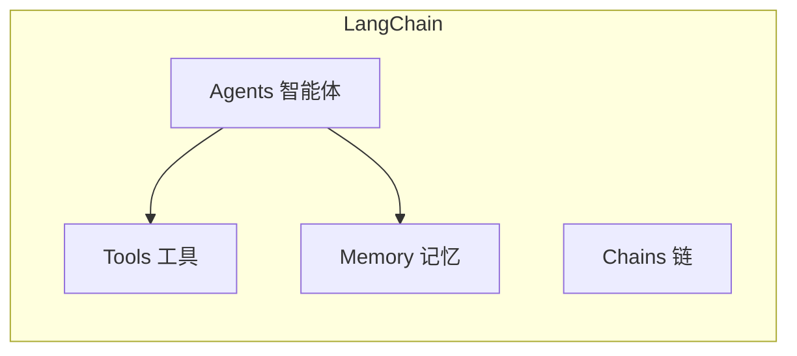
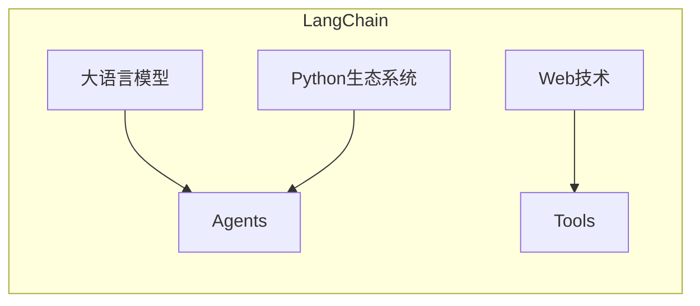
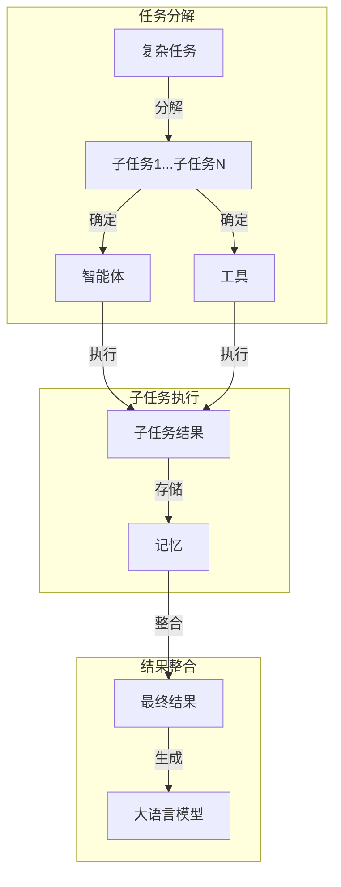

# 【LangChain编程：从入门到实践】对话场景

## 1. 背景介绍

### 1.1 人工智能的发展

人工智能(Artificial Intelligence, AI)是当代科技领域最热门、最具革命性的技术之一。近年来,AI技术在各个领域得到了广泛应用,如计算机视觉、自然语言处理、机器学习等,极大地提高了工作效率,优化了用户体验。

### 1.2 大语言模型的兴起

随着深度学习技术的不断发展,大型语言模型(Large Language Models, LLMs)应运而生,成为自然语言处理领域的重要突破。LLMs通过训练海量文本数据,掌握了丰富的语言知识和推理能力,可以生成高质量、连贯的自然语言输出。

### 1.3 LangChain的作用

LangChain是一个强大的Python库,旨在简化LLMs在实际应用中的开发和部署。它提供了一系列模块化的构建块,帮助开发者轻松构建基于LLMs的应用程序,如对话系统、问答系统、文本生成等。LangChain的出现,为AI开发者提供了一种全新的编程范式,大大降低了开发难度。

## 2. 核心概念与联系

### 2.1 LangChain核心概念

LangChain的核心概念包括:

1. **Agents(智能体)**: 封装了LLMs的功能,可执行特定任务。
2. **Tools(工具)**: 代表外部资源或功能,如网络搜索、数据库查询等。
3. **Memory(记忆)**: 存储对话历史和上下文信息,供智能体参考。
4. **Chains(链)**: 组合多个智能体和工具,形成复杂的工作流程。



### 2.2 LangChain与其他技术的关系

LangChain紧密集成了多种技术:

1. **LLMs**: 如GPT-3、BERT等,为LangChain提供语言理解和生成能力。
2. **Python生态系统**: 利用Python丰富的库,如Pandas、NumPy等,处理结构化数据。
3. **Web技术**: 通过API与外部服务集成,如Wikipedia、Wolfram Alpha等。



## 3. 核心算法原理具体操作步骤

LangChain的核心算法原理是基于"构成性理解"(Constitutive Understanding)的思想,即将复杂任务分解为一系列简单步骤,并利用LLMs和外部工具协同完成。其具体操作步骤如下:

### 3.1 任务分解

1. 将复杂任务分解为一系列子任务。
2. 为每个子任务确定合适的LLM和工具。

### 3.2 子任务执行

1. 执行每个子任务,获取结果。
2. 将结果存储在Memory中,供后续步骤参考。

### 3.3 结果整合

1. 将子任务结果按照逻辑顺序整合。
2. 使用LLM生成最终结果。



## 4. 数学模型和公式详细讲解举例说明

在LangChain中,LLMs通常采用Transformer架构,其核心是自注意力(Self-Attention)机制。自注意力机制能够捕捉输入序列中任意两个位置之间的关系,从而更好地建模长距离依赖关系。

自注意力机制的计算过程如下:

1. 计算Query、Key和Value矩阵:

$$Q = XW^Q, K = XW^K, V = XW^V$$

其中$X$是输入序列,$W^Q, W^K, W^V$是可学习的权重矩阵。

2. 计算注意力分数:

$$\text{Attention}(Q, K, V) = \text{softmax}(\frac{QK^T}{\sqrt{d_k}})V$$

其中$d_k$是缩放因子,用于防止内积过大导致梯度消失。

3. 多头注意力机制:

$$\text{MultiHead}(Q, K, V) = \text{Concat}(head_1, ..., head_h)W^O$$
$$\text{where } head_i = \text{Attention}(QW_i^Q, KW_i^K, VW_i^V)$$

多头注意力机制可以从不同的子空间捕捉不同的关系,提高模型的表现力。

以上就是Transformer中自注意力机制的核心数学原理。LangChain利用这种强大的架构,赋予LLMs出色的语言理解和生成能力。

## 5. 项目实践: 代码实例和详细解释说明

下面是一个使用LangChain构建简单问答系统的示例:

```python
from langchain import OpenAI, ConversationChain

# 初始化LLM
llm = OpenAI(temperature=0)

# 创建对话链
conversation = ConversationChain(llm=llm, verbose=True)

# 开始对话
print('Human: 什么是LangChain?')
response = conversation.predict(input='什么是LangChain?')
print('AI:', response)

print('Human: LangChain有什么主要功能?')
response = conversation.predict(input='LangChain有什么主要功能?')
print('AI:', response)
```

代码解释:

1. 导入OpenAI和ConversationChain模块。
2. 初始化OpenAI LLM,设置temperature参数控制输出的随机性。
3. 创建ConversationChain实例,用于管理对话上下文。
4. 通过predict方法与LLM进行交互,传入人类的输入。
5. LLM根据上下文生成响应,并打印输出。

运行结果:

```
Human: 什么是LangChain?
AI: LangChain是一个Python库,旨在简化大型语言模型(LLMs)在实际应用中的开发和部署。它提供了一系列模块化的构建块,帮助开发者轻松构建基于LLMs的应用程序,如对话系统、问答系统、文本生成等。LangChain将复杂任务分解为一系列简单步骤,利用LLMs和外部工具协同完成,从而大大降低了开发难度。