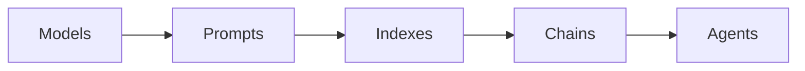

# 【LangChain编程：从入门到实践】应用部署

## 1. 背景介绍
### 1.1 人工智能的发展历程
#### 1.1.1 人工智能的起源与发展
#### 1.1.2 人工智能的三次浪潮
#### 1.1.3 人工智能的现状与未来

### 1.2 自然语言处理技术概述  
#### 1.2.1 自然语言处理的定义与应用
#### 1.2.2 自然语言处理的关键技术
#### 1.2.3 自然语言处理的发展趋势

### 1.3 LangChain的诞生与发展
#### 1.3.1 LangChain的起源与定位
#### 1.3.2 LangChain的核心功能与特点 
#### 1.3.3 LangChain的发展历程与社区生态

## 2. 核心概念与联系
### 2.1 LangChain的核心组件
#### 2.1.1 Models：语言模型的封装与调用
#### 2.1.2 Prompts：提示工程与上下文优化
#### 2.1.3 Indexes：知识库索引与检索
#### 2.1.4 Chains：任务链的组合与编排
#### 2.1.5 Agents：智能代理的构建与交互

### 2.2 LangChain的工作原理
#### 2.2.1 LangChain的整体架构
#### 2.2.2 LangChain的数据流与控制流
#### 2.2.3 LangChain的扩展机制与插件体系

### 2.3 LangChain与其他框架的比较
#### 2.3.1 LangChain vs Hugging Face
#### 2.3.2 LangChain vs OpenAI GPT-3
#### 2.3.3 LangChain vs 其他NLP框架



## 3. 核心算法原理具体操作步骤
### 3.1 提示工程算法
#### 3.1.1 Few-Shot Prompting
#### 3.1.2 Chain-of-Thought Prompting
#### 3.1.3 Self-Consistency Prompting

### 3.2 知识库检索算法
#### 3.2.1 TF-IDF
#### 3.2.2 BM25
#### 3.2.3 Embedding-based Retrieval

### 3.3 任务链编排算法
#### 3.3.1 Sequential Chain
#### 3.3.2 Map-Reduce Chain
#### 3.3.3 Router Chain

### 3.4 智能代理决策算法
#### 3.4.1 基于规则的代理
#### 3.4.2 基于模型的代理 
#### 3.4.3 基于强化学习的代理

## 4. 数学模型和公式详细讲解举例说明
### 4.1 语言模型的数学原理
#### 4.1.1 Transformer模型
$$ Attention(Q,K,V) = softmax(\frac{QK^T}{\sqrt{d_k}})V $$
#### 4.1.2 BERT模型
$$ p(w_i|w_{1:i-1}) = softmax(W_o \cdot Transformer(w_{1:i-1})) $$

### 4.2 文本相似度计算公式
#### 4.2.1 余弦相似度
$$ \cos(\theta) = \frac{A \cdot B}{||A|| \times ||B||} = \frac{\sum_{i=1}^n A_i B_i}{\sqrt{\sum_{i=1}^n A_i^2} \sqrt{\sum_{i=1}^n B_i^2}} $$
#### 4.2.2 Jaccard相似度
$$ J(A,B) = \frac{|A \cap B|}{|A \cup B|} = \frac{|A \cap B|}{|A| + |B| - |A \cap B|} $$

### 4.3 评价指标的计算公式
#### 4.3.1 Precision, Recall, F1-score
$$ Precision = \frac{TP}{TP+FP} $$
$$ Recall = \frac{TP}{TP+FN} $$
$$ F_1 = 2 \cdot \frac{Precision \cdot Recall}{Precision + Recall} $$
#### 4.3.2 BLEU, ROUGE, METEOR

## 5. 项目实践：代码实例和详细解释说明
### 5.1 搭建开发环境
#### 5.1.1 安装Python和相关依赖库
#### 5.1.2 安装和配置LangChain

### 5.2 构建语言模型
#### 5.2.1 加载预训练模型
```python
from langchain.llms import OpenAI
llm = OpenAI(model_name="text-davinci-002", temperature=0.7)
```
#### 5.2.2 微调和定制模型

### 5.3 定义提示模板
#### 5.3.1 创建提示模板
```python
from langchain.prompts import PromptTemplate
prompt = PromptTemplate(
    input_variables=["product"],
    template="What is a good name for a company that makes {product}?",
)
```
#### 5.3.2 组合和嵌套提示模板

### 5.4 构建知识库索引
#### 5.4.1 加载和解析数据
```python
from langchain.document_loaders import TextLoader
loader = TextLoader('state_of_the_union.txt')
```
#### 5.4.2 构建向量数据库
```python
from langchain.vectorstores import Chroma
from langchain.embeddings import OpenAIEmbeddings
embeddings = OpenAIEmbeddings()
vectorstore = Chroma.from_documents(documents, embeddings)
```

### 5.5 设计任务链
#### 5.5.1 顺序任务链
```python
from langchain.chains import LLMChain
chain = LLMChain(llm=llm, prompt=prompt)
```
#### 5.5.2 分支任务链
```python
from langchain.chains import SequentialChain
chain = SequentialChain(chains=[chain1, chain2, chain3], input_key="product")
```

### 5.6 开发智能代理
#### 5.6.1 基于规则的代理
```python
from langchain.agents import initialize_agent, load_tools
tools = load_tools(["serpapi", "llm-math"], llm=llm)
agent = initialize_agent(tools, llm, agent="zero-shot-react-description", verbose=True)
```
#### 5.6.2 基于模型的代理
```python
from langchain.agents.react.base import DocstoreExplorer
docstore=DocstoreExplorer(vectorstore)
agent = initialize_agent(tools, llm, agent="react-docstore", verbose=True, docstore=docstore)
```

## 6. 实际应用场景
### 6.1 智能客服
#### 6.1.1 客户意图识别
#### 6.1.2 问答系统构建
#### 6.1.3 对话状态管理

### 6.2 智能写作助手
#### 6.2.1 文章标题生成
#### 6.2.2 文章大纲生成
#### 6.2.3 文章段落续写

### 6.3 智能搜索引擎
#### 6.3.1 知识库问答
#### 6.3.2 多文档总结
#### 6.3.3 相关性排序

## 7. 工具和资源推荐
### 7.1 LangChain官方资源
#### 7.1.1 官方文档
#### 7.1.2 示例教程
#### 7.1.3 API参考

### 7.2 第三方工具集成
#### 7.2.1 Hugging Face模型
#### 7.2.2 Streamlit可视化
#### 7.2.3 FastAPI部署

### 7.3 社区交流渠道
#### 7.3.1 GitHub讨论区
#### 7.3.2 Discord频道
#### 7.3.3 Twitter账号

## 8. 总结：未来发展趋势与挑战
### 8.1 LangChain的优势与局限
#### 8.1.1 LangChain的优势
#### 8.1.2 LangChain的局限性

### 8.2 LangChain的发展方向
#### 8.2.1 更多预训练模型的支持
#### 8.2.2 端到端的应用开发
#### 8.2.3 多模态交互能力

### 8.3 LangChain面临的挑战
#### 8.3.1 模型的可解释性
#### 8.3.2 知识的鲁棒性
#### 8.3.3 推理的可控性

## 9. 附录：常见问题与解答
### 9.1 如何选择合适的语言模型？
### 9.2 如何平衡任务性能与计算成本？
### 9.3 如何处理长文档和多轮对话？
### 9.4 如何实现跨语言和多语言支持？
### 9.5 如何保障数据隐私和模型安全？

LangChain是一个强大的自然语言处理框架，它提供了丰富的组件和灵活的编排机制，可以帮助开发者快速构建各种智能应用。从语言模型、提示优化到知识检索、任务编排、智能代理，LangChain覆盖了NLP应用开发的全流程。通过LangChain，我们可以更加高效地挖掘语言模型的潜力，将人工智能技术转化为实际价值。

展望未来，LangChain还有很大的发展空间。随着大语言模型的不断进步，LangChain将支持更多先进的预训练模型，提供更加强大的语言理解和生成能力。端到端的应用开发将变得更加简单，开发者可以专注于业务逻辑而无需过多关注底层细节。多模态交互也将成为LangChain的重要方向，通过结合视觉、语音等不同模态信息，LangChain将构建更加智能、自然的人机交互系统。

当然，LangChain的发展也面临着诸多挑战。模型的可解释性、知识的鲁棒性、推理的可控性等都是亟待解决的问题。如何在提高模型性能的同时，保证结果的可信和可控，是摆在研究者和开发者面前的重要课题。

总之，LangChain为NLP应用开发开辟了一条全新的道路。通过不断探索和创新，相信LangChain必将在人工智能的发展历程中留下浓墨重彩的一笔。让我们携手并进，共同推动LangChain的进步，为智能时代贡献自己的力量。

作者：禅与计算机程序设计艺术 / Zen and the Art of Computer Programming