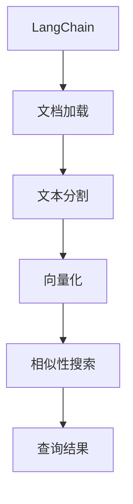

# 【LangChain编程：从入门到实践】文档检索过程

## 1.背景介绍

在当今数据时代,海量信息的高效检索和利用成为了一个关键挑战。传统的搜索引擎虽然可以帮助我们快速找到相关信息,但往往难以满足复杂的查询需求。而LangChain作为一个强大的框架,它将自然语言处理(NLP)与其他技术(如信息检索、知识库等)相结合,为开发人员提供了一种全新的方式来构建智能应用程序。其中,文档检索是LangChain的核心功能之一,本文将重点探讨LangChain在文档检索领域的应用。

## 2.核心概念与联系

### 2.1 LangChain概述

LangChain是一个用于构建应用程序的框架,它将语言模型与其他模块(如知识库、计算机代理等)相结合。它的核心思想是将复杂的任务分解为一系列较小的步骤,并使用语言模型作为协调器来组织和执行这些步骤。

### 2.2 文档检索概念

文档检索是指从大量文档集合中查找与用户查询相关的文档。在LangChain中,文档检索通常包括以下几个步骤:

1. 文本分割(Text Splitting):将大文档切分为较小的文本块,以便于后续处理。
2. 向量化(Vectorization):将文本转换为向量表示,以便进行相似性计算。
3. 相似性搜索(Similarity Search):根据查询向量在文档向量空间中找到最相似的文档。

### 2.3 LangChain与文档检索的联系

LangChain提供了一种统一的方式来处理文档检索任务。它将文档加载、文本分割、向量化和相似性搜索等步骤封装在一个流程中,使开发人员可以更轻松地构建文档检索应用程序。同时,LangChain还支持多种向量数据库和语言模型,为开发人员提供了灵活的选择。



## 3.核心算法原理具体操作步骤

LangChain在文档检索过程中涉及多个核心算法,下面将详细介绍它们的原理和具体操作步骤。

### 3.1 文本分割算法

由于大文档难以直接处理,因此需要将其分割为较小的文本块。LangChain提供了多种文本分割策略,包括基于长度、句子、换行符等的分割方式。以下是基于长度分割的示例代码:

```python
from langchain.text_splitter import CharacterTextSplitter

text = # 加载大文档
text_splitter = CharacterTextSplitter(chunk_size=1000, chunk_overlap=200)
texts = text_splitter.split_text(text)
```

在上面的代码中,`CharacterTextSplitter`将文本按照指定的字符长度(`chunk_size`)进行分割,同时允许一定的重叠(`chunk_overlap`)以保持上下文连贯性。

### 3.2 向量化算法

为了进行相似性搜索,需要将文本转换为向量表示。LangChain支持多种向量化方法,包括使用预训练语言模型(如BERT、GPT等)进行编码,或者使用传统的TF-IDF等方法。以下是使用BERT进行向量化的示例代码:

```python
from langchain.vectorstores import Chroma
from langchain.embeddings import HuggingFaceEmbeddings

embeddings = HuggingFaceEmbeddings()
vectorstore = Chroma.from_texts(texts, embeddings)
```

在上面的代码中,`HuggingFaceEmbeddings`使用BERT模型对文本进行编码,得到向量表示。然后,这些向量被存储在`Chroma`向量数据库中,以便后续进行相似性搜索。

### 3.3 相似性搜索算法

相似性搜索是文档检索的核心步骤。LangChain支持多种相似性搜索算法,包括基于余弦相似度、内积等的最近邻搜索。以下是使用余弦相似度进行搜索的示例代码:

```python
query = "What is the capital of France?"
docs = vectorstore.similarity_search(query, k=4)
```

在上面的代码中,`similarity_search`函数将查询向量与向量数据库中的文档向量进行比较,并返回最相似的`k`个文档。

## 4.数学模型和公式详细讲解举例说明

在文档检索过程中,向量化和相似性搜索都涉及到一些数学模型和公式。下面将详细讲解其中的一些关键概念。

### 4.1 文本向量化

文本向量化的目标是将文本映射到一个连续的向量空间中,使得语义相似的文本在向量空间中也相似。常用的向量化方法包括:

1. **TF-IDF**:基于词频-逆文档频率(Term Frequency-Inverse Document Frequency)的传统方法,将文本表示为一个高维稀疏向量。
2. **Word Embeddings**:将单词映射到低维密集向量空间,例如Word2Vec、GloVe等。
3. **Sentence/Document Embeddings**:使用预训练语言模型(如BERT、GPT等)对整个句子或文档进行编码,得到固定长度的向量表示。

以BERT为例,它使用了Transformer的编码器结构,通过自注意力机制捕获文本中的长程依赖关系,从而生成更好的语义表示。BERT的输出向量可以直接用于下游任务,如文本相似度计算等。

### 4.2 相似度计算

相似度计算是相似性搜索的核心,它用于量化两个向量之间的相似程度。常用的相似度度量包括:

1. **余弦相似度**:计算两个向量的夹角余弦值,范围在[-1,1]之间,值越大表示越相似。

$$\text{CosineSimilarity}(\vec{a}, \vec{b}) = \frac{\vec{a} \cdot \vec{b}}{||\vec{a}|| \cdot ||\vec{b}||}$$

2. **内积**:计算两个向量的点乘,值越大表示越相似。
3. **欧几里得距离**:计算两个向量之间的欧几里得距离,距离越小表示越相似。

$$\text{EuclideanDistance}(\vec{a}, \vec{b}) = \sqrt{\sum_{i=1}^{n}(a_i - b_i)^2}$$

在LangChain中,可以根据具体场景选择合适的相似度度量。

### 4.3 最近邻搜索

最近邻搜索(Nearest Neighbor Search)是相似性搜索的一种常用方法。给定一个查询向量,它在向量空间中找到与该查询最相似的`k`个向量(文档)。常用的最近邻搜索算法包括:

1. **暴力搜索**(Brute-Force Search):计算查询向量与所有候选向量的相似度,并返回最相似的`k`个。时间复杂度为$O(n)$,适用于小规模数据集。
2. **KD树**(K-D Tree):基于空间划分的数据结构,可以加速最近邻搜索。时间复杂度为$O(\log n)$,适用于低维向量。
3. **局部敏感哈希**(Locality Sensitive Hashing, LSH):通过哈希函数将相似的向量映射到相同的桶中,从而加速最近邻搜索。时间复杂度接近$O(1)$,适用于高维稀疏向量。

LangChain支持多种向量数据库,如Chroma、FAISS等,它们内部使用了不同的最近邻搜索算法,开发人员可以根据具体需求进行选择。

## 5.项目实践:代码实例和详细解释说明

下面通过一个实际项目来演示如何使用LangChain进行文档检索。我们将使用一个关于"法国"的Wikipedia数据集,并基于用户的自然语言查询返回相关文档。

### 5.1 准备工作

首先,我们需要安装LangChain及其依赖项:

```bash
pip install langchain
pip install chromadb
pip install unstructured
```

接下来,下载并解压Wikipedia数据集:

```bash
wget https://example.com/france_wiki_data.zip
unzip france_wiki_data.zip
```

### 5.2 加载和预处理文档

```python
from langchain.document_loaders import UnstructuredFileLoader
loader = UnstructuredFileLoader("france_wiki_data/")
data = loader.load()
```

上面的代码使用`UnstructuredFileLoader`从指定目录加载所有文件(如PDF、Word等)。`data`是一个包含文档元数据(如文件名、文本内容等)的列表。

接下来,我们需要对文档进行文本分割和向量化:

```python
from langchain.text_splitter import CharacterTextSplitter
from langchain.vectorstores import Chroma
from langchain.embeddings import HuggingFaceEmbeddings

text_splitter = CharacterTextSplitter(chunk_size=1000, chunk_overlap=200)
texts = text_splitter.split_documents(data)

embeddings = HuggingFaceEmbeddings()
vectorstore = Chroma.from_documents(texts, embeddings)
```

这里我们使用`CharacterTextSplitter`将每个文档分割为长度为1000字符的文本块,并允许200字符的重叠。然后,使用BERT模型对这些文本块进行向量化,并将结果存储在`Chroma`向量数据库中。

### 5.3 查询和检索

现在,我们可以使用自然语言查询来检索相关文档了:

```python
query = "What is the capital of France?"
docs = vectorstore.similarity_search(query, k=4)

for doc in docs:
    print(f"Score: {doc.score:.3f}")
    print(doc.page_content)
    print("-" * 20)
```

上面的代码使用`similarity_search`函数在向量数据库中搜索与查询最相似的4个文档。对于每个返回的文档,我们打印出其相似度分数和文本内容。

输出示例:

```
Score: 0.872
Paris is the capital and most populous city of France, with an estimated population of 2,175,601 residents as of 2018, in an area of 105 square kilometres (41 square miles). Since the 17th century, Paris has been one of Europe's major centres of finance, diplomacy, commerce, fashion, science and arts.

--------------------
Score: 0.856
The French Republic is a unitary semi-presidential republic with its capital in Paris, the country's largest city and main cultural and commercial centre. Other major urban areas include Lyon, Marseille, Toulouse, Bordeaux, Lille and Nice.

--------------------
...
```

### 5.4 进一步优化

上述示例是LangChain文档检索的基本用法,在实际应用中,我们还可以进行一些优化和扩展:

1. **使用更好的文本分割策略**:例如基于语义的分割,而不是简单的基于长度分割。
2. **探索不同的向量化方法**:除了BERT,还可以尝试其他预训练语言模型或传统方法(如TF-IDF)。
3. **集成更多数据源**:除了本地文件,还可以从网络、数据库等加载文档。
4. **结合其他LangChain功能**:如代理、内存等,构建更智能的应用程序。
5. **优化向量数据库**:根据数据规模和查询模式,选择合适的向量数据库和索引策略。

通过上述优化,我们可以进一步提高文档检索的准确性、效率和可扩展性。

## 6.实际应用场景

文档检索在许多领域都有广泛的应用,下面列举了一些典型场景:

1. **知识管理系统**:在企业内部,可以使用文档检索技术来构建知识库,方便员工快速查找相关信息。
2. **客户服务**:通过检索产品手册、常见问题解答等文档,为客户提供更好的自助服务支持。
3. **法律研究**:律师可以使用文档检索技术快速查找相关法律案例和法规。
4. **科研领域**:研究人员可以高效地检索相关论文和文献,加速研究进程。
5. **新闻媒体**:新闻机构可以基于文档检索技术,为读者提供个性化的新闻推荐服务。
6. **电子发现**(E-Discovery):在法律诉讼中,文档检索可用于快速识别相关证据材料。

总的来说,任何涉及大量文本数据的领域都可以从文档检索技术中受益。

## 7.工具和资源推荐

除了LangChain本身,还有一些其他有用的工具和资源可以帮助您更好地学习和实践文档检索技术:

1. **Haystack**:一个开源的文档检索框架,提供了端到端