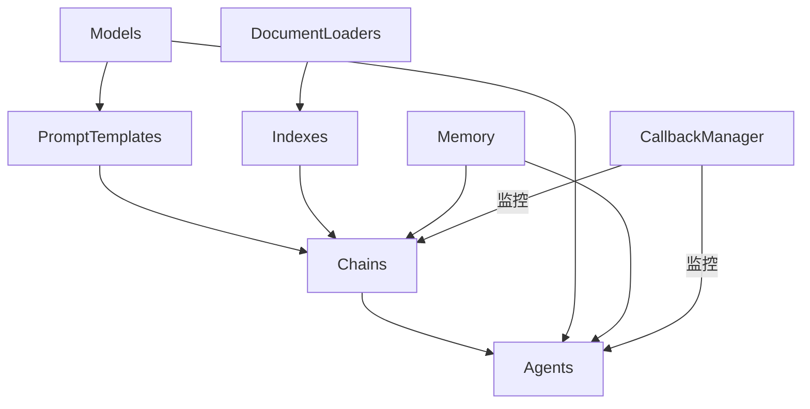

# 【LangChain编程：从入门到实践】源码安装

## 1. 背景介绍
### 1.1 LangChain简介
LangChain是一个强大的开源框架,用于构建由语言模型驱动的应用程序。它提供了一套工具和组件,可以轻松地将大型语言模型(LLM)与外部数据源和API集成,从而创建智能对话代理、知识库问答系统、文本摘要工具等。
### 1.2 LangChain的主要特点
- 模块化设计:提供了一系列可组合的组件,如提示模板、链、代理等,可以灵活组合构建复杂应用。
- 多语言模型支持:支持OpenAI GPT系列、Anthropic Claude、Cohere等主流LLM。  
- 丰富的数据加载器:内置了对接各种数据源的加载器,如文件、网页、数据库等。
- 灵活的链式调用:可以将多个组件以任意方式链接,实现复杂的交互逻辑。
- 内存管理:提供了对话历史记忆、长期记忆等机制,增强LLM的上下文理解能力。
### 1.3 应用场景
LangChain适用于各种LLM应用场景,例如:
- 智能客服/销售助手
- 个性化推荐
- 知识库问答
- 数据分析洞察
- 文本摘要生成  

## 2. 核心概念与联系
### 2.1 模型(Models) 
模型指LLM接口,LangChain通过模型包装器连接各种LLM,屏蔽差异,提供统一调用。
### 2.2 提示模板(PromptTemplates)
将输入参数填充到提示模板中,生成符合LLM输入格式的提示文本。可组合、参数化。
### 2.3 文档加载器(Document Loaders)
从各种来源如文件、网页、Notion等加载数据,转换为文档对象供LLM使用。
### 2.4 索引(Indexes)
将加载的文档进行索引、语义搜索、知识库存储,供后续查询使用。
### 2.5 链(Chains)
以特定方式将多个组件链接,协同工作,实现端到端的复杂功能。如问答链、摘要链等。
### 2.6 代理(Agents)
由LLM驱动的智能代理,可访问工具集合,自主完成多步骤任务。
### 2.7 记忆(Memory)
为链/代理提供状态存储,实现对话历史记忆、长期记忆等,增强上下文理解。
### 2.8 回调管理器(CallbackManager)  
用于监控链/代理的执行过程,实现日志记录、自定义处理逻辑注入等。

核心概念关系如下图:


## 3. 核心算法原理具体操作步骤
### 3.1 模型调用流程
1. 选择合适的LLM接口如OpenAI 
2. 通过LangChain的模型包装器如`OpenAI`初始化模型对象
3. 调用`__call__`方法传入Prompt执行推理
4. 解析返回结果,进行后处理

### 3.2 提示模板渲染流程
1. 定义包含输入参数的提示模板
2. 创建`PromptTemplate`对象,指定模板字符串和输入参数
3. 传入实际参数值,调用`format`方法渲染出最终提示
4. 将提示传给LLM执行

### 3.3 文档加载流程
1. 选择对应数据源的Document Loader如`TextLoader`  
2. 创建loader实例,指定数据源位置
3. 调用load方法,加载数据
4. 对返回的`Document`对象进行处理,如分割、过滤等
5. 存入索引或直接传给LLM

### 3.4 构建索引流程
1. 将原始文档通过加载器转换为`Document`列表
2. 选择合适的索引类如`VectorstoreIndexCreator` 
3. 创建索引实例,指定embedding模型、Vectorstore等参数
4. 调用`from_loaders`方法传入文档,构建索引
5. 对索引进行持久化存储
6. 创建检索器如`VectorStoreRetriever`,用于查询

### 3.5 创建链的流程
1. 选择链类型,如`LLMChain`、`SequentialChain`等
2. 创建链实例,指定LLM模型
3. 设置Prompt模板,添加必要的输入变量 
4. 指定输出解析器,提取structured output
5. 运行`run`或`apply`方法,传入输入,得到结果输出

### 3.6 自定义代理流程
1. 定义代理使用的工具集合`toolkit`
2. 选择代理类型,如`ZeroShotAgent`、`ConversationalAgent`等 
3. 创建代理实例,指定LLM模型、工具集合等
4. 可选添加内存组件,实现状态存储
5. 调用`run`方法,传入用户输入,代理自主执行推理和工具调用
6. 解析代理的结果输出

## 4. 数学模型和公式详细讲解举例说明
LangChain本身作为一个应用框架,内部并没有涉及复杂的数学模型。它主要是对接各种LLM,并对它们的输入输出进行流程控制和管理。

但LangChain会使用一些基础的数学概念,例如在使用Embedding时,涉及到向量空间模型和相似度计算。

以cosine相似度为例,对于两个n维向量$a$和$b$,它们的cosine相似度定义为:

$$
similarity = cos(\theta) = \frac{a \cdot b}{||a|| \times ||b||} = \frac{\sum_{i=1}^n a_i b_i}{\sqrt{\sum_{i=1}^n a_i^2} \sqrt{\sum_{i=1}^n b_i^2}}
$$

其中$a \cdot b$表示$a$和$b$的点积,$||a||$和$||b||$分别表示$a$和$b$的L2范数。

cosine相似度的取值范围为[-1, 1],值越大表示两个向量方向越接近,即它们所表示的对象越相似。

LangChain在构建基于向量的索引时,就是将文本数据通过Embedding模型转换为向量表示,然后利用向量之间的相似度来进行最近邻搜索,得到与查询最相关的结果。

## 5. 项目实践：代码实例和详细解释说明
下面通过一个问答机器人的例子,演示LangChain的基本用法。该机器人基于本地文本文件构建知识库,用户可以输入问题,机器人从知识库中检索出最相关的答案片段,再通过LLM进行总结生成最终答案。

```python
from langchain.chains import RetrievalQA
from langchain.llms import OpenAI
from langchain.document_loaders import TextLoader
from langchain.indexes import VectorstoreIndexCreator

# 加载文本文件
loader = TextLoader('input.txt')
documents = loader.load()

# 创建向量索引
index = VectorstoreIndexCreator().from_loaders([loader])

# 初始化LLM
llm = OpenAI(temperature=0)

# 创建问答链
qa = RetrievalQA.from_chain_type(
    llm=llm, 
    chain_type="stuff", 
    retriever=index.vectorstore.as_retriever()
)

# 执行问答
query = "请问公司的核心业务是什么?"
result = qa.run(query)
print(result)
```

代码解释:

1. 首先通过`TextLoader`加载本地文本文件,得到`Document`列表。
2. 创建向量索引,这里使用默认的`VectorstoreIndexCreator`,它会对文档进行分块、Embedding,并将向量存储在内存中。  
3. 初始化LLM,这里使用OpenAI的接口,设定temperature=0表示生成确定性较强的输出。
4. 创建问答链`RetrievalQA`,指定LLM和检索器,chain_type="stuff"表示对检索结果进行拼接。
5. 执行问答,传入用户的查询,问答链会自动执行检索、组合和LLM调用,最终返回生成的答案。

通过这个例子可以看出,借助LangChain,我们只需要用很少的代码就能实现一个简单的智能问答系统。LangChain屏蔽了大量底层细节,让开发者可以聚焦在应用逻辑本身。

## 6. 实际应用场景
LangChain可以用于构建各种LLM驱动的应用,下面列举几个实际的应用场景:

### 6.1 智能客服
- 加载产品手册、FAQ等数据构建知识库
- 客户输入问题,从知识库检索相关信息
- 调用LLM根据检索结果生成回答

### 6.2 个性化新闻推荐
- 爬取新闻网站,构建新闻库
- 分析用户浏览历史,生成用户画像
- 利用向量索引进行相似新闻检索
- 调用LLM根据用户画像对新闻进行个性化排序

### 6.3 会议纪要生成
- 使用Speech-to-Text API将会议录音转为文本
- 调用LLM对文本进行总结,提取关键信息
- 生成结构化的会议纪要

### 6.4 代码智能助手
- 支持用户以自然语言提出编程问题
- 从Stack Overflow等网站检索相关问答
- 调用LLM总结问题的解决方案
- 生成示例代码片段辅助用户理解  

### 6.5 智能数据分析
- 连接各种数据源如数据库、CSV文件
- 用户以自然语言提出数据分析需求
- 代理根据需求自动执行数据查询、计算、可视化
- 调用LLM解释分析结果,提供洞察

## 7. 工具和资源推荐
### 7.1 官方资源
- [LangChain官网](https://langchain.com/): 包含快速入门、概念引导、API文档等
- [Github仓库](https://github.com/hwchase17/langchain): 开源代码,可以查看最新进展
- [LangChain101教程](https://www.langchain.com/langchain-101): 官方出品的系列入门教程

### 7.2 第三方教程
- [LangChain for Gen AI and LLMs](https://www.pinecone.io/learn/langchain/): Pinecone出品的LangChain教程
- [LangChain-ChatGPT-Tutorial](https://github.com/liaokongVFX/LangChain-ChatGPT-Tutorial): 非官方的中文教程
- [LangChain-Tutorials](https://github.com/sugarforever/LangChain-Tutorials): 另一个中文教程

### 7.3 示例项目
- [langchain-ChatGLM](https://github.com/imClumsyPanda/langchain-ChatGLM): 基于LangChain和ChatGLM的对话应用
- [langchain-ChatGLM2-6B](https://github.com/yanqiangmiffy/langchain-ChatGLM2-6B): 基于LangChain和ChatGLM2的对话应用
- [langchain-serve](https://github.com/jina-ai/langchain-serve): 基于LangChain的Restful服务项目模板

### 7.4 社区资源
- [Discord社区](https://discord.gg/6adMQxSpJS): 官方Discord频道,可以与开发者直接交流
- [Twitter账号](https://twitter.com/LangChainAI): 官方推特,跟进最新动态
- [GitHub Discussions](https://github.com/hwchase17/langchain/discussions): GitHub的讨论区,可以提问、分享经验等

## 8. 总结：未来发展趋势与挑战
### 8.1 发展趋势
- 与更多LLM的无缝集成,提供开箱即用的模型选择
- 改进Few-shot Learning,减少样本数据的依赖
- 引入强化学习,让代理更智能地完成任务
- 支持更多数据源,如知识图谱、多模态数据等
- 完善面向不同场景的链模板,降低应用开发门槛

### 8.2 挑战
- 提高LLM生成内容的可控性,避免有害、虚假信息
- 在推理过程中引入因果推断,提高逻辑连贯性  
- 探索更高效的知识压缩、索引方法,应对海量信息
- 优化语言模型的推理性能,实现实时交互
- 建立行之有效的应用测试、评