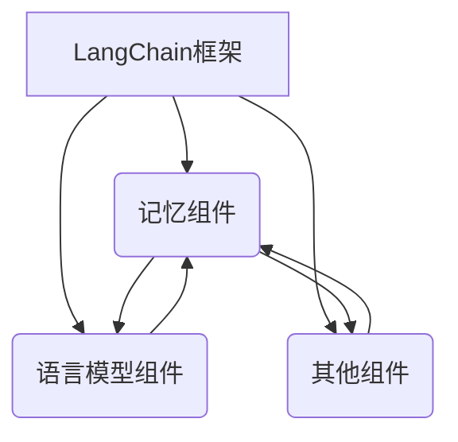
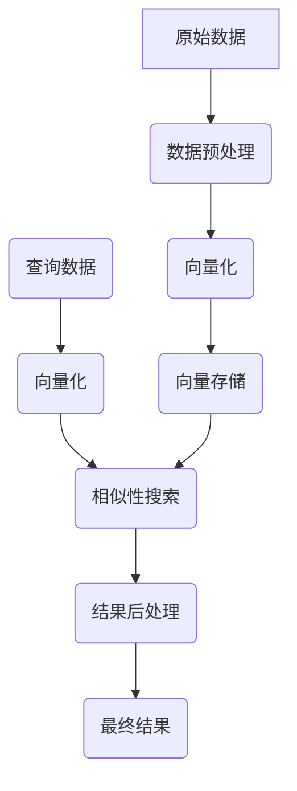

# 【LangChain编程：从入门到实践】记忆组件的应用

## 1.背景介绍

在当今的人工智能发展浪潮中,LangChain作为一个强大的框架,为开发人员提供了构建各种复杂应用程序的能力。其中,记忆组件是LangChain的核心特性之一,为AI系统赋予了记忆和上下文理解的能力。本文将深入探讨LangChain记忆组件的工作原理、使用方法和实践应用,为读者提供一个全面的指南。

### 1.1 什么是LangChain?

LangChain是一个用于构建大规模应用程序的框架,旨在简化人工智能和大语言模型的开发过程。它提供了一系列模块化组件,可用于构建复杂的应用程序,如对话系统、问答系统、文本生成等。LangChain支持多种语言模型,包括GPT、BERT、RoBERTa等,并且可以轻松集成自定义模型。

### 1.2 记忆组件的重要性

在构建智能系统时,记忆和上下文理解是至关重要的。传统的语言模型通常缺乏长期记忆和上下文理解能力,导致它们在处理长对话或复杂任务时表现不佳。LangChain的记忆组件旨在解决这一问题,为AI系统提供持久的记忆存储和上下文理解能力,从而提高系统的性能和用户体验。

## 2.核心概念与联系

### 2.1 记忆组件的工作原理

LangChain的记忆组件基于向量存储技术,它将输入数据(如文本、对话历史等)转换为向量表示,并将这些向量存储在向量数据库中。当需要检索相关信息时,记忆组件会根据查询向量在数据库中搜索最相似的向量,并返回相应的数据。这种基于向量相似性的检索方式可以有效地捕获数据之间的语义关系,从而提高检索的准确性和相关性。

### 2.2 记忆组件与其他LangChain组件的关系

记忆组件是LangChain框架中的一个关键组件,它与其他组件密切协作,为整个系统提供记忆和上下文理解能力。例如,在对话系统中,记忆组件可以存储对话历史,供语言模型在生成响应时参考;在问答系统中,记忆组件可以存储知识库数据,供语言模型检索相关信息回答问题。

LangChain提供了多种记忆组件实现,如基于Chroma的向量存储、基于Redis的键值存储等,开发人员可以根据具体需求选择合适的实现方式。



## 3.核心算法原理具体操作步骤

LangChain记忆组件的核心算法原理包括以下几个关键步骤:

### 3.1 数据预处理

在将数据存储到记忆组件之前,需要对原始数据进行预处理,包括文本清理、分词、停用词过滤等步骤。这有助于提高后续向量表示的质量和检索的准确性。

### 3.2 向量化

预处理后的数据将被转换为向量表示,这是记忆组件的核心步骤。LangChain支持多种向量化方法,如基于Transformer模型的向量化、基于TF-IDF的向量化等。选择合适的向量化方法对于捕获数据的语义信息至关重要。

### 3.3 向量存储

向量化后的数据将被存储在向量数据库中,如Chroma、Redis等。这些数据库支持高效的向量相似性搜索,可以快速检索与查询相关的数据。

### 3.4 相似性搜索

当需要检索相关信息时,查询数据将被转换为向量表示,然后在向量数据库中进行相似性搜索。搜索算法将返回与查询向量最相似的向量及其对应的原始数据。

### 3.5 结果后处理

检索到的结果可能需要进一步处理,如排序、聚合、过滤等,以满足特定的应用需求。LangChain提供了多种后处理工具,方便开发人员定制化处理结果。



## 4.数学模型和公式详细讲解举例说明

记忆组件的核心算法依赖于向量相似性计算,常用的相似性度量包括余弦相似度、欧几里得距离等。下面将详细介绍余弦相似度的数学模型和公式。

### 4.1 余弦相似度

余弦相似度是一种常用的向量相似性度量,它测量两个向量之间的夹角余弦值。余弦相似度的取值范围为[-1, 1],值越接近1,表示两个向量越相似。

给定两个向量 $\vec{a}$ 和 $\vec{b}$,它们的余弦相似度定义为:

$$\text{cosine\_similarity}(\vec{a}, \vec{b}) = \frac{\vec{a} \cdot \vec{b}}{\|\vec{a}\| \|\vec{b}\|}$$

其中 $\vec{a} \cdot \vec{b}$ 表示两个向量的点积,而 $\|\vec{a}\|$ 和 $\|\vec{b}\|$ 分别表示向量 $\vec{a}$ 和 $\vec{b}$ 的L2范数(欧几里得长度)。

点积运算可以用下式表示:

$$\vec{a} \cdot \vec{b} = \sum_{i=1}^{n} a_i b_i$$

其中 $n$ 是向量的维度,而 $a_i$ 和 $b_i$ 分别是向量 $\vec{a}$ 和 $\vec{b}$ 在第 $i$ 个维度上的值。

L2范数的计算公式如下:

$$\|\vec{x}\| = \sqrt{\sum_{i=1}^{n} x_i^2}$$

将点积和L2范数的公式代入余弦相似度的定义,我们可以得到如下等价形式:

$$\text{cosine\_similarity}(\vec{a}, \vec{b}) = \frac{\sum_{i=1}^{n} a_i b_i}{\sqrt{\sum_{i=1}^{n} a_i^2} \sqrt{\sum_{i=1}^{n} b_i^2}}$$

### 4.2 示例计算

假设我们有两个三维向量 $\vec{a} = (1, 2, 3)$ 和 $\vec{b} = (4, 5, 6)$,计算它们的余弦相似度:

$$\vec{a} \cdot \vec{b} = 1 \times 4 + 2 \times 5 + 3 \times 6 = 38$$

$$\|\vec{a}\| = \sqrt{1^2 + 2^2 + 3^2} = \sqrt{14}$$

$$\|\vec{b}\| = \sqrt{4^2 + 5^2 + 6^2} = \sqrt{77}$$

$$\text{cosine\_similarity}(\vec{a}, \vec{b}) = \frac{38}{\sqrt{14} \sqrt{77}} \approx 0.9848$$

可以看出,这两个向量的余弦相似度接近于1,表明它们是非常相似的。

余弦相似度广泛应用于向量相似性搜索、推荐系统、文本聚类等领域,是记忆组件中一个非常重要的数学模型。

## 5.项目实践:代码实例和详细解释说明

下面将通过一个示例项目,演示如何在LangChain中使用记忆组件。我们将构建一个简单的问答系统,它可以从给定的文本中检索相关信息来回答问题。

### 5.1 安装依赖项

首先,我们需要安装LangChain和相关依赖项:

```bash
pip install langchain chromadb
```

### 5.2 准备数据

我们将使用一个关于Python编程的简短文本作为知识库。

```python
text = """
Python是一种解释型、面向对象、动态数据类型的高级程序设计语言。Python的设计哲学强调代码的可读性和简洁的语法,这使得Python非常适合快速应用开发。Python支持多种编程范式,包括面向对象、命令式、函数式和过程式编程。

Python具有丰富的标准库和第三方库,可以帮助开发人员快速构建各种应用程序,如Web应用、数据分析、机器学习等。Python广泛应用于科学计算、Web开发、自动化脚本、数据分析等多个领域。

Python的主要优势包括:

1. 简单易学:Python语法简单、清晰,易于上手。
2. 可移植性:Python代码可以在多个操作系统上运行,如Windows、Linux和macOS。
3. 可扩展性:Python可以通过编写C/C++扩展模块来扩展功能。
4. 丰富的库:Python拥有大量的标准库和第三方库,可以满足各种需求。
5. 开源:Python是一种开源语言,拥有活跃的社区支持。

Python的一些著名应用包括:Web框架Django和Flask、数据分析库NumPy和Pandas、机器学习库scikit-learn和TensorFlow等。
"""
```

### 5.3 创建向量存储

我们将使用Chroma作为向量存储,它是一种高效的向量数据库,可以与LangChain无缝集成。

```python
from langchain.vectorstores import Chroma
from langchain.text_splitter import CharacterTextSplitter

text_splitter = CharacterTextSplitter(chunk_size=1000, chunk_overlap=0)
texts = text_splitter.split_text(text)

vectorstore = Chroma.from_texts(texts, embeddings, persist_directory="chroma_db")
```

在上面的代码中,我们首先使用`CharacterTextSplitter`将原始文本分割成多个块,以便更好地向量化和存储。然后,我们使用`Chroma.from_texts`方法将这些文本块转换为向量,并将它们存储在名为`chroma_db`的Chroma数据库中。

### 5.4 创建问答系统

接下来,我们将创建一个简单的问答系统,它可以从向量存储中检索相关信息来回答问题。

```python
from langchain.chains import RetrievalQA
from langchain.llms import OpenAI

retriever = vectorstore.as_retriever()
qa = RetrievalQA.from_chain_type(llm=OpenAI(), chain_type="stuff", retriever=retriever)
```

在这段代码中,我们首先从向量存储中创建一个`retriever`对象,用于执行相似性搜索。然后,我们使用`RetrievalQA.from_chain_type`方法创建一个问答链,它将结合语言模型(在本例中是OpenAI的GPT模型)和检索器来生成问题的答案。

现在,我们可以使用这个问答系统来回答一些问题:

```python
query = "Python是什么样的编程语言?"
result = qa.run(query)
print(result)
```

输出结果:

```
Python是一种解释型、面向对象、动态数据类型的高级程序设计语言。Python的设计哲学强调代码的可读性和简洁的语法,这使得Python非常适合快速应用开发。Python支持多种编程范式,包括面向对象、命令式、函数式和过程式编程。
```

可以看到,问答系统成功地从原始文本中检索到了相关的信息,并生成了一个合理的答案。

### 5.5 代码解释

在上面的示例中,我们使用了LangChain的几个关键组件:

- `CharacterTextSplitter`: 用于将原始文本分割成多个块,以便更好地向量化和存储。
- `Chroma`: 一种高效的向量数据库,用于存储文本块的向量表示。
- `RetrievalQA`: 一种问答链,结合了语言模型和检索器,可以从向量存储中检索相关信息来回答问题。

这个示例展示了如何在LangChain中使用记忆组件构建一个简单的问答系统。在实际应用中,您可以根据需求调整和扩展这个系统,例如使用更复杂的语言模型、集成更多数据源、添加更多功能等。

## 6.实际应用场景

记忆组件在各种实际应用场景中都扮演着重要角色,下面是一些典型的应用场景:

### 6.1 对话系统

在构建对话系统时,记